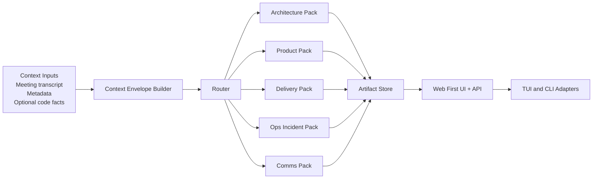

# HoldSpeak Plugin System - RFC Draft

## Purpose

Evolve HoldSpeak from meeting transcription + generic intel into a plugin-driven execution system that:

1. Detects context (code, architecture, incident, planning, customer, delivery).
2. Routes work to specialist plugins/agents.
3. Produces decision-grade artifacts and actions for multiple roles.
4. Delivers new capabilities web-first, with TUI as secondary.

This plan is intentionally incremental and reuses existing HoldSpeak runtime patterns.

## Problem Statement

Current HoldSpeak intelligence is strong but mostly meeting-centric:

- `holdspeak/intel.py` provides provider abstraction (`local`, `cloud`, `auto`).
- `holdspeak/meeting_session.py` runs intel in meeting flow.
- `holdspeak/intel_queue.py` handles deferred processing and retries.

What is missing for role-diverse workflows:

- Typed context routing across multiple domains.
- Modular plugin contracts for specialized analysis.
- Artifact pipeline with provenance/versioning.
- Policy controls for confidence gates and review checkpoints.

## Vision

HoldSpeak becomes a role-aware copilot runtime:

1. Capture source context (meeting transcript + optional repo/task metadata).
2. Route to the best plugin chain.
3. Emit structured artifacts that can be reviewed, edited, and exported.

## Non-Goals

- No rewrite of meeting capture/transcription pipelines.
- No mandatory external SaaS dependency.
- No single monolithic "super-agent" that does everything opaquely.

## Design Principles

1. Deterministic first, probabilistic second.
2. Plugin contracts are typed and auditable.
3. Orchestration remains centralized.
4. Outputs are versioned artifacts, not only transient UI text.
5. Human checkpoint is required for high-impact outputs.
6. Architecture support is a first-class plugin pack, not the only pack.
7. Web interface is the primary user surface for new plugin-system capabilities.

## Target Architecture



### Components

1. `PluginHost`
- Discovers and registers plugins.
- Validates schemas.
- Executes plugins with timeout/retry policy.

2. `Router`
- Chooses plugin chain from context signals + confidence.
- Uses deterministic rules first; optional LLM route scoring when ambiguous.

3. `ArtifactStore`
- Persists outputs with metadata:
  - `artifact_type`
  - `source_refs`
  - `plugin_id`
  - `created_at`
  - `revision`
  - `confidence`

4. `PolicyEngine`
- Blocks or flags low-confidence/high-risk outputs.
- Enforces review requirements before publish/export.

## Plugin Taxonomy

Plugins should be grouped both by function and by domain.

### Functional Plugin Types

1. `signals`
- Extract structured cues from transcript/context (topics, decisions, risks, blockers, ownership mentions).

2. `classifiers`
- Classify segment intent (`planning`, `incident`, `customer`, `retro`, `design_review`).

3. `synthesizers`
- Produce compact outputs from raw context (summary, requirement set, changelog draft).

4. `validators`
- Check output quality/completeness (missing acceptance criteria, unclear owner, ambiguous decision).

5. `artifact_generators`
- Emit versioned artifacts (ADR, PRD slice, runbook delta, test plan, release note).

6. `actuators`
- Optional side effects (create Jira issue, GitHub comment, Slack update). Disabled by default.

7. `governance`
- Enforce policy and quality gates before external actions.

### Domain Plugin Packs

1. `architecture_pack`
- Requirements extraction.
- ADR drafter.
- Mermaid architecture/dataflow diagrams.
- Risk and tradeoff register.

2. `product_pack`
- Problem statement extractor.
- User story and JTBD generator.
- Scope boundary detector (in/out).
- Success metric/KPI draft.

3. `delivery_pack`
- Action item normalizer (owner/date/dependency).
- Milestone plan and critical path.
- RAID log.
- Next-meeting agenda generator.

4. `engineering_pack`
- Technical debt detector.
- Test strategy generator (unit/integration/e2e gaps).
- API contract candidate generator.
- Incident postmortem skeleton.

5. `ops_incident_pack`
- Timeline reconstruction.
- Impact and blast-radius summary.
- Mitigation tracker and handoff notes.
- Runbook delta proposal.

6. `comms_pack`
- Stakeholder update drafts (exec, team, customer variants).
- Decision announcement drafts.
- Meeting recap templates.

7. `knowledge_pack`
- Glossary updates.
- Decision-log linking.
- Duplicate-topic detection across meetings.

## High-Value Plugin Candidates (Beyond Architect)

1. `action_owner_enforcer`
- Detects tasks without clear owner or due date and emits correction list.

2. `scope_guard`
- Flags scope creep phrases and proposes cuts.

3. `dependency_mapper`
- Extracts dependency edges between teams/services and emits a graph.

4. `risk_heatmap`
- Produces probability-impact matrix from risk language.

5. `decision_conflict_detector`
- Finds contradictory decisions versus prior meetings.

6. `customer_signal_extractor`
- Pulls customer pain points, asks, and severity signals.

7. `release_readiness`
- Maps discussion to go/no-go checklist and missing criteria.

8. `compliance_guard`
- Detects security/privacy/legal obligations and missing controls.

9. `retro_facilitator`
- Classifies statements into keep/start/stop and proposes retro actions.

10. `knowledge_base_sync`
- Generates docs/wiki patch drafts with source traceability.

## Domain Model

### Context Envelope

```python
@dataclass
class ContextEnvelope:
    session_id: str
    source_kind: str  # meeting_live | meeting_saved | manual
    text: str
    tags: list[str]
    signals: dict[str, float]  # {"code": 0.91, "incident": 0.12}
    metadata: dict[str, Any]   # repo, branch, team, ticket refs, speakers
    created_at: datetime
```

### Plugin Contract

```python
class Plugin(Protocol):
    id: str
    version: str
    kind: str  # signals | classifiers | synthesizers | validators | artifact_generators | actuators | governance
    pack: str  # architecture_pack | product_pack | delivery_pack | ...
    artifact_type: str
    required_capabilities: list[str]
    input_schema: dict[str, Any]
    output_schema: dict[str, Any]

    def supports(self, ctx: ContextEnvelope) -> float:
        ...

    def run(self, ctx: ContextEnvelope) -> PluginResult:
        ...
```

### Plugin Result

```python
@dataclass
class PluginResult:
    artifact_type: str
    title: str
    body_markdown: str
    structured_data: dict[str, Any]
    confidence: float
    warnings: list[str]
    next_recommended_plugins: list[str]
```

## Initial Built-In Plugins (Phase 1)

1. `requirements_extractor`
- Produces: functional/non-functional requirements, constraints, acceptance criteria.

2. `mermaid_architecture`
- Produces: component/context/dataflow diagrams from transcript + metadata.

3. `adr_drafter`
- Produces: ADR draft with options considered, tradeoffs, decision status.

4. `risk_register`
- Produces: top risks, impact/probability, mitigations, owners.

5. `action_owner_enforcer`
- Produces: unresolved ownership and due-date checklist.

## Routing Policy (v1)

1. Extract signals from context:
- lexical cues (`api`, `latency`, `schema`, `deploy`, `incident`, `tradeoff`, `decision`)
- metadata cues (repo path, ticket labels, meeting tags)
- speaker intent cues ("let's decide", "option A vs B", "draw architecture")

2. Deterministic routing rules:
- If `signals["code"] >= 0.70`: run `requirements_extractor` + `mermaid_architecture`.
- If `signals["decision"] >= 0.65`: run `adr_drafter`.
- If `signals["risk"] >= 0.60`: run `risk_register`.
- If `signals["planning"] >= 0.60`: run `action_owner_enforcer`.

3. Pack routing examples:
- `design_review` intent -> `architecture_pack` + `delivery_pack`.
- `sprint_planning` intent -> `delivery_pack` + `product_pack`.
- `incident_review` intent -> `ops_incident_pack` + `comms_pack`.
- `customer_sync` intent -> `product_pack` + `comms_pack`.

4. Confidence gate:
- If plugin confidence < threshold, mark artifact `needs_review`.
- For ADR artifacts, always require explicit review/accept step.

## Integration with Existing HoldSpeak

### Reuse Current Runtime

- Reuse provider/runtime selection patterns from `holdspeak/intel.py`.
- Reuse deferred processing semantics from `holdspeak/intel_queue.py`.
- Keep orchestration in controller/app boundary (`holdspeak/controller.py`, TUI app).

### Proposed New Modules

- `holdspeak/plugins/contracts.py` - `ContextEnvelope`, `Plugin`, `PluginResult`
- `holdspeak/plugins/host.py` - registration + execution
- `holdspeak/plugins/router.py` - routing policy and chain selection
- `holdspeak/plugins/builtin/*.py` - first-party plugins
- `holdspeak/artifacts.py` - persistence API and artifact schema helpers

### Execution Path (saved meeting first)

1. User opens saved meeting in web UI.
2. User invokes `Generate Plugin Pack` (profile: `architect`, `product`, `delivery`, `incident`, `customer`).
3. App builds `ContextEnvelope` from transcript + meeting metadata.
4. Router selects plugin chain.
5. Host executes chain, stores artifacts.
6. Web UI shows reviewable artifact list and override controls.
7. TUI/CLI provide secondary access paths.

## Storage Schema (MVP)

Add artifact tables (or equivalent persistence shape):

- `artifacts`
  - `id`
  - `meeting_id` (nullable for non-meeting contexts)
  - `artifact_type`
  - `title`
  - `body_markdown`
  - `structured_json`
  - `confidence`
  - `status` (`draft`, `needs_review`, `accepted`, `rejected`)
  - `plugin_id`
  - `plugin_version`
  - `created_at`
- `artifact_sources`
  - `artifact_id`
  - `source_type` (`transcript_segment`, `bookmark`, `manual_note`)
  - `source_ref`

## Security and Trust Boundaries

1. Plugins must declare capabilities:
- `read_transcript`
- `read_metadata`
- `write_artifact`
- `external_network` (default denied for local-first installs)

2. External plugin loading should be disabled by default.

3. Cloud calls inherit existing API-key and base-url config model.

## Rollout Plan

Execution-grade details for dynamic topic shifts and multi-intent routing are specified in:
`docs/PLAN_PHASE_MULTI_INTENT_ROUTING.md`
Web-first runtime migration is specified in:
`docs/PLAN_PHASE_WEB_FLAGSHIP_RUNTIME.md`

### Interface Priority (Normative)

- All new plugin-system capabilities MUST ship to the web interface first.
- TUI parity SHOULD follow where valuable, but MUST NOT block web-first delivery.
- CLI remains mandatory for automation and diagnostics.

### Phase 0 - Contracts + Stubs

- Add plugin contracts, host, router skeleton.
- Add no-op built-in plugins returning deterministic mock content.
- Add unit tests for registration, routing, validation, and error isolation.

### Phase 1 - Multi-Pack MVP (Saved Meetings)

- Implement baseline `architecture_pack` + `delivery_pack` plugins.
- Add `Generate Plugin Pack` action in web meeting detail first.
- Persist artifacts and render them in a simple list + detail view.

### Phase 2 - Deferred + Background Processing

- Integrate plugin execution with deferred queue for heavy jobs.
- Show per-artifact status and retry actions in UI.

### Phase 3 - Live Meeting Hooks

- Add optional checkpoint trigger during active meetings (bookmark + plugin run).
- Keep default behavior conservative to avoid noisy/expensive runs.

### Phase 4 - External Plugin SDK

- Manifest format and loading lifecycle.
- Safe capability model and compatibility checks.

### Phase 5 - Role Profiles + Auto-Routing

- Add profile presets (`architect`, `eng_manager`, `product_manager`, `incident_commander`).
- Support auto-selection based on recurring signals and user override history.

## Acceptance Criteria

1. A saved meeting can produce at least:
- requirements artifact
- Mermaid artifact
- ADR draft artifact
- action ownership artifact

2. Each artifact is:
- reproducible from source context
- versioned
- reviewable/approvable

3. Router and plugin execution are test-covered for:
- plugin timeout/failure isolation
- deterministic routing
- confidence gating
- pack selection correctness

## Operational Metrics

- Route accuracy (manual override rate).
- Artifact acceptance rate.
- Time-to-first-usable-artifact.
- Deferred-job success/failure rate by plugin.
- Average confidence by artifact type.

## Open Questions

1. Should Mermaid generation use strict templates first, then free-form fallback?
2. Should ADR status transitions be tied to explicit user ownership?
3. Should plugin chains be globally configured or per-project and per-role profile?
4. Where should non-meeting contexts originate first (CLI vs web vs TUI)?
5. Which plugin packs require strict human approval before any external actuator runs?

## Recommended First Implementation Slice (Next PR)

1. Add contracts + host + router modules with tests.
2. Add `requirements_extractor`, `mermaid_architecture`, and `action_owner_enforcer`.
3. Add artifact persistence primitives and one read-only artifact view.
4. Wire saved-meeting action to execute selected pack profile.

This delivers immediate cross-role value while keeping implementation risk low.
