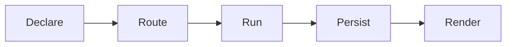

# Plugin Authoring

A meeting-intel plugin turns the transcript of a saved meeting into a typed,
reviewable artifact. Examples are decisions, requirements, a risk register and
an architecture diagram. HoldSpeak scores the transcript for intent, selects a
chain of plugins, runs them, stores the output and shows it in the read-only
History view.

The routing, storage, rendering and approval code already exist. A new plugin
supplies the prompt, the output shape and a renderer.

For the sibling contract for activity connectors, see
[Connector Development](CONNECTOR_DEVELOPMENT.md). For plugins that propose
external effects, see [Actuators](#actuators) and
[Actuator Development](ACTUATOR_DEVELOPMENT.md).

## Quick path

1. Write a class with `id`, `version` and a `run(context) -> dict` method.
2. For model work, use the dispatch handle that the host puts in the context.
3. Register a renderer so the artifact is readable in History.
4. Add the plugin id to a routing chain, or ship it as a plugin pack.
5. Write unit tests with an injected model reply.

The reference plugin is
[`decision_capture.py`](../holdspeak/plugins/builtin/decision_capture.py).
Read it next to this guide.

## How a plugin runs



- **Declare.** The class exposes `id` and `version`. It can also expose
  `kind`, `execution_mode` and `required_capabilities`.
- **Route.** The router scores the transcript for intents. It builds a plugin
  chain from the meeting profile and the active intents.
- **Run.** The host calls `run(context)` inside a timeout, after the capability
  checks pass.
- **Persist.** The host stores the output as an artifact. The key is an
  idempotency hash, so a second run on the same window changes nothing.
- **Render.** Your renderer turns the stored output into a Markdown block.

Plugins run on saved meetings. They never run on live audio.

## The plugin contract

The protocol is `HostPlugin` in
[`holdspeak/plugins/host.py`](../holdspeak/plugins/host.py).
`PluginHost.register()` needs a non-empty `id` and a `run` method. The host
reads every other attribute with a default.

| Attribute | Type | Required | Notes |
|---|---|---|---|
| `id` | `str` | Yes | Unique and stable. Lowercase snake_case, for example `decision_capture`. |
| `version` | `str` | Yes | Recorded on every run result. |
| `kind` | `str` | No | `synthesizer`, `artifact_generator`, `validator`, `signals`, `detector` or `actuator`. |
| `execution_mode` | `str` | No | `inline` (default) or `deferred`. |
| `required_capabilities` | `list[str]` | No | `llm`, `actuator`. The host blocks the plugin if a capability is off. |

### Execution mode

- `inline`: `run()` executes during window dispatch. Use it for cheap,
  deterministic work.
- `deferred`: the host queues the run as a `DeferredPluginRun`. A background
  worker runs it later with `PluginHost.process_next_deferred_run()`. Use it
  for every plugin that calls a model.

The host also accepts `queued`, `queue` and `heavy` as synonyms of `deferred`.

### The `run` context

`run(context)` receives a plain `dict`. The dispatcher in
[`holdspeak/plugins/dispatch.py`](../holdspeak/plugins/dispatch.py) builds it.
Read every key with a default.

| Key | Type | Notes |
|---|---|---|
| `transcript` | `str` | The window transcript. The main input. |
| `transcript_segments` | `list` | Timed segments, when available. |
| `active_intents` | `list[str]` | Intents that fired for this window. |
| `profile` | `str` | The meeting profile, for example `balanced` or `architect`. |
| `meeting_id`, `window_id` | `str` | The owning meeting and window. |
| `tags` | `list[str]` | Window tags. |
| `project_name`, `project` | `str` | The detected project, if any. |

Context providers that you add with `PluginHost.register_context_provider` can
add more keys.

Return a `dict`. A plugin that works returns its typed fields and
`confidence_hint` set to `1.0`. A plugin that cannot work returns a `summary`
reason and `confidence_hint` set to `0.0`, without the typed fields.

## Model calls

An LLM-backed plugin sets `required_capabilities = ["llm"]`. It never builds a
provider, reads configuration or caches an engine. The host owns all of that.

The host issues one `PluginDispatch` handle for each admitted run. It puts the
handle in a private copy of the context under `PLUGIN_DISPATCH_KEY`. The easy
way to use it is to subclass `IntelligenceConsumer` from
[`holdspeak/plugins/intelligence.py`](../holdspeak/plugins/intelligence.py):

```python
from holdspeak.plugins.intelligence import PLUGIN_INTEL_SIGNALS, IntelligenceConsumer

class MyPlugin(IntelligenceConsumer):
    id = "my_plugin"
    version = "0.1.0"
    kind = "synthesizer"
    execution_mode = "deferred"
    required_capabilities = ["llm"]
    intel_temperature = 0.2
    intel_max_tokens = 800

    def run(self, context):
        messages = [
            {"role": "system", "content": "Return the declared JSON shape."},
            {"role": "user", "content": context["transcript"]},
        ]
        try:
            raw = self._call_intel(messages, context)
        except PLUGIN_INTEL_SIGNALS:
            raise
        return self._parse_and_validate(raw)
```

Follow these rules:

- The handle works for one completion. A missing, released, cancelled or used
  handle refuses by name.
- Do not catch the `PLUGIN_INTEL_SIGNALS` exceptions as a plugin result. They
  are the outcome of the admitted run, not a plugin failure.
- Validate the reply shape before you return it.
- A deterministic plugin gets no handle and needs none.

The router owns model selection, fallback and receipts. See
[Intelligence Router architecture](internal/ARCHITECTURE_INTELLIGENCE_ROUTER.md).

## Render the artifact

[`holdspeak/plugins/synthesis.py`](../holdspeak/plugins/synthesis.py) renders
stored output for History. Two registries connect a plugin to its renderer:

- `_ARTIFACT_TYPE_BY_PLUGIN` maps a plugin id to an artifact type.
- `_ARTIFACT_RENDERERS` maps an artifact type to a renderer function.

A renderer takes a `_RenderContext`. Its `output` field is your `run` result.
The renderer returns `None` for the default body. Otherwise it returns a tuple:
the Markdown body and a dict of extra keys for the artifact JSON.

To add a renderer:

1. Add `"my_plugin": "my_artifact"` to `_ARTIFACT_TYPE_BY_PLUGIN`.
2. Write `_render_my_artifact(ctx) -> _Rendered`.
3. Register it under `"my_artifact"` in `_ARTIFACT_RENDERERS`.

Without a renderer the artifact still persists and shows the default body.

## Join a routing chain

The router,
[`holdspeak/plugins/router.py`](../holdspeak/plugins/router.py), scores the
transcript against `SUPPORTED_INTENTS`: `architecture`, `delivery`, `product`,
`incident` and `comms`.

`build_plugin_chain(profile, active_intents)` builds the chain. It starts with
`project_detector`, adds the profile base chain from
`PROFILE_PLUGIN_BASE_CHAINS`, adds the chain of each active intent from
`_INTENT_PLUGIN_CHAIN`, then removes duplicates in order.

| Profile | Base chain |
|---|---|
| `balanced` | `requirements_extractor`, `action_owner_enforcer`, `decision_capture` |
| `architect` | `requirements_extractor`, `mermaid_architecture`, `adr_drafter` |
| `delivery` | `action_owner_enforcer`, `milestone_planner`, `dependency_mapper` |
| `product` | `scope_guard`, `customer_signal_extractor` |
| `incident` | `incident_timeline`, `risk_heatmap`, `stakeholder_update_drafter` |

To make a first-party plugin fire, add its id to a profile chain, an intent
chain, or both. The tests that assert exact chains must change in the same
change: `tests/unit/test_intent_dispatch.py`,
`tests/unit/test_intent_pipeline.py` and
`tests/unit/test_multi_intent_routing.py`. Update them. Do not filter them out.

## Register a first-party plugin

`register_builtin_plugins()` in
[`holdspeak/plugins/builtin/__init__.py`](../holdspeak/plugins/builtin/__init__.py)
registers the built-ins on the host. To add one:

1. Write the class under `holdspeak/plugins/builtin/`.
2. Add it to `_BUILTIN_PLUGIN_DEFS` and to the real-plugin map in that file.
3. Add its renderer and its chain entry.

To ship a plugin without a core change, use a plugin pack.

## Plugin packs

A plugin pack is one `.py` file that exports a `MANIFEST` and a `create_plugin`
factory. The loader is
[`holdspeak/plugin_pack_loader.py`](../holdspeak/plugin_pack_loader.py). The
manifest validator is [`holdspeak/plugin_sdk.py`](../holdspeak/plugin_sdk.py).

```python
from holdspeak.plugin_sdk import validate_manifest

MANIFEST = validate_manifest({
    "id": "my_plugin",              # ^[a-z][a-z0-9_]{0,31}$
    "label": "My Plugin",
    "version": "0.1.0",             # MAJOR.MINOR.PATCH
    "kind": "synthesizer",
    "required_capabilities": ["llm"],
    "execution_mode": "deferred",
    "intents": ["incident"],
    "profiles": ["balanced"],
})

class MyPlugin:
    id = "my_plugin"
    version = "0.1.0"
    kind = "synthesizer"
    def run(self, context): ...

def create_plugin():
    return MyPlugin()
```

`validate_manifest` collects every problem and then raises
`PluginManifestError`. Each problem has a stable `code`, for example
`id_format`, `version_format`, `unknown_kind`, `unknown_capability`,
`invalid_execution_mode`, `unknown_profile` and `unknown_intent`.

Put the file in `~/.holdspeak/plugin_packs/`. To use another directory, set
`HOLDSPEAK_USER_PLUGIN_PACKS_DIR`. At startup the loader imports each file,
validates the manifest, calls `create_plugin` and registers the plugin on the
host. A bad pack is skipped and reported as a `DiscoveryError`. It never
crashes the runtime. A pack id that collides with a built-in or another pack
loses. Packs are not sandboxed: code in your home directory is code you trust.

The `intents` and `profiles` fields only record where the plugin wants to run.
They do not change the router chains. A pack plugin runs when something
invokes it by id.

A complete working pack is
[`tests/fixtures/plugin_packs/example_user_pack.py`](../tests/fixtures/plugin_packs/example_user_pack.py).

### Disable a plugin

Add plugin ids to `meeting.disabled_plugins` in the config. The host records a
disabled plugin as `skipped` and never calls it. The built chain does not
change. An empty list runs every plugin in the chain.

## Test a plugin

Tests inject the model reply, so they need no network and no model. The helper
`intel_plugin` in
[`tests/unit/plugin_dispatch_rig.py`](../tests/unit/plugin_dispatch_rig.py)
wraps a plugin with a fake dispatch:

```python
from tests.unit.plugin_dispatch_rig import intel_plugin
from holdspeak.plugins.builtin.decision_capture import DecisionCapturePlugin

def _plugin(response):
    return intel_plugin(DecisionCapturePlugin(), lambda _m, **_kw: response)

def test_run_success():
    out = _plugin(_GOOD_JSON).run({"transcript": "We made some calls."})
    assert out["confidence_hint"] == 1.0

def test_unparseable_reply_is_failure():
    out = _plugin("no json here").run({"transcript": "t"})
    assert out["confidence_hint"] == 0.0
```

Also test that the host blocks the plugin when the `llm` capability is off.
`PluginHost(default_timeout_seconds=0.5)` with no enabled capabilities returns
status `blocked` and the error `Missing capabilities: llm`. The full example is
[`tests/unit/test_decision_capture_plugin.py`](../tests/unit/test_decision_capture_plugin.py).

A plugin is done when it has:

- a real `run()` that uses the host dispatch handle for model work;
- a stored artifact that History shows;
- a registered renderer;
- chain membership;
- tests for success, failure and the capability gate, with the routing tests
  updated.

## Actuators

An actuator is a plugin with `kind = "actuator"`. It proposes an external
effect, such as a GitHub issue or a webhook post. It never performs the
effect. `run()` returns an `ActuatorProposal` dict with `target`, `action`,
`preview`, `payload`, `reversible` and `required_capabilities`. The host stores
it as `proposed`. A separate authority path and a guarded executor decide
whether the effect runs.

The `actuator` capability is off by default. A registered actuator is
`blocked` until the host enables it.

The reference actuators are `followup_ticket_actuator`,
`github_issue_actuator` and `webhook_post_actuator`. They are not part of
`register_builtin_plugins`. Each has its own `register_*` function. The module
`github_pr_actuator` is a connector builder, not a plugin. The full contract is in
[Actuator Development](ACTUATOR_DEVELOPMENT.md).

## Built-in references

| Plugin | Why read it |
|---|---|
| [`decision_capture`](../holdspeak/plugins/builtin/decision_capture.py) | The full pattern: prompt, model call, parse, validate. Deferred and `llm` gated. |
| [`mermaid_architecture`](../holdspeak/plugins/builtin/mermaid_architecture.py) | An `artifact_generator` that makes a Mermaid diagram. |
| [`action_owner_enforcer`](../holdspeak/plugins/builtin/action_owner_enforcer.py) | A `validator` that flags gaps. |
| [`followup_ticket_actuator`](../holdspeak/plugins/builtin/followup_ticket_actuator.py) | The reference actuator. It writes a local file. |

All built-in plugins are in
[`holdspeak/plugins/builtin/`](../holdspeak/plugins/builtin/).

## Out of scope

- There is no marketplace and no loader for packages from the internet. Packs
  load from a local directory only.
- A new plugin does not change the behavior of the built-ins.

## See also

- [Meeting Mode Guide](MEETING_MODE_GUIDE.md): configure the model endpoint and
  the routing that your plugin runs under.
- [Connector Development](CONNECTOR_DEVELOPMENT.md): the sibling contract for
  activity connectors.
- [Actuator Development](ACTUATOR_DEVELOPMENT.md): proposals, authority and
  write connectors.
