# Project Rooms

A Project Room is the operational surface for one Project. It connects
the Project to external providers (GitHub, Jira), installs Watches
(Project-scoped) over pull requests and issues, and runs the Steward
when conditions fire.

## What a Project Room contains

When you open a Project Room you see the Project's identity, linked
meetings, resources, the current Delta (what changed since the last
update), and the installed Watches (Project-scoped) with their
evaluation history. The Room is one coherent read: everything the
Steward and the owner need to assess the Project's state.

## Providers

A provider connects HoldSpeak to an external system. Each provider
requires its own CLI, installed and authenticated separately.

### GitHub

Requires [`gh`](https://cli.github.com/). Authenticate with
`gh auth login`. HoldSpeak reads connection status, discovers
repositories, and validates an owner/repo pair. Pull request
observations feed Watches (Project-scoped) and the Delta.

### Jira

Requires [`acli`](https://acli.atlassian.com/). Install with:

```bash
brew tap atlassian/homebrew-acli && brew install acli
acli jira auth login --site <yoursite>.atlassian.net --email <you> --token
```

A Jira connection is identified by (site, email). One owner may hold
multiple connections across different `*.atlassian.net` sites or
multiple accounts on one site. HoldSpeak never stores Jira credentials.

Every Jira call follows the switch-and-verify law: `acli jira auth
switch` to the target account, then the command, then `acli jira auth
status` read-back, under a cross-process file lock. A read-back
mismatch is a typed error, never a silent wrong read.

Issue types are enumerated from the Jira project. Statuses are observed
from the issue population (labeled as observed); Jira's three status
categories (new, indeterminate, done) are labeled as static.

All Jira access is read-only. Jira calls contact
`<site>.atlassian.net` from this device.

## The walk: a first Project through the whole Room

This is what a Tuesday looks like with Project Rooms: one project
created, connected, watched, reviewed, steward-run, and updated.

### 1. Connect your tools (once)

Before starting a Project, connect GitHub and Jira in **Settings,
Connections**. Each tool is one card with one state and one verb.
GitHub needs `gh auth login`; Jira needs
`acli jira auth login --site <site> --email <email> --token`. The
card shows `Connected` when the CLI is authenticated and `Sign in`
when it is not; the fold opens with the command in a code well with
`Copy`. Each `Recheck` contacts the named host from this device.
HoldSpeak stores no token.

See [Connect your tools](./USER_GUIDE.md#connect-your-tools) for the
full reference.

### 2. Start the interview

Open the desk, start a new Project. The interview asks for the outcome
(what the Project is about) and a notice (what you want watched). Type
or dictate both. The mic is on the well.

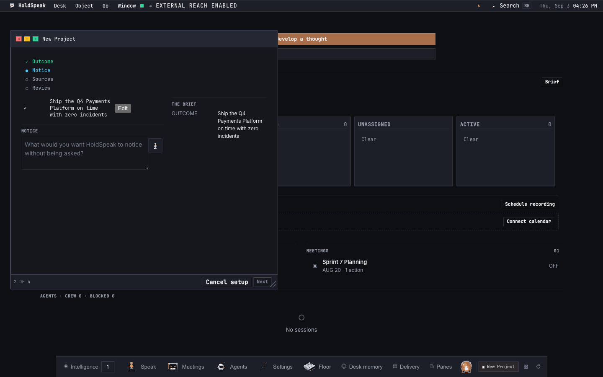

### 3. Sources

The Sources step shows a **TOOLS** row (`TOOLS 2`) above the
suggestions. Each tool card reads its state from the hub's connections
service. A connected tool shows `Connected` with no verb. A tool
that is not connected shows `Sign in` with a `Connect GitHub` or
`Connect Jira` verb that opens **Settings, Connections** in place;
the interview session survives the round trip (the setup is
server-side and resumes). `Recheck` is a quiet second action while
the Connections window is open, so a user who signs in and comes back
without closing Settings has a named way forward.

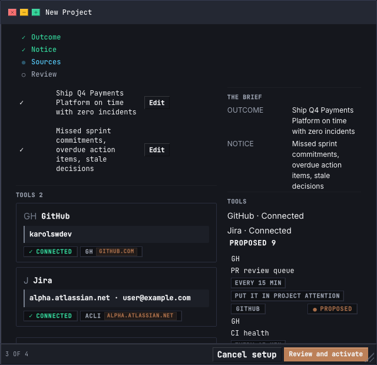

Below the TOOLS row, suggestion cards appear grouped by provider
(up to 4 per provider; the cap prevents one provider from starving
another). Each card carries a `CADENCE` token, an `ACTION` token,
a provenance chip (`gh`, `acli`, or `local`), and the provider's
connection state chip (`Connected` or `Sign in`). A card whose
provider is not connected has no tier and its click scrolls the
TOOLS row into view instead of opening a wizard.

On a cold desk (no tool connected), the TOOLS row shows
`Connect GitHub` and `Connect Jira` and no provider suggestion
cards appear -- only native cards. The TOOLS row is the only place
a cold user learns that GitHub and Jira exist.

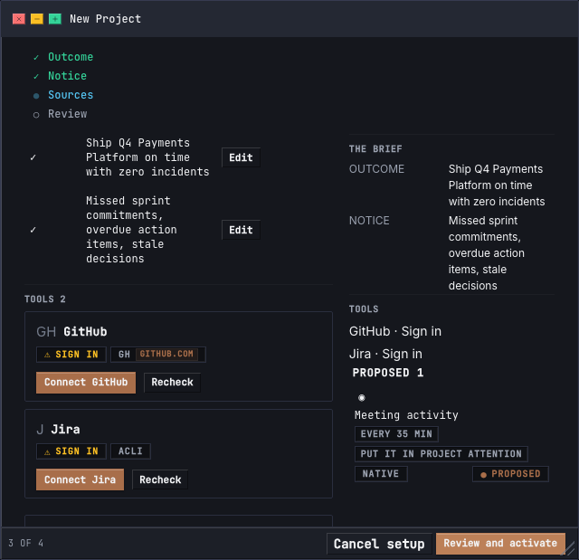

Each interview answer you have already given (the outcome, what to
notice) collapses to one row: the checkmark and your words on one
line, with an `Edit` verb.


### 4. Scope and test

Select a connected provider's suggestion card. The wizard asks scope
and population only (no auth -- that was settled in step 1). The
wizard's progress plan reads `Repository . Population . Test`
(GitHub) or `Account . Project . Population . Test` (Jira; the
Account step is skipped when exactly one connection exists).

**GitHub.** Pick a repository (search or type `owner/repo`). When a
scope was chosen for an earlier same-provider Watch in this session,
the wizard offers that scope as a known-scope card at the top:
summary `chosen for <earlier Watch name>`, verb `Use this repo`. The
discovery list follows beneath it.

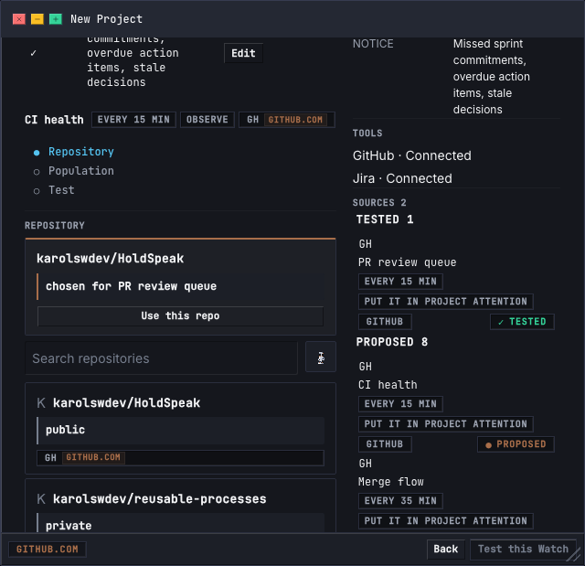

The population sheet shows read-only facts: `SUBJECT` `pull requests`,
`BASE` (the template's base-branch filter, when it carries one) and
`QUERY` in plain words. Test runs the template against the live
repository; the `MATCHES` ledger lists each matched pull request by
number, title and state. The egress chip names `github.com`.

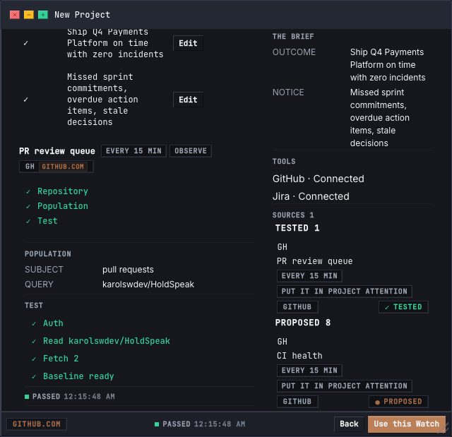

**Jira.** Pick the account (when more than one), the project, and
the issue types. The known-scope card offers `Use this project` when
a scope was chosen for an earlier same-provider Watch. Test runs the
template against the project's issue population. The egress chip
names `<site>.atlassian.net`.

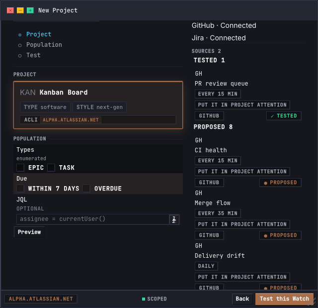

**The verbs.** The wizard footer carries the egress chip of the host,
`Back` (leaves the Watch as it was before the wizard opened), and
`Test this Watch` (primary). After a test passes, the primary verb
becomes `Use this Watch`. `gh` and `acli` hold credentials on this
machine; HoldSpeak stores no token.

### 5. Activate

The activation review shows what will run: two Watches (one per
provider), each with its template, conditions, and target population.
The footer's egress chips name both hosts. Activate baselines both
Watches against the live population and activates them.

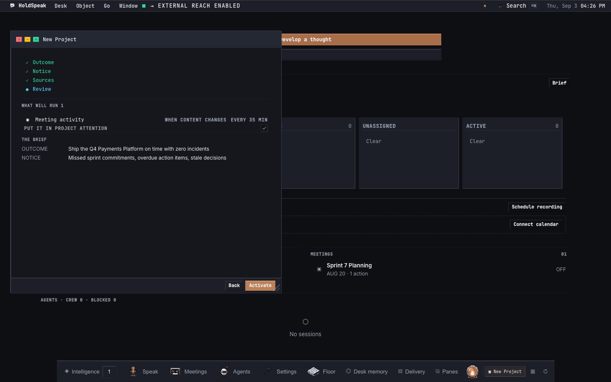

### 6. The Room

The Room lands. The identity band shows the Project name, lifecycle,
and revision. Four wings are visible: Timeline, Decisions, Search,
and Ask. The posture strip's verbs (Review, Updates, Steward) switch
the working view. The Watch ledger rows show
each Watch's template and evaluation state.

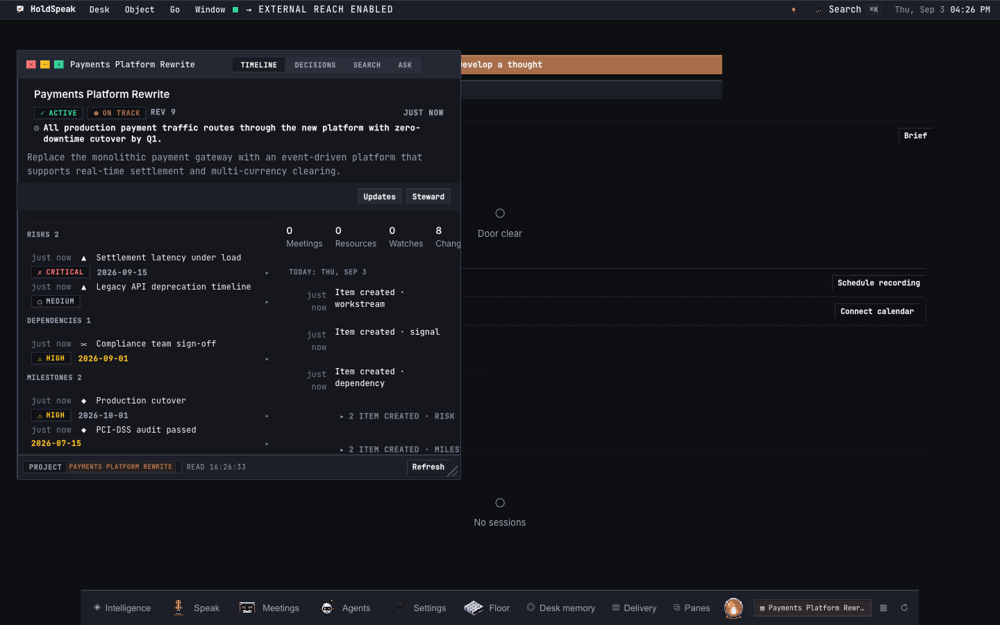

### 7. Review changes

When a Watch evaluation finds transitions (a PR merged, an issue
moved to a new status), the Delta shows them. Open a review to see
the queue. Each row shows the current and proposed state. Accept,
defer, or dismiss each observation. The footer shows the tally.

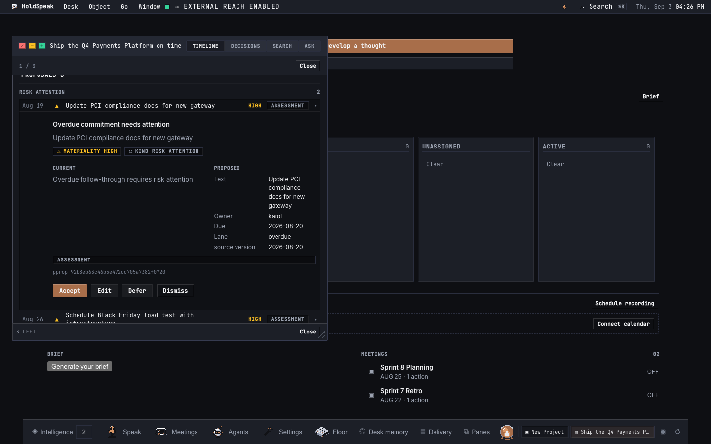

After accepting observations, the review summary shows what was
accepted, deferred, and dismissed.

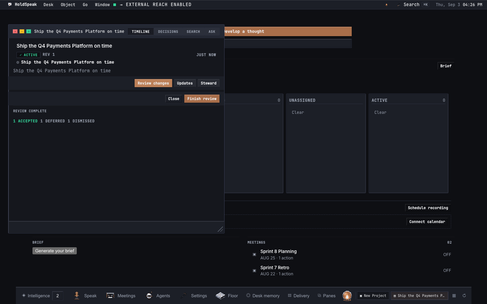

### 8. Run the Steward

Open the Steward posture. The policy editor sets whether the Steward
runs unattended and at what cadence (evaluation interval in minutes,
1 to 10080). Save the policy.

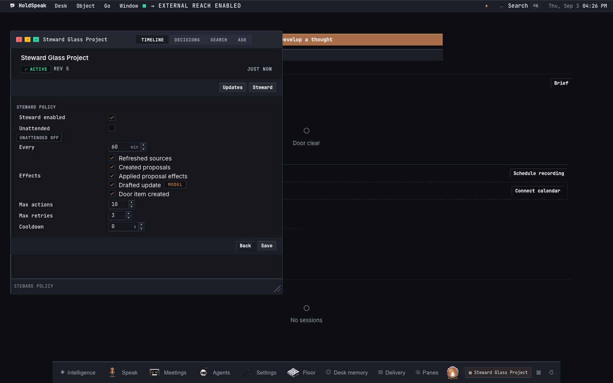

Start a manual run. The run plan shows phases (Observe, Assess,
Record) with step counts, durations, and receipt chips. The Observe
phase carries the API call count. The run detail shows each step's
output. A second manual run at the same watermark reconciles (the
Steward does not repeat work). Door items created by the Steward
appear once on the Dashboard Door.

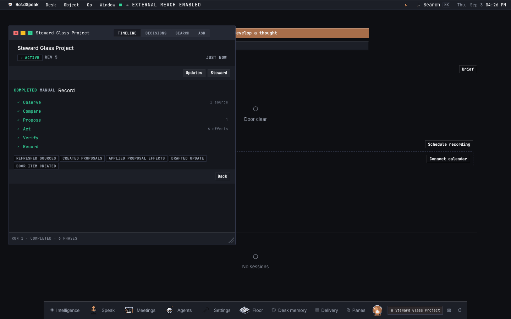

With unattended mode on and a cadence set, the Steward triggers
automatically when Watch evaluations are due. The trigger route
(`POST /api/steward/trigger`) fires evaluate_due and run_due through
the conductor's scheduler seam. If the scheduler is not wired, the
response is a typed 503 `scheduler_not_wired`.

### 9. Draft and publish an update

Draft an update from the week's accepted deltas. The editor shows
citation rows under each section. An unverified claim shows as an
action notice. The footer's egress chip is honest: it names
`deterministic` for a deterministic draft, or the model host for a
model draft.

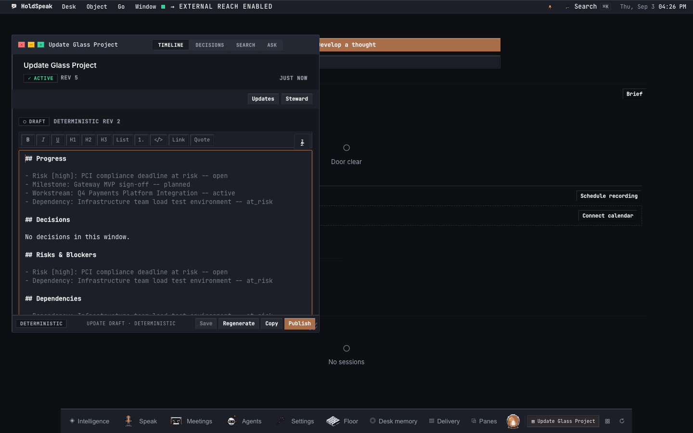

Save the draft, then publish. The published update is readable in
the Room's timeline.

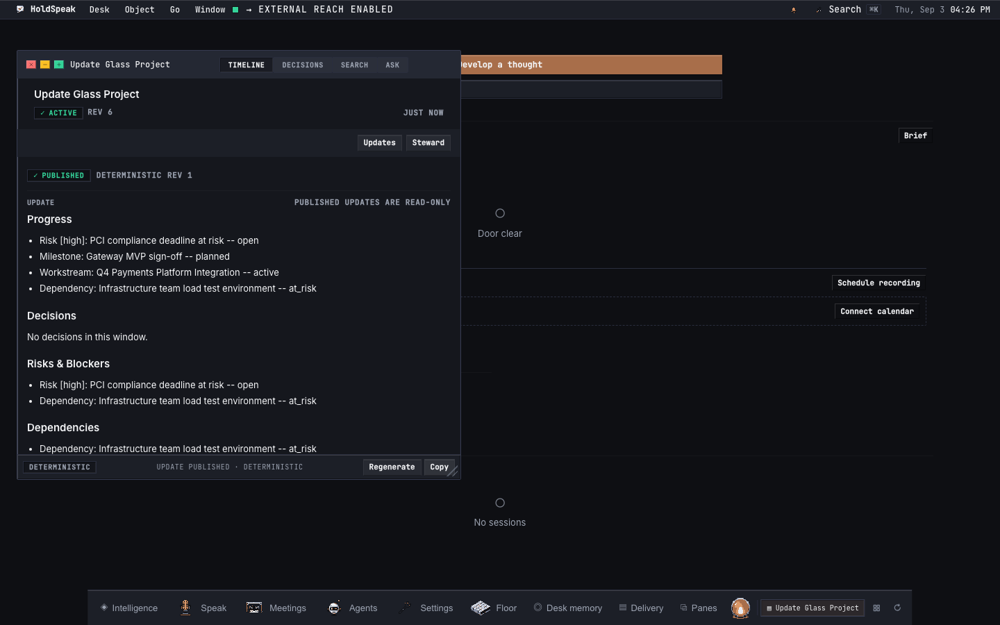

## Watches (Project-scoped)

A Watch observes a population of entities (pull requests or issues)
through a provider connection, evaluates conditions against each
entity's transitions, and fires actions when conditions match.

### GitHub templates

Five built-in templates for pull request Watches:

- `watch.github.review_queue`: surfaces PRs awaiting review.
- `watch.github.ci_health`: tracks CI check failures.
- `watch.github.merge_flow`: observes merge activity.
- `watch.github.delivery_drift`: flags PRs with no recent activity.
- `watch.github.release_readiness`: tracks release-blocking PRs.

### Jira templates

Five built-in templates for issue Watches:

- `watch.jira.blockers`: surfaces issues entering a blocked state.
- `watch.jira.delivery_flow`: tracks status transitions and completion.
- `watch.jira.due_risk`: flags issues approaching or past their due date.
- `watch.jira.scope_intake`: observes newly discovered issues.
- `watch.jira.transformation`: tracks priority escalations, reassignments, and staleness.

### Evaluation

A Watch evaluation fetches the current population, computes transitions
against the last baseline, matches conditions, and records effects.
The evaluator is the same for both providers. Conditions compare at the
change level (a field changed, changed to a value, entered a state) or
at the snapshot level (overdue, due within N days, inactive for N days,
older/newer than N days). Duplicate effects are prevented by
idempotency keys.

## MCP tools

The MCP sidecar exposes the full Project Room surface as tools. Six
Jira-specific tools (`provider.jira_connections`,
`provider.jira_add_connection`, `provider.jira_connection`,
`provider.jira_discover`, `provider.jira_search`,
`provider.jira_validate_scope`) complement the four GitHub tools
(`provider.github_connection`, `provider.github_discover`,
`provider.github_validate_repo`, and the shared `provider.list`).
Two connection tools (`connection.list`, `connection.recheck`) return
the same readiness shape as `GET /api/connections` and
`POST /api/connections/{provider}/recheck`.
`project.steward.trigger` fires evaluate_due and run_due through the
conductor seam; unwired returns a typed 503 `scheduler_not_wired`.

See [MCP sidecar](./MCP_SIDECAR.md) for the full tool reference.

## HTTP routes

The provider routes are listed in [API surface](./API_SURFACE.md)
under `web.routes.providers`. The connections routes
(`GET /api/connections`, `POST /api/connections/{provider}/recheck`)
are under `web.routes.connections`. The steward trigger route is
`POST /api/steward/trigger`.
