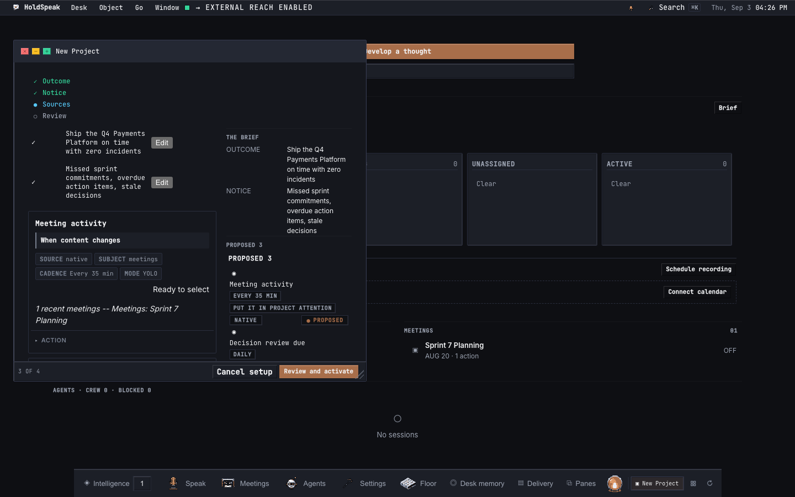
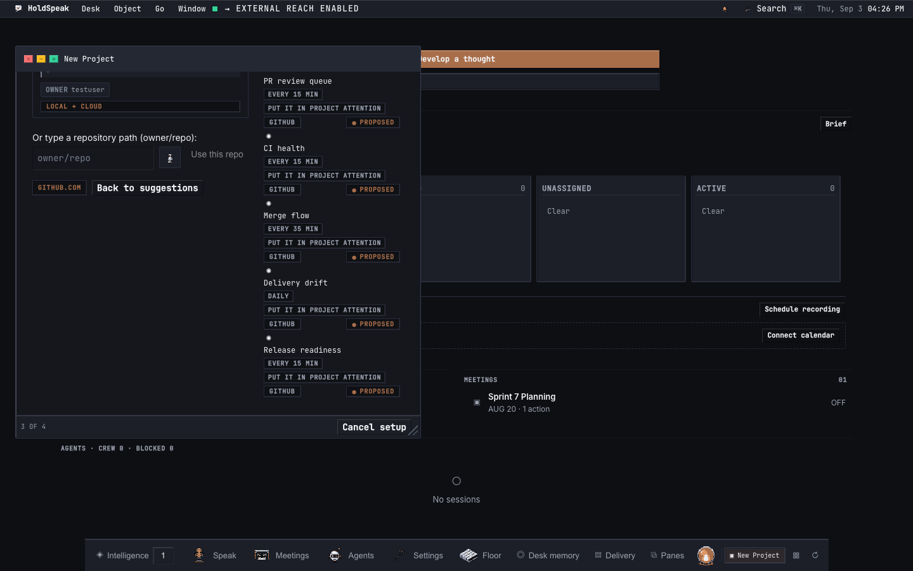
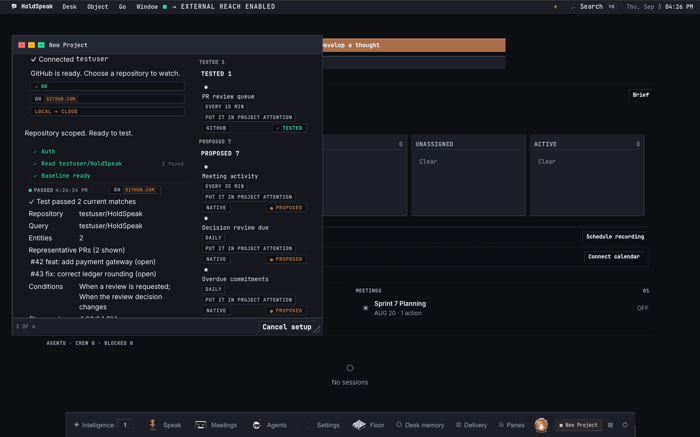
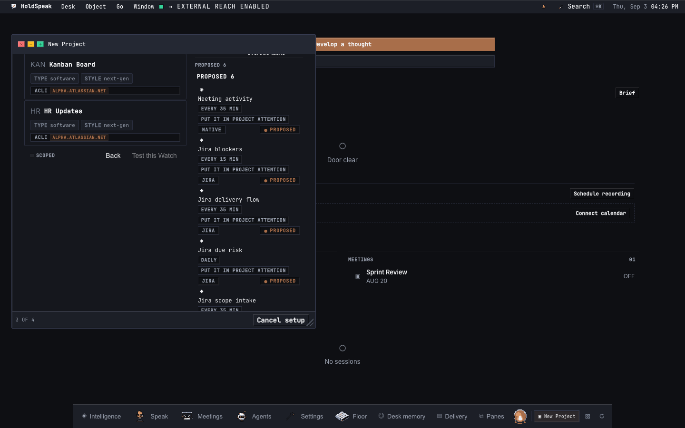
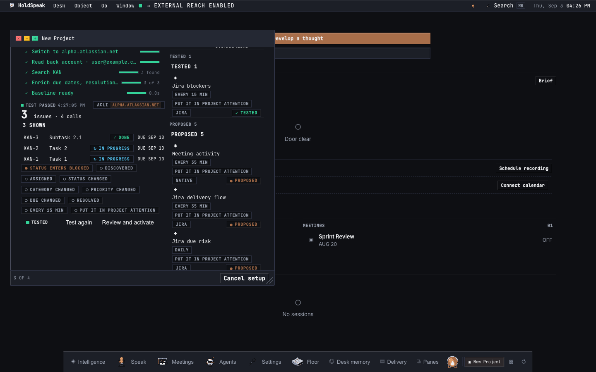

# Project Rooms

A Project Room is the operational surface for one Project. It connects
the Project to external providers (GitHub, Jira), installs Watches
(Project-scoped) over pull requests and issues, and runs the Steward
when conditions fire.

## What a Project Room contains

When you open a Project Room you see the Project's identity, linked
meetings, resources, the current Delta (what changed since the last
update), and the installed Watches (Project-scoped) with their
evaluation history. The Room is one coherent read: everything the
Steward and the owner need to assess the Project's state.

## Providers

A provider connects HoldSpeak to an external system. Each provider
requires its own CLI, installed and authenticated separately.

### GitHub

Requires [`gh`](https://cli.github.com/). Authenticate with
`gh auth login`. HoldSpeak reads connection status, discovers
repositories, and validates an owner/repo pair. Pull request
observations feed Watches (Project-scoped) and the Delta.

### Jira

Requires [`acli`](https://acli.atlassian.com/). Install with:

```bash
brew tap atlassian/homebrew-acli && brew install acli
acli jira auth login --site <yoursite>.atlassian.net --email <you> --token
```

A Jira connection is identified by (site, email). One owner may hold
multiple connections across different `*.atlassian.net` sites or
multiple accounts on one site. HoldSpeak never stores Jira credentials.

Every Jira call follows the switch-and-verify law: `acli jira auth
switch` to the target account, then the command, then `acli jira auth
status` read-back, under a cross-process file lock. A read-back
mismatch is a typed error, never a silent wrong read.

Issue types are enumerated from the Jira project. Statuses are observed
from the issue population (labeled as observed); Jira's three status
categories (new, indeterminate, done) are labeled as static.

All Jira access is read-only. Jira calls contact
`<site>.atlassian.net` from this device.

## The walk: a first Project through the whole Room

This is what a Tuesday looks like with Project Rooms: one project
created, connected, watched, reviewed, steward-run, and updated.

### 1. Start the interview

Open the desk, start a new Project. The interview asks for the outcome
(what the Project is about) and a notice (what you want watched). Type
or dictate both. The mic is on the well.



The interview discovers your connected providers and proposes Watch
candidates. Each suggestion card names the provider and the template.


### 2. Connect GitHub

Select a GitHub suggestion. The wizard shows a connection card for
`gh`. Pick a repository. Check reads the connection status from the
live API. Test runs the Watch template against the live population and
shows the match count. The egress chip names `github.com`.



The test result shows the Watch template's matches against the real
repository. Each matched entity shows its title and the condition
that fired.



### 3. Connect Jira

Select a Jira suggestion. Pick the `acli` account (site and email),
the Jira project, and the issue types. The scope preview shows the
issue count and the number of API calls. Due dates show with a day-
early margin.



Test runs the Watch template against the Jira project's issue
population. Each matched issue shows its key, summary, and the
condition that fired.



### 4. Activate

The activation review shows what will run: two Watches (one per
provider), each with its template, conditions, and target population.
The footer's egress chips name both hosts. Activate baselines both
Watches against the live population and activates them.


### 5. The Room

The Room lands. The identity band shows the Project name, lifecycle,
and revision. Four wings are visible: Timeline, Decisions, Search,
and Ask. The posture strip's verbs (Review, Updates, Steward) switch
the working view. The Watch ledger rows show
each Watch's template and evaluation state.


### 6. Review changes

When a Watch evaluation finds transitions (a PR merged, an issue
moved to a new status), the Delta shows them. Open a review to see
the queue. Each row shows the current and proposed state. Accept,
defer, or dismiss each observation. The footer shows the tally.


After accepting observations, the review summary shows what was
accepted, deferred, and dismissed.


### 7. Run the Steward

Open the Steward posture. The policy editor sets whether the Steward
runs unattended and at what cadence (evaluation interval in minutes,
1 to 10080). Save the policy.


Start a manual run. The run plan shows phases (Observe, Assess,
Record) with step counts, durations, and receipt chips. The Observe
phase carries the API call count. The run detail shows each step's
output. A second manual run at the same watermark reconciles (the
Steward does not repeat work). Door items created by the Steward
appear once on the Dashboard Door.


With unattended mode on and a cadence set, the Steward triggers
automatically when Watch evaluations are due. The trigger route
(`POST /api/steward/trigger`) fires evaluate_due and run_due through
the conductor's scheduler seam. If the scheduler is not wired, the
response is a typed 503 `scheduler_not_wired`.

### 8. Draft and publish an update

Draft an update from the week's accepted deltas. The editor shows
citation rows under each section. An unverified claim shows as an
action notice. The footer's egress chip is honest: it names
`deterministic` for a deterministic draft, or the model host for a
model draft.


Save the draft, then publish. The published update is readable in
the Room's timeline.


## Watches (Project-scoped)

A Watch observes a population of entities (pull requests or issues)
through a provider connection, evaluates conditions against each
entity's transitions, and fires actions when conditions match.

### GitHub templates

Five built-in templates for pull request Watches:

- `watch.github.review_queue`: surfaces PRs awaiting review.
- `watch.github.ci_health`: tracks CI check failures.
- `watch.github.merge_flow`: observes merge activity.
- `watch.github.delivery_drift`: flags PRs with no recent activity.
- `watch.github.release_readiness`: tracks release-blocking PRs.

### Jira templates

Five built-in templates for issue Watches:

- `watch.jira.blockers`: surfaces issues entering a blocked state.
- `watch.jira.delivery_flow`: tracks status transitions and completion.
- `watch.jira.due_risk`: flags issues approaching or past their due date.
- `watch.jira.scope_intake`: observes newly discovered issues.
- `watch.jira.transformation`: tracks priority escalations, reassignments, and staleness.

### Evaluation

A Watch evaluation fetches the current population, computes transitions
against the last baseline, matches conditions, and records effects.
The evaluator is the same for both providers. Conditions compare at the
change level (a field changed, changed to a value, entered a state) or
at the snapshot level (overdue, due within N days, inactive for N days,
older/newer than N days). Duplicate effects are prevented by
idempotency keys.

## MCP tools

The MCP sidecar exposes the full Project Room surface as tools. Six
Jira-specific tools (`provider.jira_connections`,
`provider.jira_add_connection`, `provider.jira_connection`,
`provider.jira_discover`, `provider.jira_search`,
`provider.jira_validate_scope`) complement the four GitHub tools
(`provider.github_connection`, `provider.github_discover`,
`provider.github_validate_repo`, and the shared `provider.list`).
`project.steward.trigger` fires evaluate_due and run_due through the
conductor seam; unwired returns a typed 503 `scheduler_not_wired`.

See [MCP sidecar](./MCP_SIDECAR.md) for the full tool reference.

## HTTP routes

The provider routes are listed in [API surface](./API_SURFACE.md)
under `web.routes.providers`. The steward trigger route is
`POST /api/steward/trigger`.
