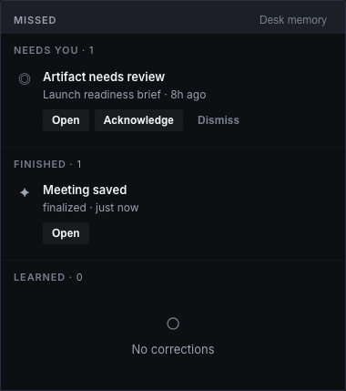
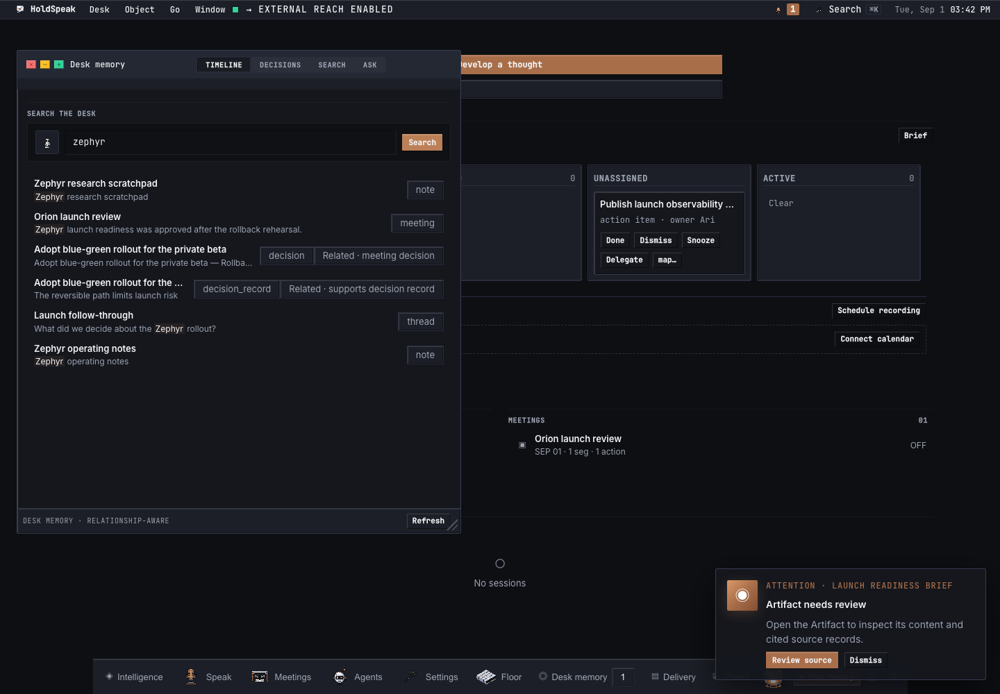
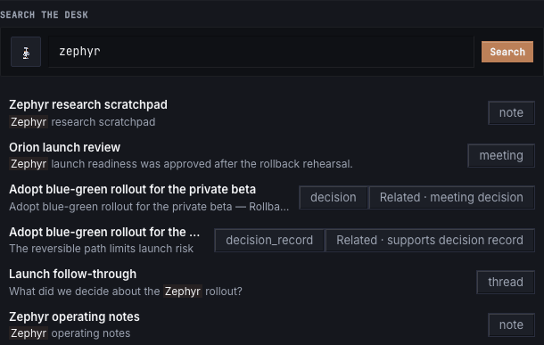
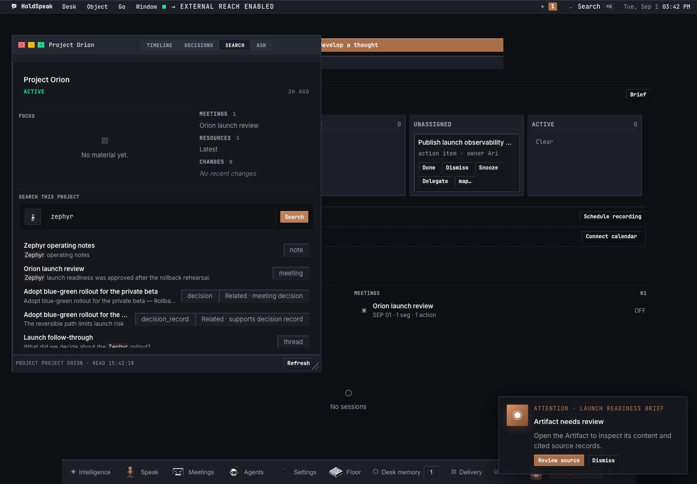
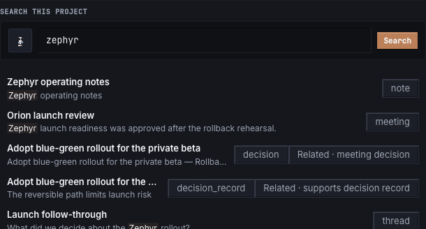

# Relationship-aware memory

Relationship-aware memory is a **read layer over HoldSpeak's durable work**.
It is not a second notebook and it does not silently invent facts. A memory is
created when HoldSpeak creates or updates a canonical object such as a Note,
Meeting transcript, Decision, Artifact, Thread, Action, Project item,
Workbench item/result, or Cadence loop.

## The lifecycle

```text
create or update durable work
        |
        +-- Note / Decision / Artifact ------------------+
        |   SQLite trigger updates its FTS5 index        |
        |                                                 |
        +-- Meeting segment / Thread message ------------+--> lexical recall
        |   content-synced FTS5 trigger updates index     |         |
        |                                                 |         v
        +-- Action / Project / Workbench / Cadence -------+   typed one-hop
            searched in its canonical SQLite table       |   relationship pass
                                                          |         |
                                                          +---------+
                                                                    v
                                                bounded, hydrated source blocks
                                                                    |
                                  +---------------------------------+----------+
                                  |                                 |          |
                             Desk search                     model prompt   API/MCP
```

There is no separate “save to relationship memory” button. The existing
authoring and capture flows are the write path:

| What the user does | Durable source | How it becomes recallable |
| --- | --- | --- |
| Keeps or edits a Note | `notes` | SQLite triggers keep `notes_memory_fts` synchronized. |
| Records/imports a Meeting | `meetings`, `segments` | Content-synced `segments_fts` indexes each transcript segment; recall returns the parent Meeting. |
| Accepts/extracts a Decision | `decisions` | Linked, non-deleted rows are synchronized to `decisions_memory_fts`. |
| Keeps an Artifact | `artifacts` | SQLite triggers keep `artifacts_memory_fts` synchronized. |
| Sends a Thread message | `threads`, `thread_messages`, `thread_message_parts` | Content-synced `thread_messages_fts` indexes message text; recall returns the parent Thread. |
| Creates follow-through or Project work | `action_items`, `project_items` | A bounded canonical-table pass applies the same query terms and ranking contract. |
| Runs a Workbench or Cadence loop | `workbench_items`, `cadence_loops` | The canonical-table pass searches the durable item, result, title, and summary fields. |
| Starts HoldSpeak after an older database upgrade | the same canonical rows | Reconciliation rebuilds the three standalone memory indexes idempotently. |

By default these rows live in
`~/.local/share/holdspeak/holdspeak.db`. Project membership and provenance
edges stay in their existing canonical relationship tables; the search index
does not become a second authority.

Workbench also has an older, deliberately separate private run-memory file at
`~/.holdspeak/workbenches/<workbench-id>/memory.jsonl`. A completed Workbench
run may append one short advisory observation there, and the next run reads a
bounded recent window. That writeback is not the Desk-wide relationship-aware
index and never authorizes an action.

## How recall works

HoldSpeak memory retrieves evidence in two bounded, local passes:

1. SQLite FTS recalls lexical matches independently from extracted Decisions,
   Artifacts, Meeting transcript segments, Notes, and Thread message parts. A
   bounded canonical-store pass applies the same ranking contract to durable
   Decision Records, authored Decisions, Actions, Project items, Workbench
   items/results, and Cadence loops. A child match returns its coherent parent
   Meeting or Thread instead of an isolated row.
2. Up to 32 lexical parent objects seed one authoritative one-hop traversal.
   The traversal follows only relationships HoldSpeak already persisted:
   Meeting–Artifact, Meeting–Decision, Decision–source, supersession, Decision
   Record sources and affected work, Action source Meetings/commitments,
   Workbench grounding/results, Cadence evidence, and frozen Thread references.
   It can add at most two neighbours per lexical seed and 64 related parents
   overall, so one highly connected Meeting cannot crowd every other direct
   match out of a bounded model context.

Model prompts are reduced to at most 24 unique lexical terms while retaining
terms from both the beginning and end of long prompts. This bounds SQLite FTS
grammar and canonical-store scans without dropping a trailing user question.

There is no model call, embedding request, network access, entity extraction, or
inferred edge in either pass. Project-scoped search checks every lexical and
related result against Project membership, Meeting membership, or a Thread's
frozen references before returning it.

Each hit says how it was found:

- `retrieval_origin: lexical` means its own child or body matched the query.
- `retrieval_origin: relationship` means a lexical seed reached it over a
  durable edge; `related_to`, `relationship`, and `graph_score` name that edge.

FTS5 BM25 scores are comparable only within one corpus, so HoldSpeak
normalizes and ranks each object kind independently and then interleaves rank
tiers. A long transcript therefore cannot bury every short Decision merely
because it contains more matching words. Ties are deterministic and prefer
newer work before the stable kind/ref ordering.

The relationship pass is intentionally one hop. It examines at most 32
lexical parents, adds at most two neighbours per seed, and returns at most 64
related parents. Prompt hydration then admits at most 16 source blocks. These
are hard context controls, not relevance suggestions from a model.

## How it is recalled, suggested, and plugged in

“Suggested” currently means **query-relevant evidence selected for the work in
front of the user**. HoldSpeak does not yet run a background recommendation
engine or display unsolicited “you may want this memory” cards.

There are two recall modes:

1. **Visible recall.** Desk Memory calls `/api/memory/search`; Project Room
   sends the same call with `project_id`. Results show their object kind, match
   snippet, and a `Related · …` chip when the second pass supplied the result.
   `memory.search` exposes the same contract to MCP clients.
2. **Automatic model grounding.** Immediately before admission, the current
   input is used as the query. Matching sources are hydrated from their
   canonical records into blocks with a title and stable `[REF: kind:id]`.
   The exact bounded blocks and their selection receipt are placed in the
   admitted payload; providers do not perform retrieval themselves.

An automatic grounding receipt carries:

```json
{
  "source_refs": ["note:n1", "meeting:m1"],
  "selection": "ecosystem_relevance",
  "matched_count": 2,
  "overflow_count": 0
}
```

Explicit attachments remain authoritative. A Project attachment performs a
Project-scoped relevance search and does not add a second global pass. Direct
Ask/Thread calls with other explicit references hydrate those references; an
unattached call uses automatic ecosystem recall. Thought refinement is the
intentional additive case: its already-frozen explicit context is joined with
automatic memory before reservation, and the coordinator and dispatcher hash
the same bytes. Threads also exclude their current Thread from automatic
self-recall and freeze recalled sources onto the user message so later edits to
the source cannot silently change that admitted turn.

## Ecosystem boundary

The same retrieval and hydration contract is used at each model-context
boundary, before the request is admitted and frozen:

| Surface | Integration |
| --- | --- |
| Ask and Thought refinement | An unattached Ask receives query-relevant memory. Thought refinement additionally joins memory to its already-frozen context; routed Thoughts reserve and dispatch the exact same bytes. |
| Threads and Agent chat | An unattached turn freezes recalled sources on the user message and excludes current-thread self-recall. Explicitly attached turns freeze the exact selected sources instead. |
| Agent/Recipe runs | Unattached runs prefix memory to the rendered input and record it in grounding metadata; explicitly grounded chats preserve the selected set. |
| Sequences and Workflows | Every model-bearing step/node retrieves independently from its current input. |
| Workbenches | An unattached item retrieves from its title/body. Explicit item grounding remains exact, while private Workbench run memory joins separately. |
| Coder steering | An ungrounded steer retrieves source blocks; an explicitly grounded steer preserves its selected sources. Previewed and executed bytes remain identical. |
| HTTP, MCP, and Thread tools | `/api/memory/search` and `memory.search` expose the identical hit contract. |
| Web Desk and Project Room | The unscoped window searches the whole Desk; a Project scope applies the Project membership fence. |

The injected text is visibly delimited (`[MEMORY]`, `[GROUNDING]`, or
source-fenced blocks depending on the consumer), and the payload records the
source refs, selection mode, matched count, and overflow count. This makes
recall inspectable even when it happened automatically.

## Search contracts

HTTP:

```text
GET /api/memory/search?query=rollback&project_id=orion&limit=20
```

MCP:

```json
{
  "name": "memory.search",
  "arguments": {
    "query": "rollback",
    "kind": "decision,meeting",
    "project_id": "orion",
    "limit": 20
  }
}
```

Both accept `query`, optional comma-separated `kind`, `project_id`, ISO-8601
`time_from`/`time_to`, `limit` (1–500), and `offset`. Valid kinds are
`decision`, `decision_record`, `desk_decision`, `artifact`, `meeting`, `note`,
`thread`, `action`, `project_item`, `workbench_item`, and `cadence`.

## What this feature does not do

- It does not create embeddings or call a model to rank results.
- It does not infer people, topics, or relationships from matching language.
- It does not write a synthesized “memory” back after every Ask or Thread.
- It does not search raw People records, secrets, settings, kernel receipts,
  unfiltered activity, or Dictation correction memory.
- It does not proactively notify the user about a possibly relevant memory.
- It does not bypass Project membership, read permissions, admission, egress,
  or receipt boundaries.

## Product evidence

The captures below come from the assembled HoldSpeak web runtime with a
temporary local database. The first proves owner-facing discovery and
Desk-wide recall; the second proves the same surface under a Project membership
fence. `Related · …` chips are relationship-pass results rather than lexical
matches.











Raw People records, credentials, settings, kernel receipts, and unfiltered
activity are intentionally not generic memory sources. Dictation's correction
memory also remains a separate privacy/typing subsystem; Dictation-originated
Notes, Meetings, Actions, and other durable outputs become searchable through
their canonical object types. These are security boundaries, not missing
integration claims.

## Design provenance

This is an original HoldSpeak adaptation of two Apache-2.0 RAGFlow retrieval
ideas: parent/child recall and the zero-LLM compiled-product expansion that
searches seeds, follows adjacent graph relations, and loads the neighbours'
source passages. HoldSpeak uses its canonical object graph in place of
RAGFlow's compiled entity rows.

No RAGFlow source file was copied or modified, and this work has not been
submitted to RAGFlow. It is a local HoldSpeak contribution implemented against
HoldSpeak's own repositories, admission system, UI, and tests.

- RAGFlow repository: <https://github.com/infiniflow/ragflow>
- Compiled expansion reference inspected at commit
  `2af732d6072f050ead758edaf23dd4ebfec5526a`:
  <https://github.com/infiniflow/ragflow/blob/2af732d6072f050ead758edaf23dd4ebfec5526a/rag/advanced_rag/harness/tools/compiled_expansion.py>
- RAGFlow license: <https://github.com/infiniflow/ragflow/blob/main/LICENSE>
