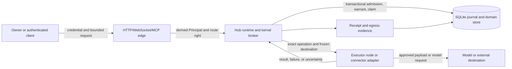

# Security model

This document reconstructs the security controls visible in the source at
snapshot `675401a857b85336d4acaa8c65383dfc9636e4c8` (2026-09-19). It is an
implementation map and an evidence boundary. The existing
[Security & Privacy Posture](SECURITY.md) remains the product security
contract; this page links to it and records runtime details without replacing
its decisions.

## Security posture and limits

HoldSpeak is local-first, single-user application code with cooperating
processes. The existing contract says plainly that the kernel is not a general
OS sandbox: a same-user process can still launch code, open sockets, and read
installed Python (`SECURITY.md`, “Kernel boundary: cooperating code, not a
sandbox”). The runtime therefore enforces its own admission, authority,
destination and receipt boundaries. It does not claim protection from a fully
compromised user account or arbitrary native code running as that user.

Normal SQLite and configuration data are plaintext protected by filesystem
permissions. People records are a separate encrypted sidecar with native key
custody; the storage decision and exclusions are defined in
[SECURITY.md](SECURITY.md), section “Storage & at-rest posture”. Do not infer
that the normal database is encrypted because a People sidecar is.

## Trust-boundary map

The boundary is enforced by several cooperating checks:

| Boundary | Data crossing | Control | Evidence |
| --- | --- | --- | --- |
| Caller → edge | Bearer token or owner token, request envelope | Principal derivation and deny-by-default route rights | `holdspeak/principals.py:275-380`; `tests/integration/test_principal_separation.py` assertions |
| Edge → kernel | Parsed request and principal | Four authority layers, operation policy and causality | `holdspeak/kernel/broker.py:295-322`; `holdspeak/kernel/admission.py:11-68` |
| Kernel → executor | Signed warrant, exact envelope, claim identity | Warrant, revocation, deadline, ancestor liveness and one claim | `holdspeak/kernel/executor.py:26-87` |
| Executor → provider/destination | Frozen target and payload reference | Registered route/adapter and operation family policy | `holdspeak/kernel/inference_invoke.py:65-148`; `holdspeak/operation_policy.py:193-360` |
| Completion → domain | Result reference and terminal evidence | Durable receipt before publication; publication CAS | `holdspeak/kernel/executor.py:89-156`; `holdspeak/kernel/publication_transition.py:12-50` |

These are application controls. They do not make every plugin or subprocess
safe if it bypasses the kernel.

## Identity and credentials

The authenticated runtime has `owner`, `agent`, and `node` principals, plus
internal `scheduler`, `service`, and unauthenticated kinds
(`holdspeak/principals.py:20-59`). A caller cannot set its principal in the
operation payload. The edge derives it from the owner token or an agent/node
credential; route authorization is centralized and deny-by-default
(`holdspeak/principals.py:275-380`). An agent can submit and read scoped work,
use its own receipt paths and revoke itself. It cannot decide, change posture,
delegate, or become owner. A node can use node delivery/executor paths; an
owner token does not become a node merely by choosing a node URL.

Agent credentials are held in memory as SHA-256 token hashes, compared with a
constant-time digest, capped at 30 days and wiped on process restart
(`holdspeak/principals.py:103-209`). The plaintext is returned only from issue
so an operator must store it at issuance. Revocation removes the credential
and its bound targets (`holdspeak/principals.py:218-269`). This is a source
fact, not a claim that a process memory dump is protected.

## Kernel security controls

Admission applies four layers in order: authenticated principal, declared
capability, hard prerequisites, and interruption policy
(`holdspeak/kernel/broker.py:295-322`). The operation envelope freezes name,
version, target, placement, policy version and authority basis. Input rejects
authority-bearing fields supplied by a caller (`holdspeak/kernel/admission.py:11-47`).
Idempotency is scoped to `(principal_identity, idempotency_key)` and a changed
envelope under the same key refuses (`holdspeak/kernel/journal.py:127-155`).

The journal is append-only in normal operation, hash-chained from a genesis
record, and verified on read (`holdspeak/kernel/journal.py:60-103`). Kernel
operation state changes, receipts and inference attestations are written in
one transaction where the path requires it; the inference attestation has
database no-update/no-delete triggers (`holdspeak/kernel/journal.py:372-493`,
`holdspeak/db/schema.py:2156-2199`). The recursive filter rejects the named audio, audio-frame, PCM, token and
token-stream keys (`holdspeak/kernel/model.py:9-13,65-73`). It does not classify
arbitrary strings as prompt, transcript or completion content.

The executor checks the warrant signature and exact envelope, revocation,
expiry, live ancestor and claim identity, then writes one claim witness
(`holdspeak/kernel/executor.py:26-87`). Receipts are immutable and require a
valid result reference; inference receipts also require attestation evidence
(`holdspeak/kernel/executor.py:89-128`). A late executor cannot rewrite an
`indeterminate` result into success.

## Control modes and effect policy

The canonical operation policy has `safe`, `neutral` and `yolo` values, with
hard invariants for authentication, secret custody, destination/payload
binding, pane identity, audit receipt, configuration integrity and schema
safety (`holdspeak/operation_policy.py:15-31`). The resolver refuses unknown
families and evaluates hard invariants before mode. Dictation, coder steering,
external writes and cadence have separate mode matrices
(`holdspeak/operation_policy.py:193-360`). The existing
[authority contract](AUTHORITY.md) defines the user-facing control modes,
review/authorization/execution separation and reusable grants. This page does
not create a second mode vocabulary.

YOLO reduces repeated confirmation only within a configured, fixed authority
scope. It does not waive authentication, destination binding, the receipt
ledger, or the People refusal matrix. External egress remains a feature-level
choice and must be represented by an egress/refusal receipt as described in
[SECURITY.md](SECURITY.md).

## Data handling and egress

The normal database can contain transcripts, speaker labels and embeddings,
meeting intelligence, activity records, operation metadata and receipts. The
generic inference journal path carries hashes, references and bounded labels.
Kernel-owned parent snapshots are a separate content-bearing path:
`kernel_parent_runs.input_json` serializes input mappings, and Sequence supplies
its request body (`parent_run.py:105-106`; `sequence_workflow_service.py:322-328`).
Do not treat the word kernel as a content-exclusion boundary.

Inference dispatch binds one physical provider child to a deployment revision,
target, placement, content-free route descriptor and egress reference
(`holdspeak/kernel/inference_invoke.py:65-148`). A fallback is another child
and another receipt, not a hidden retry. The model host and destination should
be reported from the bound route, not guessed from a caller label.

People content has a narrower encrypted boundary and is excluded from normal
database search, sync, exports, connectors, Cadence and generic MCP surfaces;
the authoritative details are in [SECURITY.md](SECURITY.md), including the
People security boundary. This implementation page does not claim that every
other application file is automatically classified correctly.

## Failure, recovery and security evidence

Startup calls parent reconciliation, inference route recovery, then projection
recovery (`holdspeak/kernel/runtime.py:173-175`). The projection recovery method
reaps expired operations first; this is not a global reaping-before-route
guarantee (`holdspeak/kernel/projection_stager.py:343-346`). An awaiting or claimed
operation that misses its liveness bound becomes a refusal or `indeterminate`
(`holdspeak/kernel/liveness.py:9-61`). A lost response is therefore resolved
by reading the receipt and journal, not by repeating the external effect.

The inspected assertions cover principal separation, agent expiry and
revocation, node identity, immutable envelopes, warrant expiry, refusal and
receipt immutability (`tests/unit/test_kernel_broker.py:66-289`,
`tests/integration/test_principal_separation.py`,
`tests/integration/test_kernel_real_hub.py:49-234`). They were read for this
reconstruction and were not run. No claim of a passing security suite is made.

## Open limits

The generated [boundary candidate census](generated/boundary-candidates.json)
is an audit lead assembled from lexical call-site candidates. It can contain
false positives and miss dynamic paths, so it is not proof of complete
coverage.

The snapshot does not prove OS-level isolation for arbitrary plugins, complete
secret zeroization after process crash, encrypted normal SQLite storage, or
owner observation of the controls. It also does not establish that every
external adapter has identical receipt coverage without inspecting that
adapter's operation registration. Treat these as verification limits and use
the existing [security contract](SECURITY.md) for product policy.

## Gate preview limitation

Gate argument previews truncate canonical JSON; they do not remove secrets.
`holdspeak/coder_gate.py::redact_args` returns a SHA-256 plus the first 120
characters. A short input, including a credential in it, can remain intact in
that prefix. Treat the preview as sensitive tool content. The executable claim
probe uses a synthetic marker to check this behavior; it does not read a real
credential. See [Gate](GATE.md).
