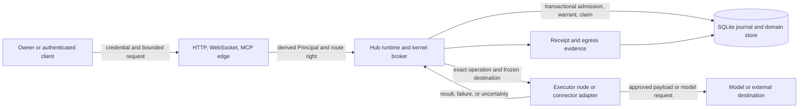

# Security model

This page maps the security controls in the source. It is for contributors.
[Security and privacy](SECURITY.md) is the product contract. This page adds
runtime detail and does not change that contract.

## Limits

HoldSpeak is local-first, single-user code with cooperating processes. It is not
an OS sandbox. A process that runs as you can launch code, open sockets, and read
the installed Python. HoldSpeak enforces its own admission, authority,
destination, and receipt boundaries. It does not protect against a fully
compromised user account or native code that runs as that user.

The normal SQLite data and the config are plaintext. File permissions protect
them. The People store is a separate encrypted store with native key custody. Do
not assume the normal database is encrypted because the People store is. See
[Security and privacy](SECURITY.md#2-storage-and-at-rest-posture).

## Trust-boundary map

```mermaid
flowchart LR
  OWNER[Owner or authenticated client]
  EDGE[HTTP, WebSocket, MCP edge]
  HUB[Hub runtime and kernel broker]
  DB[(SQLite journal and domain store)]
  NODE[Executor node or connector adapter]
  PROVIDER[Model or external destination]
  RECEIPT[Receipt and egress evidence]

  OWNER -->|credential and bounded request| EDGE
  EDGE -->|derived Principal and route right| HUB
  HUB -->|transactional admission, warrant, claim| DB
  HUB -->|exact operation and frozen destination| NODE
  NODE -->|approved payload or model request| PROVIDER
  NODE -->|result, failure, or uncertainty| HUB
  HUB --> RECEIPT
  RECEIPT --> DB
```

| Boundary | What crosses | Control | Source |
| --- | --- | --- | --- |
| Caller to edge | Bearer token or owner token, request | Principal derivation, deny-by-default route rights | `holdspeak/principals.py` |
| Edge to kernel | Parsed request and principal | Four admission layers, operation policy, causality | `holdspeak/kernel/broker.py`, `holdspeak/kernel/admission.py` |
| Kernel to executor | Signed warrant, exact envelope, claim identity | Warrant, revocation, deadline, ancestor liveness, one claim | `holdspeak/kernel/executor.py` |
| Executor to destination | Frozen target, payload reference | Registered route and adapter, operation family policy | `holdspeak/kernel/inference_invoke.py`, `holdspeak/operation_policy.py` |
| Completion to domain | Result reference, terminal evidence | Durable receipt before publication, publication compare-and-swap | `holdspeak/kernel/executor.py`, `holdspeak/kernel/publication_transition.py` |

These controls apply to code that goes through the kernel. A plugin or subprocess
that bypasses the kernel is not made safe by them.

## Identity and credentials

`holdspeak/principals.py` defines the principal kinds: `owner`, `agent`, `node`,
`scheduler`, `service`, and `none`. A caller cannot set its principal in an
operation payload. The edge derives it from the owner token or from an agent or
node credential. Route authorization is central and deny by default.

- An agent can submit and read scoped work, read usage, and revoke itself. It
  cannot decide, change posture, delegate, or become owner.
- A node can use the node link path only. An owner token does not become a node
  when it names a node URL.

Agent credentials live in memory as SHA-256 token hashes. HoldSpeak compares them
in constant time. The TTL has a cap of 30 days. A process restart clears them.
Only the issue call returns the plaintext. Revocation removes the credential and
its bound targets. This does not protect against a memory dump.

## Kernel controls

Admission applies four layers in order: authenticated principal, declared
capability, hard prerequisites, and interruption policy. The operation envelope
freezes name, version, target, placement, policy version, and authority basis.
Admission rejects authority fields that a caller supplies.

Idempotency is scoped to the principal identity and the idempotency key. A changed
envelope under the same key is refused (`holdspeak/kernel/journal.py`).

The journal is append-only and hash-chained from a genesis record. HoldSpeak
verifies it on read. Operation state changes, receipts, and inference
attestations are written in one transaction where the path needs it. Database
triggers block updates and deletes on the inference attestation.

The recursive content filter in `holdspeak/kernel/model.py` rejects named audio,
audio-frame, PCM, token, and token-stream keys. It does not classify arbitrary
strings as prompt, transcript, or completion text.

The executor checks the warrant signature, exact envelope, revocation, expiry,
live ancestor, and claim identity. Then it writes one claim witness. Receipts are
immutable and need a valid result reference. Inference receipts also need
attestation evidence. A late executor cannot rewrite `indeterminate` into
success.

## Control mode and effect policy

`holdspeak/operation_policy.py` defines the wire modes `safe`, `neutral`, and
`yolo`, and the hard invariants: authentication, secret custody, destination
binding, payload binding, pane identity, audit receipt, configuration integrity,
and schema safety. The resolver refuses unknown families and checks hard
invariants before mode. Dictation commit, Coder steering, external write, and
sync or Cadence have separate mode rules.

[Authority](AUTHORITY.md) owns the user-facing mode names, the review,
authorization, and execution split, and reusable grants. This page adds no second
vocabulary.

YOLO reduces repeated confirmation only inside a configured, fixed scope. It does
not waive authentication, destination binding, the receipt ledger, or the People
refusal rules.

## Data handling and egress

The normal database can hold transcripts, speaker labels, embeddings, meeting
intelligence, activity records, operation metadata, and receipts. The generic
inference journal path carries hashes, references, and bounded labels.

A kernel parent run is a separate path that can hold content.
`kernel_parent_runs.input_json` stores the input snapshot, and Sequence supplies
its request body there (`holdspeak/kernel/parent_run.py`). The word "kernel" does
not mean "content-free".

Inference dispatch binds one provider child to a deployment revision, target,
placement, content-free route descriptor, and egress reference. A fallback is a
new child with a new receipt, not a hidden retry. Report the model host from the
bound route. Do not guess it from a caller label.

People content has a narrower encrypted boundary. See
[People security boundary](PEOPLE_SECURITY.md).

## Failure and recovery

At startup the kernel runs parent reconciliation, inference route recovery, and
projection recovery, in that order. The projection recovery step reaps expired
operations first. This is not a global rule that reaping runs before route
recovery.

An operation that is awaiting or claimed and misses its liveness bound ends as a
refusal or as `indeterminate` (`holdspeak/kernel/liveness.py`). To resolve a lost
response, read the receipt and the journal. Do not repeat the external effect.

## Open limits

- `docs/generated/boundary-candidates.json` is a lexical audit lead. It is not in
  git. Run `scripts/gen_docs.sh` to write it. It can contain false positives and
  miss dynamic paths. It does not prove full coverage.
- The source does not prove OS-level isolation for arbitrary plugins, full secret
  zeroization after a crash, encrypted normal SQLite storage, or identical receipt
  coverage for every external adapter. Check an adapter's operation registration
  before you assume coverage.

## Gate preview limit

Gate argument previews truncate canonical JSON. They do not remove secrets.
`holdspeak/coder_gate.py::redact_args` returns a SHA-256 and the first 120
characters. A short input can stay whole in that prefix, including a credential.
Treat the preview as sensitive tool content. See [Gate](GATE.md).
