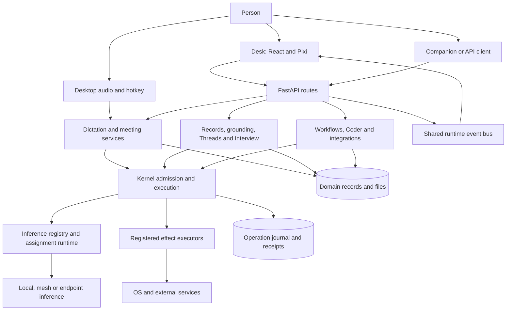

# System architecture

This map describes source at `675401a857b85336d4acaa8c65383dfc9636e4c8`.
It is a reading map, not a claim that every path has passed an owner walk.
Start with [What is HoldSpeak?](WHAT_IS_HOLDSPEAK.md) for the user model.
The existing [architecture](ARCHITECTURE.md) owns its detailed contracts.

HoldSpeak has one hub and several ways to reach it. The hub connects audio,
retained records, model work, and effects on other systems. The Desk is the main
Web surface. Native hooks, a command line, MCP clients, and companion devices
are other entrances. They do not all use HTTP: desktop hotkey/audio callbacks
can call runtime services directly. Drawing every input through FastAPI would
hide that distinction.

The arrows name major relationships. They do not assert universal coverage of
all legacy paths. The kernel adapter inventory and boundary audit identify
which operations enter admission. Content stays in domain stores. The journal
records operation facts; it is not another transcript or conversation store.

| Responsibility | Source owner | Contract to read |
| --- | --- | --- |
| Local HTTP host and WebSocket transport | `holdspeak/web_server.py::MeetingWebServer`, `WebSocketManager` | [API surface](API_SURFACE.md) |
| Request-specific routing | `holdspeak/web/routes/` | [API reference](API_REFERENCE.md) |
| Voice transformation and delivery | `holdspeak/plugins/dictation/`, `holdspeak/runtime/dictation_processing.py` | [Dictation](DICTATION_ARCHITECTURE.md) |
| Meeting session and intelligence | `holdspeak/meeting_session/`, `holdspeak/plugins/` | [Meetings](MEETING_ARCHITECTURE.md), [plugins](MEETING_INTELLIGENCE.md) |
| Model selection and physical attempts | `holdspeak/services/inference_assignment_service.py`, `holdspeak/kernel/` | [Model runtime](MODEL_RUNTIME.md) |
| Admission, authority, execution and terminal evidence | `holdspeak/kernel/runtime.py`, broker and executor | [Kernel](KERNEL.md) |
| Native records and schema | `holdspeak/db/` and service-owned stores | [Domain model](DOMAIN_MODEL.md), [data](DATA_MODEL.md) |
| Desk presentation and workspace layout | `web/src/desk/`, `web/src/runtime/RuntimeBus.tsx` | [Desk](DESK_ARCHITECTURE.md) |
| Provider secrets and boundary enforcement | backend settings and effect/inference adapters | [Security](SECURITY_MODEL.md), [authority](AUTHORITY_MODEL.md) |

## State ownership

A Meeting, Note or Thread is a retained domain record. A window rectangle is
workspace state. Hover and drag candidates are transient UI state. A model
attempt has operation identity and a terminal receipt. These lifetimes differ.
Saving a window does not save a meeting; closing it does not cancel the work
unless that window invokes a supported cancellation command.

The base SQLite schema is mechanically listed in the [schema inventory](generated/schema-inventory.json).
It is not the complete reconciled or companion schema. Read the storage guide
for service databases, local configuration, files, secrets and migration rules.

## Authority is operation-specific

A user gesture can authorize an action. Other operations wait for a decision
or require a bounded grant. Hard prerequisites still apply. The exact admission
path matters more than the word “approved” in a screen label. Model placement
is also independent of action authority: a local UI can call a remote model.
[Authority](AUTHORITY_MODEL.md) and [security](SECURITY_MODEL.md) own these rules.

## Extensions and changes

Start from the capability's evidence row, then inspect its service, route,
store and asserted behavior. Use the existing kernel codec, command, plugin or
connector seam that matches the change. Do not add another lifecycle store to
make a new view convenient. A missing adapter or weak test is an engineering
gap, not permission for documentation to claim universal coverage.

The [integration map](SYSTEM_INTEGRATION_MAP.md) describes deployment and event
boundaries. The [repository map](generated/REPOSITORY_MAP.md) locates files.
The [Desk SRS](internal/philo/SRS.md) separates existing behavior from proposed
requirements. No desktop wrapper or new control mode is shipped by this audit.
