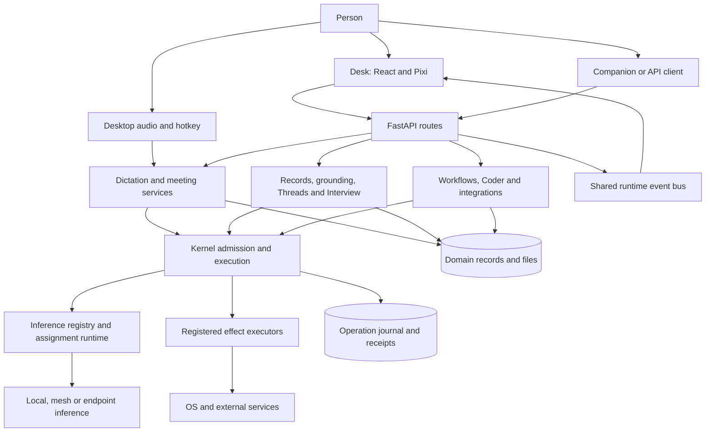

# System architecture

HoldSpeak has one hub and several ways to reach it. The hub connects audio,
retained records, model work and effects on other systems. This page is the
short map. [Architecture](ARCHITECTURE.md) holds the detailed contracts. For
the user model, read [What is HoldSpeak?](WHAT_IS_HOLDSPEAK.md).

The Desk is the main Web surface. Native hooks, a command line, MCP clients
and companion devices are other entrances. They do not all use HTTP. The
desktop hotkey and audio callbacks call runtime services directly.

```mermaid
flowchart TB
  Human[Person] --> Audio[Desktop audio and hotkey]
  Human --> Desk[Desk: React and Pixi]
  Human --> Client[Companion or API client]
  Audio --> Voice[Dictation and meeting services]
  Desk --> HTTP[FastAPI routes]
  Client --> HTTP
  HTTP --> Voice
  HTTP --> Knowledge[Records, grounding, Threads and Interview]
  HTTP --> Automation[Workflows, Coder and integrations]
  Voice --> Kernel[Kernel admission and execution]
  Knowledge --> Kernel
  Automation --> Kernel
  Kernel --> Router[Inference registry and assignment runtime]
  Kernel --> Effects[Registered effect executors]
  Router --> Dest[Local, mesh or endpoint inference]
  Effects --> Outside[OS and external services]
  Kernel --> Journal[(Operation journal and receipts)]
  Voice --> Content[(Domain records and files)]
  Knowledge --> Content
  Automation --> Content
  HTTP --> Bus[Shared runtime event bus]
  Bus --> Desk
```

The arrows show major relationships. Not every older path enters kernel
admission. Content stays in domain stores. The journal records operation
facts. It is not a transcript store.

## Who owns what

| Responsibility | Source | Read |
| --- | --- | --- |
| HTTP host and WebSocket | `holdspeak/web_server.py` (`MeetingWebServer`, `WebSocketManager`) | [API surface](API_SURFACE.md) |
| Request routing | `holdspeak/web/routes/` | [API reference](API_REFERENCE.md) |
| Voice transformation and delivery | `holdspeak/plugins/dictation/`, `holdspeak/runtime/dictation_processing.py` | [Dictation](DICTATION_ARCHITECTURE.md) |
| Meeting session and intelligence | `holdspeak/meeting_session/`, `holdspeak/plugins/` | [Meetings](MEETING_ARCHITECTURE.md), [plugins](MEETING_INTELLIGENCE.md) |
| Model selection and attempts | `holdspeak/services/inference_assignment_service.py`, `holdspeak/kernel/` | [Model runtime](MODEL_RUNTIME.md) |
| Admission, authority, execution, receipts | `holdspeak/kernel/` | [Kernel](KERNEL.md) |
| Records and schema | `holdspeak/db/` and service-owned stores | [Domain model](DOMAIN_MODEL.md), [data model](DATA_MODEL.md) |
| Desk windows and layout | `web/src/desk/`, `web/src/runtime/RuntimeBus.tsx` | [Desk](DESK_ARCHITECTURE.md) |
| Secrets and boundary rules | settings, effect and inference adapters | [Security](SECURITY_MODEL.md), [authority](AUTHORITY_MODEL.md) |

## State lifetimes

- A Meeting, Note or Thread is a retained domain record.
- A window rectangle is workspace state.
- A hover or drag candidate is transient UI state.
- A model attempt has an operation identity and a terminal receipt.

Saving a window does not save a Meeting. Closing a window does not cancel
work, unless the window sends a supported cancel command. For storage, read
[Storage and migrations](STORAGE_AND_MIGRATIONS.md). The base schema is listed
in the [schema inventory](generated/schema-inventory.json).

## Authority

A user gesture can authorize an action. Other operations wait for a decision
or need a bounded grant. Model placement is separate from action authority. A
local UI can call a remote model. [Authority](AUTHORITY_MODEL.md) and
[Security](SECURITY_MODEL.md) own these rules.

## Change the system

1. Find the capability's service, route and store.
2. Use the existing kernel codec, command, plugin or connector seam.
3. Do not add a lifecycle store to make a view convenient.

See also the [integration map](SYSTEM_INTEGRATION_MAP.md) and the
[repository map](generated/REPOSITORY_MAP.md).
