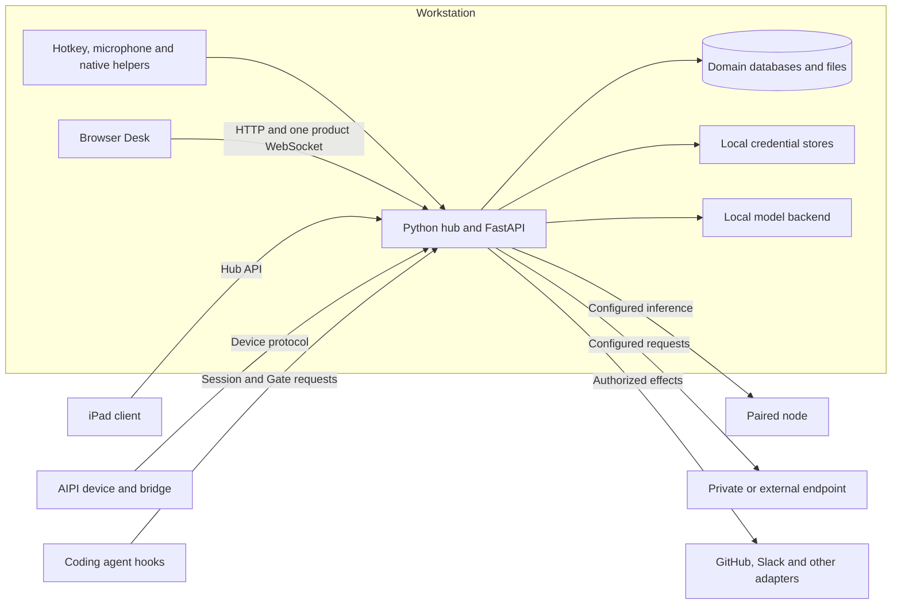
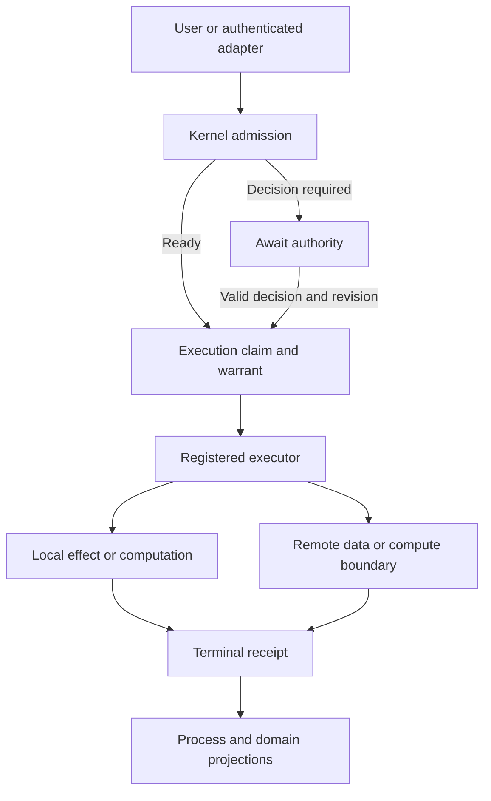

# System integration map

Research snapshot: `675401a857b85336d4acaa8c65383dfc9636e4c8`.
Read the [system architecture](SYSTEM_ARCHITECTURE.md) first. This map separates
network topology from operation authority. A LAN address is not authorization.

## Deployment

The browser is a client of the hub. The Python runtime can capture audio and
perform local operations without a browser. A companion uses its own transport
and authentication contract. Mesh inference is another execution boundary;
it is not the same connection as the Desk runtime bus.

## Data, compute, authority, secret and audit boundaries

This is the admitted-operation path, not a claim that an arbitrary plugin is
sandboxed. Admission checks the principal, operation, target and prerequisites.
The executor validates the execution claim. The receipt records the outcome;
the domain projection exposes the useful result. Credentials stay in their
own stores and must not be copied into frontend state or receipts. Read
[Kernel](KERNEL.md) for exact states and recovery, and [Security](SECURITY_MODEL.md)
for the operation-specific egress table and limits.

## Workflow map

| Job | Input and service | Durable result | Boundary owner |
| --- | --- | --- | --- |
| Speak → Type | Audio, transcription, dictation transforms and target delivery | Run/journal and optional correction | [Dictation](DICTATION_ARCHITECTURE.md) |
| Meet → Understand | Capture/import, session runner and selected plugins | Meeting, transcript and typed artifacts | [Meeting pipeline](MEETING_ARCHITECTURE.md) |
| Context → Think | Explicit attachments, retrieval and conversation/tool loop | Thread history and optional Artifact | [Agents and Threads](AGENTS_AND_THREADS.md) |
| Propose → Act | Concrete operation, admission and operation-specific authority | Native result and receipt | [Authority](AUTHORITY_MODEL.md) |
| Observe/answer Coder | Hook/session state, user response or held tool request | Coder state and delivery/Gate evidence | [Coder](CODER_INTEGRATION.md), [Gate](GATE.md) |
| Run elsewhere | Assignment, frozen plan and physical inference attempt | Result plus attempt/placement facts | [Destinations](EXECUTION_DESTINATIONS.md) |

Sequence diagrams live beside the contracts that own their semantics. The
meeting-to-actuator sequence is in [aftercare](MEETING_AFTERCARE.md); model
selection and mesh execution are in [model runtime](MODEL_RUNTIME.md) and
[destinations](EXECUTION_DESTINATIONS.md). Window/focus and drop state machines
belong to the [Desk specification](internal/philo/DESIGN_SPECIFICATION.md).
This avoids keeping two conflicting versions of the same sequence.

## Frontend integration

The Desk's spatial renderer and DOM windows read the same workspace state.
`web/src/lib/api.ts` owns HTTP access; `web/src/runtime/RuntimeBus.tsx` owns the
product socket. Feature components consume those boundaries. Local workspace
persistence is separate from backend records. A future native host must adapt
bounded OS services to this application rather than create another product
store or HTTP client. The [host ADR](internal/philo/adr/desktop-host.md) remains
proposed.

## Failure and recovery

Disconnection is not evidence that remote work failed. A queue acknowledgement
is not a result. A restart must reconcile durable operation state before a
projection tells the user work completed. Inspect the exact per-operation rules
in [Kernel](KERNEL.md), [Storage](STORAGE_AND_MIGRATIONS.md) and
[Troubleshooting](TROUBLESHOOTING.md). The design uses honest unknown or
indeterminate states where evidence is incomplete; it does not infer success
from the disappearance of a spinner.
