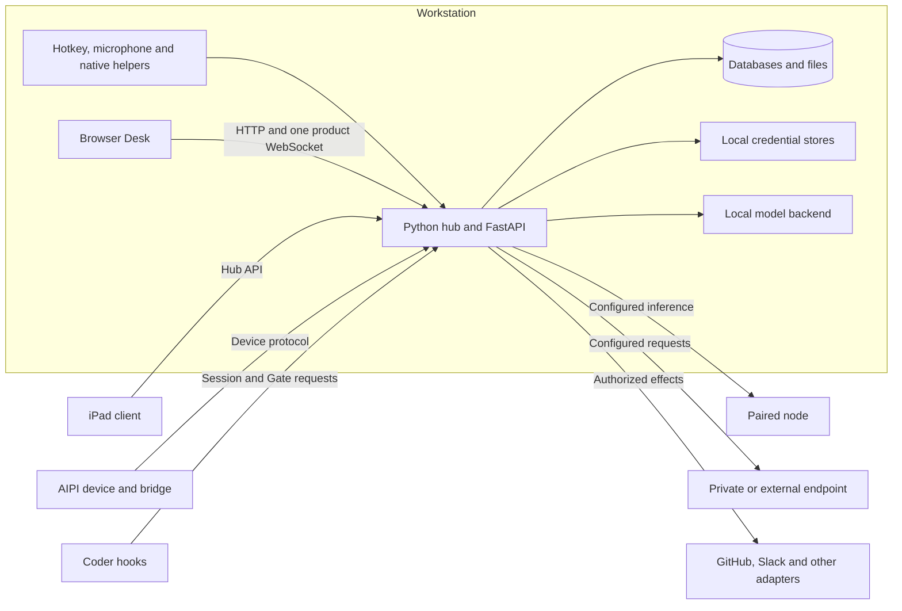
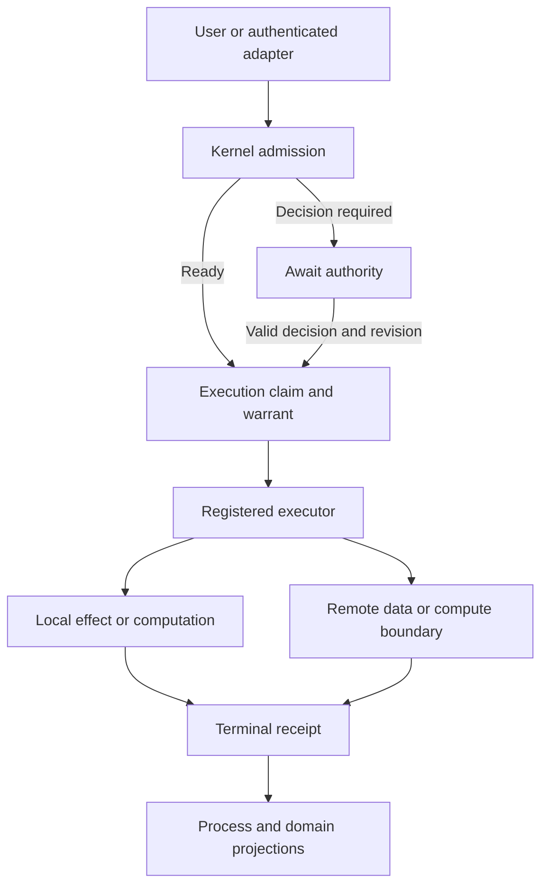

# System integration map

This map shows where HoldSpeak runs and which connections cross a boundary.
Read the [system architecture](SYSTEM_ARCHITECTURE.md) first. A network
address is not authorization. Network topology and operation authority are
separate questions.

## Deployment

```mermaid
flowchart LR
  subgraph Workstation
    Native[Hotkey, microphone and native helpers]
    Hub[Python hub and FastAPI]
    Browser[Browser Desk]
    DB[(Databases and files)]
    Secret[Local credential stores]
    Local[Local model backend]
    Native --> Hub
    Browser -->|HTTP and one product WebSocket| Hub
    Hub --> DB
    Hub --> Secret
    Hub --> Local
  end
  Tablet[iPad client] -->|Hub API| Hub
  Device[AIPI device and bridge] -->|Device protocol| Hub
  Agent[Coder hooks] -->|Session and Gate requests| Hub
  Hub -->|Configured inference| Mesh[Paired node]
  Hub -->|Configured requests| Endpoint[Private or external endpoint]
  Hub -->|Authorized effects| External[GitHub, Slack and other adapters]
```

- The browser is a client of the hub.
- The Python runtime captures audio and does local work without a browser.
- A companion uses its own transport and authentication. See
  [Companion architecture](COMPANIONS_ARCHITECTURE.md).
- Mesh inference is a separate execution boundary. It is not the Desk runtime
  bus.

## Admitted operations

```mermaid
flowchart TB
  Input[User or authenticated adapter] --> Admit[Kernel admission]
  Admit -->|Ready| Claim[Execution claim and warrant]
  Admit -->|Decision required| Wait[Await authority]
  Wait -->|Valid decision and revision| Claim
  Claim --> Dispatch[Registered executor]
  Dispatch --> Local[Local effect or computation]
  Dispatch --> Remote[Remote data or compute boundary]
  Local --> Receipt[Terminal receipt]
  Remote --> Receipt
  Receipt --> Projection[Process and domain projections]
```

Admission checks the principal, the operation, the target and the
prerequisites. The executor checks the claim. The receipt records the outcome.
The domain projection shows the result. Credentials stay in their own stores.
Do not copy them into frontend state or receipts. The path does not sandbox an
arbitrary plugin. Read [Kernel](KERNEL.md) for states and recovery. Read
[Security](SECURITY_MODEL.md) for the egress table.

## Jobs and their owners

| Job | Input and service | Durable result | Owner doc |
| --- | --- | --- | --- |
| Speak and type | Audio, transcription, dictation stages, delivery | Journal run, optional correction | [Dictation](DICTATION_ARCHITECTURE.md) |
| Meet and understand | Capture or import, session runner, plugins | Meeting, transcript, typed artifacts | [Meeting pipeline](MEETING_ARCHITECTURE.md) |
| Context and think | Attachments, retrieval, conversation and tool loop | Thread history, optional Artifact | [Agents and Threads](AGENTS_AND_THREADS.md) |
| Propose and act | Concrete operation, admission, authority | Native result and receipt | [Authority](AUTHORITY_MODEL.md) |
| Steer a Coder | Hook state, user answer, held tool call | Coder state, delivery and Gate evidence | [Coder](CODER_INTEGRATION.md), [Gate](GATE.md) |
| Run elsewhere | Assignment, frozen plan, inference attempt | Result, attempt and placement facts | [Destinations](EXECUTION_DESTINATIONS.md) |

Sequence diagrams live with the document that owns the behavior. The
meeting-to-actuator sequence is in [aftercare](MEETING_AFTERCARE.md). Model
selection is in [model runtime](MODEL_RUNTIME.md).

## Frontend

The Desk renderer and the DOM windows read the same workspace state.
`web/src/lib/api.ts` owns HTTP access. `web/src/runtime/RuntimeBus.tsx` owns
the product socket. Feature components use those two. Local workspace
persistence is separate from backend records.

## Failure and recovery

- A disconnect is not proof that remote work failed.
- A queue acknowledgement is not a result.
- After a restart, the kernel reconciles durable operation state before a
  projection reports success.
- Where evidence is missing, the state is `unknown` or `indeterminate`. A
  spinner that disappears does not mean success.

See [Kernel](KERNEL.md), [Storage](STORAGE_AND_MIGRATIONS.md) and
[Troubleshooting](TROUBLESHOOTING.md).
