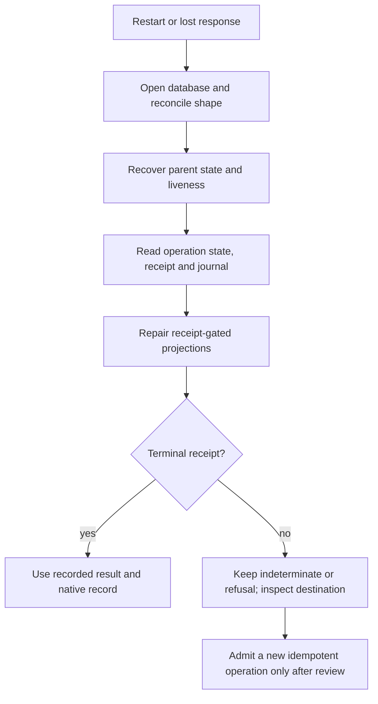
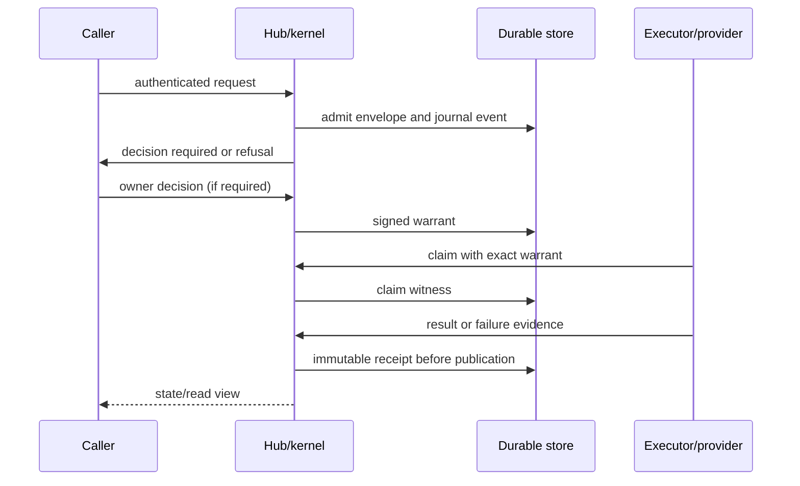

# Troubleshooting

This guide is a bounded source reconstruction at snapshot
`675401a857b85336d4acaa8c65383dfc9636e4c8` (2026-09-19). It tells an operator
which durable evidence to inspect. It does not claim that a live hub, database,
provider or owner machine has been verified. No commands or tests were run for
this documentation lane.

## Evidence-first restart path

The runtime performs parent reconciliation and liveness before projection
repair (`holdspeak/kernel/runtime.py:138-175`). If work was awaiting a decision
when the hub stopped, recovery invalidates it as an indeterminate restart
outcome; if an executor missed its signed deadline, liveness produces a
refusal or `indeterminate` (`holdspeak/kernel/broker.py:24-35`,
`holdspeak/kernel/liveness.py:9-61`). A process view or client timeout is not
proof that the provider did or did not complete.

## Trust and receipt path

Inspect the principal, operation envelope, target, warrant, claim witness,
receipt and native result in that order. The executor checks exact envelope,
revocation, expiry and live ancestry (`holdspeak/kernel/executor.py:26-128`).
The kernel's journal is hash-chained (`holdspeak/kernel/journal.py:60-103`).

## State symptoms

| Symptom | Meaning supported by source | Evidence and action |
| --- | --- | --- |
| `admitting` remains after restart | Admission was interrupted before a settled decision | Read journal; runtime recovery may terminalize it. Do not dispatch from the state |
| `awaiting_decision` after hub restart | A pending decision is no longer safe to continue | Expect `indeterminate` with `hub_restart_during_decision`; make a new request only after inspecting any destination |
| `awaiting_execution` expired | No executor claim arrived before the signed claim deadline | Expect refusal `execution_claim_expired`; do not reuse the warrant |
| `claimed` expired | An executor claimed but did not receipt before liveness deadline | Expect `indeterminate` `execution_liveness_expired`; inspect external side effects before compensation |
| `refused` | Admission, authority, causality, destination or liveness blocked the operation | Read refusal outcome and journal event; correct the named prerequisite |
| `cancelled` | Parent cancellation won the terminal race | Treat late provider output as non-publishable |
| `indeterminate` | Completion cannot be proved, including timeout, lost provider or restart | Inspect receipt, provider/destination and native row; never call it success |
| `succeeded` | Kernel has a terminal success receipt | Confirm the native result reference and materialized projection |
| `failed` | Executor produced a terminal failure receipt | Read the outcome and adapter evidence; a new operation may be needed |

Terminal states are `succeeded`, `failed`, `refused`, `cancelled` and
`indeterminate` (`holdspeak/kernel/model.py:9-13`). One operation has one
terminal receipt. A fallback or retry is a distinct child operation and must
not overwrite the first outcome.

## Common refusal and failure causes

| Code or outcome | Likely boundary | Next inspection |
| --- | --- | --- |
| `principal_right_required` | Edge route right does not match the credential | Check derived principal kind and route in `holdspeak/principals.py` |
| `unknown_operation` or unsupported family | No registered operation/policy family | Use the concrete operation registry and policy refusal; do not assume YOLO default |
| `operation_envelope_mismatch` | Reused idempotency key with changed request | Use the original envelope or a new key after reviewing effects |
| `causality_required` / dead parent | Parent warrant or identity chain is missing or no longer live | Inspect parent operation, warrant, principal and execution epoch |
| `execution_claim_expired` | No claim before deadline | Re-admit only after checking that no external work started |
| `execution_liveness_expired` | Claimed executor did not receipt | Treat external completion as unknown |
| `hub_restart_during_decision` | Restart invalidated an unsettled decision | Decide whether a compensating or new operation is safe |
| `kernel_parent_publication_in_progress` | Publication CAS currently owns the parent fence | Wait for the owner path and reread; do not force a state write |
| `delegation_missing`, `delegation_revoked`, `delegation_expired` | Scheduled authority is absent or no longer live | Inspect the exact delegation terms and schedule state |
| `delegation_target_changed` / `delegation_cadence_changed` | Schedule terms drifted from the approved snapshot | Reapprove the new terms; do not reuse old authority |
| `duplicate_tick` | A due schedule minute was already claimed | Inspect the tick/receipt ledger before retrying |
| `mic_floor_held` or `missed` | Scheduled capture could not start under its bounded window | Read the named holder or missed-window receipt |
| `owner_rejected` | Owner review rejected the operation | No executor claim should exist; create a new proposal if intent changed |

Names are drawn from the broker, liveness, security contract and schedule
paths. The exact outcome for a feature-specific adapter remains its own source
contract.

## Authentication and authority problems

### Agent gets a forbidden response

Check whether the request used a current agent credential and whether it asks
for a route requiring `decide`, `posture`, `delegate` or `node.link`. Agent
credentials are hash-stored, expiry checked and revocable, and the store is
in-memory across a process restart (`holdspeak/principals.py:103-269`). An
agent cannot turn a bearer token into an owner or node identity. The focused
principal assertions inspect expiry, revocation, agent separation and node
separation (`tests/integration/test_principal_separation.py`; inspected, not
run).

### Approval did not execute

Read the three axes separately: proposal review, authorization state and
execution state. Then read the kernel operation and receipt. An approved
proposal can be waiting for a claim, failed at its adapter, cancelled or
indeterminate. The existing [AUTHORITY.md](AUTHORITY.md) contract defines the
operator-facing terms; [AUTHORITY_MODEL.md](AUTHORITY_MODEL.md) maps them to
source.

### YOLO refused

YOLO is a mode for future operations, not a bypass. Unsupported families,
unknown destinations, missing fixed-destination registration, secret custody,
payload binding, pane identity and receipt requirements still refuse
(`holdspeak/operation_policy.py:193-360`). Read the refusal before changing
mode or grant.

## Database and schema problems

Run `holdspeak doctor` and preserve the database before changing it. Doctor's
database check is read-oriented and reports readability/table presence;
normal database open performs shape reconciliation
(`holdspeak/commands/doctor.py:58-110`). Reconciliation is additive and does
not drop tables, columns or rows (`holdspeak/db/reconcile.py:1-8`). A newer
informational `schema_version` alone is not a failure signal.

For an unreadable or suspicious file:

1. Stop the hub and copy the file without deleting its WAL/SHM sidecars.
2. Take a separate backup if SQLite can read it.
3. Do not hand-edit schema rows or delete a journal event.
4. Restore only from a validated backup while no owner process has the DB open.
5. Run doctor and inspect domain rows and receipts after restart.

`holdspeak restore` makes a safety backup before replacement and refuses a
live owner (`holdspeak/db/core.py:110-202`). Its focused assertions cover
same-data restore, safety backup and invalid-candidate preservation
(`tests/critical/test_journey_backup_restore.py:28-82`; inspected, not run).

## Projection and search problems

If transcript search is stale, distinguish `segments` from `segments_fts`:
the latter is an FTS projection maintained by triggers. If a process or Desk
card disagrees with a kernel receipt, trust the operation, journal and receipt
first, then let the owning projection repair path run. The kernel startup
order prevents a projection from publishing ahead of liveness recovery.

Do not repair a projection by writing a fabricated successful receipt. A
receipt-gated stage has `STAGED`, `FINALIZING`, `PUBLISHED` or `DISCARDED`
state; publication is a CAS-guarded operation (`holdspeak/db/schema.py:2201-2219`,
`holdspeak/kernel/publication_transition.py:12-50`).

## What remains unknown

Source inspection cannot tell whether a particular live database has been
reconciled, whether an external provider performed an effect after a lost
response, whether a user saw a control, or whether all feature adapters are
currently reachable. Those require the relevant receipt, doctor output,
database row or owner observation. Mark them unknown and preserve the
operation id rather than filling the gap with a successful-looking status.
