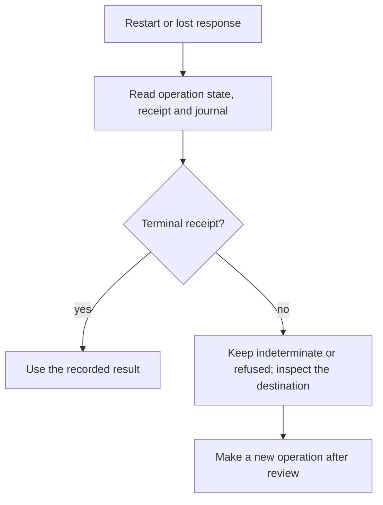

# Troubleshooting

Use this guide when HoldSpeak refuses work, stops after a restart, or shows a
state you do not expect. Start with `holdspeak doctor`. See
[Operations](OPERATIONS.md) for the doctor and the backup commands.

The kernel records every operation with a state, a journal and a receipt.
Read these records before you retry anything. A client timeout does not prove
that the provider did or did not finish.

## After a restart

```mermaid
flowchart TD
  START[Restart or lost response]
  READ[Read operation state, receipt and journal]
  DECIDE{Terminal receipt?}
  SUCCESS[Use the recorded result]
  UNKNOWN[Keep indeterminate or refused; inspect the destination]
  RETRY[Make a new operation after review]

  START --> READ --> DECIDE
  DECIDE -->|yes| SUCCESS
  DECIDE -->|no| UNKNOWN --> RETRY
```

At start, the hub repairs the database shape, recovers parent work, checks
liveness and then repairs projections. A projection never publishes before
liveness recovery.

## Operation states

Terminal states are `succeeded`, `failed`, `refused`, `cancelled` and
`indeterminate`. One operation has one terminal receipt. A retry is a new
child operation. It never overwrites the first outcome.

| State or symptom | Meaning | Action |
| --- | --- | --- |
| `admitting` after restart | Admission stopped before a decision. | Read the journal. Recovery can end it. Do not dispatch from this state. |
| `awaiting_decision` after restart | The pending decision is no longer safe. | Expect `indeterminate` with `hub_restart_during_decision`. Inspect the destination, then make a new request. |
| `awaiting_execution` expired | No executor claimed the work before the deadline. | Expect `execution_claim_expired`. Do not reuse the warrant. |
| `claimed` expired | An executor claimed the work but sent no receipt. | Expect `execution_liveness_expired`. Inspect external effects before you compensate. |
| `refused` | Admission, authority, destination or liveness blocked the work. | Read the refusal and the journal event. Fix the named cause. |
| `cancelled` | Cancellation of the parent won. | Do not publish late provider output. |
| `indeterminate` | The result cannot be proved. | Inspect the receipt and the destination. Never call it success. |
| `succeeded` | A success receipt exists. | Confirm the native result. |
| `failed` | The executor wrote a failure receipt. | Read the outcome. A new operation may be needed. |

## Refusal codes

| Code | Cause | Action |
| --- | --- | --- |
| `principal_right_required` | The credential lacks the right for the route. | Check the principal kind in `holdspeak/principals.py`. |
| `unknown_operation` | No operation or policy family is registered. | Use a registered operation. YOLO does not change this. |
| `idempotency_payload_mismatch` | An idempotency key came back with a changed request. | Use the original request, or a new key. |
| `parent_operation_unknown`, `parent_operation_not_running`, `parent_operation_not_live` | The parent operation is missing, not running or no longer live. | Inspect the parent operation and its warrant. |
| `execution_claim_expired` | No claim before the deadline. | Check that no external work started. Then make a new request. |
| `execution_liveness_expired` | The executor sent no receipt. | Treat the external result as unknown. |
| `hub_restart_during_decision` | A restart cancelled an open decision. | Decide if a new operation is safe. |
| `kernel_parent_publication_in_progress` | Another path is publishing the parent. | Wait and read again. Do not force a state write. |
| `delegation_missing`, `delegation_revoked`, `delegation_expired` | The schedule has no live authority. | Inspect the delegation and the schedule. |
| `delegation_target_changed` | The schedule target differs from the approved terms. | Approve the new terms again. |
| `duplicate_tick` | The schedule already ran for this minute. | Inspect the receipt ledger before a retry. |
| `mic_floor_held`, `missed` | A scheduled recording could not start in its window. | Read the receipt for the holder or the missed window. |
| `owner_rejected` | The owner rejected the operation. | Make a new proposal if the intent changed. |

## An agent gets a forbidden response

1. Check that the agent credential is current. Agent credentials expire and
   an owner can revoke them.
2. Check the route. Routes for `decide`, `posture`, `delegate` and
   `node.link` need more than an agent right.
3. Remember that an agent cannot become an owner or a node.

Agent credentials are held in memory. A hub restart clears them.

## An approval did not run

Read three things separately: the proposal review, the authorization state
and the execution state. Then read the operation and its receipt. An approved
proposal can wait for a claim, fail at its adapter, be cancelled or be
`indeterminate`. [Authority](AUTHORITY.md) defines the terms.

## YOLO refused the work

YOLO sets the mode for future operations. It is not a bypass. These cases
still refuse:

- an unsupported operation family
- an unknown destination
- a missing fixed-destination registration
- secret custody and payload binding
- a missing receipt requirement

Read the refusal before you change the mode or a grant. The rules are in
`holdspeak/operation_policy.py`.

## Database problems

1. Run `holdspeak doctor`. The database check reads the file and counts
   tables. The hub repairs the shape when it opens the database.
2. Stop the hub. Copy the file together with its `-wal` and `-shm` files.
3. Do not edit schema rows. Do not delete journal events.
4. Restore only from a validated backup, and only with the hub stopped. See
   [Operations](OPERATIONS.md).
5. Run the doctor again. Check your records and receipts.

Shape repair only adds. It does not drop tables, columns or rows. A newer
informational `schema_version` alone is not a failure.

## Search or a card shows old data

Transcript search reads `segments_fts`. Triggers keep it in step with
`segments`. If a card disagrees with a receipt, trust the operation, journal
and receipt. Then let the owning repair path run.

Never write a fake success receipt to fix a projection.

## What the records cannot tell you

The records cannot show whether a provider acted after a lost response, or
whether a person saw a control. Mark these facts unknown. Keep the operation
id. Do not replace the gap with a success status.
