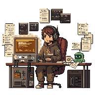

# HoldSpeak User Guide

HoldSpeak is a local-first voice workspace. It has two main jobs:

- **Meeting intelligence:** record conversations, transcribe them, extract topics, actions, summaries, and reviewable handoff artifacts.
- **Intelligent typing:** hold a hotkey, speak, and insert useful text into the active app. For coding assistants, HoldSpeak can use project context and recent Claude/Codex state to rewrite dictation into better prompts.

HoldSpeak is private by default. Audio capture, transcription, project context, and session metadata are stored locally unless you explicitly configure a cloud or OpenAI-compatible endpoint.

## Start Here

Use these guides depending on what you are setting up:

| Goal | Guide |
| --- | --- |
| Install HoldSpeak and get basic voice typing working | [Getting Started](GETTING_STARTED.md) |
| Configure project-aware intelligent typing | [Intelligent Typing Setup](INTELLIGENT_TYPING_GUIDE.md) |
| Record and review meetings | [Meeting Mode Guide](MEETING_MODE_GUIDE.md) |
| Configure local/LAN dictation models | `/docs/dictation-runtime` in the local web UI |

## Product Map

| Area | What it does | Where to use it |
| --- | --- | --- |
| Voice typing | Hold a hotkey, speak, release, insert text | Any text field, editor, terminal, browser |
| Dictation pipeline | Routes and rewrites dictated text with local rules and optional LLM stages | `/dictation`, `holdspeak dictation ...` |
| Project facts | Keeps a `kb:` map in `.holdspeak/project.yaml`; exact values stamped into dictation verbatim, no LLM | `/dictation` -> Project Facts |
| Project context | Keeps repo-local `.hs/` files that guide intelligent rewrites (optional LLM stage) | `/dictation` -> Project Context |
| Agent hooks | Lets Claude Code and Codex report current cwd/session state to HoldSpeak | `/dictation` -> Agent Hooks |
| Meeting mode | Captures microphone plus optional system audio | Dashboard, `holdspeak meeting` command |
| Meeting intelligence | Produces transcript, topics, summaries, actions, artifacts | Dashboard and `/history` |
| AIPI-Lite companion | Portable ESPHome device for meeting controls, status, and spoken replies to waiting Claude/Codex sessions | [AIPI-Lite Developer Workflow](AIPI_LITE_DEV_WORKFLOW.md), `/companion` |
| Runtime setup | Configures local MLX, llama.cpp, or OpenAI-compatible endpoints | `/dictation` -> Runtime, `/docs/dictation-runtime` |

## Workflow At A Glance

| Speak | Review | Refine |
| --- | --- | --- |
|  |  |  |
| Hold the configured hotkey and dictate into the focused app. | Capture meetings, search transcripts, and curate action items. | Let project context and agent state improve dictated prompts. |

<p align="center">
  
</p>

## Install And Start

Install from this checkout:

```bash
uv pip install -e .
```

Run diagnostics:

```bash
holdspeak doctor
```

Start the local web runtime:

```bash
holdspeak
```

By default, the web server binds to loopback only (`127.0.0.1`). The browser UI is the primary cockpit for meetings, history, dictation setup, runtime setup, and project context.

## Voice Typing

Use voice typing when you want direct text insertion into the active app.

1. Start HoldSpeak with `holdspeak`.
2. Focus the target text field.
3. Hold the configured hotkey.
4. Speak.
5. Release the hotkey.

Default hotkey:

- macOS: Right Option
- Linux: Right Alt

If global hotkeys or synthetic typing are blocked, especially on Wayland, keep HoldSpeak focused and use the focused hold-to-talk fallback.

### Punctuation

Say punctuation words and HoldSpeak converts them:

| Say | Inserts |
| --- | --- |
| `period` or `full stop` | `.` |
| `comma` | `,` |
| `question mark` | `?` |
| `exclamation mark` | `!` |
| `colon` | `:` |
| `semicolon` | `;` |
| `new line` | line break |
| `new paragraph` | blank line |

Example:

```text
hello comma can you review this question mark
```

becomes:

```text
Hello, can you review this?
```

### Clipboard Token

Say `clipboard` anywhere in a dictated phrase to insert the current clipboard
text at that position. HoldSpeak treats `clipboard` as a replacement token, so
the word itself is removed and the actual clipboard contents are inserted into
the output that gets typed or pasted.

Example:

```text
Taking a look at this clipboard could you refactor it?
```

If the clipboard contains:

```python
def total(items):
    return sum(items)
```

HoldSpeak inserts:

```text
Taking a look at this
def total(items):
    return sum(items)
could you refactor it?
```

## Intelligent Typing For Coding Assistants

HoldSpeak can do more than transcription. With the dictation pipeline enabled, it can transform a rough spoken thought into a useful prompt for Claude, Codex, a terminal, a browser, or another target.

Use this for:

- Rewording spoken notes into clear prompts.
- Injecting repo-specific project context.
- Preserving project vocabulary and preferred spellings.
- Detecting that Claude/Codex is waiting for an answer and shaping your spoken reply accordingly.

### Enable The Dictation Pipeline

Open:

```text
/dictation -> Runtime
```

Enable:

- `Enable dictation pipeline`
- Optional: `Enable project-aware rewrite stage (.hs/)`
- Optional: set `Target profile override` when active-window detection is wrong.

Pick a runtime backend:

- `auto`: prefers MLX on Apple Silicon, otherwise llama.cpp.
- `mlx`: local Apple Silicon MLX model.
- `llama_cpp`: local GGUF model.
- `openai_compatible`: local or hosted `/v1/chat/completions` endpoint.

You can also validate from the CLI:

```bash
holdspeak dictation runtime status
holdspeak dictation dry-run "ask codex to inspect the failing test"
```

For a full step-by-step setup, see [Intelligent Typing Setup](INTELLIGENT_TYPING_GUIDE.md).

### OpenAI-Compatible Endpoints

Use `openai_compatible` when the model is served somewhere else:

- LM Studio
- Ollama OpenAI bridge
- vLLM
- llama.cpp server
- LiteLLM
- OpenAI or another hosted compatible API

Configuration shape:

```json
{
  "dictation": {
    "pipeline": { "enabled": true },
    "runtime": {
      "backend": "openai_compatible",
      "openai_compatible_base_url": "http://127.0.0.1:8000/v1",
      "openai_compatible_model": "qwen2.5-7b-instruct",
      "openai_compatible_api_key_env": "OPENAI_API_KEY",
      "openai_compatible_timeout_seconds": 8
    }
  }
}
```

Known-good endpoint families include llama.cpp server, LM Studio, Ollama's OpenAI bridge, vLLM, LiteLLM, and hosted OpenAI-compatible APIs. HoldSpeak reads the API key from the named environment variable. It does not store the key in the project context files. If the endpoint is unavailable, times out, or returns malformed output, HoldSpeak preserves the original transcript and surfaces the failure in dry-run/readiness output.

## Project Context

Project context is stored in a `.hs/` directory at the repo root. These files are meant to be simple, readable, and safe to commit if your team agrees.

```text
.hs/
  instructions.md
  context.md
  memory.md
  workflows.md
  issues.md
  terms.md
  targets.md
  ignore
```

Recommended use:

| File | Purpose |
| --- | --- |
| `instructions.md` | How HoldSpeak should rewrite or inject prompts for this repo |
| `context.md` | Architecture, important paths, setup notes, constraints |
| `memory.md` | Durable user-approved facts |
| `workflows.md` | Test, build, review, and deploy commands |
| `issues.md` | Current scratchpad for active problems |
| `terms.md` | Project vocabulary and preferred spellings |
| `targets.md` | Style notes for Codex, Claude, terminal, browser, editor, chat |
| `ignore` | Paths, topics, or data HoldSpeak should not inject |

Edit these from:

```text
/dictation -> Project Context
```

Write policy:

- `.hs/` files are the canonical format and are editable from the web UI after you choose to save.
- Flat files such as `.hs_context`, `.hs_issues`, `.hs_memory`, `.hs_instructions`, `.hs_workflows`, `.hs_terms`, `.hs_targets`, and `.hs_ignore` are read-only compatibility inputs.
- If both exist, `.hs/<name>.md` wins over the matching flat file.
- HoldSpeak never writes project context automatically during dictation.
- Binary files, very large files, and files with obvious secret-looking content are skipped with warnings instead of being injected.

Start small. A useful first version is:

```text
# .hs/instructions.md
When dictating into Codex or Claude, rewrite rough speech into a concise engineering request. Preserve explicit filenames, commands, and test names.

# .hs/context.md
This is a Python application with a local FastAPI web UI and an Astro frontend.

# .hs/workflows.md
Run focused tests with `.venv/bin/python -m pytest <path>`.

# .hs/targets.md
Codex: concise implementation request.
Claude: product/design discussion is acceptable, but include concrete repo context.
Terminal: preserve command syntax exactly.
```

## Agent Hooks For Claude And Codex

Operating systems do not reliably expose the current working directory of a terminal app. Agent hooks solve that by letting Claude Code or Codex report their own `cwd`, session id, transcript path, and tool state to HoldSpeak.

For the full install and verification flow, see
[Claude/Codex Agent Hook Install](AGENT_HOOK_INSTALL.md).

Open:

```text
/dictation -> Agent Hooks
```

The tab shows:

- Recent Claude/Codex hook status.
- Local registry path.
- Copy-ready hook templates.
- A toggle for assistant-message capture.

You can also generate templates from the CLI:

```bash
holdspeak agent-hook templates --agent claude
holdspeak agent-hook templates --agent codex
```

With assistant-message capture:

```bash
holdspeak agent-hook templates --agent claude --capture-messages
holdspeak agent-hook templates --agent codex --capture-messages
```

Assistant-message capture is opt-in. When enabled, HoldSpeak stores at most 4 KB of the latest assistant message from a Stop hook, marks likely questions as `awaiting_response`, and clears that captured text on the next submitted user prompt. The `/dictation` page shows a banner when Claude or Codex appears to be waiting for your reply.

Use **Clear** on the banner to remove the captured assistant text manually.

## Meeting Mode

Use meeting mode when you want a searchable, reviewable record of a conversation.

Before a first meeting:

```bash
holdspeak meeting --setup
holdspeak meeting --list-devices
```

Start HoldSpeak:

```bash
holdspeak
```

Use the web dashboard to start and stop meetings. During a meeting, HoldSpeak can show:

- Live transcript.
- Speaker labels.
- Bookmarks.
- Topics.
- Action items.
- Summaries.
- Intelligence queue status.

After a meeting, open:

```text
/history
```

Use History to search meetings, review action items, edit accepted actions, inspect generated artifacts, and export local handoff files.

## Meeting Intelligence

Meeting intelligence can run locally or through a configured OpenAI-compatible endpoint.

Local-first behavior:

- Transcripts are stored locally.
- Meeting artifacts are stored locally.
- Deferred queues are stored locally.
- External systems are not written unless a connector or export workflow explicitly does it.

Cloud or homelab behavior:

- If you set `meeting.intel_provider` to `cloud` or configure `intel_cloud_base_url`, meeting text may be sent to that endpoint for analysis.
- Use `holdspeak doctor` from the same shell environment to verify endpoint, model, TLS, DNS, and auth configuration.

Example cloud/homelab config:

```json
{
  "meeting": {
    "intel_provider": "cloud",
    "intel_cloud_model": "qwen2.5-32b-instruct",
    "intel_cloud_api_key_env": "HOMELAB_INTEL_API_KEY",
    "intel_cloud_base_url": "http://homelab.local:8000/v1",
    "intel_deferred_enabled": true
  }
}
```

## Privacy Model

HoldSpeak is designed to be local-first.

Local by default:

- Audio capture.
- Whisper transcription.
- Meeting history.
- Dictation block configuration.
- `.hs/` project context.
- Agent-session registry.
- Captured assistant-message snippets, if enabled.

Leaves the machine only when configured:

- Cloud meeting intelligence.
- OpenAI-compatible dictation runtime hosted outside localhost.
- Connector integrations.
- Manual exports or uploads.

Sensitive files:

- Do not place secrets in `.hs/`.
- Use `.hs/ignore` to document paths and topics that should not be injected.
- Prefer environment variables for API keys.

## Troubleshooting

Run diagnostics first:

```bash
holdspeak doctor
```

Common issues:

| Symptom | Likely cause | Fix |
| --- | --- | --- |
| Hotkey does not trigger | OS global hook restriction | Use focused hold-to-talk fallback or check permissions |
| Text does not paste/type | Synthetic typing blocked | Use clipboard/manual paste fallback |
| System audio missing | No BlackHole/Pulse monitor configured | Run `holdspeak meeting --setup` |
| Dictation LLM unavailable | Missing optional backend or model | Open `/dictation` -> Readiness or Runtime |
| Project context not detected | Wrong cwd or no project marker | Set Project root in `/dictation` |
| Claude/Codex context missing | Hooks not installed or not firing | Open `/dictation` -> Agent Hooks |
| Captured agent question looks stale | Last prompt did not clear it | Use Clear on the agent banner |

## Recommended First Setup

1. Run `holdspeak doctor`.
2. Start `holdspeak`.
3. Open `/dictation`.
4. Set the Project root for your active repo.
5. Create `.hs/instructions.md`, `.hs/context.md`, `.hs/workflows.md`, and `.hs/targets.md`.
6. Open Agent Hooks and copy the Claude/Codex templates you use.
7. Enable the dictation pipeline and run a dry-run.
8. Start using voice typing in your editor or LLM CLI.

## See also

- [README](../README.md): install, platform notes, configuration reference.
- [Getting Started](GETTING_STARTED.md): first-run setup and basic voice typing.
- [Intelligent Typing Setup](INTELLIGENT_TYPING_GUIDE.md): dictation pipeline, project context, target override, OpenAI-compatible endpoints, and agent hooks.
- [Dictation runtime setup](../web/src/pages/docs/dictation-runtime.astro): source for the web runtime setup page.
- [Meeting Mode Guide](MEETING_MODE_GUIDE.md): meeting-specific setup and troubleshooting.
- [Firefox Extension Guide](FIREFOX_EXTENSION_GUIDE.md): local companion extension install.
