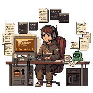

# HoldSpeak User Guide

Start with one useful loop: open HoldSpeak, **Dictate one sentence**, edit it,
then **Copy** or **Keep as Note**. The first completion furnishes the Desk
automatically with Inbox, Personal, Work, Meetings, Decisions, and Reference;
a Start here note; and editable prompts in **Everyday context**. Its shipped
default is unused: explicitly attach it for one Thought, or explicitly make an
attached set the default for future local Thoughts. No extra setup is required
for this first value.

HoldSpeak is one local copilot with two modes, and this guide is the day-to-day
map of both:

- **Dictate:** hold a hotkey, speak, and insert useful text into the active app. With the dictation pipeline on, HoldSpeak uses project context and recent Claude/Codex state to rewrite rough speech into better prompts, and the dictation journal records every run so corrections teach it.
- **Meet:** record conversations (or import recordings and transcripts), transcribe them, and extract topics, actions, summaries, and reviewable artifacts, with meeting aftercare showing what is still open when it ends.

HoldSpeak is private by default. Audio capture, transcription, project context, and session metadata are stored locally unless you explicitly configure a cloud or OpenAI-compatible endpoint.

## Start Here

Use these guides when you are ready for more than the first sentence:

| Goal | Guide |
| --- | --- |
| Install HoldSpeak and take the first-sentence loop | [Getting Started](GETTING_STARTED.md) |
| Configure the project-aware dictation pipeline | [Dictation Pipeline Setup](DICTATION_PIPELINE_GUIDE.md) |
| Record and review meetings | [Meeting Mode Guide](MEETING_MODE_GUIDE.md) |
| Configure local/LAN dictation models | `/docs/dictation-runtime` in the local web UI |

## Product Map

| Area | What it does | Where to use it |
| --- | --- | --- |
| Voice typing | Hold a hotkey, speak, release, insert text | Any text field, editor, terminal, browser |
| Dictation pipeline | Routes and rewrites dictated text with local rules and optional LLM stages | the Dictation window (`/dictation`), `holdspeak dictation ...` |
| Project facts | Keeps a `kb:` map in `.holdspeak/project.yaml`; exact values stamped into dictation verbatim, no LLM | `/dictation` -> Project Facts |
| Project context | Keeps repo-local `.hs/` files that guide intelligent rewrites (optional LLM stage) | `/dictation` -> Project Context |
| Automation hooks | Lets Claude Code and Codex report current cwd/session state to HoldSpeak | `/dictation` -> Hooks |
| Meeting mode | Captures microphone plus optional system audio | Dashboard, `holdspeak meeting` command |
| Meeting intelligence | Produces transcript, topics, summaries, actions, artifacts | Dashboard and `/history` |
| iPad app | Drives both modes from another device over the hub's HTTP API: dictate into the desk, read a meeting back with its artifacts and sources, approve a proposal, browse the archive | [Companions](#companions) |
| AIPI-Lite companion | Portable ESPHome device for meeting controls, status, and spoken replies to waiting Claude/Codex sessions | [AIPI-Lite Developer Workflow](AIPI_LITE_DEV_WORKFLOW.md), `/companion` |
| AI setup | Chooses a Thought AI from OpenRouter presets, local GGUF/llama.cpp, or a custom compatible provider; MLX remains available for writing and dictation | Settings → Models |

## Develop a thought

Keep a rough sentence as a Note, then choose **Develop this thought**. HoldSpeak
preserves the original bytes and opens a dedicated Thought Workbench. Its Note
plane includes bold, italic, underline, heading, list, code, link, and quote
controls while remaining directly editable as Markdown. On a
desktop, the live Note and focused Interview sit side by side; on a phone they
are full-width Note and Interview panes. The Note saves locally as you type.
Choose **Ask AI** for one explicit model turn. When a question
returns, **Add & ask next** atomically adds your answer to the Note and starts
exactly one next refinement turn; **Add to Note** adds it without continuing.
Choose **Finish Thought** to finish immediately, with no confirmation step.
Opening or editing the Workbench never starts AI by itself.
If no runnable model is configured, Interview places **Set up AI** directly
beneath the explanation and opens Settings in **Models**. On a phone, the fixed
footer first takes you to that Interview action. After a runnable model is
saved, the open Workbench rechecks readiness and restores **Ask AI**
automatically.

The Interview shows the intended execution boundary before a turn and the
actual placement/egress receipt afterward. During a turn, editing the Note
supersedes that frozen question rather than allowing a late result to overwrite
your work. **Info** lazily reveals the preserved Original; the raw capture is
not part of the ordinary Workbench projection.

AI context is empty by default. In the Thought body, choose **Attach** beside
**AI context**. The compact picker puts pinned **Everyday context** first, then up
to three recent choices and search; **Browse all notes** reveals the full list.
Choosing a result attaches it immediately. Everyday context is therefore one
interaction away without being silently sent to a model.

The attached chip shows the human-visible selection and its expanded Notes. The
hub, not the browser, loads those qualified refs and freezes their exact versions
for the turn. A result says what was used, for example
`Used Everyday context · 5 notes`. If a Note or collection changes, HoldSpeak
does not substitute the new text: it names the stale context and offers
**Update context** or **Remove it**. Updating, removing, answering, accepting,
or rejecting does not automatically start another model turn.

The same picker has two complete groups: **On this Thought** and **For new
Thoughts**. Once the current Thought has context, **Use these by default** makes
that whole displayed set the local default for Thoughts created or adopted
later. The shipped default is empty. Changing it is future-only: there is no
retroactive update, startup backfill, sync, or model call.

A **Default** marker identifies an attached selection that is also in the
future set. **Remove from this Thought** detaches it only here; the future
default remains unchanged. **Stop using by default** clears the complete future
set and leaves this and every earlier Thought unchanged. If any configured
selection is stale, missing, overlapping, or too large when a Thought is born,
HoldSpeak applies none of the set. Capture or adoption still succeeds with
**AI context None**, and a named receipt explains what was not applied.
Existing default-born Thoughts use the ordinary stale flow: **Update context**
or remove the selection explicitly.

## Workflow At A Glance

| Speak | Review | Refine |
| --- | --- | --- |
|  |  |  |
| Hold the configured hotkey and dictate into the focused app. | Capture meetings, search transcripts, and curate action items. | Let project context and Coder session state improve dictated prompts. |

<p align="center">
  
</p>

## Install And Start

Install from this checkout:

```bash
uv pip install -e .
```

If first capture needs repair, run diagnostics:

```bash
holdspeak doctor
```

Start the local web runtime:

```bash
holdspeak
```

By default, the web server binds to loopback only (`127.0.0.1`). The browser
opens on the first-sentence surface before the broader Desk, meeting, and
advanced dictation controls.

## Voice Typing

Use voice typing when you want direct text insertion into the active app.

1. Start HoldSpeak with `holdspeak`.
2. Focus the target text field.
3. Hold the configured hotkey.
4. Speak.
5. Release the hotkey.

Default hotkey:

- macOS: Right Option
- Linux: Right Alt

If global hotkeys or synthetic typing are blocked, especially on Wayland, keep HoldSpeak focused and use the focused hold-to-talk fallback.

### Speak your language

Whisper, the transcription engine, speaks about 99 languages, and the
**spoken language setting** (Settings, Voice typing, Spoken language)
decides how HoldSpeak uses that. The default, Auto-detect, lets Whisper
identify the language per utterance, which works well for longer speech.
Short utterances are where it can stumble: a few words in one language
can be detected as a neighboring one. If that happens to you, pin your
language and transcription stops guessing.

One setting covers everything that transcribes: dictation, live
meetings, and imported recordings all share the same engine, so they all
follow it.

### The wake word

Hold-to-talk needs a key; **the wake word** needs nothing but your voice.
Say the wake phrase (the pretrained model listens for "hey jarvis") and
HoldSpeak enters **the armed window**: a short, visible countdown during
which your next sentence is captured and run through the normal dictation
pipeline. Everything happens on your machine; the only network moment in
the whole feature is a one-time download of the detection models (about
7 MB) when you first enable it.

It is off by default, and what happens after it hears you is the safety
decision the feature is built around:

- **Preview first (the default).** Nothing is typed. The result appears as

(Separately from the wake word, `dictation.preview_before_type` in
Settings, Voice, applies the same card to every hold-key dictation;
that one is off by default.)
  a card with the transcript, the pipeline output, and a **Type it**
  button. Typing happens only when you press it, and the server types only
  the exact previewed text. Dismissing the card is always safe.
- **Type immediately (an explicit opt-in).** Your call to make, with the
  consequence stated where you make it: a false detection would type into
  whatever app is focused.

Turn it on under **Settings, Voice typing, Wake word**, and turn on
desktop presence with it: the presence surface (and Qlippy's dock, if he
is on) shows the armed state while you work in other apps. The wake word
pauses automatically whenever something else holds the microphone (a
hold-to-talk dictation, a meeting) and resumes after.

**The honest numbers.** Measured on synthesized speech across three
voices: ordinary sentences, including adversarial near-misses like "hey
travis" and "play jazz", produced **zero false detections in 57
utterances** at the default threshold. But a sentence that contains the
wake phrase or a near-homophone ("hey jarred…") can score
indistinguishably from the real thing; no threshold can separate them.
That is inherent to wake-word detection, and it is exactly why the
preview default exists: when it happens, the cost is a glance at a card,
never text in your document. Real rooms (noise, distance, accents) differ
from synthesized speech in both directions; the detection threshold is a
settings knob for that reason.

### Punctuation

Say punctuation words and HoldSpeak converts them:

| Say | Inserts |
| --- | --- |
| `period` or `full stop` | `.` |
| `comma` | `,` |
| `question mark` | `?` |
| `exclamation mark` | `!` |
| `colon` | `:` |
| `semicolon` | `;` |
| `new line` | line break |
| `new paragraph` | blank line |

These are the built-ins. **The spoken-symbol dictionary** adds your own:
open **Settings, Voice typing, Spoken-symbol dictionary** and map any
spoken phrase to any symbol or snippet ("tilde" to `~`, "arrow" to `→`,
"double colon" to `::`). Your entries win over the built-ins if the
phrases collide. Each entry has an attach mode that controls spacing:
`none` keeps the spacing you spoke, `left` glues the symbol to the
previous word (like `period` does), `right` to the next word, and `both`
to both sides (so "std double colon vector" with `both` types
`std::vector`).

Example:

```text
hello comma can you review this question mark
```

becomes:

```text
Hello, can you review this?
```

### Clipboard Token

Say `clipboard` anywhere in a dictated phrase to insert the current clipboard
text at that position. HoldSpeak treats `clipboard` as a replacement token, so
the word itself is removed and the actual clipboard contents are inserted into
the output that gets typed or pasted.

Example:

```text
Taking a look at this clipboard could you refactor it?
```

If the clipboard contains:

```python
def total(items):
    return sum(items)
```

HoldSpeak inserts:

```text
Taking a look at this
def total(items):
    return sum(items)
could you refactor it?
```

## The Dictation Pipeline For Coding Assistants

HoldSpeak can do more than transcription. With the dictation pipeline enabled, it can transform a rough spoken thought into a useful prompt for Claude, Codex, a terminal, a browser, or another target.

Use this for:

- Rewording spoken notes into clear prompts.
- Injecting repo-specific project context.
- Preserving project vocabulary and preferred spellings.
- Detecting that Claude/Codex is waiting for an answer and shaping your spoken reply accordingly.

### Enable The Dictation Pipeline

Open:

```text
/dictation -> Runtime
```

Enable:

- `Enable dictation pipeline`
- Optional: `Enable project-aware rewrite stage (.hs/)`
- Optional: set `Target profile override` when active-window detection is wrong.

Pick a runtime backend:

- `auto`: prefers MLX on Apple Silicon, otherwise llama.cpp.
- `mlx`: local Apple Silicon MLX model.
- `llama_cpp`: local GGUF model.
- `openai_compatible`: local or hosted `/v1/chat/completions` endpoint.

You can also validate from the CLI:

```bash
holdspeak dictation runtime status
holdspeak dictation dry-run "ask codex to inspect the failing test"
```

For a full step-by-step setup, see [Dictation Pipeline Setup](DICTATION_PIPELINE_GUIDE.md).

### OpenAI-Compatible Endpoints

Use `openai_compatible` when the model is served somewhere else:

- LM Studio
- Ollama OpenAI bridge
- vLLM
- llama.cpp server
- LiteLLM
- OpenAI or another hosted compatible API

The one path: add the endpoint once under **Settings > Models > Model Library**,
then choose it for **Writing & dictation** under **Assignments**.
Assigning a model is itself the "run it there" instruction, so the
dictation backend follows. Set
or replace its key on the model profile in Model Library; the environment variable
`HOLDSPEAK_PROFILE_<ID>_KEY` remains a headless fallback.

The old `dictation.runtime.openai_compatible_*` fields no longer configure
anything. An upgrade reads a configured legacy endpoint once,
converts it into a model profile named `legacy-dictation`, and points dictation
at it; the legacy key environment value deliberately does not carry over.
`dictation.runtime.openai_compatible_timeout_seconds` is not part of the
model profile and still applies.

Known-good endpoint families include llama.cpp server, LM Studio, Ollama's OpenAI bridge, vLLM, LiteLLM, and hosted OpenAI-compatible APIs. HoldSpeak uses the key you set on that model profile, or its `HOLDSPEAK_PROFILE_<ID>_KEY` headless fallback. It does not put the key in the profile definition, config, or project context files. If the endpoint is unavailable, times out, or returns malformed output, HoldSpeak preserves the original transcript and surfaces the failure in dry-run/readiness output.

## Project Context

Project context is stored in a `.hs/` directory at the repo root. These files are meant to be simple, readable, and safe to commit if your team agrees.

```text
.hs/
  instructions.md
  context.md
  memory.md
  workflows.md
  issues.md
  terms.md
  targets.md
  ignore
```

Recommended use:

| File | Purpose |
| --- | --- |
| `instructions.md` | How HoldSpeak should rewrite or inject prompts for this repo |
| `context.md` | Architecture, important paths, setup notes, constraints |
| `memory.md` | Durable user-approved facts |
| `workflows.md` | Test, build, review, and deploy commands |
| `issues.md` | Current scratchpad for active problems |
| `terms.md` | Project vocabulary and preferred spellings |
| `targets.md` | Style notes for Codex, Claude, terminal, browser, editor, chat |
| `ignore` | Paths, topics, or data HoldSpeak should not inject |

Edit these from:

```text
/dictation -> Project Context
```

Write policy:

- `.hs/` files are the canonical format and are editable from the web UI after you choose to save.
- Flat files such as `.hs_context`, `.hs_issues`, `.hs_memory`, `.hs_instructions`, `.hs_workflows`, `.hs_terms`, `.hs_targets`, and `.hs_ignore` are read-only compatibility inputs.
- If both exist, `.hs/<name>.md` wins over the matching flat file.
- HoldSpeak never writes project context automatically during dictation.
- Binary files, very large files, and files with obvious secret-looking content are skipped with warnings instead of being injected.

Start small. A useful first version is:

```text
# .hs/instructions.md
When dictating into Codex or Claude, rewrite rough speech into a concise engineering request. Preserve explicit filenames, commands, and test names.

# .hs/context.md
This is a Python application with a local FastAPI web UI and one typed
Vite/React frontend.

# .hs/workflows.md
Run focused tests with `.venv/bin/python -m pytest <path>`.

# .hs/targets.md
Codex: concise implementation request.
Claude: product/design discussion is acceptable, but include concrete repo context.
Terminal: preserve command syntax exactly.
```

## Automation Hooks For Claude And Codex

Operating systems do not reliably expose the current working directory of a terminal app. Automation hooks let Claude Code or Codex report their own `cwd`, session id, transcript path, and tool state to HoldSpeak.

For the full install and verification flow, see
[Claude/Codex automation hook install](AGENT_HOOK_INSTALL.md).

Open:

```text
/dictation -> Hooks
```

The tab shows:

- Recent Claude/Codex hook status.
- Local registry path.
- Copy-ready hook templates.
- A toggle for assistant-message capture.

You can also generate templates from the CLI:

```bash
holdspeak agent-hook templates --agent claude
holdspeak agent-hook templates --agent codex
```

With assistant-message capture:

```bash
holdspeak agent-hook templates --agent claude --capture-messages
holdspeak agent-hook templates --agent codex --capture-messages
```

Assistant-message capture is opt-in. When enabled, HoldSpeak stores at most 4 KB of the latest assistant message from a Stop hook, marks likely questions as `awaiting_response`, and clears that captured text on the next submitted user prompt. The Dictation window shows a banner when Claude or Codex appears to be waiting for your reply.

Use **Clear** on the banner to remove the captured assistant text manually.

## Meeting Mode

Use meeting mode when you want a searchable, reviewable record of a conversation.

Before a first meeting:

```bash
holdspeak meeting --setup
holdspeak meeting --list-devices
```

Start HoldSpeak:

```bash
holdspeak
```

Use the web dashboard to start and stop meetings. During a meeting, HoldSpeak can show:

- Live transcript.
- Speaker labels.
- Bookmarks.
- Topics.
- Action items.
- Summaries.
- Intelligence queue status.

After a meeting, open:

```text
/history
```

Use History to search meetings, review action items, edit accepted actions, inspect generated artifacts, and export local handoff files.

## The Door

The Chair Door follows your first sentence. Its board puts work in five
meaning-based columns: **Overdue, Now, Waiting, Unassigned,** and **Active**.
The board is server-derived. A card action appears only when the aggregate
names a lawful verb; choosing it invokes that verb and returns its Receipt in
flow. Moving or completing a card is not a cosmetic board-position edit.

The Door's **Upcoming** rail is one chronological timeline. **EVENT** rows
come from your calendar sources; each carries a **Record this** button that
arms the event for recording with one tap. **SCHEDULED RECORDING** rows name
a recording the hub will start. A schedule is not an invitation. The rail
can be empty or contain only schedules. Meetings keeps live and recent
meetings.

At phone width, the compact **Go** menu opens applications.

### Calendars

Your calendar lives in one or more ICS sources (file paths or HTTPS URLs).
The Door's Upcoming rail projects the next 14 days from every enabled source
into one timeline. The hub refreshes each source at boot and every 15 minutes;
between refreshes the last good projection stays.

#### Connecting your first calendar

Two doors lead to the same place:

1. **From the Door.** When no source is connected the rail reads
   **No calendar connected.** and offers a **Connect calendar** button. It opens
   **Settings, Meetings, Calendar**.
2. **From Settings directly.** Open **Settings, Meetings, Calendar**. The
   **Sources** table starts empty.

Choose **+ ADD SOURCE**. A row appears with three fields: **LABEL**, **URL**,
and **ON** (the enable toggle). Set **URL** to a local ICS file path or an
HTTPS URL. Set **LABEL** to a short name you will recognize on the rail (for
example "Work" or "Personal"). **ON** enables the source.

A per-source egress chip appears below the table for every HTTPS source,
stating the host the hub fetches. A local file source has no egress chip
because nothing leaves the machine. See
[Security & Privacy](SECURITY.md#4-egress-points-everywhere-data-can-leave-the-machine)
for the wire posture.

#### Adding a second source

Choose **+ ADD SOURCE** again. Each source gets its own row in the table.
Sources refresh independently: a broken source keeps its last good events on the
rail while every healthy source refreshes normally.

#### What the rail shows

Each **EVENT** row shows the title, a **STARTS** time, and (when present) the
location and meeting link. Every event row also carries a **Record this** button.
Tapping it arms the event for recording; the button is replaced by an **ARMED**
chip and a **Cancel?** prompt. If the event cannot be armed, the row states the
reason: **ALREADY ARMED**, **EVENT ENDED**, or **EVENT NOT FOUND**. When more
than one source is configured, each event row carries a provenance chip: a mono
uppercase label naming the source (the label you gave it, falling back to the
hostname of the URL, falling back to **LOCAL** for file sources). When only one
source is connected the chip is omitted.

If the same event appears in two feeds it shows twice, each with its own
provenance chip. Cross-feed UIDs are not globally unique, so HoldSpeak does not
merge duplicates silently.

#### Breakage, refresh, and cleanup

A source that fails to refresh (network error, timeout, malformed feed) retains
its last good projection. The failure is a named receipt; healthy sources are
never touched by a failed source.

The refresh cadence is boot plus every 15 minutes. Disabling a source (clearing
**ON**) removes its events from the rail at the next refresh tick. Removing a
source (choosing **REMOVE?** on its row) does the same. Re-enabling a disabled
source refetches it on the next tick.

#### Importing from a calendar screenshot

If your calendar lives behind a login (Outlook/O365) and has no public ICS
feed, you can import a week by screenshot.

1. Take a screenshot of the week view in your calendar app. PNG, JPEG, and
   WebP are accepted; up to three screenshots of the same week can be merged.
2. In **Settings, Meetings, Calendar**, choose **IMPORT SCREENSHOT** (or drop
   the screenshot onto the Desk glass).
3. The hub sends the image to the vision model assigned to the
   `calendar.snapshot_extract` capability. If no vision model is assigned, the
   import is refused with a named receipt. The egress badge on the extraction
   result tells you where the screenshot went (local if the model runs on this
   machine, cloud if it runs off it).
4. A review window opens. The extracted events are editable: title, day, start
   time, end time, and location. A **Week anchor** field at the top names the
   Monday of the displayed week (YYYY-MM-DD format). The week anchor is never
   silently guessed: if the vision model could not read a date header, the
   field is empty and you must set it.
5. Review the events and the anchor. Choose **CONFIRM** to write them, or close
   the window to cancel (nothing is written).
6. On confirm, the hub generates a local `.ics` file under
   `~/.local/share/holdspeak/calendar-snapshots/` and registers it as a file
   source labeled **O365 SNAPSHOT**. The generated `.ics` passes through the
   same bounded parser every ICS source uses (the parser is the one trust
   boundary; model output is treated as hostile input).
7. The rail shows the imported events under the **O365 SNAPSHOT** provenance
   chip. Importing a new screenshot for the same week replaces that source's
   events. If an imported event was armed for recording, re-importing the
   same week preserves the armed link: each snapshot event's identity is
   computed from its content (title, times, location), so an unchanged event
   keeps the same identity across imports.

#### Arm an event for recording

A calendar event on the Upcoming rail is one tap from becoming a live
recording. Tap **Record this** on the event row and the hub arms a recording
linked to that event. The row changes: the button is replaced by an **ARMED**
chip and a **Cancel?** prompt.

The hub computes everything from the event. The recording title, duration,
and start time come from the calendar data. If the event is already in
progress, the recording covers the remaining time and starts immediately. If
the event has not started, the recording starts 60 seconds before it.
Duration is capped at 480 minutes.

Three reasons can prevent arming, stated on the row:

- **ALREADY ARMED**: the event already has a linked recording.
- **EVENT ENDED**: the event's end time has passed.
- **EVENT NOT FOUND**: the event row is stale (the feed moved on since the
  rail loaded).

To cancel, tap **Cancel?** on the event row, then confirm with **Cancel**.

When the armed recording fires, the hub captures the meeting through the same
path a manual or scheduled recording uses. The finished meeting carries the
event's identity: in Meetings, its row reads **FROM <SOURCE>** with the
event title (for example, **FROM WORK** followed by the event title in
uppercase). If the calendar event has been removed from the feed by the time
the recording ends, the origin line is absent rather than fabricated.

**Calendar changes follow the recording.** When the hub refreshes a calendar
source and a linked event has changed:

- If the event was extended or its title changed, the armed recording's
  duration and title update to match.
- If the event moved to a different start time, the hub finds the nearest
  occurrence with the same series identity and rebinds the recording to it.
- If the event was removed from the feed, the armed recording cancels itself.

A recording that has already started capturing is never touched by a feed
refresh. Only idle armed recordings participate in reconciliation.

An event imported via **IMPORT SCREENSHOT** is armable in exactly the same
way. Re-importing the same week preserves the link as described above.

When a schedule is linked to a calendar event, it does not appear as a
separate **SCHEDULED RECORDING** row while the event row is on the rail. The
event row wears the **ARMED** chip instead. The schedule row reappears only
if the event leaves the projection.

## People

People is an encrypted, local-only relationship surface for managers who run
recurring 1:1s. Every People record is encrypted at rest with a key held by your
OS credential store (macOS Keychain or Linux Secret Service). The trust facts are
stated on the surface: **Encrypted**, **Local storage**, **Notes only**.

### Set up People

Open People from the Desk (or the Go menu). The first visit shows **Set up
People** with the subtitle "Encrypted, local-only relationship context." Choose
it, and HoldSpeak creates the encrypted sidecar and generates the random key in
your OS credential store.

### Add a relationship

Choose **New relationship**. Name the person, pick a kind (Direct report, Peer,
or Extended), and choose **Add**. The roster sorts by open commitment count, then
alphabetically.

### Link the 1:1 series

Open a relationship and switch to the **Context** lens. Choose **Link calendar
event** at the bottom of the Calendar series section. The picker lists upcoming
events from your calendar sources. Rows whose title contains the person's name
are sorted first and tagged **SUGGESTED**: that tag is an in-memory hint, never
logged or persisted. Choose the row and your click is the link. One link covers
every past and future occurrence of the recurring series.

A series can be linked to one person at a time. Linking a series already held by
another relationship refuses by naming the holder. Re-linking the same person
refreshes the label. To remove a link, choose **Unlink** on the linked series
row, then confirm with **Unlink?**.

### The rail person chip and PREP

Once a series is linked, every occurrence of that event on the Door's Upcoming
rail carries the person's name as a quiet mono chip beside the event title.
Next to **Record this**, linked event rows also show a **Prep** button. Choosing
it opens the person's Prep lens directly.

The relationship header shows the next linked occurrence (for example,
**NEXT 1:1** followed by the day and time).

### What the Prep brief shows

The Prep lens is a read-time view computed across the encrypted and plaintext
boundary. It never persists. It shows:

- **You owe**: your open commitments to this person (encrypted). Leader-private
  items show a "Leader private" tag.
- **Their agenda**: open agenda items from their 1:1 sessions (encrypted).
- **Grounding note count** if any grounding notes exist (encrypted).
- **Last 1:1s**: the most recent linked meetings with their open action items
  (plaintext, by reference) and any decisions minted from those meetings
  (plaintext, via the decision record chain).
- **Unlinked meeting count**: manual recordings without a calendar event link in
  the same time window, so you see what the brief does not cover.

### The MCP brief tool

The `people.one_on_one.brief` tool computes the same brief for an MCP client. It
returns only `shared_intent` material. Leader-private commitments, agenda items,
and grounding notes are never returned. The response carries a `policy` block
naming the disclosure boundary.

The People MCP capability defaults to write for the local owner process. Set
`HOLDSPEAK_MCP_PEOPLE_ACCESS=read` to reduce it or `=off` to disable it before
the sidecar starts.

### The dev keystore (walk and test only)

Set `HOLDSPEAK_PEOPLE_KEYSTORE_FILE` to a file path to bypass the OS credential
store during development or testing. The file keystore uses a JSON format at the
named path, creates on first use with 0600 permissions, and isolates its sidecar
alongside the key file (never the production sidecar path). It is never the
default.

`holdspeak doctor` reports the keystore mode. When the dev keystore is active,
doctor prints: "People keystore: WARN: DEV FILE keystore at <path>. not for real
use" with a fix: "Unset HOLDSPEAK_PEOPLE_KEYSTORE_FILE for production use. The
file keystore is for development and testing only." If both the production
sidecar and the dev sidecar exist, doctor warns: "BOTH WORLDS EXIST."

## Schedule A Recording

You can set the hub to start a recording on its own at a time you choose.
A scheduled recording uses the hub's real microphone through the same capture
path a manual recording uses; no browser needs to be open.

### Create a schedule

Use any of four paths:

1. **The Chair Door.** In **Upcoming**, choose **Schedule recording**. The
   in-world schedule window lets you name the recording, choose **Once** or
   **Recurring**, and set a duration (default 60 minutes).
2. **From a calendar event.** Tap **Record this** on any event in the
   Upcoming rail. The hub creates a one-shot schedule linked to that event
   with all fields computed automatically. See
   [Arm an event for recording](#arm-an-event-for-recording) in Calendars.
3. **HTTP.** `POST /api/scheduled-recordings` with `title`, `cron_expr`,
   `duration_minutes`, and `enabled`.
4. **MCP.** The `scheduled_recording.*` tools expose the same CRUD.

A one-shot schedule fires once and disables itself. A recurring schedule
advances to its next fire time after every terminal outcome.

### What happens at fire time

When the schedule is due, the hub enters an arming countdown. During the
countdown you can cancel with `POST /api/scheduled-recordings/{id}/cancel`.
If nobody cancels, capture starts under the hub's real microphone. The
recording auto-stops at the set duration.

If the microphone floor is already held (another recording, a dictation, the
wake listener), the schedule refuses with a named receipt instead of fighting
for the mic. If the hub was down at the scheduled time, it detects the missed
fire on restart and leaves a missed receipt. Neither case is a silent skip.

### Where scheduled recordings appear

Future schedules appear in the Door **Upcoming** rail as **SCHEDULED
RECORDING** rows with their next fire time. After a recording completes, its
meeting entry is the same as any other captured meeting: transcript,
artifacts, aftercare.

## Meeting Intelligence

Meeting intelligence can run locally or through a configured OpenAI-compatible endpoint.

Local-first behavior:

- Transcripts are stored locally.
- Meeting artifacts are stored locally.
- Deferred queues are stored locally.
- External systems are not written unless a connector or export workflow explicitly does it.

Cloud or homelab behavior:

- If you set `meeting.intel_provider` to `cloud` (or `auto`, which can fall back to it), meeting text may be sent to the model endpoint you picked for analysis.
- The one path: add the endpoint once under **Settings > Models > Model Library**,
  then choose it for **Meetings** under **Assignments**. The
  `intel_cloud_*` fields are legacy migration inputs and do not configure runs.
- Use `holdspeak doctor` from the same shell environment to verify endpoint, model, TLS, DNS, and authentication; its placement line names the model each pipeline resolves to.

The provider switch itself still lives in config (deferred intel is
always on and no longer user-configurable):

```json
{
  "meeting": {
    "intel_provider": "cloud"
  }
}
```

## Project Memory

A meeting earns its keep when the decision is still easy to find after the
transcript has left your working set. Open a project on the Desk to see its
**Project Memory** window. Its Timeline, Decisions, Search, and Ask faces keep
the whole loop in one place:

1. Record or import a meeting and add it to the project. Meeting intelligence
   turns each captured decision into a durable record.
2. Open **Decisions**. Each record names when it was decided and links to the
   transcript moment when HoldSpeak can verify one. **Reported** means the
   meeting plugin supplied an in-range timestamp. **Anchored** means the exact
   decision text was found in a transcript segment. No verified moment means no
   moment link.
3. Accept a decision that stands. If a later decision replaces it, supersede
   the old one in the row and name its successor. A superseded decision points
   to the record that replaced it.
4. Promote an accepted decision to an ADR, note, or decision announcement. You
   can use the record as written or ask your configured model to draft the
   artifact. A superseded decision refuses promotion and points you to its
   successor.
5. Use **Search** to find words across decisions, artifacts, and notes. Run
   `holdspeak memory rebuild-index` if you need to rebuild those local search
   indexes from the records you still have.
6. Use **Ask this project** for a cited answer over the matching project
   sources. Every source remains a separate reference you can follow. The
   egress badge names where the model runs, and **Grounded on N of M** tells you
   how many matching sources reached the bounded prompt and how many were left
   out.

**Timeline** includes the project-qualified change since the previous meeting,
labeled **Since <previous meeting title>**. It does not compare against an
unrelated meeting from another project.

### Retention and deletion

A decision record survives deletion of its source meeting. HoldSpeak marks its
source as deleted instead of deleting the decision text, rationale, date, or
lifecycle. The transcript and its moment are gone, so the surviving record no
longer offers that source jump. It remains available in **Decisions**.

"Years later" means text search over the decisions with linked sources,
artifacts, and notes still in your local database. A severed decision remains a
decision record but leaves that cross-kind index. The index is not a backup,
does not restore deleted source material, and makes no promise that data you
remove will survive. Back up the database separately if you need recovery.

### The process window

Open **Process** when you want to see what the kernel journal says is running,
waiting, needs you, unknown, or recently ended. Rows show the reported work,
its state, and available principal, placement, target, and lineage details.
The window reads kernel objects and events; it has no controls that start,
stop, retry, approve, or otherwise change a run. **Unknown** is literal: the
journal did not report a lifecycle state the window can classify. It does not
mean failed, stuck, or safe to stop.

## Companions

HoldSpeak runs as a desktop hub. A companion on another device drives it over
the same local HTTP API your browser uses, on your own network (LAN or
Tailscale), with no hosted relay. Every request carries the hub's bearer token,
exactly as the browser does when the runtime is bound off loopback.

### The iPad app

The iPad is a client of both modes, not a remote control for one. It reaches the
hub through typed clients over the existing API, so the work happens on the desk
and the iPad shows it:

- **Dictate into your desk.** Speak an answer on the iPad and the hub runs that
  text through the full dictation pipeline (your corrections, your blocks, your
  routing) and types the result into the focused app or answers a waiting
  Claude/Codex session. A configured voice command fires on this remote path
  too, the same bounded action it would fire at the desk, so a keyword is not
  dictated as prose. The spoken language setting and the spoken-symbol
  dictionary apply on this path, the same as local dictation.
- **Read a meeting back in full.** Pull a meeting's artifacts with their
  confidence scores and the transcript sources each was grounded in, browse the
  archive narrowed server-side by speaker, tag, or text (the same facets as
  `/history`), and read its aftercare: what is open, decided, and changed.
- **Review when you want it.** Secure and Normal keep proposing and approving as
  two steps. Fresh installs use YOLO, so an eligible action to a configured
  destination executes with its receipt instead; the iPad still exposes any
  proposal that requires review.
- **See what is grounded.** Activity pre-briefing nudges, source-cited, come
  through to the iPad so you can pick a record to ground the next dictation in.

The iPad's own storage is schema safe the way the desktop is: it backs an older
database up before migrating it, and refuses to open one written by a newer
build rather than risk your data. Its Settings readiness section reports that
store health alongside the paired desktop's status.

### AIPI-Lite

AIPI-Lite is an optional portable device for meeting controls, status feedback,
and spoken replies to a waiting Claude/Codex session. Firmware and bridge setup
are in the [AIPI-Lite Developer Workflow](AIPI_LITE_DEV_WORKFLOW.md).

## Using The Desk

The desk is an operating surface: every object on it is a working icon.

**Icons carry state at rest.** Pixel art renders 1:1 in one uniform cell for
every kind. Badges show only live facts: a member count sits bottom-right on
Knowledge and drawers, a green tick top-right marks something edited in the
last two days, an amber dot top-left means it needs you, and a stale Coder
session wears its faded image. A badge you do not see means the fact does not
exist. The desk never decorates.

**Select and open.** With a mouse, one click selects (the cell box appears and
the label inverts); double-click opens. On touch, a tap opens. Every object
and every drawer answers right-click with the same menu.

**Drawers are directories.** A zone renders as a drawer icon with its member
count. Double-click a drawer and it opens as a real window beside the desk;
the desk stays visible and several drawers can be open at once. Each drawer
window offers an Icons view and a List view (Name, Kind, Modified; click a
column to sort), and it remembers its view, sort, size, and position across
reloads. In the List view, a row's Take out returns that member to the desk.

**Drop to compose.** Drag an object over another: a viable target lights up
and a tag under the cursor names exactly what release does. Drop a note on an
Agent and its card opens with the note's content held as the run material.
You press Ask; a drop never runs a model by itself. Drop a note on a
Knowledge crystal and it files there, the same membership the card's Filed
strip shows. Drop anything on a drawer to file it. Pairs with no named verb
do nothing.

**Info on everything.** Right-click anything and choose Info: one card shows
its identity (the name edits in place), what it measures, where it is filed,
where it came from, and, for Agents, a Runs on property you can change
right there. The same card serves every kind.

**The menu bar.** Desk, Object, Go, and Window menus sit in the top bar.
Object verbs follow your selection; a verb that cannot run right now stays
visible with the reason beside it. Go reaches every application and tool,
the same list the ⌘K search reaches.

The full written law for this grammar lives in
[`web/ICON-DISCIPLINE.md`](../web/ICON-DISCIPLINE.md) and
[`docs/internal/DESK_GRAMMAR.md`](internal/DESK_GRAMMAR.md).

## Mission Control On The Desk

If you plan work with [Delivery Workbench](https://github.com/karolswdev/delivery-workbench),
the desk renders your repositories as a conveyor: one belt per project, phases
as segments, the current phase's stories riding it, and live Coder sessions
pinned to the story they are working. Name your repositories in
`~/.holdspeak/delivery_workbench.json` and the belt appears at the foot of the
desk.

Everything on the belt is read from receipts. Roadmap state comes from each
repository's own `dw` command line, pull requests and their check results from
your own authenticated `gh`, and the event ticker from the repository's rail
log, with commit-gate refusals shown first and carrying the refused rule
verbatim. A story chip's evidence tick opens the evidence file right there on
the desk. When a repository cannot answer, its lane says so plainly instead of
pretending an empty belt.

The belt itself never writes. The one way to act from it is the story-flip
proposal, which rides the same propose, approve, execute flow as every other
action on the desk, and the repository's own commit gate keeps the final say.

### Pull Request Receipts

Repositories registered as Delivery sources also show their pull requests as
receipt rows in the desk's list view: number, title, state, the CI conclusion
(never the logs), the author, and when the row was last observed. Rows that
need you sort first: open with failing CI, then open, then drafts, with merged
and closed kept quiet below.

Refresh is a verb, not a background habit. Clicking **Refresh** runs one
batched `gh` call per registered source; that is the section's only network
touch, and the badge beside the title says so. If you want a cadence, set
`pr_refresh_seconds` on the source's registry entry yourself; nothing polls
until you do. A refresh that fails marks the rows stale, keeps the last good
rows, and names the failure; the observed-at stamp always tells you how old
what you are reading is.

Each row states how it was matched to your work, and never claims more than
the match proves: **exact** means the head commit or branch is a registered
worktree's; **name match** means only that a branch name resembles a Work
attempt's story id; everything else is unattributed. Two verbs: **See diff**
renders the real local diff in place, and when the commits are not in your
local checkout it says so and offers a fetch as an explicit act, because a
fetch is network. **Open on GitHub** leaves the desk, and says so by being a
link.

### Follow A Pull Request Through

A direct click from you does not ask you to confirm the same act twice. **Diff**
reads the local checkout. **Send agent** starts a Coder session in the exact
matched worktree with your bounded instruction and the pull request diff.
**Draft review** runs the configured model and keeps its answer as an Artifact.
Each result appears directly below the pull request row as a Receipt; the
spawned Coder session also carries its own session Receipt.

Work proposed by the Coder session can still stop and ask. With the gate armed,
a matched risky tool call rises in **Needs you** and waits for **Approve** or
**Deny**. The call does not run while it is held, and your denial reason returns
to the session. Read-only terminal watching and local pull request diff reads
continue without a consent card.

GitHub writes always get their own visible proposal. Choose **Post comment**,
edit or speak the complete text, then choose **Propose**. The row shows the full
text with its GitHub badge and waits for **Approve** or **Deny**. Approval posts
exactly that comment and leaves an inline Receipt; denial leaves GitHub
untouched. **Merge**, **Close**, and **Force push** are deliberately not offered.

## Steer A Session From The Desk

Watching is free; every steer resolves authority and is audited. Local steering
does not leave your machine.

Click any session pin on the belt, or the "Watch live" chip in a coder card,
and the session pull-out opens with a live view of that Coder session's terminal pane.
The view is read only: it updates on its own, marks itself stale when the
session has gone quiet, and never sends a keystroke.

The pull-out names the exact pane and the Control posture used for steering. In
Secure, click **Arm pane** for a five-minute exact-pane grant. In Normal, the
same deliberate action grants fifteen minutes. The chip becomes a countdown;
one click disarms it. In YOLO, an eligible registered session reads **YOLO ·
direct** and needs no HoldSpeak arm prompt for text or allowed keys. It does not
gain arbitrary terminal authority: the pane identity captured by the live view
rides every delivery, and the hub re-checks that identity immediately before a
keystroke. A missing or replaced pane refuses, so a reply meant for one session
cannot land in another. Changing posture or restarting the hub clears existing
pane grants.

Once the exact grant or YOLO posture is ready, the composer appears. Speak your
reply by holding the mic, or type it. The paper-plane toggle chooses whether a
return is pressed after the text lands, so a multi-part steer can stay in the
Coder session's input box. Send, and the reply lands in the pane exactly as you
composed it.

You can carry desk objects into a steer. Open the grounding picker in the
composer, choose a meeting or an artifact, and its content rides in ahead of
your message under a labeled header, capped so it fits what the Coder session can read
in one go. The composer shows the exact text before it sends, and refuses at
compose time if the context is too large, naming the size.

Triage what a session surfaces, three ways, all from the pull-out. Keep the
Coder session's current question as a Desk Note, its lineage naming the session and the
moment. Pin an off-rails session to a story yourself, a manual mark the belt
shows with a hollow ring so it never reads as the rails' own verdict. Or flip a
correlated story's status through the same proposal the belt uses, the commit
gate keeping the final say.

Every reply and every refusal is written to the steering audit: who, when, which
session and pane, the exact operation-policy snapshot, and a bounded text
fingerprint. The result also appears as a Receipt on the Coder session. Read the
source audit with `GET /api/coders/steering/audit`.

### Take Over A Session: Any Key, Any Pane, Any Machine

Steering is not only typing text. Under the same resolved authority you can send
real keys: interrupt a runaway with `C-c`, dismiss a prompt with `Escape`, or
drive a menu with the arrows and `Enter`. Keys go through the same one path and
the same audit as a text reply, so the trail reads like what you did: `C-c`,
`Down Down Enter`. A key that is not a real terminal key is refused by name and
never sent (`POST /api/coders/{key}/keys`).

The session does not have to be one HoldSpeak already knows. Every tmux pane on
the machine is listed at `GET /api/coders/steering/panes`, including a shell you
opened by hand. Watch any of them free. Secure and Normal ask you to arm its
exact pane id (`pane:%N`); YOLO can use that exact selection directly. Either
path re-verifies the canonical pane before delivery, so a pane you attach to by
hand has the same identity protection as a tracked session.

And the machine does not have to be this one. With a node configured
(`HOLDSPEAK_STEER_NODES`), the desk relays a watch, an arm, a steer, or a key
sequence to that node, which runs it against its own terminal. The machine that
types owns the authority decision and audit: the far node resolves its own
Control posture or grant, re-checks the expected pane, and records the attempt.
The relay only carries the command and expected identity. A node that does not
answer refuses by name, at once, rather than leaving you waiting.

The rule never changes as the reach grows: watching is free; Secure and Normal
use a bounded exact-pane grant; eligible YOLO steering uses the registered pane
and posture without another prompt; the pane is re-checked before every key; a
recycled pane refuses; and every attempt leaves a Receipt. YOLO removes the
HoldSpeak prompt, not the destination, identity, payload, or key checks.

You do all of this from the desk, not a terminal. Open the Panes list at the
bottom of the desk to see every tmux pane on the machine, and attach to any one.
When authority is ready, a row of keys appears next to the composer: one tap
sends `^C` to stop a runaway, or the arrows and `Enter` to drive a menu. A chip
in the header shows which machine you are steering, this Mac or a paired node.

The desk can also make and end sessions. The Panes list has a field to spawn a
new session by name (the name is checked, so it can never carry a stray command).
The Desk keeps Rename and Kill in a separate session-control window even when
YOLO can steer directly. Kill requires that arm and asks you to confirm, because
ending a session cannot be undone; Rename retains its strict name/argument
validation while its full policy classification remains open. Spawn, steer,
rename, and kill each leave their own line in the audit.

## The Gate: A Steered Agent Asks First

Armed, the gate is fail-closed. That is a real trade, stated plainly: if the
hub is down, unreachable, or answers with an error while the gate is armed, a
matched tool call is denied with the reason named, not waved through. A gate
that cannot reach you refuses to pretend it asked. If you want an agent that
never waits on the hub, leave the gate off; off is the default and the hook is
inert.

Steering lets you type into a session. The gate is the other direction: a
Claude Code session you have opted in can stop before a risky tool call and
ask the desk. The agent's PreToolUse hook posts a proposal to the hub and
waits; the call runs only after you approve it.

Arming takes two deliberate steps, and both are yours to make:

1. `holdspeak gate install` prints a hook block. You add it to
   `~/.claude/settings.json` yourself; HoldSpeak never edits another
   application's configuration.
2. `holdspeak gate arm` flips the master switch, and
   `holdspeak gate allow --repo <path>` names the repository whose calls are
   held (Bash only in this release). Both opt-ins must be set;
   `holdspeak gate status` and `holdspeak doctor` read the armed state back.

A held call appears in the shade's **Needs you** group as a card naming the
session, the tool, a redacted argument preview (a hash and the first 120
characters; the full arguments never reach the hub), and how long the agent
has been waiting. Two verbs: **Approve** lets the call run. **Deny** opens a
one-line reason edited in place, and that reason reaches the agent verbatim,
so it can course-correct instead of blindly retrying.

A hold that nobody decides expires as a deny, with the reason returned to the
agent. A hub restart invalidates every held proposal rather than resuming it;
the agent proposes again by retrying. Every arrival and every decision writes
an audit row you can read back at `GET /api/gate/audit`.

## Session Receipts

A steered session's pull-out and a delivery attempt's card carry one receipt
line. Every number on it states its provenance:

- Elapsed time, steers, and holds come from records the hub itself wrote.
  They are always shown.
- Token figures appear only when the adapter can vouch for them: a gated
  Claude Code session reports its own transcript totals when it ends, with
  cache read and cache write kept as separate figures. A bare tmux pane
  reports nothing, so its line shows no token numbers at all.
- Cost appears only when tokens are reported AND you have added a price row
  for the model in `~/.holdspeak/pricing.json`. It renders as
  `≈ $X.XX (price table, date)`. A missing cost line is a feature: no price
  row means no estimate, and the desk will not print a made-up zero.

## Ground A Run On The Rails

If you plan work with Delivery Workbench, the rails themselves become
material you can hand to any run. In the grounding picker, beside your
meetings, is a rails group listing the belt's live projects: the
roadmap, the current phase, and its stories. Pick one and its content
rides into your ask or your steer, capped and labeled with where it
came from.

What rides in is a receipt, not a guess. The hub reads the exact file
the `dw` command line names for that story or phase, and hands the run
that file's text. It never reads a status out of the document, so a
grounded story is always the real thing on disk. A reference the hub
cannot resolve is refused by name rather than filled in.

## The Rails Journal

You can also let a local model keep a running note of what the rails
do. Turn the ambient observer on in your configuration (it is off by
default) and name the model you want it to use. From then on it watches
your pipeline's own event stream (story flips, commit-gate passes and
refusals, evidence captures, phase closes) and writes a short journal
entry for each batch of new activity. The entries are ordinary desk
notes: you can open them, file them, and ground a later run on them.

The observer only reads and writes its journal. It never touches the
rails; if you want to act on something it noticed, you use the same
story-flip proposal every other desk action uses, and your commit gate
keeps the final say. When the model is unreachable, the entry records
the events plainly and says the summary was unavailable, rather than
inventing one. Read the journal back with
`GET /api/missioncontrol/rails/journal`. Nothing here leaves your
machine: the observer reads your own `dw` and runs your own model.

## Privacy Model

HoldSpeak is designed to be local-first.

Local by default:

- Audio capture.
- Whisper transcription.
- Meeting history.
- Dictation block configuration.
- `.hs/` project context.
- Coder session registry.
- Captured assistant-message snippets, if enabled.

Leaves the machine only when configured:

- Cloud meeting intelligence.
- OpenAI-compatible dictation runtime hosted outside localhost.
- Connector integrations.
- Manual exports or uploads.

Sensitive files:

- Do not place secrets in `.hs/`.
- Use `.hs/ignore` to document paths and topics that should not be injected.
- Set model-profile keys in **Model Library**; use environment variables
  when provisioning a headless hub.

## Troubleshooting

Run diagnostics first:

```bash
holdspeak doctor
```

Common issues:

| Symptom | Likely cause | Fix |
| --- | --- | --- |
| Hotkey does not trigger | OS global hook restriction | Use focused hold-to-talk fallback or check permissions |
| Text does not paste/type | Synthetic typing blocked | Use clipboard/manual paste fallback |
| System audio missing | No BlackHole/Pulse monitor configured | Run `holdspeak meeting --setup` |
| Dictation LLM unavailable | Missing optional backend or model | Open `/dictation` -> Readiness or Runtime |
| Project context not detected | Wrong cwd or no project marker | Set Project root in `/dictation` |
| Claude/Codex context missing | Hooks not installed or not firing | Open `/dictation` -> Hooks |
| Captured Coder session question looks stale | Last prompt did not clear it | Use Clear on the Coder session banner |

## Optional Coding-Copilot Setup

1. Run `holdspeak doctor`.
2. Start `holdspeak`.
3. Open `/dictation`.
4. Set the Project root for your active repo.
5. Create `.hs/instructions.md`, `.hs/context.md`, `.hs/workflows.md`, and `.hs/targets.md`.
6. Open Hooks and copy the Claude/Codex templates you use.
7. Enable the dictation pipeline and run a dry-run.
8. Start using voice typing in your editor or LLM CLI.

## See also

- [README](../README.md): install, platform notes, configuration reference.
- [Getting Started](GETTING_STARTED.md): first-run setup and basic voice typing.
- [Dictation Pipeline Setup](DICTATION_PIPELINE_GUIDE.md): dictation pipeline, project context, output-target override, OpenAI-compatible endpoints, and automation hooks.
- [Dictation runtime setup](../web/src/pages/cores/RuntimeDocsCore.tsx): source for the local Web runtime setup page.
- [Meeting Mode Guide](MEETING_MODE_GUIDE.md): meeting-specific setup and troubleshooting.
- [Firefox Extension Guide](FIREFOX_EXTENSION_GUIDE.md): local companion extension install.
