# HoldSpeak User Guide

Use this guide as a reference for daily work on the Desk.
For installation and first capture, read [Getting Started](GETTING_STARTED.md).

HoldSpeak connects voice typing, Meetings, saved records, Threads, and supported automation.
The [documentation index](README.md) groups the guides by task.
These documents describe `main`, which can differ from your installed release.

Configured models, connectors, remote clients, and outbound actions have separate data boundaries.
See [Security & Privacy](SECURITY.md) for the full contract.
The default Control mode is **YOLO**. Read [Control modes](AUTHORITY.md) before configuring external effects.

## Start Here

| Task | Guide |
| --- | --- |
| Install and capture a sentence | [Getting Started](GETTING_STARTED.md) |
| Describe goals and receive suggestions | [Interview](INTERVIEW.md) |
| Prepare a decision review or manual agent brief | [Architecture work recipes](ARCHITECTURE_WORK.md) |
| Choose an automation path | [Automation](AUTOMATION.md) |
| Configure model engines | [Models](MODELS.md) |
| Record or review a meeting | [Meeting mode](MEETING_MODE_GUIDE.md) |
| Configure coding dictation | [Dictation pipeline](DICTATION_PIPELINE_GUIDE.md) |
| Use Desk windows and objects | [The Desk](WEB_DESK.md) |
| Select an environment | [Places](ENVIRONMENTS.md) |

## Product Map

| Area | What it does | Where to use it |
| --- | --- | --- |
| Voice typing | Hold a hotkey, speak, release, insert text | Any text field, editor, terminal, browser |
| Dictation pipeline | Routes and rewrites dictated text with local rules and optional LLM stages | the Dictation window (`/dictation`), `holdspeak dictation ...` |
| Project facts | Keeps a `kb:` map in `.holdspeak/project.yaml`; exact values stamped into dictation verbatim, no LLM | `/dictation` -> Project Facts |
| Project context | Keeps repo-local `.hs/` files that guide intelligent rewrites (optional LLM stage) | `/dictation` -> Project Context |
| Automation hooks | Lets Claude Code and Codex report current cwd/session state to HoldSpeak | `/dictation` -> Hooks |
| Meeting mode | Captures microphone plus optional system audio | Meetings, `holdspeak meeting` command |
| Meeting intelligence | Produces transcript, topics, summaries, actions, artifacts; **Run intelligence** on any meeting that never ran | Meetings |
| iPad app | Drives both modes from another device over the hub's HTTP API: dictate into the desk, read a meeting back with its artifacts and sources, approve a proposal, browse the archive | [Companions](#companions) |
| AIPI-Lite companion | Portable ESPHome device for meeting controls, status, and spoken replies to waiting Claude/Codex sessions | [AIPI-Lite Developer Workflow](AIPI_LITE_DEV_WORKFLOW.md), `/companion` |
| Threads | Saved conversations with sources, model replies, and applicable tools | **Desk > New Thread** or **Continue in thread** on a supported object |
| Interview | Repeatable sections, saved context, and contextual suggestions | The **Interview** Thread mode |
| Places | Floor environments, favorites, and Settle in | The dock or **Go > Change places** |
| Connections | See each external tool's readiness (GitHub, Jira, Calendar, Models), run Recheck, and follow the recovery command when a tool is not connected | Settings, Connections |
| Models | The Concierge detects engines, proposes one assignment set, and applies with **Use these**; choose **Adjust** for individual capability assignments | Settings, Models |

## Develop a thought

The Interview pane described here refines one Note.
The separate [Interview Thread mode](INTERVIEW.md) develops working context across repeatable sections.

Keep a rough sentence as a Note, then choose **Develop this thought**. HoldSpeak
preserves the original bytes and opens a dedicated Thought Workbench. Its Note
plane includes bold, italic, underline, heading, list, code, link, and quote
controls while remaining directly editable as Markdown. On a
desktop, the live Note and focused Interview sit side by side; on a phone they
are full-width Note and Interview panes. The Note saves locally as you type.
Choose **Ask AI** for one explicit model turn. When a question
returns, **Add & ask next** atomically adds your answer to the Note and starts
exactly one next refinement turn; **Add to Note** adds it without continuing.
Choose **Finish Thought** to finish immediately, with no confirmation step.
Opening or editing the Workbench never starts AI by itself.
If no runnable model is configured, Interview places **Set up AI** directly
beneath the explanation and opens Settings in **Models**. On a phone, the fixed
footer first takes you to that Interview action. After a runnable model is
saved, the open Workbench rechecks readiness and restores **Ask AI**
automatically.

The Interview shows the intended execution boundary before a turn and the
actual placement/egress receipt afterward. During a turn, editing the Note
supersedes that frozen question rather than allowing a late result to overwrite
your work. **Info** lazily reveals the preserved Original; the raw capture is
not part of the ordinary Workbench projection.

AI context is empty by default. In the Thought body, choose **Attach** beside
**AI context**. The compact picker puts pinned **Everyday context** first, then up
to three recent choices and search; **Browse all notes** reveals the full list.
Choosing a result attaches it immediately. Everyday context is therefore one
interaction away without being silently sent to a model.

The attached chip shows the human-visible selection and its expanded Notes. The
hub, not the browser, loads those qualified refs and freezes their exact versions
for the turn. A result says what was used, for example
`Used Everyday context · 5 notes`. If a Note or collection changes, HoldSpeak
does not substitute the new text: it names the stale context and offers
**Update context** or **Remove it**. Updating, removing, answering, accepting,
or rejecting does not automatically start another model turn.

The same picker has two complete groups: **On this Thought** and **For new
Thoughts**. Once the current Thought has context, **Use these by default** makes
that whole displayed set the local default for Thoughts created or adopted
later. The shipped default is empty. Changing it is future-only: there is no
retroactive update, startup backfill, sync, or model call.

A **Default** marker identifies an attached selection that is also in the
future set. **Remove from this Thought** detaches it only here; the future
default remains unchanged. **Stop using by default** clears the complete future
set and leaves this and every earlier Thought unchanged. If any configured
selection is stale, missing, overlapping, or too large when a Thought is born,
HoldSpeak applies none of the set. Capture or adoption still succeeds with
**AI context None**, and a named receipt explains what was not applied.
Existing default-born Thoughts use the ordinary stale flow: **Update context**
or remove the selection explicitly.

## Workflow At A Glance

| Speak | Review | Refine |
| --- | --- | --- |
|  |  |  |
| Hold the configured hotkey and dictate into the focused app. | Capture meetings, search transcripts, and curate action items. | Let project context and Coder session state improve dictated prompts. |

<p align="center">
  
</p>

## Install And Start

Follow [Getting Started](GETTING_STARTED.md) for platform dependencies, environment setup, and the first capture.
Start `holdspeak` from the installed environment.
Open the URL printed by the runtime.

## Voice Typing

Use voice typing when you want direct text insertion into the active app.

1. Start HoldSpeak with `holdspeak`.
2. Focus the target text field.
3. Hold the configured hotkey.
4. Speak.
5. Release the hotkey.

Default hotkey:

- macOS: Right Option
- Linux: Right Alt

If global hotkeys or synthetic typing are blocked, especially on Wayland, keep HoldSpeak focused and use the focused hold-to-talk fallback.

### Speak your language

Whisper, the transcription engine, speaks about 99 languages, and the
**spoken language setting** (Settings, Voice typing, Spoken language)
decides how HoldSpeak uses that. The default, Auto-detect, lets Whisper
identify the language per utterance, which works well for longer speech.
Short utterances are where it can stumble: a few words in one language
can be detected as a neighboring one. If that happens to you, pin your
language and transcription stops guessing.

One setting covers everything that transcribes: dictation, live
meetings, and imported recordings all share the same engine, so they all
follow it.

### The wake word

Hold-to-talk needs a key; **the wake word** needs nothing but your voice.
Say the wake phrase (the pretrained model listens for "hey jarvis") and
HoldSpeak enters **the armed window**: a short, visible countdown during
which your next sentence is captured and run through the normal dictation
pipeline. Everything happens on your machine; the only network moment in
the whole feature is a one-time download of the detection models (about
7 MB) when you first enable it.

It is off by default, and what happens after it hears you is the safety
decision the feature is built around:

- **Preview first (the default).** Nothing is typed. The result appears as

(Separately from the wake word, `dictation.preview_before_type` in
Settings, Voice, applies the same card to every hold-key dictation;
that one is off by default.)
  a card with the transcript, the pipeline output, and a **Type it**
  button. Typing happens only when you press it, and the server types only
  the exact previewed text. Dismissing the card is always safe.
- **Type immediately (an explicit opt-in).** Your call to make, with the
  consequence stated where you make it: a false detection would type into
  whatever app is focused.

Turn it on under **Settings, Voice typing, Wake word**, and turn on
desktop presence with it: the presence surface (and Qlippy's dock, if he
is on) shows the armed state while you work in other apps. The wake word
pauses automatically whenever something else holds the microphone (a
hold-to-talk dictation, a meeting) and resumes after.

**The honest numbers.** Measured on synthesized speech across three
voices: ordinary sentences, including adversarial near-misses like "hey
travis" and "play jazz", produced **zero false detections in 57
utterances** at the default threshold. But a sentence that contains the
wake phrase or a near-homophone ("hey jarred…") can score
indistinguishably from the real thing; no threshold can separate them.
That is inherent to wake-word detection, and it is exactly why the
preview default exists: when it happens, the cost is a glance at a card,
never text in your document. Real rooms (noise, distance, accents) differ
from synthesized speech in both directions; the detection threshold is a
settings knob for that reason.

### Punctuation

Say punctuation words and HoldSpeak converts them:

| Say | Inserts |
| --- | --- |
| `period` or `full stop` | `.` |
| `comma` | `,` |
| `question mark` | `?` |
| `exclamation mark` | `!` |
| `colon` | `:` |
| `semicolon` | `;` |
| `new line` | line break |
| `new paragraph` | blank line |

These are the built-ins. **The spoken-symbol dictionary** adds your own:
open **Settings, Voice typing, Spoken-symbol dictionary** and map any
spoken phrase to any symbol or snippet ("tilde" to `~`, "arrow" to `→`,
"double colon" to `::`). Your entries win over the built-ins if the
phrases collide. Each entry has an attach mode that controls spacing:
`none` keeps the spacing you spoke, `left` glues the symbol to the
previous word (like `period` does), `right` to the next word, and `both`
to both sides (so "std double colon vector" with `both` types
`std::vector`).

Example:

```text
hello comma can you review this question mark
```

becomes:

```text
Hello, can you review this?
```

### Clipboard Token

Say `clipboard` anywhere in a dictated phrase to insert the current clipboard
text at that position. HoldSpeak treats `clipboard` as a replacement token, so
the word itself is removed and the actual clipboard contents are inserted into
the output that gets typed or pasted.

Example:

```text
Taking a look at this clipboard could you refactor it?
```

If the clipboard contains:

```python
def total(items):
    return sum(items)
```

HoldSpeak inserts:

```text
Taking a look at this
def total(items):
    return sum(items)
could you refactor it?
```

## Speak

Speak is the voice-typing window on the Desk. It shows one loop: talk, see
it land, teach once.

**The transport** at the top carries the **Talk** button (the one primary)
and the **Open** latch. The level meter shows audio input while you talk.

**The utterance well** shows what you said as it lands. You can also type
text into the well and press **Ctrl+Enter** to land it (dry run when
**DRY RUN** is on). **LANDS IN** is one line naming the target and its
last latency (e.g. `Claude Code · 41 MS`). The **FOCUSED APP** picker
sits at its right; the **DRY RUN** toggle previews without typing.

When a result lands, the **RESULT** section shows the final text. **OK**
accepts it. **Wrong** unfolds the teach row in place: pick the field,
type the correction with the mic, and choose **Teach**.

**ENGINE** is one row naming the dictation model and its host (`THIS
DEVICE` or a LAN address). When unset, its state reads **NOT SET** with a
**Choose** verb that opens the Concierge as its own window (titled
**Models**).

**Details** (folded by default) shows the pipeline state register, the
latency budget, and the raw trace.

The footer carries the host chip (`THIS DEVICE`), the journal count
(`9 TODAY`), and the **Review** and **Export** verbs. The wings are Speak,
Journal, and Blocks; Journal is a stream of past utterances.

## The Dictation Pipeline For Coding Assistants

HoldSpeak can do more than transcription. With the dictation pipeline enabled, it can transform a rough spoken thought into a useful prompt for Claude, Codex, a terminal, a browser, or another target.

Use this for:

- Rewording spoken notes into clear prompts.
- Injecting repo-specific project context.
- Preserving project vocabulary and preferred spellings.
- Detecting that Claude/Codex is waiting for an answer and shaping your spoken reply accordingly.

### Enable The Dictation Pipeline

Open:

```text
/dictation -> Runtime
```

Enable:

- `Enable dictation pipeline`
- Optional: `Enable project-aware rewrite stage (.hs/)`
- Optional: set `Target profile override` when active-window detection is wrong.

Pick a runtime backend:

- `auto`: prefers MLX on Apple Silicon, otherwise llama.cpp.
- `mlx`: local Apple Silicon MLX model.
- `llama_cpp`: local GGUF model.
- `openai_compatible`: local or hosted `/v1/chat/completions` endpoint.

You can also validate from the CLI:

```bash
holdspeak dictation runtime status
holdspeak dictation dry-run "ask codex to inspect the failing test"
```

For a full step-by-step setup, see [Dictation Pipeline Setup](DICTATION_PIPELINE_GUIDE.md).

### OpenAI-Compatible Endpoints

Use `openai_compatible` when the model is served somewhere else:

- LM Studio
- Ollama OpenAI bridge
- vLLM
- llama.cpp server
- LiteLLM
- OpenAI or another hosted compatible API

The one path: add the endpoint once under **Settings > Models**,
then select it for **Writing & dictation** in the Concierge set.
Select **Use these** to apply the set.
Assigning a model is itself the "run it there" instruction, so the
dictation backend follows.
For keyed providers, use the owner Model Library API described in [Models](MODELS.md).
The environment variable
`HOLDSPEAK_PROFILE_<ID>_KEY` remains a headless fallback.

The old `dictation.runtime.openai_compatible_*` fields no longer configure
anything. An upgrade reads a configured legacy endpoint once,
converts it into a model profile named `legacy-dictation`, and points dictation
at it; the legacy key environment value deliberately does not carry over.
`dictation.runtime.openai_compatible_timeout_seconds` is not part of the
model profile and still applies.

Known-good endpoint families include llama.cpp server, LM Studio, Ollama's OpenAI bridge, vLLM, LiteLLM, and hosted OpenAI-compatible APIs. HoldSpeak uses the key you set on that model profile, or its `HOLDSPEAK_PROFILE_<ID>_KEY` headless fallback. It does not put the key in the profile definition, config, or project context files. If the endpoint is unavailable, times out, or returns malformed output, HoldSpeak preserves the original transcript and surfaces the failure in dry-run/readiness output.

## Project Context

Project context is stored in a `.hs/` directory at the repo root. These files are meant to be simple, readable, and safe to commit if your team agrees.

```text
.hs/
  instructions.md
  context.md
  memory.md
  workflows.md
  issues.md
  terms.md
  targets.md
  ignore
```

Recommended use:

| File | Purpose |
| --- | --- |
| `instructions.md` | How HoldSpeak should rewrite or inject prompts for this repo |
| `context.md` | Architecture, important paths, setup notes, constraints |
| `memory.md` | Durable user-approved facts |
| `workflows.md` | Test, build, review, and deploy commands |
| `issues.md` | Current scratchpad for active problems |
| `terms.md` | Project vocabulary and preferred spellings |
| `targets.md` | Style notes for Codex, Claude, terminal, browser, editor, chat |
| `ignore` | Paths, topics, or data HoldSpeak should not inject |

Edit these from:

```text
/dictation -> Project Context
```

Write policy:

- `.hs/` files are the canonical format and are editable from the web UI after you choose to save.
- Flat files such as `.hs_context`, `.hs_issues`, `.hs_memory`, `.hs_instructions`, `.hs_workflows`, `.hs_terms`, `.hs_targets`, and `.hs_ignore` are read-only compatibility inputs.
- If both exist, `.hs/<name>.md` wins over the matching flat file.
- HoldSpeak never writes project context automatically during dictation.
- Binary files, very large files, and files with obvious secret-looking content are skipped with warnings instead of being injected.

Start small. A useful first version is:

```text
# .hs/instructions.md
When dictating into Codex or Claude, rewrite rough speech into a concise engineering request. Preserve explicit filenames, commands, and test names.

# .hs/context.md
This is a Python application with a local FastAPI web UI and one typed
Vite/React frontend.

# .hs/workflows.md
Run focused tests with `.venv/bin/python -m pytest <path>`.

# .hs/targets.md
Codex: concise implementation request.
Claude: product/design discussion is acceptable, but include concrete repo context.
Terminal: preserve command syntax exactly.
```

## Automation Hooks For Claude And Codex

Operating systems do not reliably expose the current working directory of a terminal app. Automation hooks let Claude Code or Codex report their own `cwd`, session id, transcript path, and tool state to HoldSpeak.

For the full install and verification flow, see
[Claude/Codex automation hook install](AGENT_HOOK_INSTALL.md).

Open:

```text
/dictation -> Hooks
```

The tab shows:

- Recent Claude/Codex hook status.
- Local registry path.
- Copy-ready hook templates.
- A toggle for assistant-message capture.

You can also generate templates from the CLI:

```bash
holdspeak agent-hook templates --agent claude
holdspeak agent-hook templates --agent codex
```

With assistant-message capture:

```bash
holdspeak agent-hook templates --agent claude --capture-messages
holdspeak agent-hook templates --agent codex --capture-messages
```

Assistant-message capture is opt-in. When enabled, HoldSpeak stores at most 4 KB of the latest assistant message from a Stop hook, marks likely questions as `awaiting_response`, and clears that captured text on the next submitted user prompt. The Dictation window shows a banner when Claude or Codex appears to be waiting for your reply.

Use **Clear** on the banner to remove the captured assistant text manually.

## Meeting Mode

Use meeting mode when you want a searchable, reviewable record of a conversation.

Before a first meeting:

```bash
holdspeak meeting --setup
holdspeak meeting --list-devices
```

Start HoldSpeak:

```bash
holdspeak
```

Open **Meetings** to start and stop meetings. The headline tells you when a
meeting needs intelligence, or says `Nothing needs you` when all are handled.

During a meeting HoldSpeak shows the live transcript with speaker labels,
bookmarks, topics, action items, summaries, and the intelligence queue.

After a meeting, its row in the Meetings stream shows one of these states:

| State | Meaning | Verb |
|---|---|---|
| **SAVED** | Intelligence ran and results are stored. | **Open** |
| **OFF** | Has a transcript but intelligence never ran. | **Run intelligence** |
| **RAN** | Auto-run completed; duration and model host shown (`RAN, 41 S, host`). | **Open** |
| **RUNNING** | Intelligence is running now. | |
| **NEEDS YOU** | Open items need your attention (count shown). | **Open** |
| **NO TRANSCRIPT** | No transcript available yet. | |
| **FAILED** | Intelligence failed (the reason is named). | **Retry** |
| **REC** | Recording now. | |

Choose **Run intelligence** on any **OFF** meeting to process its transcript
through the configured plugins. The detail view shows the outcomes, the
transcript, and aftercare when a channel is configured.

## The loop closes

The loop is what happens after a meeting ends: intelligence extracts decisions
and action items, and you decide what to keep. Nothing fires by itself. Every
extracted item arrives as a proposal; **Confirm** commits it through the kernel.

### The auto-run setting

The auto-run setting controls when meeting intelligence runs. Open
**Settings, Meetings**. The **Intelligence** row carries a CycleGadget with
three positions and the model's host chip:

| Position | Behavior |
|---|---|
| **OFF** | Intelligence never runs automatically. Use **Run intelligence** on individual meetings. |
| **AFTER ROOM MEETINGS** (default) | Intelligence runs automatically after every meeting linked to a Room. The Room link is the consent act. |
| **AFTER EVERY MEETING** | Intelligence runs automatically after every meeting, linked or not. |

The model host chip on the row names where intelligence runs (for example
`THIS DEVICE` or `192.168.1.43, LAN`). When no model is assigned, the chip
reads **NO MODEL** and auto-run jobs queue with a named failure.

### Proposals in the Room and on the arrival

After intelligence completes, extracted decisions and action items appear as
proposals in the Room's **NEEDS YOU** section and on the arrival. Each proposal
row shows:

- A prefix naming the kind: `Decide:` for a decision, `Confirm:` for an action item (for example `Decide: adopt PostgreSQL 17 for the data layer`).
- A provenance token naming the meeting and the segment timestamp.
- The speaker label, when known.
- The model host chip at the point of extraction.

Three verbs on a Room proposal row:

| Verb | What it does |
|---|---|
| **Confirm** | Writes the decision record and the commitment through the kernel. The proposal moves to **DECISIONS & COMMITMENTS**. |
| **Edit** | Unfolds an inline editor: the extracted text, the owner, and the due date are editable. **Save & confirm** commits the edited version. The original extraction stays as provenance. |
| **Dismiss** | Declines the proposal with a receipt. No record is created. |

On the arrival, each proposal row carries **Confirm** and **Open** (Open lands
in the Room scrolled to that proposal).

When all proposals are confirmed or dismissed, the **NEEDS YOU** section shows
only Watch items (or is absent when nothing needs you).

### The meeting detail after a run

The meeting row in the stream gains a state token after an auto-run:
`RAN, 41 S, 192.168.1.43, LAN` (a success chip, the wall-clock duration, and
the model's host). A failed run reads `FAILED` with the reason named. The
detail view's **NEEDS YOU** section lists the proposals scoped to that meeting,
with **Confirm** and **Dismiss**.

### The 1:1 card

Before a 1:1, the person's card in the People Prep lens carries what waits on
them from your project Watches:

- **PRS WAITING**: PRs where this person is a requested reviewer, with the days
  since the request and the repo reference. Each row has an **Open** verb.
- **OPEN ASSIGNMENTS**: Jira issues assigned to this person, with the issue key
  and status. Each row has an **Open** verb.
- **COMMITMENTS**: the existing section, with an **OVERDUE** count when any
  commitment is past due.
- **LAST MEETING**: the existing section, with the open-items count from the
  most recent meeting.

The summary line on the People ledger row reads the first two actionable facts
(for example `2 PRs waiting 3+ days, 1 overdue`). When no Watch data matches
and no commitments are overdue, the summary is absent. The People boundary
applies: a name never leaves the encrypted People store. The resolver matches
owner aliases and display names inside the boundary at read time, and only
opaque references cross into the Watch projection.

### Suggested sources

When a meeting transcript mentions a repository (`owner/repo`) or an issue key
that matches a connected provider, the Room's **SOURCES** section shows a
suggested source row: `SUGGESTED, karolswdev/holdspeak, from Standup` with
**Add** and **Dismiss**. **Add** creates a Watch source on the Room. **Dismiss**
hides the suggestion; the same reference will not be suggested again for this
Room. A suggestion for a reference that already has a Watch source is suppressed.

## The steward's hand

The steward can draft a weekly project update and
propose a reviewer nudge. Both are opt-in, receipted, and visible before they
act.

### The drafted update

When the steward runs (unattended or via **Run now**), it collects every delta
since the last published update through the claim schema. If you assigned a
model to the project update capability, the model rewrites the inventory into
stakeholder-readable prose. Every factual sentence carries its claim ref as an
inline chip (click to open the source). Sentences the model added beyond the
inventory are marked **UNVERIFIED**. The model's display name and host appear in
the footer (for example `Llama 3.3 70B, 192.168.1.43, LAN`).

When no model is assigned or the model fails, the update falls back to the
deterministic body (no unverified markers, no egress).

Four verbs on the update: **Save** persists the edit without publishing.
**Regenerate** rebuilds the draft from the current inventory (deterministic).
**Copy** copies the Markdown to the clipboard. **Publish** publishes through the
project revision law.

### The health rows

The Room's **HEALTH** section appears between the
headline chips and the **NEEDS YOU** section. It is present when at least one
source has entities and absent when none do. The section caption carries a
`CHECKED <age>` token showing the snapshot age (for example `CHECKED 5m ago`
or `CHECKED 2h ago`).

Each row is one signal with data:

| Row | Present when | Cells | Green state |
|---|---|---|---|
| **REVIEW WAIT** | At least one open PR carries a review request | `3 D MEDIAN`, `3 WAITING` (days since the PR was created, not since the review was requested) | Real numbers (no "zero" row) |
| **ISSUE AGING** | Jira entities exist | `4 > 14 D` (count of issues older than the threshold, default 14 days) | `CLEAR` |
| **CI** | Branch CI entities exist | `2 FLAKY` (alternating pass/fail branches), `QUEUE 3` (open PRs with passing CI not yet merged); absent tokens for zero values | `PASSING` |
| **RELEASE** | Any of the above has data | The composite: `READY` when all green, or a summary naming the worst signal | `READY` |

The lead chip on each row is green, amber, or red. The color reflects the
worst value for that signal. Absent rows mean no data, not all green (all green
shows the section with green indicators).

What the system can and cannot know: review wait is days since the PR was
created (`createdAt`), not since the review was requested. GitHub does not
expose the review-request timestamp in the `gh pr list` fields the Watch
collects. The face says WAIT, never LATENCY.

### The reviewer nudge

A reviewer nudge is a proposed GitHub comment on a PR
where a reviewer's median wait exceeds the threshold. It is the first external
write the steward can perform.

**Arming.** Open the steward policy on the project. The **Reviewer nudge** row
carries a check gadget and an egress badge reading `GITHUB.COM`. Checked means
the steward may propose a nudge during its next run. Unchecked (the default)
means nudges are never proposed for this project. This is the first gate.

**The card.** When the steward proposes a nudge, a NEEDS YOU row appears for the
reviewer: the name, the median wait, the count, and a **Nudge** verb. Pressing
**Nudge** unfolds the card inline (no modal):

- The reviewer's name.
- The PR number and title, linked.
- The proposed comment text, editable in place. The default template:
  `This PR has been waiting for review for N days. Flagged by HoldSpeak.`
  No personal name in the text. The per-project default template is editable in
  the steward policy; every individual nudge is still editable before Send.
- The host badge: `GITHUB.COM`.
- **Send** posts the comment from your own `gh` identity. **Dismiss** closes
  the card with no write.

This is the second gate: you approve each nudge individually.

**The receipt.** After Send, the card becomes a receipt row:
`SENT, Ania Kowalska, #612, 18:02, GITHUB.COM`. The receipt persists in the
service event ledger with the comment URL, PR number, reviewer name, timestamp,
and approval principal. No Undo (a posted comment cannot be retracted by
HoldSpeak).

**The 7-day cooldown.** After a nudge is sent or dismissed for a PR and
reviewer, the steward will not propose the same nudge again for 7 days. While
cooling, the bottleneck row reads `NUDGED 3 D AGO` instead of offering the
Nudge verb.

**Dismiss.** Dismissing a nudge card closes it with no write. The 7-day
cooldown still applies, so the steward will not re-propose the same nudge
until the cooldown expires.

## Reach

Reach lets a second machine on your tailnet trigger the hub's sweep and the
steward's drafter remotely, so the work runs overnight while you are away from
the desk. The hub speaks Streamable HTTP; a scoped credential controls what the
caller may do; every remote call is receipted. No relay, no cloud proxy: the
two machines talk directly on the tailnet.

### Turning remote access on

Open **Settings, System**. The hub row gains a `REMOTE OFF` token. Toggle it
to `REMOTE ON`; the row shows the tailnet address the hub listens on (for
example `100.64.0.2:8765`). The listener is off by
default. No traffic is accepted on the remote path until you turn it on.

### Issuing a credential

Below the toggle, a `CREDENTIALS` section appears (absent when remote is off).
Choose **Issue credential**. A well opens in-world with three fields:

| Field | Options | Default |
|---|---|---|
| **Name** | Any label you will recognize (for example `sweep-runner`) | (required) |
| **Palette** | `PROJECT` / `SWEEP` / `DESK` / `ALL` | `PROJECT` |
| **TTL** | `12 H` / `24 H` / `7 D` / `30 D` | `12 H` |

The palette controls which tool families the credential
may call. `PROJECT` restricts to project tools only. `ALL` grants the full
non-owner tool set. The TTL caps the credential's lifetime at 30 days.

Press **Issue**. The well shows the token once: `TOKEN SHOWN ONCE -- COPY IT
NOW`. Copy it. The plaintext is never shown again; the hub stores a hash.

Each credential row in the ledger shows its name, palette, expiry, and last-used
age. The section caption reads `N CREDENTIALS` (total
including expired) and `N ACTIVE` (non-expired only). Both are absent at zero.
**Revoke** on any row invalidates the credential immediately.

Credentials are in-memory. A hub restart clears them;
re-issue after a restart.

### What a remote caller can and cannot do

A remote credential derives an `AGENT` principal, never `OWNER`. The owner's
web token is refused on a non-loopback request. The caller may invoke only the
tool families named in its palette; calls outside the palette return a capability
error. `X-Forwarded-For` is never read for principal
derivation on any route.

Every remote tool call writes a receipt carrying `origin: remote` and the
caller's identity label. The receipt rows in the shade and the Room's pipeline
observer wear the `REMOTE` badge with the caller's tailnet IP (for example
`REMOTE · 192.168.1.43`).

### The overnight runner

A headless machine on the tailnet (the `.43` box, for example) runs a client
script that connects to the hub's Streamable HTTP endpoint with a scoped
credential. The script calls `cadence_run_now` (one sweep tick) and
`project_run_steward` for each active Room (the steward's drafter). The
receipts land on the Mac's desk.

The Mac must stay awake while the runner operates: on AC power with "Prevent
automatic sleeping when the display is off" enabled in System Settings, or
`caffeinate -s` in a terminal. The hub does not prevent sleep.

See [Reach Runner](REACH_RUNNER.md) for the install guide and the transcript
shape.

### Rhythm's `Runs on` row

Open **Settings, Rhythm**. Below the sweep cadence row, the `Runs on` row
carries a picker: `THIS DEVICE` or a configured remote host (for example
`192.168.1.43`). When a remote host is selected, a caption reads
`WHILE THIS MAC IS AWAKE`. `Run now` stays on the
sweep row (one verb, once); the `Runs on` row has no trailing verb.

### Confluence on the Door

Confluence joins GitHub and Jira on the Door. The
source row shows the Confluence emblem, the site host (for example
`karolswdev.atlassian.net`), and the connection state. Default watch templates:
`RECENT BLOGS` (on by default) and `PAGES BY ID` (off by default).

The Confluence connector uses the same `acli` CLI and the same `(site, email)`
identity as Jira. Connection, recheck, and discovery follow the switch-and-verify
law: each `(site, email)` combination is one connection row in **Settings,
Connections**.

**Honest limit:** V0 watches blog posts via `blog list` and pages by known ID
via `page view --id`. Full-space page search is not available until the CLI
supports `page list`. The Door defaults name what works today, not what might
work later. No Confluence REST API call is ever made;
the CLI holds the credentials.

### Receipt rows

Remote operations appear in the shade's pipeline observer and each Room's
observer pane. Each receipt from a remote caller carries a `REMOTE` badge
naming the caller's tailnet IP. Steward runs triggered remotely read
`STEWARD RUN · draft · REMOTE · 192.168.1.43`. Local operations continue to
read `THIS DEVICE`.

## The Arrival

The arrival is the desk's home screen. Its headline tells you the one fact
that matters: how many items need you across your active projects, or
`Nothing needs you` when none do. Under the headline, one line names your
next scheduled recording or calendar event when one exists.

**NEEDS YOU** lists the items across all project rooms (source, the thing,
why, **Open**). Each row carries its project token when more than one room
contributes. When nothing needs you the section is absent.

**THOUGHTS** lists unfinished thoughts. The first carries **Continue**;
others show their state (**Ready for you**, **Needs attention**). Empty:
absent.

**BRIEF** shows waiting items with **Ack** / **Defer**. When no brief
exists, one line reads `No brief yet` with a **Generate** verb. Empty: absent.

**MEETINGS** lists the last three meetings as stream rows (date, title,
duration, state). States: **SAVED** (intelligence ran), **OFF** with **Run
intelligence** (has a transcript, never ran), **REC** (recording now),
**NO TRANSCRIPT**. Empty: absent.

Agents live in their own window in the dock, not on the arrival.

The capture bar at the foot carries **Talk**, **Develop a thought**, and
**Record meeting**. At phone width, the compact **Go** menu opens
applications.

### Calendars

Your calendar lives in one or more ICS sources (file paths or HTTPS URLs).
The Door's Upcoming rail projects the next 14 days from every enabled source
into one timeline. The hub refreshes each source at boot and every 15 minutes;
between refreshes the last good projection stays.

#### Connecting your first calendar

Two doors lead to the same place:

1. **From the Door.** When no source is connected the rail reads
   **No calendar connected.** and offers a **Connect calendar** button. It opens
   **Settings, Meetings, Calendar**.
2. **From Settings directly.** Open **Settings, Meetings**. The **CALENDAR**
   section starts with only the **Connect calendar** row.

Choose **Add** on the **Connect calendar** row. A well unfolds under it with
one field (**Calendar URL or file path**, with a mic) and **Cancel** /
**Save**. Paste a local ICS file path or an HTTPS URL and choose **Save**.
The source's row appears above, labeled by the host (for an HTTPS source)
or the file name; **Edit** reopens the same well pre-filled.

Every HTTPS source row carries an egress chip naming the host the hub
fetches. A file source row reads `THIS DEVICE` because nothing leaves the
machine. See
[Security & Privacy](SECURITY.md#4-egress-points-everywhere-data-can-leave-the-machine)
for the wire posture.

#### Adding a second source

Choose **Add** again. Each source gets its own row. Sources refresh
independently: a broken source keeps its last good events on the rail
while every healthy source refreshes normally.

#### What the rail shows

Each **EVENT** row shows the title, a **STARTS** time, and (when present) the
location and meeting link. Every event row also carries a **Record this** button.
Tapping it arms the event for recording; the button is replaced by an **ARMED**
chip and a **Cancel?** prompt. If the event cannot be armed, the row states the
reason: **ALREADY ARMED**, **EVENT ENDED**, or **EVENT NOT FOUND**. When more
than one source is configured, each event row carries a provenance chip: a mono
uppercase label naming the source (the label you gave it, falling back to the
hostname of the URL, falling back to **LOCAL** for file sources). When only one
source is connected the chip is omitted.

If the same event appears in two feeds it shows twice, each with its own
provenance chip. Cross-feed UIDs are not globally unique, so HoldSpeak does not
merge duplicates silently.

#### Breakage, refresh, and cleanup

A source that fails to refresh (network error, timeout, malformed feed) retains
its last good projection. The failure is a named receipt; healthy sources are
never touched by a failed source.

The refresh cadence is boot plus every 15 minutes. Disabling a source
(**Disable** on its row) removes its events from the rail at the next refresh
tick. Removing a source (**Remove** on its row, then **Remove** on the confirm
that opens under it) does the same. Re-enabling a disabled source
(**Enable**) refetches it on the next tick.

#### Importing from a calendar screenshot

If your calendar lives behind a login (Outlook/O365) and has no public ICS
feed, you can import a week by screenshot.

1. Take a screenshot of the week view in your calendar app. PNG, JPEG, and
   WebP are accepted; up to three screenshots of the same week can be merged.
2. In **Settings, Meetings**, choose **Snapshot** on the **Connect calendar**
   row (or drop the screenshot onto the Desk glass).
3. The hub sends the image to the vision model assigned to the
   `calendar.snapshot_extract` capability. If no vision model is assigned, the
   import is refused with a named receipt. The egress badge on the extraction
   result tells you where the screenshot went (local if the model runs on this
   machine, cloud if it runs off it).
4. A review window opens. The extracted events are editable: title, day, start
   time, end time, and location. A **Week anchor** field at the top names the
   Monday of the displayed week (YYYY-MM-DD format). The week anchor is never
   silently guessed: if the vision model could not read a date header, the
   field is empty and you must set it.
5. Review the events and the anchor. Choose **CONFIRM** to write them, or close
   the window to cancel (nothing is written).
6. On confirm, the hub generates a local `.ics` file under
   `~/.local/share/holdspeak/calendar-snapshots/` and registers it as a file
   source labeled **O365 SNAPSHOT**. The generated `.ics` passes through the
   same bounded parser every ICS source uses (the parser is the one trust
   boundary; model output is treated as hostile input).
7. The rail shows the imported events under the **O365 SNAPSHOT** provenance
   chip. Importing a new screenshot for the same week replaces that source's
   events. If an imported event was armed for recording, re-importing the
   same week preserves the armed link: each snapshot event's identity is
   computed from its content (title, times, location), so an unchanged event
   keeps the same identity across imports.

#### Arm an event for recording

A calendar event on the Upcoming rail is one tap from becoming a live
recording. Tap **Record this** on the event row and the hub arms a recording
linked to that event. The row changes: the button is replaced by an **ARMED**
chip and a **Cancel?** prompt.

The hub computes everything from the event. The recording title, duration,
and start time come from the calendar data. If the event is already in
progress, the recording covers the remaining time and starts immediately. If
the event has not started, the recording starts 60 seconds before it.
Duration is capped at 480 minutes.

Three reasons can prevent arming, stated on the row:

- **ALREADY ARMED**: the event already has a linked recording.
- **EVENT ENDED**: the event's end time has passed.
- **EVENT NOT FOUND**: the event row is stale (the feed moved on since the
  rail loaded).

To cancel, tap **Cancel?** on the event row, then confirm with **Cancel**.

When the armed recording fires, the hub captures the meeting through the same
path a manual or scheduled recording uses. The finished meeting carries the
event's identity: in Meetings, its row reads **FROM <SOURCE>** with the
event title (for example, **FROM WORK** followed by the event title in
uppercase). If the calendar event has been removed from the feed by the time
the recording ends, the origin line is absent rather than fabricated.

**Calendar changes follow the recording.** When the hub refreshes a calendar
source and a linked event has changed:

- If the event was extended or its title changed, the armed recording's
  duration and title update to match.
- If the event moved to a different start time, the hub finds the nearest
  occurrence with the same series identity and rebinds the recording to it.
- If the event was removed from the feed, the armed recording cancels itself.

A recording that has already started capturing is never touched by a feed
refresh. Only idle armed recordings participate in reconciliation.

An event imported via **Snapshot** is armable in exactly the same
way. Re-importing the same week preserves the link as described above.

When a schedule is linked to a calendar event, it does not appear as a
separate **SCHEDULED RECORDING** row while the event row is on the rail. The
event row wears the **ARMED** chip instead. The schedule row reappears only
if the event leaves the projection.

## Connect your tools

Open **Settings, Connections**. The tile shows one card per tool with its
readiness state and one verb.


Four tools appear:

| Tool | Emblem | State chip | Provenance | Command |
|---|---|---|---|---|
| **GitHub** | `GH` | `Connected`, `Sign in`, `gh missing`, `Unreachable`, `Off` | `gh` | `gh auth login` |
| **Jira** | `J` (or site initial) | `Connected`, `Sign in`, `acli missing`, `Not set up` | `acli` | `acli jira auth login --site <site> --email <email> --token` |
| **Calendar** | calendar outline | `Connected`, `Not set up` | `local` | (opens Settings, Meetings) |
| **Models** | `M` | `Assigned`, `Unassigned` | `local` | (opens Settings, Models) |

State chips render in uppercase via CSS; the label in the code and in
this table is as-authored (e.g. `Sign in`).

**GitHub.** When the `gh` CLI is authenticated, the card reads
`Connected` with the logged-in account name and a quiet `Recheck`
verb. When signed out or expired, the card reads `Sign in` and the
fold opens with the recovery command (`gh auth login`) in a code well
with `Copy`. When `gh` is not on PATH, the chip reads `gh missing`.
When the probe times out or the network fails, the chip reads
`Unreachable` with the error in the chip title. Every `Recheck`
contacts `github.com` from this device; the egress chip names it.

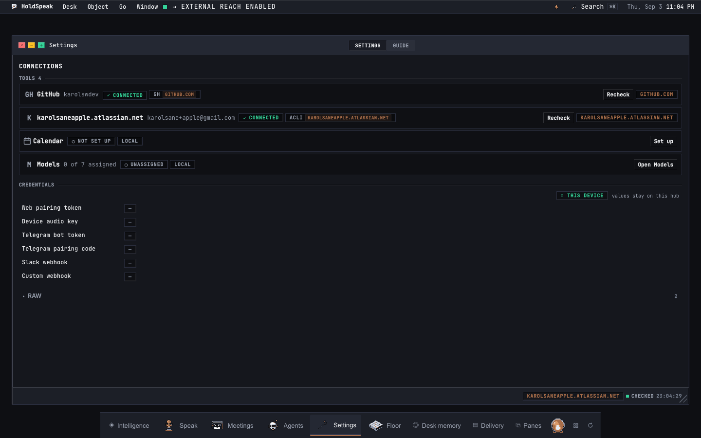

**Jira.** Each Jira connection is one (site, email) pair. With zero
connections, the card shows `Not set up` and fields for site and email
to add the first account. With one or more connections, each row shows
its site, email, state, and the `acli` provenance chip naming the
site. The recovery command is
`acli jira auth login --site <site> --email <email> --token`.
Every `Recheck` contacts `<site>.atlassian.net` from this device.
HoldSpeak never stores Jira credentials; `acli` holds the token on
this machine.

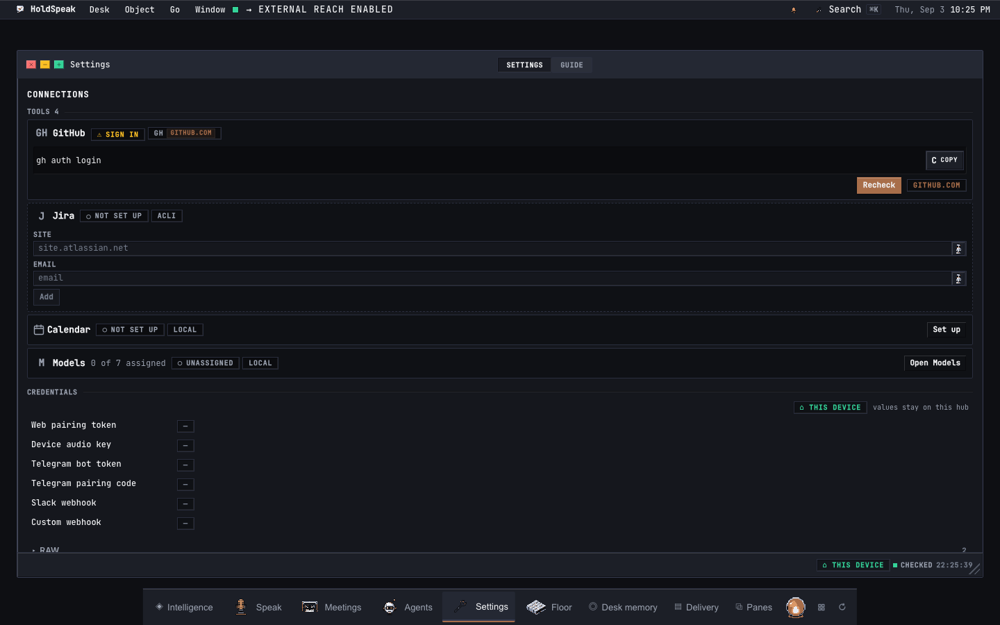

**Calendar** and **Models** are link cards. Calendar opens **Settings,
Meetings** (the calendar source setup from the Door). Models opens
**Settings, Models** (the pack door and topology map). Neither card
rechecks an external host.

**The receipt.** After any `Recheck`, the tile footer shows the time
of the last check and the egress host contacted.

**No hosted relay.** `gh` and `acli` hold credentials on this machine.
HoldSpeak stores no token and contacts no relay; each `Recheck` runs
the CLI's own probe from this device to the named host.

### The wire

`GET /api/connections` returns one entry per tool with `state`,
`account`, `next_action`, `recovery_hint`, `error_detail`,
`last_checked_at`, and `egress_host`. `POST
/api/connections/{provider}/recheck` rechecks one provider and returns
its refreshed entry. The MCP twins are `connection.list` and
`connection.recheck`.

## New Project

Select **Desk > New Project**. The screen has three parts: the
outcome line, the **SOURCES** section, and the footer.

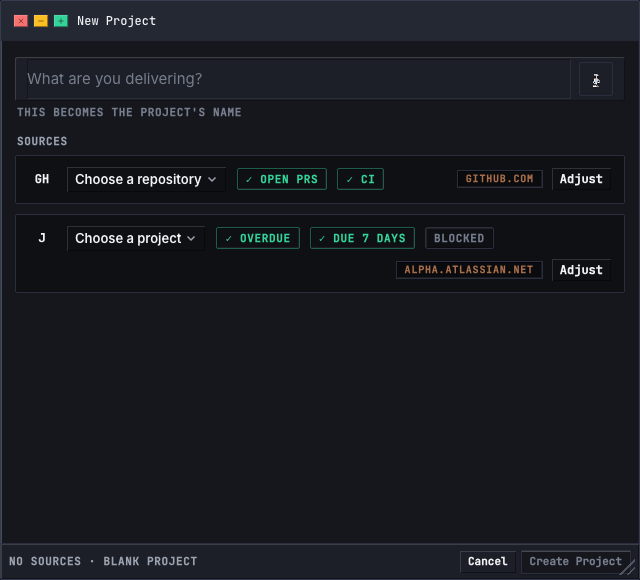

### The outcome line

Type what you are delivering. The placeholder reads `What are you
delivering?`. A mic button at the right edge accepts voice input. This
text becomes the project's name (first 80 characters) and its outcome.
A caption under the input reads `THIS BECOMES THE PROJECT'S NAME`.

### Sources

Each connected tool (GitHub, Jira) appears as one row in the
**SOURCES** section. The section label carries a count of sources that
have a scope picked (e.g. `SOURCES 2`).

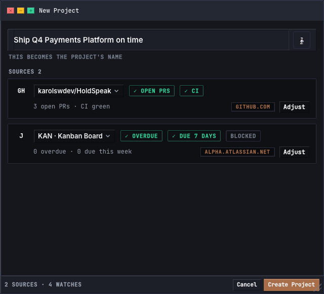

**A connected row** shows: the provider emblem (`GH` or `J`), a scope
picker trigger (the picked name or `Choose a repository` /
`Choose a project`), default Watch toggles as tokens, the live count
once it arrives, an egress chip naming the host, and an `Adjust`
button.

**Default Watch toggles.** GitHub: `OPEN PRS` (on), `CI` (on). Jira:
`OVERDUE` (on), `DUE 7 DAYS` (on), `BLOCKED` (off). Each toggle
controls whether that Watch is created with the project. The toggles
are `CheckGadget` tokens: pressed means on.

**The count is the check.** Picking a scope immediately fetches the
count for every enabled Watch. While the fetch runs, the row reads
`CHECKING`. When the count arrives, the row displays it in secondary
text (e.g. `12 open PRs, CI green`). If the fetch fails, the row
reads `CAN'T CHECK` with the reason in plain words. There is no
separate test step.

**A not-connected row** shows the emblem, the provider name, a state
chip (`SIGN IN` or `NOT SET UP`), and a primary `Connect` button. The
button opens **Settings, Connections**. When you return from
Connections, the row re-reads the connection state and becomes a
picker row if the tool is now connected.

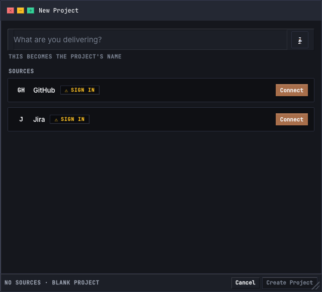

### The picker

Click the scope trigger on a connected row to open the picker. It
unfolds under the row with a search input (`Search repositories` for
GitHub, `Search projects` for Jira) and cards listing available
scopes. A repository or project that another project already watches
shows a token `ALSO WATCHED BY <project>`. Pick one to collapse the
picker and start the count fetch. `Show more` loads additional results.

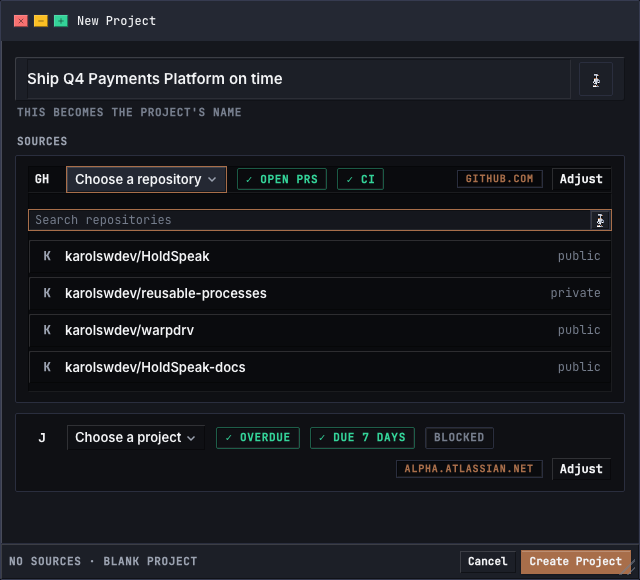

### Adjust

Click `Adjust` on a connected row to open the disclosure under the
row. For GitHub: `BASE BRANCH` (default `main`), `LABELS`, and a
`DRAFTS` toggle. For Jira: `ISSUE TYPES` and `JQL` (optional). This
is where Watch population settings live. Click `Adjust` again to
close it.

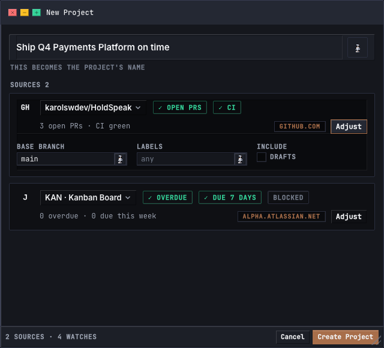

### Footer and creation

The footer receipt shows the live totals: `2 SOURCES · 4 WATCHES` when
sources are picked, or `NO SOURCES · BLANK PROJECT` when none are.
`Cancel` closes the window. `Create Project` is enabled when the
outcome line has text. Creating with zero sources is allowed (the
receipt names this as a blank project). Create builds the project, its
Watches, and fetches the first counts, then opens the Room.

## Project Room

A project opens as a Room. The title bar carries the project name. Two
wings: **ROOM** and **HISTORY**. The ROOM wing answers four questions
in order: what needs me now, what am I watching, what changed since I
last looked, and what did we decide and what do I owe people. An ask
well sits at the foot.

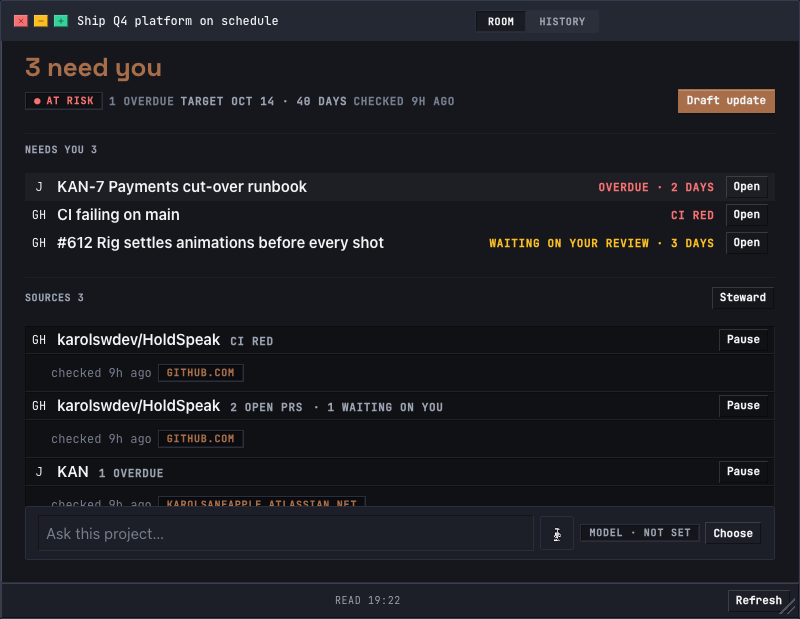

### The head

The headline at display scale reads `3 need you` (in accent) when
items need attention, or `Nothing needs you` (muted) when none do.
Below the headline, chips show the project's health:

- **Health.** A state chip reads `ON TRACK` (success) or `AT RISK`
  (danger). AT RISK triggers when any of: overdue Jira entities > 0,
  CI failing on the base branch, or a review waiting on the owner > 3
  days. The reason token names the first true input.
- **Target.** When the project has a target date: `TARGET OCT 15 · 41
  DAYS`. A passed target reads `OVERDUE BY 3 DAYS` in danger tone.
- **Checked.** `CHECKED 3 MIN AGO` names when sources last ran.
- **Draft update.** One primary button in the head opens the update
  posture.

The outcome line appears in the head only when the title bar cannot
show it whole (long name or narrow viewport).

### Needs you

The **NEEDS YOU** section lists items that require your attention. Each
row shows a source emblem, the item's title, a WHY token naming the
reason and age (e.g. `WAITING ON YOUR REVIEW · 3 DAYS`, `OVERDUE · 2
DAYS`, `DECISION PENDING`), and a verb: `Open` for items with a URL,
`Decide` for pending proposals.

What feeds this section: review requests assigned to you, CI status on
the base branch (a failing CI reads `CI failing on main`), overdue
Jira entities, and pending review proposals.

When empty, the section reads `Nothing needs you` with the next check
time.

### Sources

The **SOURCES** section shows one row per Watch. Each row shows the
source emblem, the scope name, live count tokens (zero counts are
omitted), a `checked` time, the egress chip naming the host, and a
`Pause` or `Resume` verb.

A Watch in `CAN'T CHECK` state shows the reason in plain words and a
`Remove` verb. A `SUGGESTED` row (from meeting facts) sits last with
an `Add` verb, offered but never applied automatically.

The `Steward` button opens the steward's automation settings.

### Since you looked

The **SINCE YOU LOOKED** section uses the server-side read marker. The
caption reads `SINCE YOU LOOKED` when a prior read exists, or
`SINCE CREATED` for a brand-new project. The last-read time appears as
a token (e.g. `WED 09:21`).

Changes are grouped by source with a group heading (e.g. `GitHub · 2
opened · 1 merged`) and entry rows in phrases (e.g. `#618 opened by
mira · 2 h ago`). Opening the Room moves the read marker.

When empty: `Nothing since HH:MM` or `Created just now`.

### Decisions and commitments

The **DECISIONS & COMMITMENTS** section is hidden when empty. When
present, rows read `Decided · <text> · <time>` (from decision records)
or `You owe · <text> · by <time>` (from commitments). Each row carries
an `Open` verb.

These come from meetings linked to the project. When no meeting is
linked, the section is hidden.

### The ask well

At the foot of the Room: an input reading `Ask this project…` with a
mic button. The model's egress chip sits at the right edge: `MODEL ·
192.168.1.43` when a model is assigned, or `MODEL · NOT SET` with a
`Choose` link to Settings, Models when no model is assigned. Answers
appear as an aerogel inset above the well with grounding citations.

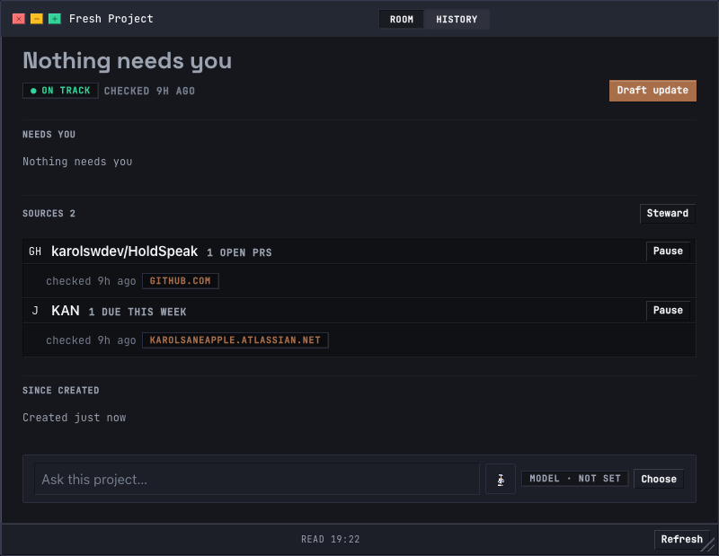

### Footer

On the ROOM wing, the footer receipt reads `READ HH:MM · NEXT CHECK
HH:MM`. On the HISTORY wing, the receipt reads `N TODAY · M THIS WEEK`.
A `Refresh` verb reloads the room data and resets the read marker.

### History

The **HISTORY** wing shows a dated stream of project events. A filter
bar lets you narrow by source: `ALL`, `GITHUB`, `JIRA`, `ROOM`. A
search input with mic narrows entries by text. Each day group shows its
entries in phrases with timestamps.

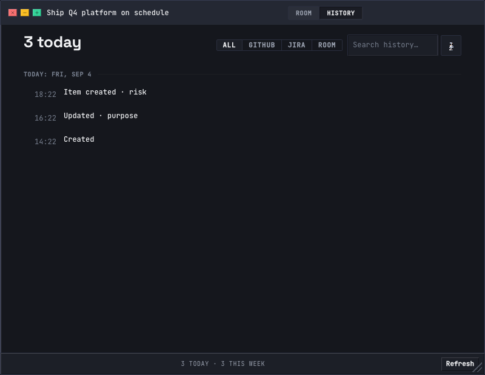

## Settings

Settings is the one configuration window. Its headline states the most
important thing that needs your attention: `No default model` when an engine
is missing, or `All set` when everything is configured.

Each module is a row with its name, its state tokens, and **Open**:

| Row | State tokens |
|---|---|
| **MODELS** | `NO DEFAULT` when unset; `N GROUPS SET · N ENGINES` when configured |
| **CONNECTIONS** | `N CONNECTED` (absent at zero) |
| **VOICE** | `LIVE` + the current target name |
| **MEETINGS** | `INTELLIGENCE ON` or `INTELLIGENCE OFF` |
| **WALLPAPER** | The selected place |
| **RHYTHM** | `EVERY 15 MIN . NEXT hh:mm` when the sweep runs; `NO LOOPS` at zero |
| **SOUNDS & PRESENCE** | `ON` or `OFF` |
| **SYSTEM** | `THIS DEVICE` + `MESH ON` or `MESH OFF` |

The **POSTURE** row carries a cycle control for the security posture
(`YOLO`, `Normal`, `Secure`), stated once. The footer carries `THIS DEVICE`
and a receipt (`WRITTEN hh:mm`). Choose a row to open its module.

## Rhythm

Open **Settings, Rhythm**. The Rhythm module controls the Heartbeat: the
unattended sweep that evaluates project Watches and refreshes the
needs-you aggregate on a cadence.

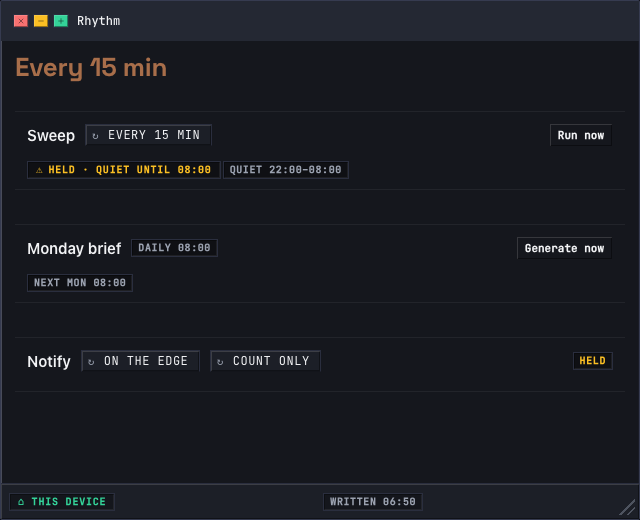

### The sweep row

The **Sweep** row controls the sweep interval with a cycle control
(`EVERY 5 MIN`, `EVERY 15 MIN`, `EVERY 30 MIN`, `EVERY 60 MIN`;
default `EVERY 15 MIN`). **Run now** triggers one immediate sweep
(allowed during quiet hours). Fact tokens below the row read
`QUIET hh:mm-hh:mm`, `NEXT hh:mm`, `LAST hh:mm`, and after a sweep
`N ROOMS` and `N MS`. During quiet hours a `HELD . QUIET UNTIL hh:mm`
chip replaces the fact tokens.

### The Monday brief row

The **Monday brief** row shows a fixed `DAILY hh:mm` token (the hour
is quiet hours end; this is not a setting). The brief regenerates once a
day after quiet hours close. Fact tokens read `NEXT MON hh:mm` and
`LAST <date>`. **Generate now** triggers immediate regeneration;
disabled while generating (a `GENERATING` chip replaces the verb).

### Notifications

The **Notify** row carries two cycle controls:

| Control | Options |
|---|---|
| **Mode** | `OFF`, `ON THE EDGE` (the default), `EVERY SWEEP` |
| **Content** | `COUNT ONLY` (the default), `ROOM NAMES` |

`ON THE EDGE` fires when the needs-you count crosses from 0 to
positive, or when it increases since the last notification. `EVERY
SWEEP` fires after every sweep that finds items. `COUNT ONLY` limits
the body to the count (`3 need you across 2 projects`); `ROOM NAMES`
adds the first WHY per project (at most three lines). During quiet
hours a `HELD` chip appears on the row.

### Per-Room mute

Each project Room carries a mute toggle. A muted Room is excluded from
the notification count and the dock badge count. Muted Rooms still
appear in the shade's **PROJECTS** section, dimmed, with a `MUTED`
token, and do not count toward the section caption.

### The shade's PROJECTS section

The shade lists one row per Room that has needs-you items: the project
glyph, the project name, a count token, the first WHY, and an **Open**
verb. The section caption reads `PROJECTS` with the aggregate count
(`N NEED YOU`). The dock badge carries the same number. When the
aggregate is zero, the section is absent.

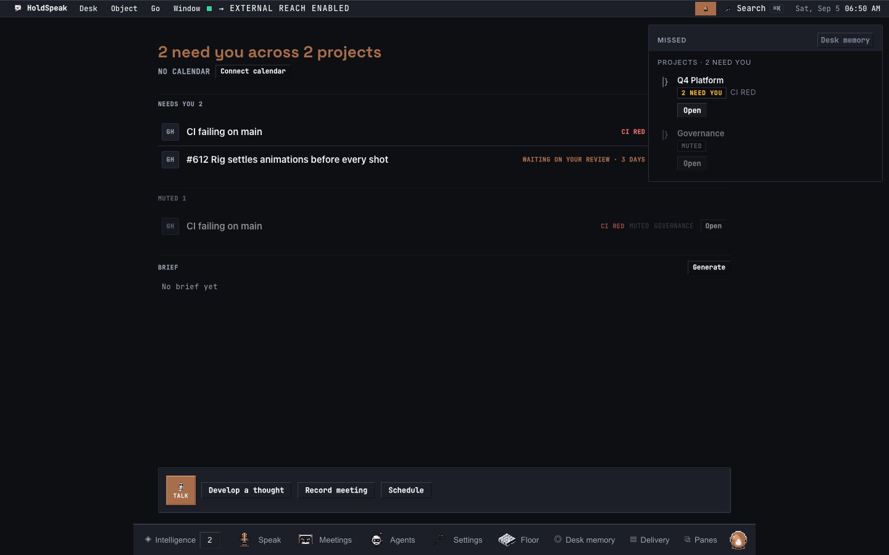

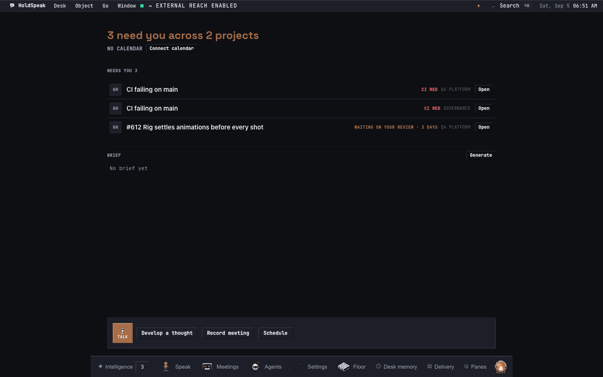

### PROJECTS in the command deck

Type a project name in the command deck (Cmd+K). Up to 10 Rooms appear
as verb entries (sorted by needs-you count, then name), each with the
project kind glyph, the project name, and a trailing count badge (zero
badges omitted). Selecting a Room opens it. Additional Rooms are
reachable through the Projects surface.

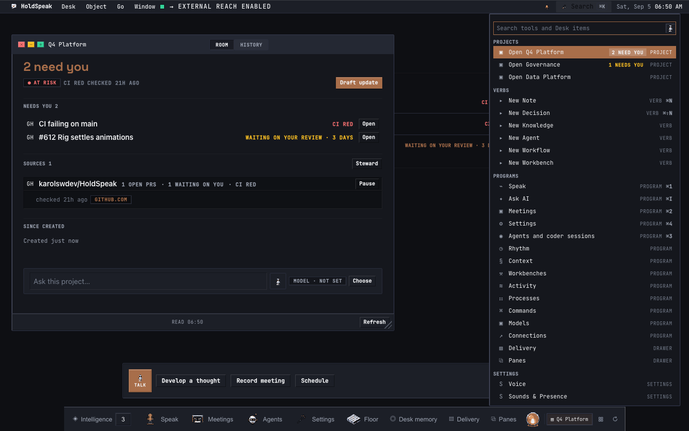

## The clock

The clock is the calendar on the desk. Connect a calendar and the
arrival gains a temporal signal: what is coming, what is armed, and
which meetings belong to your Rooms.

### Connecting a calendar

Open **Settings, Meetings**. The **CALENDAR** section shows one ledger
row per source: a state dot (idle when the source is disabled), the
source label, `ICS` or `SNAPSHOT`, the egress chip naming the host for
an HTTPS source (a file source carries no chip: nothing leaves the
machine), `N EVENTS`, and `LAST READ HH:MM` (your local clock) after the
first refresh. Each row carries the verbs
**Edit**, **Disable** (or **Enable**), and **Remove**; Remove arms a
one-step confirm under the row (`REMOVE <LABEL>`, **Remove** /
**Cancel**).

The **Connect calendar** row carries **Add** and **Snapshot**. **Add**
unfolds one well under the row: paste an ICS URL (an Outlook or Google
ICS export link) or a local file path, with a mic on the field and
**Cancel** / **Save**. **Edit** reuses the same well, pre-filled, under
the source row. The conductor refreshes every 15 minutes. **Snapshot**
is the vision adapter: it extracts events from a calendar screenshot
via the assigned vision model (local/LAN profiles preferred; the host
is recorded on the egress); confirmed events become a file source
ingested through the same pipeline.

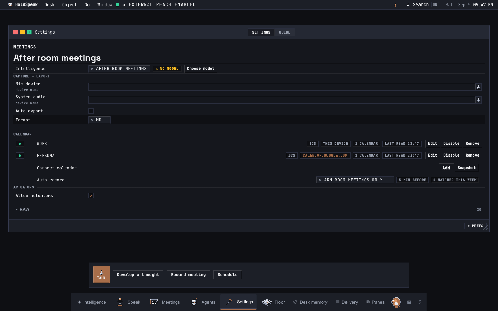

### The WEEK strip

Below the arrival's headline, the WEEK strip shows five to seven day
tokens (`MON` through `SUN`; weekend days appear only when they carry
meetings). Each day carries one dot per meeting on that day (maximum
four dots; five or more shows the count with a plus, `5+` style).
Today's token is accented.
Below the dots: `N MEETINGS THIS WEEK`.

The strip is absent when no calendar source is connected or when the
week has zero events.

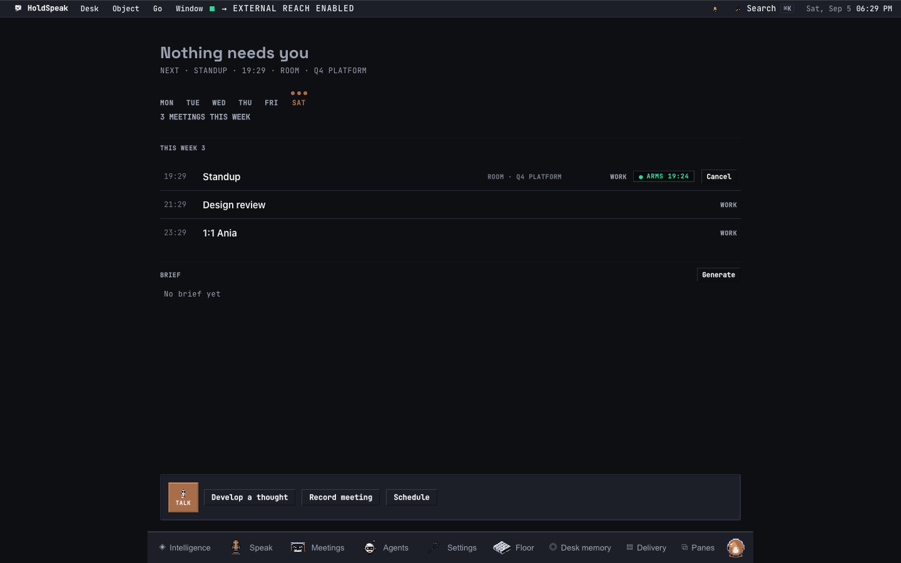

### Event rows

Each upcoming calendar event on the arrival shows the event title,
time (`HH:MM`), the calendar source label, and (when the event matches
a Room) `ROOM` followed by the Room name. When the event has an armed
recording, the row carries `ARMS HH:MM` and a **Cancel** verb that
disarms the recording without affecting the calendar event.

Orphan armed recordings (event-born recordings whose calendar event
has left the projection) render as a separate `ARMED` row with the
original event title and source label.

### Auto-record

Open **Settings, Meetings**. The **Auto-record** row carries a cycle
control with three states:

| State | What it does |
|---|---|
| `OFF` (default) | No event-born recordings are created |
| `ARM ROOM MEETINGS ONLY` | Arms recordings for events matching a Room |
| `ARM ALL CALENDAR MEETINGS` | Arms recordings for every event with a meeting URL |

When enabled, the conductor creates an idle recording for each
matching calendar event. The recording arms at `starts_at` minus five
minutes and, like every scheduled recording, records at the event
(the toggle is your standing consent to record; OFF by default).
**Cancel** on the row stops it for good: a cancelled row is never
re-armed by a later refresh. A `5 MIN BEFORE` token
appears beside the toggle; when `ARM ROOM MEETINGS ONLY` is active, an
`N MATCHED THIS WEEK` token follows. When a calendar event moves, the
recording's arm time moves with it. When an event disappears from the
ICS feed, the recording is cancelled with a receipt.

### The Room's meeting watch

In the Room's **SOURCES** section, a meeting watch row sits alongside
GitHub and Jira: `MTG` emblem, `MEETINGS`, `N THIS WEEK`, `NEXT DAY
HH:MM`, and the Watch verbs (**Pause**, **Resume**, **Retire**). The
row is absent when no meetings link to the Room. The meeting watch
feeds into the Room's SINCE YOU LOOKED delta: a new intelligence run
or a new commitment from a linked meeting appears as a change.

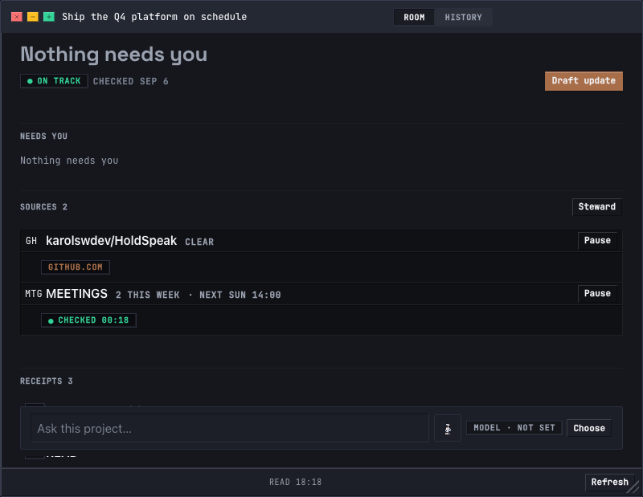

### The weekly brief

When a calendar is connected, the Rhythm module's brief row reads
`Weekly brief` with its true cadence `DAILY HH:MM`: the brief
regenerates every morning and reads the whole week ahead (it remains
`Monday brief` without a calendar). The lookback window is unchanged
(preceding business-day close to now). A separate `compute_lookahead`
covers now to Sunday 23:59.

The brief's `THIS WEEK` section uses a full-week window (Monday 00:00
to Sunday 23:59) and carries:

- meetings count, armed recordings count, next event title and time.
- commitments due this week, with the first item and its day.
- new decisions from meetings since the last brief.

The `changed`, `broke`, `waiting`, and `decisions` sections use the
unchanged lookback window. All sections are absent when they have zero
items (the brief still runs its existing non-calendar collectors).

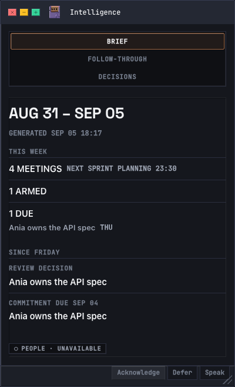

## Models: the Concierge

Open **Settings, Models**. The Concierge is one screen that answers three
questions: what engines exist, what should each capability use, and is
everything ready.

### What you see

The headline states the found count (`5 engines found`) or `No engine yet`.
Under it, a chip row names your hardware (`THIS MAC · M-series · 36 GB`) and
the last check time.

**FOUND** lists every detected engine as a ledger row. Each row shows:

- A kind token: **LAN**, **THIS MAC**, or **CLOUD**.
- The engine name (`Qwen3.6 35B`, `Whisper base`, `OpenRouter`).
- Latency when probed (`41 MS`), file size for local engines (`26.5 GB`),
  runtime (`MLX`, `LLAMA.CPP`), **KEY SET** / **KEY NOT SET** for cloud.
- The host chip (`192.168.1.43 · LAN`, `THIS DEVICE`, `openrouter.ai`).
- State: `READY` or `UNREACHABLE`.

A catalog preset not yet on disk is a row too, with **Download** and its file
size. `Add an engine...` at the bottom opens a field for a base URL and
**Check** to probe it.

Cloud rows carry a **Check** verb with the cost chip `1 TOKEN · $`. That is
the only way a cloud key is ever probed against the paid endpoint; no paid
probe happens without your explicit verb.

**THE SET** proposes one engine per capability group: Thoughts & notes, Chat,
Writing & dictation, Speech recognition, Meetings, Agents & tools, Background.
Each row carries a picker control (the stroke-chevron gadget) with the
proposed engine, its latency token, its host chip, and a state token:

| State | Meaning |
|---|---|
| **READY** | The engine responded to a probe. |
| **CHECKING** | A probe is running. |
| **WAITING** | Depends on a download or check that has not finished. |
| **KEY NOT SET** | A cloud engine with no key configured. |
| **OFF** | You set this group to `None` explicitly. |

The proposal rule: Speech recognition uses a local Whisper engine only (never
LAN or cloud). Writing & dictation picks the smallest reachable low-latency
engine. Every other group picks the strongest reachable LAN engine. Cloud
appears only when you pick it in the picker.

**Use these** (the one primary verb) writes the whole set in one step. It is
disabled until every group is **READY** or explicitly **OFF**.

### Adjust

Choose **Adjust** (the ghost verb by the set's caption) and the full
capability table unfolds under the set rows. Every capability row shows its
group, its explicit override, and its engine's host chip. This is the
per-capability control for fine-grained assignments. The set rows stay
visible above.

### Cloud Check

A cloud engine row's **Check** verb is the only path that sends a paid token.
The cost chip (`1 TOKEN · $`) is visible before you press it. The probe
returns the latency and confirms reachability. No cloud probe runs without
this explicit verb.

### Download

A catalog preset in the FOUND list that is not on disk shows **Download**
with its file size. Choosing it starts the download; the row shows a
progress token (`received / total`, with the received part absent at zero).
Dependent set rows stay **WAITING** and **Use these** stays disabled until
the file is **READY**.

### The footer

The receipt reads `7 GROUPS · 3 ENGINES` (or `NO ENGINE · SET UP NOTHING`
when nothing is found). **Cancel** appears when the set has unsaved changes.

### First open on a cold machine

The headline reads `No engine yet`. The FOUND section lists catalog presets
as **Download** rows and the `Add an engine...` entry. **Use these** is
disabled. One path forward: download a preset or add an engine, then apply.

The full reference for model files, endpoints, and providers is
[Models (bring your own)](MODELS.md).

## People

People is an encrypted, local-only relationship surface for managers who run
recurring 1:1s. Every People record is encrypted at rest with a key held by your
OS credential store (macOS Keychain or Linux Secret Service). The trust facts are
stated on the surface: **Encrypted**, **Local storage**, **Notes only**.

### Set up People

Open People from the Desk (or the Go menu). The first visit shows **Set up
People** with the subtitle "Encrypted, local-only relationship context." Choose
it, and HoldSpeak creates the encrypted sidecar and generates the random key in
your OS credential store.

### Add a relationship

Choose **New relationship**. Name the person, pick a kind (Direct report, Peer,
or Extended), and choose **Add**. The roster sorts by open commitment count, then
alphabetically.

### Link the 1:1 series

Open a relationship and switch to the **Context** lens. Choose **Link calendar
event** at the bottom of the Calendar series section. The picker lists upcoming
events from your calendar sources. Rows whose title contains the person's name
are sorted first and tagged **SUGGESTED**: that tag is an in-memory hint, never
logged or persisted. Choose the row and your click is the link. One link covers
every past and future occurrence of the recurring series.

A series can be linked to one person at a time. Linking a series already held by
another relationship refuses by naming the holder. Re-linking the same person
refreshes the label. To remove a link, choose **Unlink** on the linked series
row, then confirm with **Unlink?**.

### The rail person chip and PREP

Once a series is linked, every occurrence of that event on the Door's Upcoming
rail carries the person's name as a quiet mono chip beside the event title.
Next to **Record this**, linked event rows also show a **Prep** button. Choosing
it opens the person's Prep lens directly.

The relationship header shows the next linked occurrence (for example,
**NEXT 1:1** followed by the day and time).

### What the Prep brief shows

The Prep lens is a read-time view computed across the encrypted and plaintext
boundary. It never persists. It shows:

- **You owe**: your open commitments to this person (encrypted). Leader-private
  items show a "Leader private" tag.
- **Their agenda**: open agenda items from their 1:1 sessions (encrypted).
- **Grounding note count** if any grounding notes exist (encrypted).
- **Last 1:1s**: the most recent linked meetings with their open action items
  (plaintext, by reference) and any decisions minted from those meetings
  (plaintext, via the decision record chain).
- **Unlinked meeting count**: manual recordings without a calendar event link in
  the same time window, so you see what the brief does not cover.

### The MCP brief tool

The `people.one_on_one.brief` tool computes the same brief for an MCP client. It
returns only `shared_intent` material. Leader-private commitments, agenda items,
and grounding notes are never returned. The response carries a `policy` block
naming the disclosure boundary.

The People MCP capability defaults to write for the local owner process. Set
`HOLDSPEAK_MCP_PEOPLE_ACCESS=read` to reduce it or `=off` to disable it before
the sidecar starts.

### Map a person to the Door board

A Door board card has an owner string, the name extracted from the meeting. If you
manage people and want to know who is waiting on whom, you can map an owner string
to a relationship once and the board remembers.

On a card whose owner is not yet mapped (and is not one of the reserved strings
"me", "remote", or "you"), the card shows a **map...** button. Choose it and a
picker lists your relationships. Rows whose display name overlaps with the owner
string sort first and show **(suggested)**; that hint is in-memory only, never
logged. Your click is the map.

You can also map from the relationship side. Open a relationship, switch to the
**Context** lens, and find the **Owner aliases** section. Type the owner string
and choose **Add**. Each alias shows a two-beat **Remove** / **Remove?** verb.

One person per alias: mapping an alias already held by another relationship refuses
and names the holder. Re-mapping the same person is a no-op. Reserved strings are
refused by name.

### Person chips, filter, and staleness

Once a card's owner is mapped, a quiet mono chip with the person's name appears on
the card. Click the chip to filter the board to that person. The board header
carries one chip per mapped person plus **Everyone** to clear the filter.

Beside the person chip, a staleness label reads **waiting Nd** (for example,
"waiting 3d"). The number counts days since the card's `delegated_at` timestamp
(the moment the owner last changed) or its `created_at` if no delegation has
happened. Zero is "waiting 0d". The Intelligence Follow-Through view (the deep
room) wears the same person chip and staleness label for mapped owners.

### The chief-of-staff brief

The Monday Brief gains a People section when you have mapped relationships with
open signals. Choose **Brief** from the Door header (or open the Intelligence
Brief view). When no brief exists yet, the lane shows **Generate your brief**.

The People section shows one row per relationship that has at least one signal:

- **They owe N** and staleness in days: the count of open board cards whose owner
  matches any of this person's aliases.
- **You owe N**: your open commitments to this person (from the encrypted store).
- **N agenda**: open agenda items from their 1:1 sessions (encrypted).
- **Next: title**: the next linked calendar event from this person's series.

Choose a person row to expand it. Two verbs appear in the footer:

- **Add to 1:1 agenda**: creates an open agenda item through the existing People
  agenda authority (a real encrypted write, not a UI-only mark).
- **Open person**: opens the relationship in People.

Nothing about people is persisted in the brief. The People section is computed at
read time by `compose_person_overlay`, called at the HTTP route and MCP adapter
after the persisted brief service returns. The `MondayBrief` dataclass never
carries a `person_sections` field. The `holdspeak://briefs/latest` MCP resource
serves the person-free dataclass by construction. When the encrypted sidecar is
unavailable, the brief shows **People sidecar unavailable** instead of silence.

### The dev keystore (walk and test only)

Set `HOLDSPEAK_PEOPLE_KEYSTORE_FILE` to a file path to bypass the OS credential
store during development or testing. The file keystore uses a JSON format at the
named path, creates on first use with 0600 permissions, and isolates its sidecar
alongside the key file (never the production sidecar path). It is never the
default.

`holdspeak doctor` reports the keystore mode. When the dev keystore is active,
doctor prints: "People keystore: WARN: DEV FILE keystore at <path>. not for real
use" with a fix: "Unset HOLDSPEAK_PEOPLE_KEYSTORE_FILE for production use. The
file keystore is for development and testing only." If both the production
sidecar and the dev sidecar exist, doctor warns: "BOTH WORLDS EXIST."

## Threads

A Thread is a saved conversation on the hub.
It contains your sent messages, model replies, source references, and tool results.
Use a Thread when you want to continue work across multiple turns.

### Start a Thread

1. Select **Desk > New Thread**.
2. Select a mode if the task requires one.
3. Enter your request.
4. Select **Send**.

You can also select **Continue in thread** on a supported Desk object.
That object becomes a source reference for the conversation.
The hub resolves the referenced content for the turn.

### The composer

Type your request or use the click-to-toggle microphone control.
Use `@` to attach supported records such as Meetings, Notes, Artifacts, and decisions.
Each attachment appears as a chip above the field.

**Enter** sends the request. **Shift+Enter** inserts a new line.
The Send control becomes Stop during generation.
Your prompt appears immediately while the request starts.
A failed send retains the text for correction or retry.

Chair/Floor changes preserve the open Thread and its current draft.
An unsent composer draft has no durable-save guarantee across a reload.
Sent messages are separate from that temporary draft state.

### Streaming, receipts, and egress

Replies stream into the conversation.
The turn's boundary and Receipt identify where it ran and the reported result.
A failure appears with the affected turn.

Routine tool calls remain collapsed under **Actions**, including before the final answer arrives.
Open **Actions** when you want to inspect them.
An explicit choice to open the details remains in effect as the turn updates.
Approval requests, tool questions, failures, and denials remain visible outside the routine group.

### Branch, keep, and search

Editing a past user message or regenerating a reply creates a conversation branch.
The branch controls let you inspect sibling branches.
Keep a useful reply as a separate Note or Artifact with its provenance.
Desk search includes saved Threads.

### People boundary

People source parts have a sensitive classification.
The context assembler redacts those parts before a cloud model turn.
The People tools expose only the permitted shared-intent data for the authenticated caller.
See [People security](PEOPLE_SECURITY.md) for the complete confidentiality boundary.

In Interview's **People** section, use **Open People** for relationship work.
That section omits the Thread composer.

### The Thread has hands

A model can request tools exposed by the current mode.
The Thread tool gate checks the tool class, Control mode, and any recorded tool policy.
The called service also applies its own operation rules.

Without an explicit per-tool policy:

| Control mode | Tool admission |
| --- | --- |
| **Secure** | Evidence reads proceed. Candidate builders and effect proposals wait for a decision. |
| **Normal** | Evidence reads and candidate builders proceed. Effect proposals wait for a decision. |
| **YOLO** | Classified, offered tools can proceed through the Thread gate. Service-level authority checks still apply. |

A held call offers these controls:

- **Allow once** admits this call.
- **Allow always** records a policy for this tool in this Thread.
- **Deny** refuses this call.

A recorded per-tool policy takes precedence at the Thread gate.
It does not bypass destination, credential, or permission checks in the service.
See [Control modes](AUTHORITY.md) for central operation policy.

A tool can also request structured input during a call.
Submit the requested values or decline the question.
The tool result includes execution state and available Receipt information.
The collapsed raw-result view exposes the returned payload, subject to the tool result size limit.

### Modes

Modes select a system instruction and a tool set for the Thread.
The built-in modes include:

| Mode | Purpose |
| --- | --- |
| **Desk** | Read Desk evidence and prepare candidates. |
| **Chase** | Use broader Desk and People operations for follow-through. |
| **Draft** | Write without tools. |
| **Plan** | Read Thoughts, decisions, and relevant Desk context. |
| **Project** | Use the Project-oriented mode and its existing MCP path. |
| **Interview** | Revisit sections, save working context, and develop suggestions. |

Select a mode above the composer.
A mode change applies to the next turn.
Selecting the active mode again removes that binding.
For Interview's sections, suggestion controls, and limits, read [Interview](INTERVIEW.md).

### Saved prompts

A saved prompt is a Note tagged `prompt`.
Use `/prompt <name>` to insert its text into the composer.
Review the inserted text before you send it.

### Guardrails

A guardrail is a Note tagged `guardrail` with configuration in its front matter.
Guardrails can review tool-requesting passes and display violations or warnings.
They do not automatically deny every flagged request.
The normal tool and operation gates remain responsible for execution authority.

### Annotations

Select text in an assistant reply to add a comment.
Saved annotation chips become part of the next message when you send it.
These saved annotations can survive reload independently of the unsent text draft.

### Compaction

Use `/compact` to summarize earlier turns into a cut marker.
Later model context includes that summary and subsequent messages.
Earlier messages remain behind the conversation's history control.
Review the summary when the omitted detail matters to your task.

### Todo

Use `/todo <text>` to create an action item from the Thread.
The item retains a source reference to the conversation.
An action item does not configure an automation.

### Slash commands

Enter `/` at the start of a line to open the command palette.

| Command | Action |
| --- | --- |
| `/mode <name>` | Select a Thread mode |
| `/prompt <name>` | Insert a saved prompt |
| `/tools` | List the mode's tools |
| `/guardrail <name>` | Toggle a guardrail on the mode |
| `/todo <text>` | Create an action item |
| `/compact` | Summarize earlier turns |
| `/keep` | Keep the last reply as a Note |
| `/fork` | Branch the conversation |
| `/stop` | Stop generation |
| `/new` | Create a Thread |

### The Call

Call mode combines spoken replies with microphone input for the Thread.
A new Thread starts with Call off.
The Call control reports listening, thinking, or speaking while active.
Select the active control to stop the call.

The reply's speaker control can replay an answer.
Browser speech synthesis is the default voice path.
The optional `tts` extra supplies server voices through kokoro-onnx.
Voice availability depends on the configured path and runtime.

The server voice dependencies include GPL-3.0 components.
See the package and Settings voice information when you enable that extra.
Call hardware and voice quality require validation on the actual device.

## Schedule A Recording

You can set the hub to start a recording on its own at a time you choose.
A scheduled recording uses the hub's real microphone through the same capture
path a manual recording uses; no browser needs to be open.

### Create a schedule

Use any of four paths:

1. **The arrival.** Select **Schedule** in the capture bar. The
   in-world schedule window lets you name the recording, choose **Once** or
   **Recurring**, and set a duration (default 60 minutes).
2. **From a calendar event.** Tap **Record this** on any event in the
   Upcoming rail. The hub creates a one-shot schedule linked to that event
   with all fields computed automatically. See
   [Arm an event for recording](#arm-an-event-for-recording) in Calendars.
3. **HTTP.** `POST /api/scheduled-recordings` with `title`, `cron_expr`,
   `duration_minutes`, and `enabled`.
4. **MCP.** The `scheduled_recording.*` tools expose the same CRUD.

A one-shot schedule fires once and disables itself. A recurring schedule
advances to its next fire time after every terminal outcome.

### What happens at fire time

When the schedule is due, the hub enters an arming countdown. During the
countdown you can cancel with `POST /api/scheduled-recordings/{id}/cancel`.
If nobody cancels, capture starts under the hub's real microphone. The
recording auto-stops at the set duration.

If the microphone floor is already held (another recording, a dictation, the
wake listener), the schedule refuses with a named receipt instead of fighting
for the mic. If the hub was down at the scheduled time, it detects the missed
fire on restart and leaves a missed receipt. Neither case is a silent skip.

### Where scheduled recordings appear

Future schedules appear in the Door **Upcoming** rail as **SCHEDULED
RECORDING** rows with their next fire time. After a recording completes, its
meeting entry is the same as any other captured meeting: transcript,
artifacts, aftercare.

## Meeting Intelligence

Meeting intelligence can run locally or through a configured OpenAI-compatible endpoint.

Local-first behavior:

- Transcripts are stored locally.
- Meeting artifacts are stored locally.
- Deferred queues are stored locally.
- External systems are not written unless a connector or export workflow explicitly does it.

Cloud or homelab behavior:

- If you set `meeting.intel_provider` to `cloud` (or `auto`, which can fall back to it), meeting text may be sent to the model endpoint you picked for analysis.
- The one path: add the endpoint once under **Settings > Models**,
  then select it for **Meetings** in the Concierge set and apply **Use these**. The
  `intel_cloud_*` fields are legacy migration inputs and do not configure runs.
- Use `holdspeak doctor` from the same shell environment to verify endpoint, model, TLS, DNS, and authentication; its placement line names the model each pipeline resolves to.

The provider switch itself still lives in config (deferred intel is
always on and no longer user-configurable):

```json
{
  "meeting": {
    "intel_provider": "cloud"
  }
}
```

### Named owners in action items

When the transcript names people, intelligence extracts their names verbatim
into the `owner` field of each action item. Two tokens are reserved: **Me**
(the speaker or meeting leader) and **Remote** (the counterpart). Every other
owner string is a literal person name as the model heard it in the transcript.
An action item whose owner is unclear gets `null`.

Extracted items land in the **Pending** review state in the **Unassigned**
column on the Door board. From there the triage loop is: review the item,
accept or dismiss it, and (for items with a named owner) map the owner string
to a People relationship. Mapping is a one-time gesture per alias. Once mapped,
the card wears a person chip, a staleness label, and the board filters by
person. The Monday Brief's People section aggregates the same signals per
relationship.

Owner strings can drift between model runs (for example, "Ewa S." vs "Ewa", or
a TTS-synthesized recording transcribing a name as something phonetically
similar). Multiple aliases per person is the designed answer: add each variant
in the relationship's **Owner aliases** section.

On a reference 35B model (Qwen3.6-35B-A3B on cpu-moe), extraction takes
approximately 8 seconds. Transcription of a two-minute audio file takes
approximately 10 seconds with mlx-whisper.

## Project Memory

A meeting earns its keep when the decision is still easy to find after the
transcript has left your working set. Open a project on the Desk to see its
**Project Memory** window. Its Timeline, Decisions, Search, and Ask faces keep
the whole loop in one place:

1. Record or import a meeting and add it to the project. Meeting intelligence
   turns each captured decision into a durable record.
2. Open **Decisions**. Each record names when it was decided and links to the
   transcript moment when HoldSpeak can verify one. **Reported** means the
   meeting plugin supplied an in-range timestamp. **Anchored** means the exact
   decision text was found in a transcript segment. No verified moment means no
   moment link.
3. Accept a decision that stands. If a later decision replaces it, supersede
   the old one in the row and name its successor. A superseded decision points
   to the record that replaced it.
4. Promote an accepted decision to an ADR, note, or decision announcement. You
   can use the record as written or ask your configured model to draft the
   artifact. A superseded decision refuses promotion and points you to its
   successor.
5. Use **Search** to find words across decisions, artifacts, and notes. Run
   `holdspeak memory rebuild-index` if you need to rebuild those local search
   indexes from the records you still have.
6. Use **Ask this project** for a cited answer over the matching project
   sources. Every source remains a separate reference you can follow. The
   egress badge names where the model runs, and **Grounded on N of M** tells you
   how many matching sources reached the bounded prompt and how many were left
   out.

**Timeline** includes the project-qualified change since the previous meeting,
labeled **Since <previous meeting title>**. It does not compare against an
unrelated meeting from another project.

### Retention and deletion

A decision record survives deletion of its source meeting. HoldSpeak marks its
source as deleted instead of deleting the decision text, rationale, date, or
lifecycle. The transcript and its moment are gone, so the surviving record no
longer offers that source jump. It remains available in **Decisions**.

"Years later" means text search over the decisions with linked sources,
artifacts, and notes still in your local database. A severed decision remains a
decision record but leaves that cross-kind index. The index is not a backup,
does not restore deleted source material, and makes no promise that data you
remove will survive. Back up the database separately if you need recovery.

### The process window

Open **Process** when you want to see what the kernel journal says is running,
waiting, needs you, unknown, or recently ended. Rows show the reported work,
its state, and available principal, placement, target, and lineage details.
The window reads kernel objects and events; it has no controls that start,
stop, retry, approve, or otherwise change a run. **Unknown** is literal: the
journal did not report a lifecycle state the window can classify. It does not
mean failed, stuck, or safe to stop.

## Companions

HoldSpeak runs as a desktop hub. A companion on another device drives it over
the same local HTTP API your browser uses, on your own network (LAN or
Tailscale), with no hosted relay. Every request carries the hub's bearer token,
exactly as the browser does when the runtime is bound off loopback.

### The iPad app

The iPad is a client of both modes, not a remote control for one. It reaches the
hub through typed clients over the existing API, so the work happens on the desk
and the iPad shows it:

- **Dictate into your desk.** Speak an answer on the iPad and the hub runs that
  text through the full dictation pipeline (your corrections, your blocks, your
  routing) and types the result into the focused app or answers a waiting
  Claude/Codex session. A configured voice command fires on this remote path
  too, the same bounded action it would fire at the desk, so a keyword is not
  dictated as prose. The spoken language setting and the spoken-symbol
  dictionary apply on this path, the same as local dictation.
- **Read a meeting back in full.** Pull a meeting's artifacts with their
  confidence scores and the transcript sources each was grounded in, browse the
  archive narrowed server-side by speaker, tag, or text (the same facets as
  `/history`), and read its aftercare: what is open, decided, and changed.
- **Review when you want it.** Secure and Normal keep proposing and approving as
  two steps. Fresh installs use YOLO, so an eligible action to a configured
  destination executes with its receipt instead; the iPad still exposes any
  proposal that requires review.
- **See what is grounded.** Activity pre-briefing nudges, source-cited, come
  through to the iPad so you can pick a record to ground the next dictation in.

The iPad's own storage is schema safe the way the desktop is: it backs an older
database up before migrating it, and refuses to open one written by a newer
build rather than risk your data. Its Settings readiness section reports that
store health alongside the paired desktop's status.

### AIPI-Lite

AIPI-Lite is an optional portable device for meeting controls, status feedback,
and spoken replies to a waiting Claude/Codex session. Firmware and bridge setup
are in the [AIPI-Lite Developer Workflow](AIPI_LITE_DEV_WORKFLOW.md).

## Using The Desk

The desk is an operating surface: every object on it is a working icon.

**Icons carry state at rest.** Pixel art renders 1:1 in one uniform cell for
every kind. Badges show only live facts: a member count sits bottom-right on
Knowledge and drawers, a green tick top-right marks something edited in the
last two days, an amber dot top-left means it needs you, and a stale Coder
session wears its faded image. A badge you do not see means the fact does not
exist. The desk never decorates.

**Select and open.** With a mouse, one click selects (the cell box appears and
the label inverts); double-click opens. On touch, a tap opens. Every object
and every drawer answers right-click with the same menu.

**Drawers are directories.** A zone renders as a drawer icon with its member
count. Double-click a drawer and it opens as a real window beside the desk;
the desk stays visible and several drawers can be open at once. Each drawer
window offers an Icons view and a List view (Name, Kind, Modified; click a
column to sort), and it remembers its view, sort, size, and position across
reloads. In the List view, a row's Take out returns that member to the desk.

**Drop to compose.** Drag an object over another: a viable target lights up
and a tag under the cursor names exactly what release does. Drop a note on an
Agent and its card opens with the note's content held as the run material.
You press Ask; a drop never runs a model by itself. Drop a note on a
Knowledge crystal and it files there, the same membership the card's Filed
strip shows. Drop anything on a drawer to file it. Pairs with no named verb
do nothing.

**Info on everything.** Right-click anything and choose Info: one card shows
its identity (the name edits in place), what it measures, where it is filed,
where it came from, and, for Agents, a Runs on property you can change
right there. The same card serves every kind.

**The menu bar.** Desk, Object, Go, and Window menus sit in the top bar.
Object verbs follow your selection; a verb that cannot run right now stays
visible with the reason beside it. Go reaches every application and tool,
the same list the ⌘K search reaches.

The full written law for this grammar lives in
[`web/ICON-DISCIPLINE.md`](../web/ICON-DISCIPLINE.md) and
[`docs/internal/DESK_GRAMMAR.md`](internal/DESK_GRAMMAR.md).

## Mission Control On The Desk

If you plan work with [Delivery Workbench](https://github.com/karolswdev/delivery-workbench),
the desk renders your repositories as a conveyor: one belt per project, phases
as segments, the current phase's stories riding it, and live Coder sessions
pinned to the story they are working. Name your repositories in
`~/.holdspeak/delivery_workbench.json` and the belt appears at the foot of the
desk.

Everything on the belt is read from receipts. Roadmap state comes from each
repository's own `dw` command line, pull requests and their check results from
your own authenticated `gh`, and the event ticker from the repository's rail
log, with commit-gate refusals shown first and carrying the refused rule
verbatim. A story chip's evidence tick opens the evidence file right there on
the desk. When a repository cannot answer, its lane says so plainly instead of
pretending an empty belt.

The belt itself never writes. The one way to act from it is the story-flip
proposal, which rides the same propose, approve, execute flow as every other
action on the desk, and the repository's own commit gate keeps the final say.

### Pull Request Receipts

Repositories registered as Delivery sources also show their pull requests as
receipt rows in the desk's list view: number, title, state, the CI conclusion
(never the logs), the author, and when the row was last observed. Rows that
need you sort first: open with failing CI, then open, then drafts, with merged
and closed kept quiet below.

Refresh is a verb, not a background habit. Clicking **Refresh** runs one
batched `gh` call per registered source; that is the section's only network
touch, and the badge beside the title says so. If you want a cadence, set
`pr_refresh_seconds` on the source's registry entry yourself; nothing polls
until you do. A refresh that fails marks the rows stale, keeps the last good
rows, and names the failure; the observed-at stamp always tells you how old
what you are reading is.

Each row states how it was matched to your work, and never claims more than
the match proves: **exact** means the head commit or branch is a registered
worktree's; **name match** means only that a branch name resembles a Work
attempt's story id; everything else is unattributed. Two verbs: **See diff**
renders the real local diff in place, and when the commits are not in your
local checkout it says so and offers a fetch as an explicit act, because a
fetch is network. **Open on GitHub** leaves the desk, and says so by being a
link.

### Follow A Pull Request Through

A direct click from you does not ask you to confirm the same act twice. **Diff**
reads the local checkout. **Send agent** starts a Coder session in the exact
matched worktree with your bounded instruction and the pull request diff.
**Draft review** runs the configured model and keeps its answer as an Artifact.
Each result appears directly below the pull request row as a Receipt; the
spawned Coder session also carries its own session Receipt.

Work proposed by the Coder session can still stop and ask. With the gate armed,
a matched risky tool call rises in **Needs you** and waits for **Approve** or
**Deny**. The call does not run while it is held, and your denial reason returns
to the session. Read-only terminal watching and local pull request diff reads
continue without a consent card.

GitHub writes always get their own visible proposal. Choose **Post comment**,
edit or speak the complete text, then choose **Propose**. The row shows the full
text with its GitHub badge and waits for **Approve** or **Deny**. Approval posts
exactly that comment and leaves an inline Receipt; denial leaves GitHub
untouched. **Merge**, **Close**, and **Force push** are deliberately not offered.

## Steer A Session From The Desk

Watching is free; every steer resolves authority and is audited. Local steering
does not leave your machine.

Click any session pin on the belt, or the "Watch live" chip in a coder card,
and the session pull-out opens with a live view of that Coder session's terminal pane.
The view is read only: it updates on its own, marks itself stale when the
session has gone quiet, and never sends a keystroke.

The pull-out names the exact pane and the Control posture used for steering. In
Secure, click **Arm pane** for a five-minute exact-pane grant. In Normal, the
same deliberate action grants fifteen minutes. The chip becomes a countdown;
one click disarms it. In YOLO, an eligible registered session reads **YOLO ·
direct** and needs no HoldSpeak arm prompt for text or allowed keys. It does not
gain arbitrary terminal authority: the pane identity captured by the live view
rides every delivery, and the hub re-checks that identity immediately before a
keystroke. A missing or replaced pane refuses, so a reply meant for one session
cannot land in another. Changing posture or restarting the hub clears existing
pane grants.

Once the exact grant or YOLO posture is ready, the composer appears. Speak your
reply by holding the mic, or type it. The paper-plane toggle chooses whether a
return is pressed after the text lands, so a multi-part steer can stay in the
Coder session's input box. Send, and the reply lands in the pane exactly as you
composed it.

You can carry desk objects into a steer. Open the grounding picker in the
composer, choose a meeting or an artifact, and its content rides in ahead of
your message under a labeled header, capped so it fits what the Coder session can read
in one go. The composer shows the exact text before it sends, and refuses at
compose time if the context is too large, naming the size.

Triage what a session surfaces, three ways, all from the pull-out. Keep the
Coder session's current question as a Desk Note, its lineage naming the session and the
moment. Pin an off-rails session to a story yourself, a manual mark the belt
shows with a hollow ring so it never reads as the rails' own verdict. Or flip a
correlated story's status through the same proposal the belt uses, the commit
gate keeping the final say.

Every reply and every refusal is written to the steering audit: who, when, which
session and pane, the exact operation-policy snapshot, and a bounded text
fingerprint. The result also appears as a Receipt on the Coder session. Read the
source audit with `GET /api/coders/steering/audit`.

### Take Over A Session: Any Key, Any Pane, Any Machine

Steering is not only typing text. Under the same resolved authority you can send
real keys: interrupt a runaway with `C-c`, dismiss a prompt with `Escape`, or
drive a menu with the arrows and `Enter`. Keys go through the same one path and
the same audit as a text reply, so the trail reads like what you did: `C-c`,
`Down Down Enter`. A key that is not a real terminal key is refused by name and
never sent (`POST /api/coders/{key}/keys`).

The session does not have to be one HoldSpeak already knows. Every tmux pane on
the machine is listed at `GET /api/coders/steering/panes`, including a shell you
opened by hand. Watch any of them free. Secure and Normal ask you to arm its
exact pane id (`pane:%N`); YOLO can use that exact selection directly. Either
path re-verifies the canonical pane before delivery, so a pane you attach to by
hand has the same identity protection as a tracked session.

And the machine does not have to be this one. With a node configured
(`HOLDSPEAK_STEER_NODES`), the desk relays a watch, an arm, a steer, or a key
sequence to that node, which runs it against its own terminal. The machine that
types owns the authority decision and audit: the far node resolves its own
Control posture or grant, re-checks the expected pane, and records the attempt.
The relay only carries the command and expected identity. A node that does not
answer refuses by name, at once, rather than leaving you waiting.

The rule never changes as the reach grows: watching is free; Secure and Normal
use a bounded exact-pane grant; eligible YOLO steering uses the registered pane
and posture without another prompt; the pane is re-checked before every key; a
recycled pane refuses; and every attempt leaves a Receipt. YOLO removes the
HoldSpeak prompt, not the destination, identity, payload, or key checks.

You do all of this from the desk, not a terminal. Open the Panes list at the
bottom of the desk to see every tmux pane on the machine, and attach to any one.
When authority is ready, a row of keys appears next to the composer: one tap
sends `^C` to stop a runaway, or the arrows and `Enter` to drive a menu. A chip
in the header shows which machine you are steering, this Mac or a paired node.

The desk can also make and end sessions. The Panes list has a field to spawn a
new session by name (the name is checked, so it can never carry a stray command).
The Desk keeps Rename and Kill in a separate session-control window even when
YOLO can steer directly. Kill requires that arm and asks you to confirm, because
ending a session cannot be undone; Rename retains its strict name/argument
validation while its full policy classification remains open. Spawn, steer,
rename, and kill each leave their own line in the audit.

## The Gate: A Steered Agent Asks First

Armed, the gate is fail-closed. That is a real trade, stated plainly: if the
hub is down, unreachable, or answers with an error while the gate is armed, a
matched tool call is denied with the reason named, not waved through. A gate
that cannot reach you refuses to pretend it asked. If you want an agent that
never waits on the hub, leave the gate off; off is the default and the hook is
inert.

Steering lets you type into a session. The gate is the other direction: a
Claude Code session you have opted in can stop before a risky tool call and
ask the desk. The agent's PreToolUse hook posts a proposal to the hub and
waits; the call runs only after you approve it.

Arming takes two deliberate steps, and both are yours to make:

1. `holdspeak gate install` prints a hook block. You add it to
   `~/.claude/settings.json` yourself; HoldSpeak never edits another
   application's configuration.
2. `holdspeak gate arm` flips the master switch, and
   `holdspeak gate allow --repo <path>` names the repository whose calls are
   held (Bash only in this release). Both opt-ins must be set;
   `holdspeak gate status` and `holdspeak doctor` read the armed state back.

A held call appears in the shade's **Needs you** group as a card naming the
session, the tool, a redacted argument preview (a hash and the first 120
characters; the full arguments never reach the hub), and how long the agent
has been waiting. Two verbs: **Approve** lets the call run. **Deny** opens a
one-line reason edited in place, and that reason reaches the agent verbatim,
so it can course-correct instead of blindly retrying.

A hold that nobody decides expires as a deny, with the reason returned to the
agent. A hub restart invalidates every held proposal rather than resuming it;
the agent proposes again by retrying. Every arrival and every decision writes
an audit row you can read back at `GET /api/gate/audit`.

## Session Receipts

A steered session's pull-out and a delivery attempt's card carry one receipt
line. Every number on it states its provenance:

- Elapsed time, steers, and holds come from records the hub itself wrote.
  They are always shown.
- Token figures appear only when the adapter can vouch for them: a gated
  Claude Code session reports its own transcript totals when it ends, with
  cache read and cache write kept as separate figures. A bare tmux pane
  reports nothing, so its line shows no token numbers at all.
- Cost appears only when tokens are reported AND you have added a price row
  for the model in `~/.holdspeak/pricing.json`. It renders as
  `≈ $X.XX (price table, date)`. A missing cost line is a feature: no price
  row means no estimate, and the desk will not print a made-up zero.

## Ground A Run On The Rails

If you plan work with Delivery Workbench, the rails themselves become
material you can hand to any run. In the grounding picker, beside your
meetings, is a rails group listing the belt's live projects: the
roadmap, the current phase, and its stories. Pick one and its content
rides into your ask or your steer, capped and labeled with where it
came from.

What rides in is a receipt, not a guess. The hub reads the exact file
the `dw` command line names for that story or phase, and hands the run
that file's text. It never reads a status out of the document, so a
grounded story is always the real thing on disk. A reference the hub
cannot resolve is refused by name rather than filled in.

## The Rails Journal

You can also let a local model keep a running note of what the rails
do. Turn the ambient observer on in your configuration (it is off by
default) and name the model you want it to use. From then on it watches
your pipeline's own event stream (story flips, commit-gate passes and
refusals, evidence captures, phase closes) and writes a short journal
entry for each batch of new activity. The entries are ordinary desk
notes: you can open them, file them, and ground a later run on them.

The observer only reads and writes its journal. It never touches the
rails; if you want to act on something it noticed, you use the same
story-flip proposal every other desk action uses, and your commit gate
keeps the final say. When the model is unreachable, the entry records
the events plainly and says the summary was unavailable, rather than
inventing one. Read the journal back with
`GET /api/missioncontrol/rails/journal`. Nothing here leaves your
machine: the observer reads your own `dw` and runs your own model.

## Privacy Model

HoldSpeak is designed to be local-first.

Local by default:

- Audio capture.
- Whisper transcription.
- Meeting history.
- Dictation block configuration.
- `.hs/` project context.
- Coder session registry.
- Captured assistant-message snippets, if enabled.

Leaves the machine only when configured:

- Cloud meeting intelligence.
- OpenAI-compatible dictation runtime hosted outside localhost.
- Connector integrations.
- Manual exports or uploads.

Sensitive files:

- Do not place secrets in `.hs/`.
- Use `.hs/ignore` to document paths and topics that should not be injected.
- Set model-profile keys in the configured credential controls; use environment variables
  when provisioning a headless hub.

## Troubleshooting

Run diagnostics first:

```bash
holdspeak doctor
```

Common issues:

| Symptom | Likely cause | Fix |
| --- | --- | --- |
| Hotkey does not trigger | OS global hook restriction | Use focused hold-to-talk fallback or check permissions |
| Text does not paste/type | Synthetic typing blocked | Use clipboard/manual paste fallback |
| System audio missing | No BlackHole/Pulse monitor configured | Run `holdspeak meeting --setup` |
| Dictation LLM unavailable | Missing optional backend or model | Open `/dictation` -> Readiness or Runtime |
| Project context not detected | Wrong cwd or no project marker | Set Project root in `/dictation` |
| Claude/Codex context missing | Hooks not installed or not firing | Open `/dictation` -> Hooks |
| Captured Coder session question looks stale | Last prompt did not clear it | Use Clear on the Coder session banner |

## Optional Coding-Copilot Setup

1. Run `holdspeak doctor`.
2. Start `holdspeak`.
3. Open `/dictation`.
4. Set the Project root for your active repo.
5. Create `.hs/instructions.md`, `.hs/context.md`, `.hs/workflows.md`, and `.hs/targets.md`.
6. Open Hooks and copy the Claude/Codex templates you use.
7. Enable the dictation pipeline and run a dry-run.
8. Start using voice typing in your editor or LLM CLI.

## See also

- [README](../README.md): install, platform notes, configuration reference.
- [Getting Started](GETTING_STARTED.md): first capture and installation.
- [Interview](INTERVIEW.md): saved context, suggestions, and manual drafts.
- [Automation](AUTOMATION.md): triggers, tools, and execution limits.
- [Dictation Pipeline Setup](DICTATION_PIPELINE_GUIDE.md): dictation pipeline, project context, output-target override, OpenAI-compatible endpoints, and automation hooks.
- [Dictation runtime setup](../web/src/pages/cores/RuntimeDocsCore.tsx): source for the local Web runtime setup page.
- [Meeting Mode Guide](MEETING_MODE_GUIDE.md): meeting-specific setup and troubleshooting.
- [Firefox Extension Guide](FIREFOX_EXTENSION_GUIDE.md): local companion extension install.
