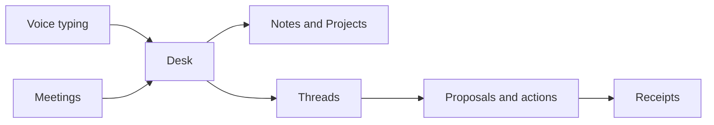

# What is HoldSpeak?

HoldSpeak is one local copilot with two modes.
Voice typing types anywhere and learns how you work.
Meetings end with decisions, actions, and follow-ups instead of a recording.
Both modes feed the Desk, where you also keep Notes, Projects, Threads, and agents.

Whisper runs on your machine.
The language model is yours: a local GGUF or MLX model, or an OpenAI-compatible endpoint that you choose.

## Choose a job

| Your job | What you use | Result to check |
| --- | --- | --- |
| Put spoken words into another app | Voice typing | The text appears in the focused field |
| Find the useful parts of a meeting | Meetings and meeting intelligence | A saved transcript with a summary linked to it |
| Think through material you already have | Notes, Projects, and Threads | An answer with sources you can inspect |
| Let software act for you | An action proposal | The action that ran and its Receipt |

These jobs are not separate apps.
A meeting result can become context for a Thread.
The Thread can then help you prepare the follow-up.

## The words you need first

| Word | Meaning |
| --- | --- |
| Desk | The workspace where records and tools open as windows |
| Meeting | A saved conversation and its transcript |
| Note | Text that you keep and edit |
| Artifact | A saved output that you can return to |
| Project | A scope for related work and sources |
| Thread | A conversation with saved turns and context |
| Model | The engine that generates or transforms a result |
| Receipt | A record of what an operation did |

The [Glossary](GLOSSARY.md) defines every term.
The [domain model](DOMAIN_MODEL.md) separates stored records from visual objects.

## How the parts fit

The hub is the local process that runs the work and stores the results.
The Desk is the web surface of the hub.
Start the hub with `holdspeak`.

## Add tools when the job needs them

1. Start with voice typing or one meeting.
2. Add model rewriting or meeting intelligence when it saves work.
3. Use Notes and Projects to keep context.
4. Add Threads or coder integration for work that needs a conversation.
5. Configure connectors or devices only when you need their action.

The [capability reference](CAPABILITIES.md) lists the full surface, including developer-only and platform-limited paths.

## Know what an action can do

Your own gesture can approve an action.
Delegated work and proposed external actions have their own authority checks.
Read [Control modes](AUTHORITY.md) before you enable them.

Models, connectors, and devices can send data off your machine.
Local storage does not make every configured operation local.
Check the destination of each model and connector.
Read [Security & Privacy](SECURITY.md) for the egress rules.

## See also

- [Getting Started](GETTING_STARTED.md): install and keep your first sentence.
- [Use cases](USE_CASES.md): pick a job and check its result.
- [System architecture](SYSTEM_ARCHITECTURE.md): how the parts work together.
- [Capabilities](CAPABILITIES.md): implementation and limits.
- [Troubleshooting](TROUBLESHOOTING.md): follow a specific failure.
