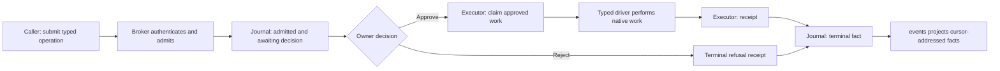

# The backend runtime decomposition

The backend twin of [ARCHITECTURE_WEB_FRONTEND.md](./ARCHITECTURE_WEB_FRONTEND.md).
The runtime is split into single-concern modules, thin assembly cores, and a
small operation kernel for consent, audit, and execution receipts. Density
guards keep those boundaries from silently regrowing.

## Why this exists

`web_runtime.py` proved that a carve regrows without a lock. Phase 52
sliced the dictation orchestration out of it at 2,341 lines; by Phase 63 it
had regrown to 2,635 (the wake word, devices, and routing glue all landed
in the god-object because it was the path of least resistance).
`meeting_session.py` had the same disease un-flagged: models, recording,
transcription, intel, persistence, and mutations in one 1,674-line file.

## The operation kernel

`holdspeak/kernel/` is the named boundary for cooperating runtime code that
performs consequential work. Its caller plane still has exactly four calls:

- `read(refs, view, consistency)` returns operation, canonical, process, and
  receipt projections within the caller's read scope.
- `submit(request)` admits one typed operation and returns its handle.
- `decide(operation_id, approve|reject, expected_revision)` records an
  authenticated decision against the admitted revision.
- `events(after_cursor, filter)` replays journal facts after a durable cursor.

The facade resolves the authenticated principal from the scoped runtime context
and passes it to the broker; an operation payload cannot choose its actor.
Operations are registered, versioned types under `submit`, never new syscalls.
The authoritative startup registry is the `OperationSpec` tuple in
`holdspeak/kernel/runtime.py`; this document deliberately does not duplicate the
whole list. It includes effect operations, `inference.run@1`, the actual provider
child `inference.invoke@1`, `inference.cancel@1`, and typed parent operations such
as `sequence.run@1`, `workflow.run@1`, `workbench.run@1`,
`meeting.session@1`, `meeting.deferred-intel-job@1`, `dictation.session@1`, and
`wake.session@1`. Each type owns validation and native projections in its codec;
the broker remains blind to driver-specific behavior.

Model execution crosses the kernel through the `InferenceRunner` waist: one
physical provider attempt becomes one admitted and claimed `inference.invoke@1`
child over one immutable deployment revision and receives one terminal receipt.
The router owns capability resolution, assignment precedence, frozen plans,
controller fallback, and route-level receipt election. Read
[Intelligence Router architecture](ARCHITECTURE_INTELLIGENCE_ROUTER.md) for that
canonical mechanic chain and its end-to-end Recipe trace.

Execution is a separate plane for authenticated nodes. `claim` atomically takes
approved work and validates its one-use authority; `receipt` writes an immutable
terminal outcome; `reconcile` reports the durable operation and receipt when an
effect's result is uncertain. A caller proposing work is not the same actor as
the node taking responsibility for it, so these three calls do not expand the
caller plane.

The operation journal is the lifecycle truth. It records admitted operations,
state transitions, refs, hashes, bounded heads, and terminal receipts in a
per-stream SHA-256 chain. Native domain records remain authoritative for their
own content and project through `read`; the journal correlates them instead of
copying them. The bus is a projection of journal facts: consumers resume from a
cursor through `events`, and WebSocket or long-poll delivery does not become a
second truth or a command path.

This is the audit and consent boundary for every known HoldSpeak route in the
ratified census. Desktop typing additionally crosses a spawned,
warrant-validating executor process before the raw keyboard/clipboard driver
is imported; generic signed claim/execution deadlines terminalize silent work.
It is not a general sandbox for arbitrary same-user Python. The exact boundary
and the now-empty transitional register are documented in
[Security & Privacy Posture](../SECURITY.md#kernel-boundary-cooperating-code-not-a-sandbox).
The constitutional contract is [Article XI](./CONSTITUTION.md#article-xi--the-kernel).

## The shape

**`holdspeak/web_runtime.py` (the core, ~555 lines)** keeps exactly what a
boot module owns: `__init__`, config apply + presence sync, the onboarding
nudges, signal handling, `run()`, and `run_web_runtime()`. Everything else
is a mixin in **`holdspeak/runtime/`**, composed by the class:

| Module | Concern |
|---|---|
| `transcriber_state.py` | transcription status, lazy load, background warm |
| `activity.py` | runtime activity broadcasts, the voice-state machine, state/status payloads |
| `meeting_glue.py` | meeting start/stop, segment/intel/broadcast handlers, bookmarks, action-item passthroughs |
| `routing_glue.py` | MIR intent controls, route preview, history + artifact persistence, project association |
| `plugin_queue.py` | the deferred plugin-run queue (flush, drains, loop) |
| `dictation_capture.py` | transcribe-and-type, the hotkey handlers, tmux agent reply, voice-command dispatch |
| `wake_glue.py` | the wake-word listener lifecycle, armed capture, the preview/type fork |
| `device_glue.py` | AIPI-Lite voice sessions, events, health, queries |

**`holdspeak/meeting_session/` (a package; the old module path is the
package, so every existing import works)**:

| Module | Concern |
|---|---|
| `models.py` | the pure data layer: Bookmark, TranscriptSegment, IntelSnapshot, MeetingSaveResult, MeetingState |
| `session.py` | the core lifecycle: start/stop, device attach, broadcasts; no provider engine state |
| `intel_plan.py` | immutable per-capability deployment revisions and content-free plan summary |
| `intel_admission.py` / `intel_child.py` | the live `meeting.session` parent and one admitted child per actual intel attempt |
| `deferred_admission.py` | a separate bounded parent for queue retries after the live session closes |
| `live_readiness.py` | explicit live readiness derived from frozen plan placement facts, with no construction |
| `transcribe_admission.py` / `transcribe_loop.py` | shared-Whisper child admission, background loop, overlap window, and chunks |
| `intel_analysis.py` / `bookmarks.py` | live cadence and receipt-gated bookmark refinement through the admitted seam |
| `persistence.py` | `save()` |
| `mutations.py` | action-item status/review/edit, title, tags |

## The rules the pattern lives by

1. **Mixins receive everything via `self`.** A mixin module never imports
   `web_runtime` (the core imports the mixins; a cycle is a design error).
2. **Patch targets live where the lookup happens.** A test that fakes a
   module-level dependency (`Transcriber`, `run_dictation_pipeline`, …)
   patches the MIXIN module that calls it, not the core. Phase 63 learned
   this twice the hard way: a missed patch loaded a real MLX Whisper model
   inside a unit test (a process-fatal abort), and a wrong-module patch
   passed two tests coincidentally while the real pipeline ran silently.
3. **No unused imports in mixin modules.** An importable-but-uncalled name
   is a patching trap — someone will monkeypatch it and nothing will
   change. Phase 63 auto-trimmed every carved header.
4. **Relative imports gain a dot inside packages — at every indentation.**
   The carve scripts missed indented `try:`-block imports twice; the
   guarded `except ImportError` fallbacks then masked the mistake
   (intel silently became `None`). Check function-local imports too.
5. **The guard fires → carve, don't bump**
   (`tests/unit/test_backend_density_guard.py`: cores 650/850, modules
   ≤600). Raising a budget is a reviewed decision, not a reflex.

## Adding a concern (the walkthrough)

1. Create `holdspeak/runtime/<concern>.py` with a `<Concern>Mixin` class;
   import only what the methods call (parent-relative: `from ..x import`).
2. Add the mixin to `WebRuntime`'s base list in `web_runtime.py`.
3. State arrives via `self` (set up in the core's `__init__`); new
   attributes are initialized there, used in the mixin.
4. Tests that fake the mixin's module-level dependencies patch
   `holdspeak.runtime.<concern>.<name>`.
5. Stay under the module budget; if the concern wants more, it is two
   concerns.

## The Phase 79 packages

Phase 79 applied the same discipline to the next three monoliths. The same
rules hold (verbatim moves, patch targets where the lookup happens,
relative imports gain a dot, the guard locks the shape):

**`holdspeak/db/activity/`** (was `db/activity.py`, 1,596): six concern
mixins composed into `ActivityRepository` over `BaseRepository` —
`records` (the ledger + its row mapper), `settings` (import checkpoints,
privacy, nudge dismissals), `rules` (domain + project rules), `enrichment`
(connectors + their run ledger), `annotations`, `candidates`.

**`holdspeak/web/routes/system/`** (was `routes/system.py`, 1,299): five
routers composed under the unchanged `build_system_router` — `health`,
`coders`, `settings` (the PUT validation matrix, the one module with its
own named budget), `voice` (wake type, transcribe, the preview one-shots,
the command test), `ws`; `_shared` holds the state-shape helpers health
and coders both consume.

**`holdspeak/web/routes/primitives/`** (was `routes/primitives.py`,
1,294): seven family routers under the unchanged
`build_primitives_router` — `notes`, `agents`, `profiles`, `kbs`,
`chains`, `workflows`, `directories`; `_shared` holds `_json_body`,
`_new_id`, the source-type vocabulary (re-exported from the package
root), and the ONE run frame/persist tail all three run endpoints call.

Guard additions: package `__init__` files stay composition-only (≤ 90);
concern modules stay ≤ 600; `system/settings.py` carries a named 800.

## Named watch items

- `holdspeak/db/schema.py`: the canonical schema DDL (`SCHEMA_SQL`),
  pinned by the schema snapshot test. `holdspeak/db/reconcile.py` applies
  it declaratively on every open (additive-only, no version gate).
- The old item, `web/routes/meetings.py`, was resolved by Phase 72's
  split into the meetings package.
