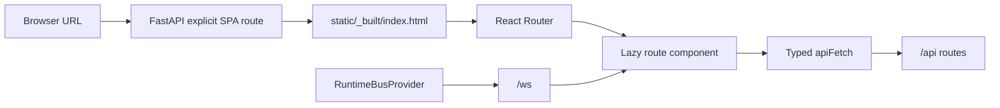

# Web frontend architecture

**Status:** canonical since Phase 91.

HoldSpeak Web is one typed Vite/React 19 application. FastAPI serves one shell,
React Router selects a product route, Signal React components own interactions,
and the shared API/auth and runtime-bus layers own browser I/O.

## Request and render flow



FastAPI intentionally registers explicit browser paths instead of a global
catch-all, so an added API route can never be swallowed by the SPA. Keep
`holdspeak/web/routes/pages.py::SPA_ROUTES` and `web/src/routes.tsx` aligned.
Both `/history` and the canonical-name alias `/meetings` render the archive;
`/desk` is a compatibility alias for the root Desk.

## Source boundaries

```text
web/src/main.tsx                    one entry and provider composition
web/src/routes.tsx                  browser route inventory + lazy imports
web/src/components/AppShell.tsx     navigation, trust and connection chrome
web/src/components/signal/          semantic shared control grammar
web/src/pages/                       route compositions
web/src/features/                    bounded feature models and hooks
web/src/desk/                        spatial Desk components + Zustand stores
web/src/lib/api.ts                  only direct fetch call site
web/src/lib/auth.ts                 query-token bootstrap and forwarding
web/src/runtime/RuntimeBus.tsx      only product /ws owner
web/src/styles/                      tokens, reset and named compositions
```

Route-local state stays in the route. State shared across a feature can move to
a feature hook/reducer. State shared across routes may use Zustand when it has a
real cross-route lifetime. Do not add a store merely to avoid passing props.

## Interaction grammar

Signal components use native browser semantics and add DeskOS hierarchy,
material, spacing and motion. A route arranges controls; it does not redefine
their target size, focus, disabled, loading or status behavior. Primary actions
are 44 px high. Dense subordinate actions are 36 px high and retain at least a
24 px effective target.

Use `Field` for associated labels, descriptions and errors; `Dialog` for modal
focus containment/return; `InlineMessage` for live success/error feedback; and
`StatusPill` for states that must not rely on color alone. Reduced-motion rules
are global. The living contract is `/design/components`.

## API, authentication and secrets

All product HTTP calls use `apiFetch`, `apiBlob`, or the low-level `apiRequest`
from `src/lib/api.ts`. A browser arriving with `?token=…` captures the token in
tab-scoped `sessionStorage`, removes it from the address bar, and forwards it as
`X-HoldSpeak-Token`. The Runtime bus includes the same credential in its
handshake URL. This is a hub access token, not a model-provider key.

Provider/API keys never reach Web state or storage. A Runtime Profile exposes
only its safe shape and whether a key must exist on the hub. Any new editor that
adds a secret field violates the architecture.

## The one runtime bus

`RuntimeBusProvider` owns one `/ws` connection for the entire React tree. It
normalizes `{type, data}` frames, exposes connection state, sends the 15-second
keepalive, backs off reconnects, and removes listeners on unmount. Live,
Presence, arrival, and the Desk Record orb subscribe to that provider. The
device-audio PSK socket is a separate hardware transport and is not a product
runtime-bus consumer.

## Testing and drift locks

`npm run check` runs the architectural census, strict typecheck, all React/Desk
tests, and the production build. The architecture guard rejects old framework
directives/dependencies, selector-owned bootstraps, runtime HTML injection, and
network calls that bypass the typed client. FastAPI integration tests assert
that every direct link returns the same shell. The Phase-91 parity ledger pins
each route's verbs, endpoints, states, storage, WebSocket use, and focus seams.

When adding a route:

1. Add a lazy route in `src/routes.tsx` and an explicit shell path in
   `holdspeak/web/routes/pages.py`.
2. Update `docs/WEB_REACT_PARITY_LEDGER.json` before implementing verbs.
3. Compose Signal primitives; add a bounded feature hook/model when behavior
   becomes non-trivial.
4. Add route/component tests and a FastAPI deep-link assertion.
5. Run `npm run check` and the relevant backend API integration tests.
