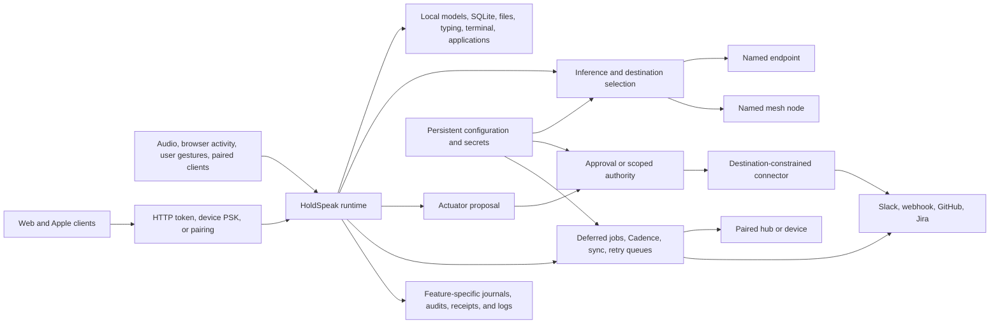

# HoldSpeak Privacy, Approval, and Operator-Control Design Review

**Status:** Current-state architecture review and design input

**Reviewed:** 2026-07-10

**Scope:** Desktop Python runtime, web surfaces, Apple client, AIPI/device path, mesh and sync, plugins/connectors, persistence, configuration, tests, UAT, and product documentation

**Primary question:** Which parts of HoldSpeak support the promises “nothing leaves your computer,” “you can approve everything,” and related operator-control expectations—and where have those controls begun to cost more usability than they return?

> This is a design document, not a security certification. It describes the repository working tree as reviewed, including the React web migration currently in progress. It deliberately separates verified behavior, documented intent, and mismatches between them.

## 1. Executive summary

HoldSpeak has a strong local-first foundation, but it no longer has a literally local-only architecture. It can use local models, user-selected OpenAI-compatible endpoints, paired hubs, mesh nodes, device audio streams, Slack and generic webhooks, GitHub and Jira CLIs, Telegram, model downloads, and cross-machine coder steering. The honest modern promise is therefore not “nothing leaves the machine.” It is closer to:

> HoldSpeak keeps work local by default, makes every remote destination explicit, and gives the operator control appropriate to the consequence of the action.

The current implementation supports that promise through six distinct control families:

1. **Locality defaults.** Local inference is the default for meeting intelligence; optional subsystems and actuators are generally disabled; the web runtime binds to loopback by default; raw desktop meeting audio is not intentionally persisted.
2. **Egress selection.** Provider and endpoint configuration, endpoint profiles, connector URLs, host allow-lists, named mesh nodes, pairing tokens, and runtime egress badges identify or constrain where data can travel.
3. **Approval and preview.** Actuator proposals, Slack/webhook/GitHub cards, dictation preview tokens, wake-word preview, dry runs, and explicit model downloads let the user inspect some operations before commitment.
4. **Capability grants.** Coder steering uses a time-limited, session-specific grant; macro configuration and paired-device credentials act as longer-lived grants; an enabled connector manifest constrains declared operations.
5. **Audit and inspectability.** Actuator transitions, steering attempts, connector runs, activity records, dictation journal entries, receipts, and durable queues make many actions observable after the fact.
6. **Fail-closed behavior.** Local-provider selection does not silently become cloud, missing credentials and off-list destinations are rejected, invalid proposal transitions fail, pane identity is rechecked, newer database schemas are refused, and several remote paths expose honest failure states.

The usability problem is not that each control is individually unreasonable. It is that the controls accumulated independently and now overlap without one policy model. A Slack send, for example, can involve configuration, proposal creation, an approval card, an executor status gate, a connector manifest, and a destination check. Meanwhile, a configured voice macro can execute a shell command immediately on each exact utterance, and a paired client can synchronize broad data sets automatically. “Approval” therefore means different things in different subsystems.

The review reaches five primary conclusions:

- **The safety posture is fragmented, not centrally designed.** Defaults, UI labels, route behavior, connector gates, and documentation together constitute policy. There is no single resolved policy that can answer “is this operation allowed, why, and under which consent?”
- **The strongest product claim is broader than the implementation.** Local-first behavior is real, but remote and paired workflows are first-class. Per-action approval is real for actuator proposals, but it is not universal and should not be described as universal.
- **Some friction is removable policy; some is a security invariant.** Preview-before-type, approval frequency, cloud fallback, sync cadence, and grant duration are reasonable profile dimensions. Authentication, secret handling, destination validation, payload integrity, pane identity, and audit integrity must not become weaker under `--yolo`.
- **There are correctness and security gaps to fix before relaxing controls.** The unauthenticated general WebSocket on a non-loopback runtime, credentials returned by the settings API, settings writes that discard top-level configuration sections, incomplete trust reporting, approval payload hashes that are optional at execution, and a broken proposal contract in the in-progress React screen are not usability tradeoffs.
- **Run profiles are a useful lens, but a three-value enum is not enough internally.** `--safe`, `--neutral`, and `--yolo` can be understandable presets. Underneath, HoldSpeak needs a typed policy evaluator based on operation consequence, destination, reversibility, consent scope, and data class.

The recommended direction is to preserve a small set of non-negotiable invariants, centralize the remaining behavior in a policy engine, ship profiles as presets over that engine, bind every consequential operation to a policy receipt, and reduce repeated privacy prose in favor of a single visible profile/egress state plus precise just-in-time explanations.

### 1.1 Code and concept inventory companion

The feature-level review in this document is complemented by the code-derived [System Primitive and Component Inventory](SYSTEM_PRIMITIVE_COMPONENT_INVENTORY.md). That inventory traces concrete types, route families, repositories, configuration objects, lifecycle enums, sync contracts, and client primitive unions.

Its main finding is more fundamental than approval friction: HoldSpeak repeatedly treats durable resources, executable definitions, live sessions, integrations, proposed effects, and UI projections as peer “primitives.” Similar concepts then acquire independent names and state machines, while generic names such as `profile`, `agent`, `action`, `capability`, `run`, `context`, and `connector` cross abstraction levels.

The inventory therefore refines this document's profile recommendation:

- `safe`, `neutral`, and `yolo` should be a process/session **`ControlMode`** or **`AuthorityPreset`**, not another persisted `Profile` concept;
- the existing `RuntimeProfile` should converge toward **`InferenceTarget`**;
- MIR/plugin selection should use **`RoutingPreset`**;
- dictation application detection should use **`DeliveryTargetType`**;
- shared infrastructure should be built around Resource, CapabilityDefinition, Invocation, ExecutionAttempt, EffectRequest, Authority, Destination, Receipt, and Projection.

This distinction prevents the proposed usability change from adding another overlapping abstraction to the system it is meant to simplify.

## 2. Scope and method

### 2.1 Included surfaces

This review traces operator control through:

- product and positioning claims in [README.md](../../README.md), [POSITIONING.md](POSITIONING.md), and [SECURITY.md](../SECURITY.md);
- configuration defaults and persistence in [config.py](../../holdspeak/config.py);
- command-line entry points in [main.py](../../holdspeak/main.py);
- web authentication, REST routes, WebSockets, setup status, settings, and the legacy and React interfaces;
- dictation, wake word, pipeline rewriting, journal, corrections, target assistance, and voice macros;
- meeting capture, model/provider routing, intelligence queues, aftercare, Slack, webhooks, and GitHub issue proposals;
- plugin hosts, actuator lifecycle, gated connectors, connector packs, and permission manifests;
- activity history, enrichment connectors, retention, exclusions, and deletion controls;
- coder factory and steering, including relay to named nodes;
- sync, mesh inference, device audio, Apple endpoint profiles, local model downloads, and secret storage;
- Cadence, Telegram delivery, Rails observer, and Mission Control;
- SQLite/config storage, backups, schema handling, and duplicated sync payloads;
- unit, integration, end-to-end, and UAT contracts that assert trust behavior.

### 2.2 Review categories

Every relevant surface was evaluated against the same questions:

1. What data is read, stored, transformed, or transmitted?
2. Does the operation remain on one device, cross to a paired device, or reach an external service?
3. What causes it to run: a direct gesture, a setting, a proposal approval, a time-bounded grant, a schedule, or background behavior?
4. What is the default?
5. What is shown before and after the operation?
6. What authorization, destination, capability, and integrity checks apply?
7. Where is the result audited, retained, and deletable?
8. Does documented intent match production behavior and the current UI?

### 2.3 Important qualification

The working tree contains the completed Web framework cutover plus active UAT
work. Findings labeled **migration findings** capture observations made while
that cutover was in flight; the closeout evidence and current React source take
precedence where those observations have since been resolved.

## 3. Product promises and the actual contract

### 3.1 Claims currently in circulation

The repository uses several overlapping trust claims:

- “Nothing leaves your machine.”
- “No cloud, no account, no telemetry.”
- “You approve before anything is sent.”
- “Actuators are off by default.”
- “What executes is exactly what was previewed.”
- “The model is yours,” including a local model or an endpoint the user points at.
- Local state is inspectable, pausable, and deletable.
- Remote failure is named rather than silently hidden.

These statements come from different generations of the product. Taken literally together, they are not a coherent current contract. An endpoint chosen by the user may be on the same LAN, on a private mesh node, or in a commercial cloud. A paired hub is another computer even when no third-party cloud is involved. A Slack webhook plainly leaves the machine. Background sync and Telegram delivery do not request per-item approval.

### 3.2 Recommended canonical promise

The implementation can credibly support the following four-part contract:

1. **Local by default.** Capture, transcription, storage, and intelligence can run without a HoldSpeak cloud service or account.
2. **No undisclosed destination.** Any configured remote computation or delivery has a named endpoint, node, peer, or connector and an accurate data-scope description.
3. **Consequence-appropriate control.** HoldSpeak asks for confirmation, issues a scoped grant, or relies on clearly disclosed persistent configuration according to the effect of the operation.
4. **Inspectable receipts.** Consequential operations explain what happened, where data went, which policy allowed it, and how to stop or revoke future operations.

This contract accommodates genuinely useful remote and automated workflows without pretending they do not exist.

### 3.3 Vocabulary that must stop being overloaded

| Term | Proposed precise meaning |
|---|---|
| **Local** | Processing and storage remain within the current device process/filesystem boundary. |
| **Paired** | Data crosses to a user-paired HoldSpeak device or hub. This is network egress even when it stays within the user's equipment. |
| **Mesh** | Work is sent to a named HoldSpeak inference or steering node. Mesh is a destination class, not synonymous with local. |
| **External** | Data reaches a non-HoldSpeak service or tool such as an OpenAI-compatible endpoint, Slack, Telegram, GitHub, Jira, or a generic webhook. |
| **Egress** | Any bytes sent outside the current process/device boundary, including paired and LAN destinations. |
| **Approval** | A human decision bound to one immutable proposed operation. |
| **Grant** | Time-, session-, destination-, or capability-scoped authority that may permit multiple operations. |
| **Configuration consent** | Persistent enablement of a named behavior or destination; not equivalent to per-operation approval. |
| **Preview** | A representation shown before commitment. A preview is only a security control if it is mechanically bound to the committed payload. |
| **Receipt** | Durable evidence of the requested operation, resolved policy, consent basis, destination, payload identity, and outcome. |
| **Reversible** | The product has a defined compensating action, not merely that a user might fix the result manually. |

## 4. Current trust boundaries

HoldSpeak crosses more boundaries than the original single-machine dictation product. The relevant boundaries are:



The diagram exposes the current design tension: authentication, destination selection, human approval, persistent configuration, and audit are separate control planes. No single one of them determines the effective posture.

1. **Microphone/system audio to process.** Sensitive audio enters the runtime and is transcribed.
2. **Process to local OS.** Typed text, launched applications, opened URLs, shell commands, local CLI execution, filesystem writes, notifications, and terminal keystrokes affect the host.
3. **Process to local persistence.** Config, SQLite, logs, queues, model files, audio on Apple platforms, and sync inbox files extend the lifetime of data.
4. **Loopback client to runtime.** Any process able to reach the loopback server can call the REST API; loopback is intentionally frictionless.
5. **LAN/remote client to runtime.** Off-loopback HTTP requests require a web token, but the general `/ws` socket currently does not enforce the same token.
6. **Device audio peer to runtime.** A separate pre-shared key authenticates the device audio WebSocket.
7. **Runtime to model endpoint.** Transcript, prompt, context, or dictated text may be sent to an OpenAI-compatible endpoint.
8. **Runtime to paired hub or mesh node.** Meeting content, artifacts, primitives, model-profile shapes, inference prompts, steering messages, and status can cross machines.
9. **Runtime to external delivery.** Slack, generic webhooks, Telegram, GitHub/Jira CLIs, failure webhooks, and connector packs may expose content or identifiers.
10. **Plugin/connector code to host authority.** Built-in and user-discovered Python code runs in-process. Permission manifests constrain use of cooperative gates; they are not a sandbox against malicious pack code.
11. **Web/Apple UI to secret stores.** Tokens, API keys, PSKs, and webhook credentials move through configuration and UI APIs with uneven protection.

The design implication is important: “local-first” is a data-flow property, while “approval-first” is an authority property. They need related UI, but they cannot be implemented as one boolean.

## 5. Control taxonomy: what “the user approved it” currently means

HoldSpeak already contains several useful consent patterns. The problem is inconsistent naming and application.

### 5.1 One-shot, payload-specific approval

Used by actuator proposals and dictation preview tokens.

- The user sees a proposed effect or exact text.
- The decision should bind to one payload.
- Reuse should be impossible.
- A change should require a new approval.

This is the strongest pattern and appropriate for external writes and destructive actions.

### 5.2 Direct-gesture consent

Used by hold-to-talk dictation, “run now,” model download, explicit sync, answer/steer submission, and some factory operations.

- The click, key hold, or submit action is itself consent.
- A second dialog is unnecessary if consequence and destination are apparent before the gesture.
- This model fails when a button labeled “Test” unexpectedly opens a URL, launches an application, or runs a shell command.

### 5.3 Configuration-as-consent

Used by model endpoints, Slack and companion webhook URLs, voice macros, connector enablement, Telegram, and some automation settings.

- The user enables a durable behavior once.
- Future operations may happen without renewed confirmation.
- The UI must state scope, duration, data classes, destination, and revocation method at configuration time and at the point of use.

Configuration-as-consent is valid, but it must not be described later as per-action approval.

### 5.4 Time-bounded capability grant

Used most clearly by coder steering.

- The grant is bound to one session/pane and has a monotonic expiry.
- Multiple text or key deliveries are allowed while armed.
- Pane identity is revalidated for each delivery and attempts are audited.

This is a strong precedent for reducing repeated approvals without granting indefinite authority.

### 5.5 Pairing or bearer-token trust

Used by the web runtime, device audio, sync, and connected HoldSpeak clients.

- Possession of a token or PSK authorizes a class of API requests.
- Authorization can persist much longer than one action.
- Rotation or deletion revokes future connections, although existing connection behavior must be explicit.

### 5.6 Scheduled or background authority

Used by deferred meeting intelligence, automatic Apple sync, Cadence schedules, Telegram delivery, offline queues, and retry workers.

- Initial enablement authorizes later operations triggered by time or availability.
- The user is not present at the exact moment of egress.
- These paths require visible armed state, destination-scoped receipts, pause/disable controls, and bounded retry behavior.

### 5.7 Audit without preapproval

Used by activity collection, journal recording, local state transitions, and some factory operations.

- The system records behavior and offers later inspection/deletion.
- This supports accountability but is not consent.
- Audit cannot compensate for an operation whose consequence required advance authority.

## 6. Current default posture

| Surface | Current default | Practical effect |
|---|---|---|
| Web bind | Loopback | Local processes can access without a token; LAN clients cannot connect unless explicitly bound. |
| Meeting intelligence | Enabled, local provider | Local model is used; no cloud fallback under `local`. |
| Provider `auto` | Explicitly selectable | Local is tried first, then a configured endpoint can be used without a new per-run prompt. |
| Meeting actuators | Master off; allow-list empty | Generic plugin actuator execution is blocked. |
| Slack/companion webhook | URL empty | No proposal/send surface until configured. Per-send approval then executes without the generic master toggle. |
| Meeting GitHub repo | Empty | Issue proposal path is unavailable until configured. |
| Dictation pipeline | Off | Raw transcription path remains primary. |
| Preview before typing | Off | Ordinary hold-to-talk dictation types immediately. |
| Wake word | Off; preview action when enabled | First enabling wake is explicit; recognized speech previews rather than types by default. |
| Dictation journal | On; bounded record count | Dictation runs are stored locally after heuristic secret filtering. |
| Voice macros | Off | No command fires until macros and entries are configured. |
| Activity privacy | Enabled in DB | Local browser-history import is allowed, but refresh is a separate action; retention is bounded. |
| Presence/mascot | Off | Ambient surfaces do not start by default. |
| Cadence | Off | No background cadence cycle by default. |
| Telegram | Off | No Telegram polling or delivery until configured. |
| Rails observer | Off | No observer loop by default. |
| Mesh serving | Off / explicit command or toggle | No inference service is exposed until started. |
| Device audio | PSK required | Empty credentials fail; pairing must be configured. |

The defaults are conservative. However, defaults alone do not produce a coherent experience because enabling one feature often exposes another independent gate, and a few subsystems intentionally bypass the generic gates in favor of their own consent model.

## 7. End-to-end workflow review

### 7.1 Ordinary hold-to-talk dictation

**Flow:** hotkey down → audio capture → local transcription → optional pipeline transformations → type into focused application → journal/audit.

**Current control behavior:**

- The hotkey hold is treated as the authorizing gesture.
- With `preview_before_type=false`, recognized text is typed immediately.
- The transcription model is normally local; optional pipeline or target-model assistance can invoke a configured OpenAI-compatible endpoint.
- The journal is enabled independently of preview and stores bounded local records after secret filtering.
- Focused application state matters: typing is a local side effect in another application, not a read-only operation.

**Design assessment:** Immediate typing is appropriate for the core dictation loop and should remain the neutral behavior. Requiring approval for every utterance destroys the product's primary utility. The important disclosure is whether any pipeline stage can egress text before typing, not another confirmation after speech.

**Friction/gaps:**

- Trust messaging often focuses on meeting intelligence and can understate the dictation endpoint path.
- Journal storage and model egress are separate decisions but are visually easy to conflate.
- Agent-reply sessions intentionally bypass the general preview path, so “preview all dictation” is not literally universal.

### 7.2 Preview-before-type and wake-word dictation

**Flow:** transcription → server stores preview text with a one-shot token → UI presents text → “Type it” or discard → token is consumed.

**Controls:**

- The token binds a one-time decision to server-held text.
- A successful type or discard consumes the token.
- Wake word is off by default, and its default enabled action is preview.
- The user can explicitly choose immediate wake typing.

**Design assessment:** This is a well-shaped one-shot approval mechanism. It should be the safe-profile behavior and an option for high-consequence targets. It should not become the mandatory default for every normal dictation path.

**Important distinction:** The token protects text integrity between preview and type. It does not prove that upstream transcription or rewriting was local; the egress state must be shown separately.

### 7.3 Dictation pipeline, corrections, and grounding

The optional dictation pipeline can add project detection, intent routing, knowledge grounding, rewriting, and corrections. It is off by default and fails through several explicit no-op/fallback states.

Privacy-supporting surfaces include:

- explicit runtime/provider configuration;
- local-first model selection;
- dry-run and preview endpoints for intent behavior;
- secret filtering before journal/correction persistence;
- bounded journal retention and clear/delete APIs;
- project-local override directories;
- counters and “disabled for session” reporting when the runtime exceeds safety limits.

The usability cost is configuration density: the user must reason about transcription, pipeline enablement, target assistance, endpoint profiles, journal behavior, and preview independently. A single resolved run receipt would make the actual path more understandable than many settings.

### 7.4 Voice macros

**Flow:** exact whole-utterance match → configured action → open URL, launch application, run shell command through `sh -c`, or type text.

**Controls:**

- The subsystem and macro list are off by default.
- Exact matching reduces accidental activation.
- The connector checks the operation configured for that macro.
- Configuration is treated as consent; there is no approval for each fire.

**High-consequence behavior:** A configured shell macro may be arbitrarily consequential. The commands UI's `/api/commands/test` route executes open/launch/shell actions immediately; only `type_text` is treated as a preview. A generic “Test” label is insufficient for an operation that can execute a shell command.

**Audit limitation:** Macro execution is logged/activity-visible but does not use the durable actuator proposal/audit lifecycle. The database now supports non-meeting actuator origins, so the historical reason for keeping macros outside that lifecycle is weaker.

**Recommendation:** Keep configuration-as-consent for neutral mode, add a clearly labeled execution preview in safe mode, and require receipts for all fires. A profile must not convert untrusted or dynamically generated speech into an unrestricted shell command.

### 7.5 Meeting capture and local persistence

**Flow:** microphone/system/device audio → transcription → segments/speakers → SQLite meeting record → optional intelligence and plugins.

Privacy-supporting behavior includes:

- desktop raw audio is handled in memory rather than intentionally retained;
- transcript and artifacts remain in the local database by default;
- speaker embeddings are local persistent biometric-like data;
- user-visible meeting archive and deletion controls;
- schema backup before supported migrations and refusal to open a newer unsupported schema.

The storage statement must be platform-qualified. Apple clients can use persistent recording/model file stores and the app sandbox; desktop and Apple retention are not identical. Documentation that says “audio is never persisted” should name the platform and code path.

### 7.6 Meeting intelligence: local, auto, endpoint, and deferred work

**Local provider:** The local provider never becomes cloud. This invariant is explicitly tested and should remain non-negotiable.

**Cloud/endpoint provider:** A configured OpenAI-compatible endpoint receives transcript-derived text. The endpoint may in practice be a LAN server, private mesh service, or commercial cloud, so the internal name `cloud` is a poor privacy label.

**Auto provider:** The runtime attempts local inference and may then use the configured remote provider. Selection of `auto` is a persistent consent decision, but the per-run transition from local to remote happens because of availability rather than a fresh user action.

**Deferred processing:** Enabled by default for meeting intelligence. Work can execute later, including when the initiating screen is gone. If the selected provider is remote, egress can therefore occur asynchronously.

**Good controls:**

- provider normalization fails unknown values toward local;
- local and endpoint profile choices are explicit;
- API results include actual egress scope for many runs;
- `intel_cloud_store` is separately off unless enabled;
- failed endpoint jobs surface error/retry states rather than silently pretending to be local.

**Design gaps:**

- “auto” is both a reliability policy and a privacy policy.
- The setup trust summary is an incomplete aggregate; it does not cover all remote subsystems.
- The doctor emphasizes meeting-intel egress but does not provide equivalent coverage for all dictation and automation paths.
- Labels drift among `local`, `cloud`, `mixed`, and `mesh`; they do not consistently represent destination ownership or data scope.

### 7.7 Meeting aftercare: proposal → approval → execution

The actuator design is the repository's most explicit approval architecture.

**Proposal contract:** `target`, `action`, human-readable `preview`, machine `payload`, `reversible`, and required capabilities. Proposal creation is not execution.

**Persistent lifecycle:**

```text
proposed -> approved -> executed
    |           |
    |           +-> failed -> approved (retry)
    +-> rejected
```

Every legal transition is audited. The executor checks status, policy, optional allow-list, optional approval-time payload hash, then calls an injected connector. Connectors can further constrain exact command prefixes or destination hosts through manifests and a permission gate.

**What is strong:**

- creating or broadcasting a proposal does not itself egress;
- proposal broadcasts omit the machine payload;
- illegal lifecycle transitions fail;
- connectors are injected and testable;
- Slack URLs are read at execution time and are not stored in proposal payloads;
- Slack and companion webhook connectors bind delivery to the configured URL/host;
- GitHub issue execution uses a narrow `gh issue create` command shape;
- terminal outcomes and errors are persisted and broadcast.

**Where the contract is weaker than the prose:**

- The approval-time payload hash is optional in `ActuatorExecutor.execute`. Production execute-on-approve calls do not generally pass one. Current database routes do not normally expose payload mutation, but “what executes is exactly what was approved” is not mechanically universal unless approval always records and execution always verifies the hash.
- The user approves a human `preview`, while execution consumes a structured `payload`. The contract requires a faithful preview, but there is no generic renderer that proves the preview contains every material payload field.
- The generic governance story says approval plus `allow_actuators` plus allow-list. Slack and desk webhook/GitHub routes intentionally instantiate the executor with `allow_actuators=True` because destination configuration plus per-action approval is considered enough. This is a reasonable product choice, but it contradicts the universal “triple gate” story.
- A meeting-origin GitHub proposal is not automatically executed by the normal meeting decision route unless that route supplies a GitHub executor. Desk GitHub proposals do execute on approval. The same-looking approval can therefore mean “send now” or “mark approved for a later executor.”

**Usability consequence:** Users cannot reliably infer whether “Approve” executes now, merely authorizes, or still requires another master switch. The UI needs an explicit commitment label: “Approve and send,” “Approve for executor,” or “Approve batch.”

### 7.8 Slack and companion webhooks

These paths use a deliberate double-consent model:

1. configuring a URL enables exactly that destination; and
2. approving a proposal authorizes one send.

They intentionally do not require the generic actuator master switch as a third consent. This is one of the better usability decisions in the current architecture, provided it is documented consistently.

Remaining concerns:

- Slack, companion webhook, and older generic `webhook_allowed_hosts` settings represent overlapping destination-governance models.
- Webhook URLs are credentials and live in plaintext config.
- The full settings API returns these values, creating a broader read surface than the connector itself.
- A profile should change approval frequency only after destination trust is explicit; it should never permit a proposal to redirect to an arbitrary payload URL.

### 7.9 GitHub, Jira, and CLI connectors

HoldSpeak uses the user's installed/authenticated `gh` and Jira CLI paths rather than storing all service tokens itself. Narrow command construction and dry runs are good controls.

Two different operation classes exist:

- **Read/enrichment:** entity identifiers can be sent through an authenticated CLI to enrich local activity. Configuration and an explicit run/refresh usually authorize the operation.
- **Write/actuation:** issue creation is proposal-gated and should be bound to exact repo/title/body.

Connector manifests declare capabilities and permissions, and runtime gates reject missing declarations. However, locally discovered user packs execute Python in-process. A malicious pack can ignore cooperative gates. Documentation correctly needs to treat the permission system as an honesty/compatibility boundary, not a sandbox.

### 7.10 Activity history and local context

Browser history/activity collection supports the privacy promise through:

- local browser database snapshotting rather than browser-cloud APIs;
- an enabled/paused privacy setting;
- explicit refresh/import routes;
- domain exclusions;
- bounded retention;
- clear/delete controls;
- connector preview and dry-run output;
- visible connector run history.

The data is still highly sensitive. URLs can embed query strings, document identifiers, or tokens. Activity records are not equivalent to secret-filtered dictation journal text. The product should clearly distinguish local retention controls from content redaction.

The UI currently repeats variants of “local-only” and “never leaves” copy on activity and journal surfaces. The positioning guidance already prefers a compact egress badge. A central profile/egress indicator plus a detailed trust drawer would reduce reassurance fatigue without reducing transparency.

### 7.11 Coder steering and factory controls

Coder steering is the clearest existing example of a useful middle ground between per-action approval and unrestricted automation.

**Read path:** Peeking at panes is not grant-gated.

**Write path:**

- typing text or sending special keys requires a per-session grant;
- grants have bounded TTLs and live in memory;
- process restart clears them;
- the tmux pane identity is pinned and rechecked on every delivery;
- pane loss or identity mismatch revokes authority;
- special keys are allow-listed;
- every attempt is audited;
- a named relay sends to a configured node, but the node owning the pane owns the grant and authoritative audit.

**Behavior while armed:** Multiple deliveries can occur without repeated approval. That is exactly what a capability grant is supposed to do.

**Factory operations:** Spawn and rename are direct, explicit, and audited but do not require an arm grant. Spawn can accept an arbitrary command. Kill does require a grant. This consequence classification should be reviewed: arbitrary-command spawn may be at least as consequential as some armed key actions.

**UI mismatch:** Some UAT language says “hold to arm,” while the web/Apple interaction is effectively a click/tap that creates a timed grant. The product should say what it does: “Arm for 15 minutes,” show the target pane, and show a visible countdown/revoke control.

### 7.12 Sync and paired-hub workflows

Sync moves substantial data across a device boundary: meetings, artifacts, notes, knowledge bases, recipes, chains, workflows, directories, profile shapes, and model manifests. API keys and model binaries are intentionally excluded from profile sync.

**Consent model:** Pairing/configuration authorizes the relationship; individual records generally do not require approval. Apple clients may synchronize automatically during load and after authoring, with durable offline queues.

**Good controls:**

- keys are separate from syncable profile shape;
- Apple profile keys use device-only Keychain storage;
- offline errors are surfaced and retried;
- manual sync controls exist;
- a paired endpoint is named.

**Risks and clarity issues:**

- “Nothing leaves this device” is false once automatic sync is enabled, even if both devices belong to the user.
- Sync transport relies on the web runtime's bearer-token model and does not itself imply encrypted transport.
- The hub stores pushed payloads in sync inbox JSON files for auditing/receipt behavior. Those files can duplicate meeting or artifact content outside canonical rows; deleting the canonical meeting may not erase every inbox copy.
- The paired-hub token in Apple settings is stored through `AppStorage`/UserDefaults rather than the Keychain, unlike model profile keys.

Sync should be labeled **paired egress**, with data-class controls and a “delete remote copies” story rather than being folded into “local.”

### 7.13 Mesh inference and cross-machine steering

Mesh serving is off until explicitly started or toggled. A named node, endpoint, and optional token define the destination. Mesh jobs and events make remote execution visible; offline nodes fail with a named error.

The privacy property is not “no egress” but “egress to a named HoldSpeak node.” The current `local/cloud/mesh/mixed` vocabulary inconsistently treats topology and trust as the same axis. UI should show both:

- **destination:** this device / paired device / named node / external endpoint; and
- **data scope:** audio / transcript / prompt and selected context / artifact / command.

### 7.14 Device audio and AIPI Lite

The device WebSocket performs a strict PSK handshake. Empty keys fail, comparisons are constant-time, keys can be lazily generated and rotated, and meeting-device status is visible.

Important limitations:

- The transport is plaintext WebSocket unless placed behind a secure tunnel or TLS terminator.
- The current implementation does not contain the source-IP allow-list claimed in [SECURITY.md](../SECURITY.md).
- Rotating a PSK governs future handshakes; current connections need an explicit revocation/disconnect policy.
- The PSK is stored in plaintext config and is returned by the settings API.

These are authentication and secret-management issues, not candidates for a permissive profile.

### 7.15 Cadence, Telegram, and Rails observer

Cadence is local and disabled by default, but once enabled it introduces scheduled/background authority. Telegram is a separate opt-in configuration with bot token, pairing/allow-list information, polling, and automatic delivery of due nudges or briefings. This is recurring external egress without per-message approval.

Telegram is underrepresented in the current security egress inventory and aggregate trust status. The bot token is plaintext configuration and is included in the full settings object. The fixed service destination (`api.telegram.org`) should be named in trust surfaces.

Rails observer is off by default and oriented toward read/observe/propose behavior. It is a useful pattern: automation can generate a proposal without inheriting actuation authority.

### 7.16 Model and wake-word downloads

Model downloads are inbound network operations with durable local storage and supply-chain implications. Apple model downloads are explicit, cancellable, and visible. Wake-word model acquisition occurs as part of explicit enablement and has UAT coverage for honest network disclosure.

Although downloads do not send transcript content, they still disclose IP address, timing, requested model, and client metadata to a hosting service. The egress taxonomy should represent **network metadata only** separately from content upload.

### 7.17 Failure webhooks and diagnostics

Deferred failure webhooks can send job/error information to a configured URL, potentially with a configured header value. Diagnostics and `doctor` expose endpoint reachability and selected provider behavior.

Failure reporting is easily overlooked because it is not the primary business operation. It belongs in the same destination inventory as Slack and Telegram, with a precise payload description and redaction policy.

## 8. Network egress inventory

The following inventory is broader than the current [SECURITY.md](../SECURITY.md) table.

| Egress surface | Trigger/consent | Data potentially sent | Destination control | Current visibility |
|---|---|---|---|---|
| Meeting intelligence endpoint | Provider/profile selection; direct or deferred run | Transcript-derived prompts and context | Configured base URL/profile | Per-run egress fields and some setup/doctor surfaces |
| Dictation pipeline/model assist | Pipeline/assist configuration plus dictation gesture | Dictated text, project/activity grounding, prompts | Configured runtime/profile endpoint | Less consistently represented in aggregate trust UI |
| Recipe/chat/ask inference | Explicit run/chat gesture | User input plus selected/pinned context | Selected model/profile/node | Response egress metadata in many paths |
| Mesh inference | Named node selection | Prompt and selected context | Named node base URL/token | Mesh/node status and failures |
| Cross-machine steering relay | Explicit steer while remote session armed | Text/keys and session identity | Named node config/token | Steering audit and relay errors |
| Sync | Pairing plus manual/background sync | Meetings, artifacts, primitives, profiles, manifests | Paired hub URL/token | Sync state and queue status |
| Device audio | Paired device session | Audio frames and device metadata | Runtime URL + PSK | Device status; transport scope less prominent |
| General web API | Client request | Any returned API data | Loopback or token-gated HTTP | Bind/setup state |
| General web WebSocket | Page/client connection | Broadcast transcripts, proposals, activity/status frames | Currently no token check in route | No complete off-loopback auth indication |
| Slack webhook | URL configured + proposal approval | Rendered digest/draft text | Exact configured URL/host | Proposal egress badge and result |
| Companion/generic webhook | URL configured + proposal approval | Approved body | Exact URL/host or allow-listed host, depending path | Proposal/result |
| GitHub issue write | Repo configured + proposal approval | Repo, title, body | Narrow `gh issue create` argv | Proposal/result/CLI auth |
| GitHub/Jira enrichment | Connector enablement + run | Entity IDs/queries | Installed CLI configuration | Dry run, permission notes, run history |
| Mission Control GitHub operations | Explicit proposal/action | Repository metadata and write content | GitHub CLI/repo config | Receipts and proposal state |
| Telegram | Telegram/Cadence configuration; scheduled sends and replies | Brief/nudge/reply text, chat metadata | Telegram API plus chat allow-list | Cadence/Telegram state; absent from main egress summary |
| Deferred failure webhook | Configured failure reporting + job failure | Failure/job metadata | Configured URL/header | Configuration/logs; easy to miss |
| Voice macro URL | Macro configured and utterance/test fired | URL request metadata and URL content | Exact configured macro | Commands UI/log/activity |
| Voice macro shell/launch | Macro configured and fired | No network by HoldSpeak itself, but invoked command/app can egress arbitrarily | Configured command only | Weak consequence labeling |
| Model downloads | Explicit import/download/enable | Request metadata; model identifier | Catalog/source URL | Download UI/UAT |
| Wake model download | Wake enablement | Request metadata; model identifier | Built-in source | Setup/UAT disclosure |
| Firefox/activity extension | Browser event delivery | Activity records | Configured HoldSpeak runtime, normally loopback | Extension/runtime state |
| AIPI/bridge channels | Pairing/runtime use | Audio, status, commands depending channel | Configured bridge/runtime | Device UI/status |

### 8.1 Missing unifying property

No central registry currently answers all of these questions for every row:

- Is it enabled?
- What destination will be used now?
- What data class leaves?
- What consent basis applies?
- Can it run in the background?
- What is the latest receipt?
- How is it revoked?

That registry is a prerequisite for profiles and for credible trust UI.

## 9. Persistence and deletion inventory

### 9.1 Desktop configuration

[config.py](../../holdspeak/config.py) serializes the entire configuration as indented plaintext JSON. This includes web tokens, device PSKs, webhook URLs, Telegram tokens, and failure-webhook headers. There is no application-level encryption, atomic replacement, or explicit permission hardening in the save method.

If config loading encounters a genuinely invalid structure/value, it logs a warning and returns defaults. Failing safe is preferable to honoring malformed dangerous values, but silently reverting an operator's expected posture can also be surprising. The runtime should expose a blocking “configuration rejected; defaults active” state rather than relying on logs.

### 9.2 Desktop SQLite

Sensitive persisted classes include:

- meeting transcripts and segments;
- speaker embeddings and speaker identity data;
- intelligence artifacts, action items, decisions, and proposals;
- actuator payloads, results, errors, and audit transitions;
- activity URLs and derived entities;
- dictation journal and corrections;
- steering audit metadata and grounding references;
- Cadence state, queues, notes, recipes, knowledge, workflows, profiles, and receipts.

Full-disk encryption is currently the principal at-rest protection. “Local” must not be presented as synonymous with “encrypted.”

### 9.3 Duplicate and side-channel persistence

Data can outlive its primary record through:

- sync inbox JSON receipt/audit files;
- deferred queues and retry records;
- database migration backups;
- logs;
- Apple audio/model stores;
- browser extension queues;
- external destinations after delivery;
- CLI tools' own caches/history;
- OS clipboard, focused application, terminal scrollback, or shell history after local actuation.

A delete control should state its boundary. “Delete meeting” cannot honestly promise deletion from Slack, GitHub, a paired hub, backups, or sync inbox files unless those paths implement coordinated erasure.

### 9.4 Secret filtering

The dictation journal and some agent-context/correction paths use heuristic secret filtering and can redact an entire field. That is useful defense in depth, not a guarantee. Activity URLs, arbitrary proposal payloads, logs from invoked tools, and user-authored knowledge do not all pass through one redaction layer.

## 10. Authentication, authorization, and secret handling

### 10.1 Web runtime

- Loopback is intentionally open for usability.
- A non-loopback bind is refused without a configured token.
- HTTP middleware accepts header, bearer, or query token and uses constant-time comparison.
- Query tokens support browser navigation; the React auth helper moves the token into session storage and scrubs the URL.
- Static assets, health, and mesh-info exceptions are deliberately less restricted.

**Critical gap:** [ws.py](../../holdspeak/web/routes/system/ws.py) accepts `/ws` connections without applying the off-loopback token policy. HTTP middleware does not automatically authenticate WebSockets. A remote client can therefore subscribe to general runtime broadcasts when the server is network-bound, despite the security document's “every request” claim.

### 10.2 Settings API

`GET /api/settings` returns `Config.to_dict()`. That includes secrets such as the web auth token, device PSK, Slack/companion URLs, failure webhook header material, and Telegram credentials. Loopback openness means any local web origin/process that can successfully call the API can read them; off-loopback token holders can also retrieve all of them.

The settings response should be a redacted view model: booleans such as `token_set`, last four/fingerprint, host-only destinations, and explicit replacement/rotation actions. Secrets should never round-trip through a general form.

### 10.3 Settings write fragmentation

The settings route merges with the current dictionary but reconstructs `Config` with only hotkey, model, UI, meeting, dictation, device, presence, and wake-word sections. Top-level mesh, Cadence, Telegram, Rails observer, and version-related sections are omitted from the constructor and can revert to defaults after an unrelated settings save.

This is both a usability and security problem: a single settings action can silently change the effective control posture of subsystems not shown on that page.

### 10.4 Apple secrets

- Runtime-profile API keys use device-only Keychain storage and do not sync. This is the correct pattern.
- The paired-hub/web token uses `AppStorage`/UserDefaults in current code, which is weaker and inconsistent.
- Legacy endpoint-key migration spans UserDefaults and Keychain and should be simplified so settings/model discovery cannot accidentally revive a plaintext legacy path.

### 10.5 Device authentication

The PSK handshake is sound as a basic bearer-secret mechanism. It is not source authorization, transport encryption, or device identity attestation. Documentation should not claim a source-IP allow-list until one exists.

## 11. Audit and evidence surfaces

| Surface | What it proves | What it does not prove |
|---|---|---|
| Actuator audit transitions | Who/what changed proposal state and terminal result | That the human preview faithfully represented every payload field, unless payload binding is mandatory |
| Connector run history | Pack invocation, status, warnings, declared permissions | That arbitrary in-process pack code did not bypass cooperative gates |
| Steering audit | Target, operation attempt, outcome, text head/hash, grounding | Full semantic content or user comprehension of the grant |
| Dictation journal | Local transformation path and bounded history | That upstream egress did not occur; secret filtering is heuristic |
| Activity ledger | Imported local activity and enrichment state | Consent for every viewed browser record; external CLI behavior outside HoldSpeak |
| Mission Control receipts | Repository operation outcomes | Global coverage of all egress classes |
| Sync queue/inbox | Cross-device delivery attempts and payload receipt | Coordinated deletion from every replica |
| Runtime egress metadata | Provider actually used for a run | Other simultaneous/background egress not represented by that run |
| UAT scenarios | Intended user-visible trust behavior | Production truth when scenario wording or harness falls behind route/UI contracts |

Audit should become one cross-cutting receipt schema rather than multiple feature-specific records with different semantics.

## 12. Documentation, tests, and current UI contract mismatches

### 12.1 Security document drift

[SECURITY.md](../SECURITY.md) is a valuable baseline but is no longer complete. It omits or under-describes dictation endpoint egress, sync, coder relay, Telegram, some Apple behavior, model discovery/download metadata, and current mesh/profile flows. It claims a device source-IP allow-list not found in implementation and claims off-loopback request authentication more broadly than the unauthenticated `/ws` route supports.

### 12.2 Actuator governance drift

[PLUGIN_AUTHORING.md](../PLUGIN_AUTHORING.md) describes approval, master switch, allow-list, and parity as the full execution stack. Production Slack/desk helpers intentionally use configuration plus approval and instantiate the master gate as enabled. The UAT “governance gate” scenario can therefore validate a generic invariant that is not universal across product routes.

### 12.3 Execute-on-approve ambiguity

Legacy pages already contain different explanatory copy for targets that send on approval and targets that only transition state. That distinction is real but too subtle. The button itself should describe the commitment.

### 12.4 React proposal contract (resolved during migration)

**Resolved migration finding:** an intermediate version of
[HistoryPage.tsx](../../web/src/pages/HistoryPage.tsx) had:

- enables controls only when `status === "pending"`, while backend actuator proposals use `proposed`; and
- posts `approve`/`decline`, while the backend accepts `approved`/`rejected`.

The shipped React surface now uses the production decision route and keeps
proposal actions behind explicit approval. The typed source contract and Web
integration suite pin that lifecycle.

### 12.5 Setup trust summary defects

The setup trust aggregation is too narrow for a global trust claim. It covers selected model endpoint concepts and some actuator/webhook settings but omits many destinations. Its `auth_token_set` lookup uses the wrong configuration level (`config.web_auth_token` rather than `config.meeting.web_auth_token`), so it can report false even when a token exists.

### 12.6 UAT as design evidence

The UAT corpus contains unusually strong trust scenarios: unapproved actions never egress, local-provider invariants, egress badge flips, key non-sync/readback, preview-before-type, wake preview, steering grants, no-telemetry idle checks, air-gapped mobile use, and schema-safe upgrade behavior.

The corpus should be treated as executable product policy, but only after reconciling its language with production routes. A scenario that expects triple gating cannot simultaneously certify a route designed around double consent without explicitly naming the exception.

## 13. Findings: where safety is hampering usability

### F1. Repeated consent without added information

Some operations stack configuration, enablement, proposal, approval, master gate, allow-list, and connector gate. Each layer was added for a reason, but not every layer provides the user new information. Repeating a decision without changing scope is ceremony, not control.

**Direction:** Keep machine-enforced narrowing at every layer, but collapse redundant human decisions into one explicit grant or approval.

### F2. “Local/cloud” asks the wrong question

A LAN endpoint, paired Mac, mesh node, and commercial API are all different trust relationships. Calling all endpoint inference `cloud` creates unnecessary alarm for private infrastructure while understating paired-device egress.

**Direction:** Show destination identity and data scope; retain a simple badge but make its details precise.

### F3. Settings are being used as invisible grants

Macros, Telegram, endpoint fallback, background sync, and deferred intelligence can run later based on durable configuration. Users are not consistently shown that the setting is an ongoing grant.

**Direction:** Every persistent grant needs scope, duration, destination, last-used time, and revoke/pause control.

### F4. Approval semantics vary by target

“Approve” may send immediately, mark approved, still be blocked by governance, or enable a retry. This creates hesitation and failed expectations.

**Direction:** Use commitment-specific verbs and show the next state before the gesture.

### F5. Safety copy is duplicated rather than centralized

Multiple pages repeat “local only,” “nothing leaves,” and “you approve” prose. Repetition consumes attention, becomes inconsistent, and eventually trains users to ignore the message.

**Direction:** One persistent profile/egress indicator, precise inline badges, and a trust drawer with current destinations and grants.

### F6. Conservative defaults hide product value

Pipeline intelligence, intent routing, macros, Cadence, presence, connectors, and actuation are individually off or gated. A new user can encounter a capable-looking UI whose most useful loops are inert.

**Direction:** A guided neutral profile can enable low-risk local capabilities while preserving explicit destination setup and high-consequence approvals.

### F7. Dry-run and proposal states can become dead ends

The system is good at generating safe previews, but some approved proposals need host-specific execution that the active route does not provide. Safe failure becomes workflow failure.

**Direction:** Do not offer an approval control unless the UI can state and perform the next step, or clearly label it as an authorization for another executor.

### F8. The product overuses binary gates for continuous risk

Typing one dictated sentence, sending a digest to a fixed Slack channel, executing a shell macro, killing a tmux session, and synchronizing a transcript are not equivalent. Boolean `enabled`/`allow` fields cannot express consequence, destination trust, reversibility, or duration.

**Direction:** Introduce typed operation classes and scoped grants.

## 14. Findings that must not be “fixed” by a permissive profile

The following are security/correctness work, not friction knobs:

| Priority | Finding | Required treatment |
|---|---|---|
| P0 | General `/ws` lacks off-loopback authentication | Apply the same token policy during WebSocket handshake; test local, valid-token, missing-token, and bad-token paths. |
| P0 | Settings API returns raw secrets | Replace with redacted view models and dedicated set/rotate/delete operations. |
| P0 | Settings PUT omits top-level config sections | Preserve/validate the entire configuration or make section-specific endpoints; add round-trip tests. |
| P0 | React proposal states/decisions do not match backend | Share generated/typed contracts and add browser-to-route integration coverage. |
| P1 | Approval payload hash is optional | Record hash at approval and require it at every execution; include destination and material rendering version. |
| P1 | Human preview is not generically proven faithful | Define target-specific canonical preview renderers and material-field tests. |
| P1 | Device source-IP allow-list is documented but absent | Implement it or remove the claim; do not leave fictitious defense in the threat model. |
| P1 | Setup trust summary is incomplete and has token lookup bug | Build from a central destination registry rather than hand-maintained fields. |
| P1 | Apple paired token is stored in UserDefaults | Move to Keychain and migrate/delete the legacy value. |
| P1 | Sync inbox copies have unclear retention/deletion | Define retention, encryption expectations, and coordinated deletion semantics. |
| P2 | Plaintext config contains multiple credentials | Split secrets into OS credential storage where feasible; harden file permissions and atomic save. |
| P2 | Config-load fallback can silently change posture | Surface a blocking degraded-config state with explicit recovery. |
| P2 | Security/UAT wording disagrees with production exceptions | Update policy docs and scenario contracts from the same operation registry. |

No `--yolo` mode should bypass any item in this table.

## 15. Design principles for the next system

### 15.1 Separate invariants from preferences

**Non-negotiable invariants:**

- authenticate off-device clients;
- never return or sync secrets through general data APIs;
- validate and pin destinations;
- bind approval/grant to immutable material payload fields;
- revalidate volatile target identity such as a tmux pane;
- use narrow command construction and resist injection;
- provide durable, honest outcome receipts;
- fail visibly when policy or destination is unavailable;
- preserve schema and configuration integrity;
- never silently reinterpret `local only` as endpoint fallback.

**Profile-adjustable preferences:**

- whether dictated text previews before typing;
- whether a trusted destination requires per-item, batch, or time-scoped authorization;
- whether configured remote inference can fall back automatically;
- how long steering remains armed;
- whether sync is manual or background;
- whether reversible local actions can auto-execute;
- whether configured macros preview before firing;
- retention duration and amount, within product bounds;
- notification and explanation density.

### 15.2 Ask once per meaningful change in authority

A second confirmation is justified only if it adds material information or widens authority. Examples:

- first send to a new destination;
- payload/destination changes after preview;
- irreversible action;
- grant scope widens from one item to a batch or time window;
- local processing becomes remote;
- background execution is enabled;
- a secret or credential is introduced.

### 15.3 Prefer scoped grants over repeated prompts

The steering model should be generalized:

- grant to a specific destination or target;
- allow named operation classes;
- bound by TTL, count, project, data class, and reversibility;
- show a live countdown and revoke control;
- record each use;
- revoke on identity or configuration change.

### 15.4 Make consequence visible before the primary gesture

Buttons should say “Approve and send to Slack,” “Run shell command,” “Sync 12 meetings to Mac Studio,” or “Arm pane %7 for 15 minutes.” If the primary gesture is explicit enough, a modal can often be removed.

### 15.5 Represent actual behavior, not intended configuration

Receipts and live badges should be derived from the resolved provider/destination used for the operation. Configuration status is useful, but it is not proof of what occurred.

## 16. Control modes as presets, not as the policy model

The user's `--safe`, `--neutral`, and `--yolo` idea is a useful front door. Code and product language should call the resolved concept a **Control Mode**, not a run profile: `profile` already has several incompatible meanings, including the persisted inference target currently named `RuntimeProfile`. The implementation should avoid sprinkling `if mode == "yolo"` through features. Instead, resolve a typed policy object once and evaluate every consequential operation through it.

### 16.1 Candidate preset semantics

The names below use the requested language. Product-facing naming can be revisited later.

| Dimension | `--safe` | `--neutral` | `--yolo` |
|---|---|---|---|
| Core inference | Local only unless a run explicitly selects a named endpoint | Use configured profile; no undisclosed destination | Use configured profile and permitted automatic fallback |
| Ordinary hold dictation | Preview before typing | Type immediately; preview for wake/high-risk targets | Type immediately, including configured wake behavior |
| Dictation pipeline | Local transforms; remote step asks per run | Configured endpoint acts as persistent consent | Configured endpoint plus allowed fallback/background retry |
| External writes | Per-action immutable approval | Per-action by default; allow explicit destination-scoped batch/TTL grants | Auto-execute allow-listed reversible writes under a visible grant; irreversible writes still require approval unless separately and explicitly granted |
| Slack/webhook | Approve each exact payload | Approve each or grant destination for a bounded batch | Auto-send within a bounded destination/data-class grant |
| GitHub/Jira writes | Approve exact repo/title/body | Approve exact write; optional project-scoped grant | Auto-execute allow-listed reversible/low-impact writes; keep destructive operations gated |
| Voice macros | Preview open/launch/shell; typing can remain direct | Configuration is consent; show receipts | Direct configured execution; never allow dynamic/untrusted command construction |
| Coder steering | Short grant or per-delivery for special/destructive keys | Existing bounded session grant | Longer bounded grant; identity pin, key allow-list, audit remain |
| Factory operations | Confirm arbitrary-command spawn and kill | Direct spawn/rename; armed kill | Grant-based batch control; no auth/identity bypass |
| Sync | Manual, with item/data-class summary | Background sync to paired hub, visible and pausable | Aggressive background sync/retry to paired hub |
| Activity | Manual refresh; shorter retention | Current local collection/retention | Scheduled enrichment for configured connectors; receipts remain |
| Cadence/Telegram | Cadence local; approve external sends | Configured Telegram delivery as ongoing grant | Same destination grant with broader scheduling; never send to unpaired chat IDs |
| Retention | Minimal bounded retention | Product defaults | Longer user-selected retention; never imply encryption |
| Explanation density | Detailed just-in-time consequences | Compact badge + expandable detail | Compact persistent profile indicator + receipts; not zero visibility |

### 16.2 “Yolo” still has boundaries

`--yolo` should mean “reduce confirmation friction inside authority I have explicitly granted,” not:

- accept unauthenticated network clients;
- expose secrets;
- ignore destination allow-lists;
- permit payload mutation after approval;
- disable audit;
- send to a newly discovered destination;
- execute arbitrary model-generated shell text;
- ignore target identity changes;
- silently convert local inference to a remote service never configured by the user;
- bypass database/config compatibility protection.

This distinction is essential. Otherwise a usability preset becomes a security bypass, which makes it impossible to recommend even for expert users.

### 16.3 Profile precedence and lifetime

Recommended precedence, highest first:

1. non-negotiable invariant;
2. operation-specific denial or destination constraint;
3. explicit one-shot approval/grant attached to the operation;
4. process/session CLI profile (`--safe|--neutral|--yolo`);
5. project/workspace policy;
6. persisted user default;
7. product default.

CLI selection should be process-scoped and should not silently rewrite persistent configuration. Widening the active profile should be visible for the life of the process. A profile change affects future operations only; already proposed operations retain their captured policy and payload identity.

### 16.4 Policy must be multidimensional internally

A candidate resolved policy shape:

```text
ControlPolicy
  control_mode
  inference_egress: local_only | named_destinations | configured_fallback
  typing_commit: immediate | preview
  external_write_authority: per_action | scoped_grant | auto_allowlisted
  local_consequential_authority: per_action | configured | scoped_grant
  destructive_authority: per_action | scoped_grant
  background_egress: deny | paired_only | configured_destinations
  sync_mode: manual | background
  steering_grant_ttl
  retention_policy
  explanation_level
  invariant_version
```

Control modes populate defaults for these fields. Feature configuration can narrow them. Only a deliberate, visible grant can widen them within the preset's permitted ceiling.

## 17. Proposed operation-policy architecture

### 17.1 Operation descriptor

Every consequential path should construct a common descriptor before acting:

```text
OperationDescriptor
  operation_id
  kind
  initiator: direct_gesture | schedule | retry | model | remote_client
  origin: dictation | meeting | desk | cadence | connector | sync | device
  target
  destination_id and normalized endpoint/host
  data_classes
  effect_class
  reversible
  background
  material_payload_hash
  canonical_preview
  requested_at
```

### 17.2 Effect classes

| Class | Examples | Default control |
|---|---|---|
| E0 — local read/compute | Read archive, local inference, pane peek | Direct, audited only where useful |
| E1 — local reversible write | Save note, update local status | Direct gesture or background policy |
| E2 — local consequential effect | Type into app, send terminal keys, open URL, launch app | Direct gesture, configuration consent, or scoped grant |
| E3 — network read/compute | Endpoint inference, CLI enrichment, model discovery | Named destination plus data-scope consent |
| E4 — external write | Slack, webhook, GitHub issue, Telegram | Immutable approval or scoped destination grant |
| E5 — destructive/irreversible | Kill session, destructive shell command, remote delete | One-shot approval by default; tightly bounded explicit grants only |

Risk is not determined by effect class alone. A local shell command can be E5; a model download may be E3 with no content upload; a sync is E3/E4 depending semantics.

### 17.3 Central evaluator

The evaluator returns one of:

- `allow_direct` — the initiating gesture/configuration is sufficient;
- `allow_by_grant` — include grant ID and remaining scope;
- `require_preview` — show canonical preview and mint one-shot commitment;
- `require_approval` — persist proposal with payload hash;
- `deny` — identify the invariant/policy and remediation;
- `blocked_unavailable` — authority exists but destination/executor is unavailable.

Every result includes human-readable reason codes. UI, logs, doctor, UAT, and security inventory should consume the same reason codes.

### 17.4 Mandatory receipt

For E2–E5, record:

- operation descriptor and material hash;
- resolved profile and policy version;
- invariant checks;
- consent basis: gesture, approval ID, grant ID, or persistent configuration version;
- actual destination and actual data classes;
- timestamps and attempts;
- external/local outcome;
- revocation or compensation link when available.

Sensitive content can remain hashed/redacted where full storage creates more risk than value.

### 17.5 Approval lifecycle revision

Recommended lifecycle:

```text
draft -> proposed -> approved -> executing -> executed
                     |             |            |
                     |             +-> failed --+-> retry_requested
                     +-> expired
proposed -> rejected
any pre-execution state -> blocked_policy / cancelled
```

Approval must bind:

- material payload hash;
- normalized destination;
- canonical preview renderer version;
- effect class and reversibility;
- policy/invariant version;
- expiration.

Changing any bound field invalidates approval and creates a new proposal.

## 18. UI and interaction design

### 18.1 Persistent control indicator

Show one compact header indicator:

```text
[ Neutral ]  This device + 1 paired destination  ·  2 active grants
```

Opening it reveals:

- current process profile and precedence source;
- active remote destinations;
- data classes each may receive;
- active time/batch grants with revoke buttons;
- background workers and next scheduled action;
- recent receipts and failures;
- local storage/retention summary;
- degraded security/configuration warnings.

### 18.2 Just-in-time labels

Examples:

- “Ask Gemma on this Mac”
- “Ask `studio-llm` — sends prompt + selected notes”
- “Approve and send digest to `hooks.slack.com`”
- “Arm pane `%7` on `mac-studio` for 15 min”
- “Sync 3 meetings and 12 artifacts to `Karol's iPad`”
- “Run configured shell command now”

### 18.3 Profile switching

- Switching to a stricter profile takes effect immediately for future operations and can revoke incompatible grants.
- Switching to a more permissive profile shows the dimensions that widen; it should not enumerate every unchanged invariant.
- A CLI-selected profile remains visible and cannot be silently overwritten by a web form.
- The process should print the resolved profile and active destinations at startup.

### 18.4 Approval queue

Unify meeting, desk, Mission Control, and other proposal cards into one component/API contract. Cards should show:

- commitment-specific primary button;
- destination identity and data-scope chips;
- canonical preview;
- reversible/compensation state;
- whether approval executes immediately;
- why the operation needs approval under the active profile;
- expiry;
- grant alternative where appropriate (“Allow Slack digests for 30 minutes”).

### 18.5 Trust copy

Replace broad repeated promises with short factual labels. Reserve explanatory prose for first use, profile changes, destination setup, and the trust drawer. This follows the positioning document's recommendation to use egress as a badge rather than dominate the product narrative.

## 19. Migration plan

### Phase 0 — Correct trust-critical gaps

1. Authenticate `/ws` off-loopback.
2. Redact settings responses and add secret-specific APIs.
3. Fix full-config round-trip behavior.
4. Repair and type the React proposal contract.
5. Fix setup token status and stop presenting the aggregate as complete until it is registry-backed.
6. Make approval-time payload/destination hash mandatory.
7. Reconcile source-IP documentation, Apple token storage, and sync-inbox retention.

### Phase 1 — Build the inventory and descriptor layer

1. Create a registry for all network destinations and local consequential operations.
2. Add operation descriptors at existing execution seams without changing behavior.
3. Generate trust/doctor/security inventory from the registry.
4. Emit local-only shadow policy decisions and compare them with actual route outcomes.

### Phase 2 — Unify receipts and grants

1. Define one receipt schema.
2. Adapt actuator and steering records first.
3. Add receipts for macros, sync, Telegram, endpoint inference, and factory operations.
4. Add destination-scoped, time/count-bounded grants.
5. Implement central revocation and active-grant UI.

### Phase 3 — Introduce profiles without changing defaults

1. Add `--safe`, `--neutral`, and `--yolo` as process-scoped presets.
2. Keep current behavior mapped to neutral where possible.
3. Run the evaluator in enforce mode for a small set: dictation preview, steering TTL, Slack approval, and sync cadence.
4. Show resolved policy and reason in receipts/UAT evidence.

### Phase 4 — Remove redundant friction

1. Replace repeated approvals with scoped grants where users demonstrate stable intent.
2. Remove obsolete master toggles from product routes whose destination configuration plus approval already supplies the intended authority.
3. Keep the internal connector/destination enforcement even when human prompts are removed.
4. Consolidate trust copy and approval components.

### Phase 5 — Expand automation deliberately

1. Permit neutral/yolo background behaviors only through registered operation descriptors.
2. Require compensation semantics for anything labeled reversible.
3. Add policy simulation: “What would happen under Safe/Neutral/Yolo?”
4. Publish a generated privacy manifest for the running configuration.

## 20. Verification strategy

### 20.1 Policy matrix tests

For every operation kind, test:

- all three profiles;
- local, paired, mesh, and external destinations as applicable;
- direct, scheduled, retry, model-initiated, and remote-client initiators;
- reversible and irreversible variants;
- no grant, valid grant, expired grant, exhausted count, changed destination, and changed payload;
- actual receipt fields and reason codes.

### 20.2 Invariant tests

These must pass identically in all profiles:

- off-loopback HTTP and WebSocket auth;
- secrets absent from general API/sync responses;
- local-only provider never calls an endpoint;
- off-list destination never receives a call;
- payload/destination change invalidates approval;
- stale pane identity revokes steering;
- unknown/invalid configuration cannot silently widen authority;
- unsupported newer schema remains unopened;
- audit/receipt exists for every E2–E5 attempt;
- model-generated content cannot become a shell command without an explicit preconfigured command boundary.

### 20.3 User-visible UAT

Update scenarios to verify what the operator can actually observe:

- active profile and precedence source;
- exact destination and data scope;
- whether approval sends immediately;
- active grant countdown and revocation;
- background activity indicator;
- actual provider/destination receipt after a fallback;
- delete-boundary explanation;
- no dead-end approved state;
- settings changes do not alter unrelated control sections;
- React and Apple surfaces use the same proposal vocabulary.

### 20.4 Network observation

Retain the existing no-telemetry/egress capture scenarios, but derive expected connections from the destination registry. Test idle, capture, local intelligence, endpoint intelligence, sync, Telegram, model download, and proposal execution separately. DNS and connection metadata count as network activity even when content is not uploaded.

## 21. Decisions recommended now

1. **Retire the literal universal claim “nothing leaves your machine.”** Keep it only as the description of a clearly identified Safe/local-only run state.
2. **Adopt “local by default; named destinations; consequence-appropriate control; inspectable receipts” as the architecture contract.**
3. **Treat profiles as presets over a central policy, not feature-specific bypasses.**
4. **Map current ordinary hold-to-talk behavior to Neutral.** Immediate typing is core utility, not a safety defect.
5. **Use steering-style scoped grants to reduce repeated approvals.** Begin with fixed Slack/webhook destinations and coder sessions.
6. **Keep per-action approval for new destinations, payload changes, destructive effects, and unbounded external writes.**
7. **Complete Phase 0 before shipping Yolo.** A permissive profile would otherwise amplify unrelated auth/secret/config bugs.
8. **Generate trust UI and documentation from one destination/operation registry.** Hand-maintained global claims have already drifted.

## 22. Open product questions

These are intentional decisions, not implementation details:

1. Is a user-owned LAN/mesh endpoint marketed as “local,” “private remote,” or simply by device name?
2. Should Neutral ever allow `auto` to change from local to external inference without an in-session notification?
3. Which external writes are truly reversible, and what compensation action does HoldSpeak own?
4. Can a destination grant cover arbitrary payloads, or must it also bind data class/template/project?
5. What is the maximum grant TTL and batch count for each effect class?
6. Does switching to Safe revoke all external/background grants immediately or merely stop their use?
7. Should `--yolo` be a product-facing name, an expert CLI alias, or an internal preset name?
8. What deletion guarantee is possible across paired hubs, sync inboxes, backups, Slack/GitHub, and CLI caches?
9. Should loopback remain completely open when the runtime exposes shell macros, steering, and factory operations, or should there be an optional “locked local” posture?
10. Which Apple recordings/audio files are retained by default, and how should that platform difference appear next to desktop claims?

## 23. Source map

### Product and security intent

- [README.md](../../README.md)
- [POSITIONING.md](POSITIONING.md)
- [SECURITY.md](../SECURITY.md)
- [MODELS.md](../MODELS.md)
- [MEETING_MODE_GUIDE.md](../MEETING_MODE_GUIDE.md)
- [DICTATION_PIPELINE_GUIDE.md](../DICTATION_PIPELINE_GUIDE.md)
- [PLUGIN_AUTHORING.md](../PLUGIN_AUTHORING.md)
- [CONNECTOR_DEVELOPMENT.md](../CONNECTOR_DEVELOPMENT.md)
- [System Primitive and Component Inventory](SYSTEM_PRIMITIVE_COMPONENT_INVENTORY.md)

### Configuration, trust, and runtime

- [config.py](../../holdspeak/config.py)
- [main.py](../../holdspeak/main.py)
- [setup_status.py](../../holdspeak/setup_status.py)
- [setup_runtime.py](../../holdspeak/setup_runtime.py)
- [web_auth.py](../../holdspeak/web_auth.py)
- [settings.py](../../holdspeak/web/routes/system/settings.py)
- [ws.py](../../holdspeak/web/routes/system/ws.py)

### Inference and dictation

- [providers.py](../../holdspeak/intel/providers.py)
- [engine.py](../../holdspeak/intel/engine.py)
- [mesh_relay.py](../../holdspeak/intel/mesh_relay.py)
- [voice.py](../../holdspeak/web/routes/system/voice.py)
- [pipeline.py](../../holdspeak/web/routes/dictation/pipeline.py)
- [journal.py](../../holdspeak/plugins/dictation/journal.py)
- [voice_macro_connector.py](../../holdspeak/plugins/voice_macro_connector.py)

### Actuators and connectors

- [actuators.py](../../holdspeak/plugins/actuators.py)
- [actuator_executor.py](../../holdspeak/plugins/actuator_executor.py)
- [gated_connector.py](../../holdspeak/plugins/gated_connector.py)
- [actuator_shared.py](../../holdspeak/web/routes/actuator_shared.py)
- [aftercare.py](../../holdspeak/web/routes/meetings/aftercare.py)
- [desk_actuators.py](../../holdspeak/web/routes/desk_actuators.py)
- [github_issue_actuator.py](../../holdspeak/plugins/builtin/github_issue_actuator.py)
- [slack_export.py](../../holdspeak/slack_export.py)

### Devices, steering, sync, and automation

- [device_audio.py](../../holdspeak/device_audio.py)
- [device_audio_ws.py](../../holdspeak/device_audio_ws.py)
- [coder_steering.py](../../holdspeak/coder_steering.py)
- [coder_steering_relay.py](../../holdspeak/coder_steering_relay.py)
- [coder_steering_routes.py](../../holdspeak/web/routes/system/coder_steering_routes.py)
- [sync.py](../../holdspeak/web/routes/sync.py)
- [cadence_telegram.py](../../holdspeak/cadence_telegram.py)
- [cadence.py](../../holdspeak/web/routes/cadence.py)

### Apple client and storage

- [AppSettings.swift](../../apple/App/MeetingCapture/AppSettings.swift)
- [DeskDioramaStage.swift](../../apple/App/MeetingCapture/DeskDioramaStage.swift)
- [DeskSync.swift](../../apple/App/MeetingCapture/DeskSync.swift)
- [ProfileKeyStore.swift](../../apple/App/MeetingCapture/ProfileKeyStore.swift)
- [ModelDownloads.swift](../../apple/App/MeetingCapture/ModelDownloads.swift)
- [MeetingAudioStore.swift](../../apple/Sources/RuntimeCore/Capture/MeetingAudioStore.swift)
- [HTTPSyncProvider.swift](../../apple/Sources/Providers/Sync/HTTPSyncProvider.swift)
- [SyncCoordinator.swift](../../apple/Sources/RuntimeCore/Sync/SyncCoordinator.swift)

### Current interfaces and executable contracts

- [HistoryPage.tsx](../../web/src/pages/HistoryPage.tsx)
- [SettingsPage.tsx](../../web/src/pages/SettingsPage.tsx)
- [LivePage.tsx](../../web/src/pages/LivePage.tsx)
- [UAT scenarios](../../uat/scenarios)
- [unit tests](../../tests/unit)
- [integration tests](../../tests/integration)

## 24. Final assessment

HoldSpeak's privacy and approval architecture is not excessive because users were given too much control. It is excessive because control is expressed through too many unrelated mechanisms, broad promises, and repeated explanations, while the system lacks one authoritative answer for what an operation will do.

The right simplification is not to remove boundaries indiscriminately. It is to:

1. make the remaining hard boundaries real and uniform;
2. classify operations by consequence and destination;
3. replace repetitive prompts with scoped, visible, revocable grants;
4. make profiles concise presets over that policy;
5. give every consequential action an honest receipt.

That would let HoldSpeak become substantially easier to use without abandoning the part of its identity that still matters: the operator—not HoldSpeak, not a hidden cloud service, and not an autonomous plugin—decides where the work runs and how much authority it receives.
