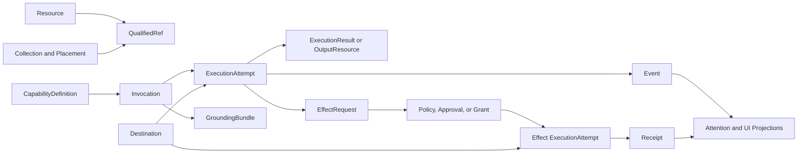

# HoldSpeak System Primitive and Component Inventory

**Status:** Code-derived architecture inventory and concept-consolidation analysis

**Reviewed:** 2026-07-10

**Companion to:** [Privacy, Approval, and Operator-Control Design Review](PRIVACY_APPROVAL_CONTROL_DESIGN_REVIEW.md)

**Scope:** Python runtime, FastAPI control plane, SQLite persistence, plugin and connector ecosystems, web Desk, Apple Desk/runtime, sync/mesh, AIPI bridge, and product vocabulary

> This document is about the nouns and state machines from which HoldSpeak is built. It inventories concrete code components first, then asks which concepts are genuinely distinct, which are projections of the same thing, and which have drifted into overlapping abstractions.

## 1. Executive diagnosis

HoldSpeak's architectural problem is not simply that it has many features. It is that feature development repeatedly introduced a locally sensible noun and lifecycle without first deciding whether that noun was:

- a durable domain entity;
- a view projection of another entity;
- a reusable executable definition;
- a live execution or session;
- an external integration;
- a request for authority;
- an execution placement;
- or local presentation state.

As a result, the same word often names different abstraction levels, while different words often name the same underlying role.

The clearest examples are:

- **`profile`** means an inference target, an intent-routing preset, a plugin-chain preset, a detected delivery/application target, a browser profile, and potentially a safety mode.
- **`agent`** means a saved persona currently stored as a `RecipeRecord`, a live Claude/Codex process represented by `AgentSession`/coder records, a chat role, and sometimes any LLM-backed capability.
- **`connector`** means an activity-enrichment pack, a guarded outbound implementation, a Desk object representing Slack/GitHub/webhook, and colloquially any configured endpoint.
- **`capability`** means a runnable Desk primitive, a host feature required by a plugin, a type of row produced by a connector, and a model modality advertised by a manifest.
- **`action`** means a meeting work item, an actuator verb, a voice-macro command, a Cadence recommendation, a UI affordance, and an external side effect.
- **`run`** means an inline plugin invocation, a deferred job, a recipe/chain/workflow invocation, a mesh task, a UAT execution, or a complete runtime process depending on context.
- **`primitive`** is presented as a canonical concept, but web, sync, Apple Desk, Apple card rendering, and Apple object dispatch each have different primitive-kind sets.

This produces four concrete failure modes:

1. **Policy attaches to the wrong layer.** A setting intended to select inference placement becomes a proxy for consent, credentials, fallback, and egress at once.
2. **UI labels conceal lifecycle differences.** “Approve,” “Run,” “Agent,” and “Local” do not reliably predict what code path or state transition follows.
3. **Similar infrastructure is rebuilt.** Plugins, connector pipelines, recipes, chains, workflows, macros, Cadence, mesh jobs, and steering all invoke work, but do not share one invocation/execution/receipt model.
4. **Cross-platform parity becomes translation rather than reuse.** Web and Apple adapters map between multiple type systems whose comments each call themselves canonical.

The system should not be flattened into one universal object. Several distinctions are real and valuable. Authentication is not approval; review is not authorization; a folder is not a context collection; a saved persona is not a live coding session. The required change is to make the abstraction layers explicit and give each layer one canonical vocabulary.

The recommended minimal kernel is:

1. **Resource** — durable user data or a durable definition.
2. **QualifiedRef** — a globally meaningful `{kind, id}` reference.
3. **Collection and Placement** — semantic grouping versus spatial/organizational filing.
4. **CapabilityDefinition** — something reusable that can be invoked.
5. **Invocation and ExecutionAttempt** — a request to run and each attempt to fulfill it.
6. **EffectRequest** — an immutable proposed consequential operation.
7. **Authority** — policy, one-shot approval, or scoped grant that permits an effect.
8. **Destination** — the named device, node, endpoint, service, application, or pane involved.
9. **Event and Receipt** — observation versus durable evidence of a consequential result.
10. **Projection** — a UI card, nudge, queue row, or derived summary that is not itself the source of truth.

Everything currently called a plugin, recipe, chain, workflow, macro, actuator, connector, run, job, proposal, or nudge can be placed precisely within that kernel.

One immediate naming conclusion follows: **do not add another persisted concept called a run profile.** The proposed `--safe`, `--neutral`, and `--yolo` flags should resolve a `ControlMode` or `AuthorityPreset`. Existing `RuntimeProfile` should converge toward `InferenceTarget`. That keeps execution placement separate from operator authority.

## 2. Inventory method and scale

The inventory was derived from concrete definitions and route/schema declarations rather than documentation alone:

- `class`, dataclass, enum, protocol, and manifest definitions across `holdspeak/`;
- FastAPI route decorators under [holdspeak/web/routes](../../holdspeak/web/routes);
- the SQLite schema and repositories in [db/core.py](../../holdspeak/db/core.py);
- top-level and nested configuration objects in [config.py](../../holdspeak/config.py);
- the Desk framework in [web/src/lib/primitives.ts](../../web/src/lib/primitives.ts);
- Apple Desk, sync, runtime-profile, and workflow contracts;
- plugin, connector, actuator, queue, and mesh lifecycle constants;
- API and UI vocabulary in the current React migration;
- explicit compatibility comments documenting prior renames and aliases.

### 2.1 Scale indicators

These numbers are not presented as quality metrics. They show why implicit vocabulary can no longer carry the architecture.

| Surface | Code-derived size | Architectural significance |
|---|---:|---|
| FastAPI handlers | 249 route decorators | The HTTP API is now a product-wide control plane, not a meeting dashboard. |
| Route modules with handlers | 42 files | Domain ownership is distributed across many route families. |
| Route-family split | 46 primitive, 42 activity, 37 dictation, 34 system, 33 meeting, 57 other | No one route family corresponds to the full product ontology. |
| SQLite table declarations | 52 in the primary schema | Many durable concepts and lifecycle projections now coexist. |
| Database repository handles | 21 on `Database` | The database container exposes many independent aggregate roots. |
| Config classes | 16 `*Config`/`Config` dataclasses | Configuration is a second domain model outside SQLite. |
| Top-level config sections | 12 plus `config_version` | Settings are distributed by feature rather than semantic class. |
| `MeetingConfig` fields | 48 annotated defaults | One config object owns audio, inference, web auth, routing, plugin policy, connectors, and diarization. |
| `LLMRuntimeConfig` fields | 13 | Dictation inference has a separate placement/config vocabulary. |
| `DictationPipelineConfig` fields | 10 | Transformation, target selection, learning, journal, and retention coexist. |
| `WebRuntime` mixins | 9 | One process object remains the integration root for most live behavior. |
| `WebContext` fields | 33 | Route dependency injection is a broad optional callback/service bag. |
| Shipped meeting-intel plugins | 14 | The plugin ecosystem is a substantial executable domain. |
| Sync kinds | 11 | Cross-device identity has its own formal taxonomy. |
| Web Desk primitive kinds | 11 | The UI's “canonical” taxonomy differs from sync. |
| Apple Desk primitive kinds | 15 | Apple presentation promotes several projections to primitives. |
| Apple object/card taxonomies | 5 and 9 kinds | Even one client has multiple parallel type discriminators. |

### 2.2 What these numbers reveal

The primary concern is not 249 routes or 52 tables by themselves. It is that the concepts crossing those surfaces lack shared identity, lifecycle, execution, and authority contracts. The API therefore transports many feature-specific shapes, while clients rebuild their own organizing taxonomies.

## 3. Component topology inventory

### 3.1 Runtime and control-plane components

| Component | Concrete implementation | Owns today | Conceptual concern |
|---|---|---|---|
| Interactive process | [web_runtime.py](../../holdspeak/web_runtime.py) `WebRuntime` | Process startup, config, audio, transcription, meeting, plugins, dictation, wake, device, Cadence, server | An integration root is necessary, but it also resolves policy and domain behavior through feature-specific fields. |
| Runtime mixins | [holdspeak/runtime](../../holdspeak/runtime) | Activity, meeting glue, routing, plugin queue, dictation capture, wake, device, Cadence, transcriber state | Decomposition is physical, while shared concepts such as invocation, authority, and receipt remain duplicated. |
| Meeting session | [meeting_session/session.py](../../holdspeak/meeting_session/session.py) | Live meeting state, transcript loop, mutations, persistence, intelligence | “Session” is both a live aggregate and part of broader coder/device session vocabulary. |
| Web server | [web_server.py](../../holdspeak/web_server.py) | FastAPI application, WebSocket manager, callbacks | General product control plane retains meeting-specific naming. |
| Route service bag | [web/context.py](../../holdspeak/web/context.py) `WebContext` | 33 callbacks/services/objects exposed to route modules | Named “context,” but structurally a service locator/dependency bundle, colliding with user grounding context. |
| Runtime presence | [activity_tracker.py](../../holdspeak/activity_tracker.py) | Current activity/presence state and display policy | Calls transient UI state “activity,” colliding with the durable browser activity ledger. |
| Setup/trust aggregation | [setup_status.py](../../holdspeak/setup_status.py) | Readiness and selected trust summary | Re-derives cross-cutting system state instead of reading a canonical registry. |

### 3.2 Persistence components

The `Database` container exposes repositories for meetings, intel, plugins/artifacts, projects, activity, actuators, dictation corrections, dictation journal, milestones, Cadence, notes, KBs, recipes, profiles, chains, workflows, directories, memberships, model manifests, mesh relay, and steering audit.

This contains at least five different persistence roles:

1. **User content:** meetings, segments, notes, artifacts.
2. **Reusable definitions:** recipes, profiles, chains, workflows, policies.
3. **Relationships:** projects, directories, memberships, artifact sources.
4. **Operational state:** intel jobs, plugin jobs, mesh jobs, connector runs.
5. **Evidence and attention:** audits, journal, activity, corrections, Cadence loops/nudges.

They currently share SQLite but not one conceptual persistence contract. Some resources hard-delete, some use tombstones, some are recomputed projections, and some are append-only evidence.

### 3.3 Executable subsystems

| Subsystem | Definition | Invocation | Execution state | Output/effect |
|---|---|---|---|---|
| Meeting plugin | `HostPlugin` / `PluginManifest` | Intent window dispatch | `PluginRun` plus optional `PluginRunJob` | Structured output, artifact, or actuator proposal |
| Dictation stage | `Transducer` / configured stage id | One utterance through `DictationPipeline` | `PipelineRun`/`StageResult`; separate telemetry/journal | Rewritten text, tags, warnings |
| Activity connector | `ConnectorManifest` + pack module | Preview/enrich/clear or connector pipeline | `ConnectorRun` | Records, annotations, candidates, or planned commands |
| Write connector | `WriteConnectorManifest` + injected callable | Approved actuator execution | Actuator proposal lifecycle | Subprocess or outbound request |
| Recipe/persona | `RecipeRecord` | `/run` or `/chat` | Ad hoc run frame | Run-born artifact or chat output |
| Chain | `ChainRecord.steps` | `/run` | Route-local step list/run frame | Run-born artifact |
| Workflow | `WorkflowRecord.prompt/graph_json` | `/run` | Linearization plus route-local result | Run-born artifact or workflow output |
| Voice macro | `VoiceMacro` | Exact utterance or test route | Log/activity only | Type, open, launch, shell |
| Cadence | `CadencePolicy`, projected `OpenLoop` | Timer or run-now | Tick result plus loop/nudge state | Recommendation, reply, proposal, Telegram send |
| Mesh relay | Runtime profile/node + relay job | Ask/dictation/other placement | queued → running → completed/failed | Remote inference result |
| Coder steering | Live coder session + in-memory grant | Steer/keys/factory route | Delivery result and steering audit | Terminal input/process effect |
| AIPI bridge | Settings + protocol models | Device gesture/audio stream | Reconnect and companion-state machines | Audio/control frames to runtime/device |

These are not all the same product feature, but they are all executions. Each independently answers some subset of:

- What definition is being invoked?
- What input and grounding were supplied?
- Who/what initiated it?
- Where will it execute?
- Can it egress or cause an effect?
- What authority permits that effect?
- Is it queued, running, retried, cancelled, or complete?
- What durable result and receipt exist?

That repeated question set is the evidence for a shared execution kernel.

### 3.4 Extension ecosystems

HoldSpeak has three related but distinct extension/control contracts:

1. **Plugin SDK:** six plugin kinds, host feature requirements (`llm`, `actuator`), inline/deferred execution, intent/profile routing hints.
2. **Connector SDK:** five connector kinds, four output “capabilities,” ten permission strings, preview/enrich/clear protocols, pipeline consumption.
3. **Guarded write connector:** a separate narrow manifest that synthesizes a connector manifest solely to reuse `PermissionGate` before shell/network effects.

The guarded connector's synthetic manifest uses `kind="cli_enrichment"` and `capabilities=("commands",)` even for a network webhook. That is technically expedient but conceptually revealing: the manifest vocabulary is not a natural fit for the write-execution role.

### 3.5 Client and edge components

| Surface | Main concepts | Distinctive state/translation burden |
|---|---|---|
| React web | Desk primitives, page resources, ambient runtime frames, approval cards | Converts snake_case records to UI-specific unions; current migration duplicates old API assumptions. |
| Web Desk | Content/capability/organization/live/local sync classes | Labels `recipe` as Agent; contains aliases for pre-rename `agent`; treats model chats differently from recipes. |
| Apple Desk | `DeskPrimitive`, several card/object enums, `EgressScope`, local records | Promotes meeting derivatives and integrations to primitives; maintains local presentation and synced canonical data simultaneously. |
| Apple runtime | `RuntimeProfile`, inference providers, Workbench engine, sync engine | Has both rich executable workflow and minimal synced workflow definition; translates between them. |
| AIPI bridge | Device leg, HoldSpeak leg, audio queue, companion-state/LCD plans | Has its own product state machine derived from runtime status text and protocol frames. |

## 4. The five competing meanings of “primitive”

“Primitive” currently means at least five things.

### 4.1 Durable sync primitive

[sync.py](../../holdspeak/web/routes/sync.py) and [Sync.swift](../../apple/Sources/Contracts/Sync.swift) define 11 sync kinds:

```text
meeting, artifact, note,
kb, directory, directory_membership,
recipe, chain, workflow,
profile, model
```

This taxonomy answers: **which durable records replicate across devices?**

### 4.2 Web Desk primitive

[primitives.ts](../../web/src/lib/primitives.ts) defines 11 UI kinds:

```text
meeting, artifact, note,
directory, kb,
recipe, chain, workflow,
coder, game, layout
```

This taxonomy answers: **which objects can appear in the web Desk framework?**

Only eight kinds are shared with the sync taxonomy. Web adds live/presentation kinds (`coder`, `game`, `layout`); sync adds infrastructure/relationship kinds (`directory_membership`, `profile`, `model`). Both are reasonable lists, but neither is a universal primitive list.

### 4.3 Apple Desk primitive

[DeskPrimitive.swift](../../apple/App/MeetingCapture/DeskPrimitive.swift) defines 15 kinds:

```text
meeting, summary, actions, transcript, topics,
note, artifact, model, kb, workflow, connector,
recipe, chain, game, coder
```

This taxonomy answers: **what can be rendered/routed as a physical object on the Apple Desk?** It promotes meeting projections (`summary`, `actions`, `transcript`, `topics`) and integrations (`connector`) to primitive status, but does not include canonical `directory`; zones/directories are modeled elsewhere.

### 4.4 Apple dispatch/card primitive

Apple also maintains:

- `DeskObjectKind`: meeting, output, notebook, model, knowledge base;
- `DeskCardKind`: meeting, summary, topics, action, artifact, transcript, notebook, model, KB;
- `DeskHomeKind` and other local navigation/card categorizations.

These answer narrower interaction and presentation questions.

### 4.5 Marketing/design primitive

Product prose calls content, organization, capability, presence, and local presentation objects all “primitives.” This is a useful design metaphor—everything can live on the Desk—but it becomes dangerous when reused as a storage or API assertion.

### 4.6 Correct classification

| Current “primitive” | Architectural class | Why |
|---|---|---|
| Meeting | Resource aggregate | Durable user content with child segments/bookmarks/actions. |
| Artifact | Output resource | Durable generated/user-reviewed content with lineage. |
| Note | Content resource | Durable user-authored content. |
| Directory | Placement container | Gives one organizational home and hierarchy. |
| Directory membership | Placement edge | Relationship, not an independently meaningful object/card. |
| KB | Context collection | Semantic grounding membership; distinct from placement. |
| Recipe | Capability definition | Saved persona/prompt configuration that can be invoked. |
| Chain | Workflow shorthand | Linear composition of capability references. |
| Workflow | Capability definition/graph | General executable definition. |
| Profile | Inference target definition | Execution placement/configuration, not Desk content. |
| Model manifest | Capability advertisement | Says a node can serve a model; not the model binary or a run. |
| Coder | Live session handle | Projection of an external process/session. |
| Summary/topics/transcript/actions | Projection or meeting child/output | They derive from or belong to a meeting; their independent identity varies. |
| Connector | Integration definition/projection | Represents access to an external/local system, not content. |
| Game/layout | Local presentation state | Deliberately not canonical or synced. |

### 4.7 Recommendation

Reserve **resource** for canonical durable identities. Use **Desk item** or **projection** for anything renderable on the Desk. Use **sync record** for the replication envelope. Use **capability definition** for runnable things. This removes the need for every surface to pretend its union is the canonical ontology.

## 5. Concept collision register

### 5.1 Profile

| Current concept | Code | Actual meaning |
|---|---|---|
| Runtime profile | `ProfileRecord`, `/api/profiles`, Apple `RuntimeProfile` | Named inference target containing placement, endpoint/model/node shape. |
| Meeting MIR profile | `MeetingConfig.mir_profile` | Intent-scoring/routing behavior preset. |
| Plugin profile | `MeetingConfig.plugin_profile`, `PluginManifest.profiles` | Selects or hints a base plugin chain. |
| Target profile | [target_profile.py](../../holdspeak/target_profile.py) | Detected focused application/delivery context. |
| Browser source profile | `ActivityRecord.source_profile` | Browser user/profile directory that produced history. |
| Summarizer command profile | `SummarizerCommandProfile` | External coding-agent summarizer command shape. |
| Proposed safe/neutral/yolo profile | Design discussion | Operator authority/friction preset. |

**Diagnosis:** These share only the vague property “named preset.” They operate on execution placement, routing policy, UI delivery, data provenance, subprocess configuration, and authority. Adding another generic `Profile` would worsen the collision.

**Canonical terms:**

- `InferenceTarget` for current RuntimeProfile;
- `RoutingPreset` for MIR/plugin chain selection;
- `DeliveryTargetType` for dictation target detection;
- `BrowserProfileRef` for activity provenance;
- `ControlMode` for safe/neutral/yolo.

### 5.2 Provider, backend, engine, model, target, and node

Current inference configuration blends several axes:

- meeting `intel_provider`: `local | cloud | auto` is partly placement and partly fallback policy;
- dictation `backend`: `auto | mlx | llama_cpp | openai_compatible` is implementation plus placement;
- `RuntimeProfile.kind`: `onDevice | openAICompatible | desktop | meshNode` is destination/transport;
- `ProfileRecord.model` and `model_file` select models in different placements;
- `ModelManifestRecord` advertises availability;
- `active_provider` records actual runtime behavior;
- `node` names a mesh worker while `desktop` means a paired hub whose own provider may itself be remote.

**Canonical split:**

1. `ModelAsset` — actual local binary or external model identifier.
2. `ModelCapability` — advertised task/modality/context support.
3. `InferenceTarget` — named device/node/endpoint with credential reference.
4. `InferenceEngine` — MLX, llama.cpp, OpenAI-compatible client, relay client.
5. `RoutingPolicy` — ordered fallback/selection rules.
6. `InferenceSelection` — chosen target plus model for an invocation.
7. `ResolvedPlacement` — what actually executed, recorded on the receipt.

Egress should be derived from `InferenceTarget` and actual placement, not from a provider string named `cloud`.

### 5.3 Agent, recipe, persona, and coder

`RecipeRecord` says it is a “first-class Agent persona” while explicitly warning that it is distinct from `AgentSession`. The web wire uses `recipe`, the UI label is Agent, older lineage uses `agent`, the API serves `/api/recipes`, and live Claude/Codex sessions are also called agents/coders.

This creates at least three real concepts:

1. **Persona definition:** reusable prompt, role, tools, KB, profile.
2. **Conversation/run:** an invocation or chat thread using that persona.
3. **External agent session:** a live Claude/Codex process with events, question state, and steering target.

**Recommendation:** Canonicalize the first as `PersonaDefinition` (or keep `Recipe` everywhere, but not both). Reserve `AgentSession` for a live autonomous/external process. Use `assistant` only as a message role. Treat “Agent” as a product label only if the UI makes saved persona versus live coder visually explicit.

### 5.4 Plugin, connector, actuator, integration, and tool

These are currently nested and overlapping:

- A plugin is executable meeting-intelligence code.
- An actuator is a plugin kind that returns a proposal.
- A connector pack imports/enriches activity or exposes commands.
- A guarded write connector performs the actuator's effect.
- Slack/GitHub/webhook are called connectors in the Desk even when proposals are created directly by routes rather than a plugin.
- Recipe `tools` are strings but do not share the connector/permission model.

**Canonical split:**

- `ExtensionPackage` — distributable/trusted code package.
- `CapabilityDefinition` — something the host can invoke, regardless of package origin.
- `IntegrationAdapter` — code that communicates with a particular external/local system.
- `EffectAdapter` — narrow integration operation that causes a side effect.
- `ToolBinding` — a capability's allowed use of an integration operation.

“Plugin” and “connector” can remain packaging/UI terms, but execution and authority should be expressed through the canonical types.

### 5.5 Capability

The word currently means four incompatible things:

| Location | Values | Meaning |
|---|---|---|
| Plugin host | `llm`, `actuator` | Host features/authority required to invoke a plugin. |
| Connector manifest | `records`, `annotations`, `candidates`, `commands` | Output surfaces the connector produces. |
| Desk sync class | recipe, chain, workflow | Runnable user-authored definition. |
| Model manifest | e.g. `language` | Model modality/task availability. |

**Recommendation:**

- plugin `required_host_features`;
- connector `produces`;
- Desk `executable` or `capability_definition`;
- model `modalities`/`tasks`;
- authority continues to use `permissions`/`scopes`.

### 5.6 Permission, gate, allow-list, enabled, approval, and grant

Current controls include bearer authentication, PSK authentication, feature booleans, plugin host-feature gates, connector permission manifests, actuator master switches, actuator allow-lists, destination host allow-lists, proposal approvals, steering grants, pairing allow-lists, and direct user gestures.

They answer different questions:

- **Authentication:** who/what is calling?
- **Readiness:** is the implementation/credential available?
- **Policy:** is this operation category allowed?
- **Capability declaration:** what feature does code need or produce?
- **Destination constraint:** where may it act?
- **Approval:** did a person authorize this exact immutable operation?
- **Grant:** may a bounded class of operations happen repeatedly?

Calling all of these gates obscures both security review and UX. The code should expose these dimensions separately in a policy decision.

### 5.7 Action

Current meanings include:

- `ActionItem`: a durable task extracted from a meeting;
- actuator `action`: a verb in an external effect proposal;
- `VoiceMacroAction`: deterministic local command configuration;
- `NextBestAction`: a Cadence recommendation;
- `PrimitiveAction`: a Desk menu affordance;
- action artifact/content;
- Mission Control story/status operations.

**Canonical terms:**

- `WorkItem` for a task someone should complete;
- `EffectOperation` for a system side effect;
- `Recommendation` for a suggested next step;
- `CommandDefinition` for a macro;
- `UICommand` for an affordance.

### 5.8 Proposal, candidate, suggestion, recommendation, and nudge

These concepts all represent “something not yet fully committed,” but at different stages:

| Concept | State/lifecycle | Semantics |
|---|---|---|
| Actuator proposal | proposed → approved/rejected → executed/failed | Immutable effect awaiting authority and execution. |
| Activity meeting candidate | candidate → armed/dismissed/started | Possible future meeting inferred from activity. |
| Project-doc suggestion | apply/dismiss | Proposed local content/config change. |
| Cadence next action | recommendation, may reference proposal | Suggested response to an open loop. |
| Activity nudge | computed/dismissed/selected | Attention projection over activity. |
| Cadence nudge | pending/shown/acted/dismissed/expired | Delivery record for a recommendation. |
| Artifact needs-review | draft/needs_review/accepted/rejected | Content quality/editorial decision. |

These should not be forced into one lifecycle. They should share a common **AttentionProjection** envelope referencing the real subject:

```text
AttentionProjection
  subject_ref
  reason
  requested_decision_kind
  presentation_state
  expires_at
```

The subject remains an `EffectRequest`, `Candidate`, `ContentResource`, or `WorkItem` with its own lifecycle.

### 5.9 Review, accept, approve, arm, and apply

These are different human decisions:

- **review/accept artifact:** editorial/content-quality judgment;
- **review/accept action item:** validate that an extracted work item is real;
- **approve proposal:** grant authority for an effect;
- **arm candidate:** mark a possible meeting ready to start;
- **arm steering:** grant time-scoped terminal authority;
- **apply suggestion:** mutate local content/configuration;
- **select nudge:** choose current attention/context.

The UI may use friendly verbs, but backend fields should encode the decision type. `accepted` must not imply authorization, and `approved` must not imply content correctness.

### 5.10 Run, job, attempt, session, and runtime

The code uses:

- `PluginRun` for a completed/blocked/queued dispatch result;
- `PluginRunJob` for deferred work;
- `IntelJob` and `IntelJobAttempt`;
- `MeshRelayJob` for cross-node work;
- `PipelineRun` for one dictation pass;
- recipe/chain/workflow “run” route-local executions;
- `AgentSession` and coder sessions for long-lived processes;
- `MeetingSession` for a live capture aggregate;
- `VoiceTypingSession` for audio ownership;
- `WebRuntime` for the application process;
- UAT runs/sittings for test execution.

**Canonical terms:**

- `Invocation`: one request to execute a definition.
- `ExecutionAttempt`: one queued/running/terminal attempt, possibly one of several retries.
- `Session`: a long-lived interactive relationship or captured conversation.
- `ProcessRuntime`: the application host lifecycle.
- `TestRun`: explicitly names the testing domain.

### 5.11 Pipeline, chain, workflow, graph, route, and stage

Current executable composition models include:

- dictation pipeline with ordered transducer stage IDs;
- MIR routing pipeline producing plugin chains;
- connector pipeline consuming outputs of upstream packs;
- `ChainRecord` as ordered recipes;
- `WorkflowRecord` as prompt or `graph_json`;
- Apple `Workflow` as a rich linear source/steps/output engine;
- Apple Blueprints graph with control and data edges;
- Python graph runner that supports only provably linear graphs.

These are variants of composition, but their semantics differ by trigger, data contract, and supported control flow.

**Recommendation:** Establish one `ExecutableGraph` wire model with typed nodes and edges. Treat a chain as linear graph shorthand; a dictation pipeline as a system-owned graph; a connector pipeline as a graph with integration nodes; a persona as a leaf capability node. Triggers and execution policies live outside the graph.

Do not claim full graph portability while the hub executes only a linear subset. Persist an explicit `execution_support`/compatibility result rather than falling back under the generic word workflow.

### 5.12 Resource, artifact, output, derivative, note, and result

Generated text can be:

- a plugin `output` dictionary;
- an `ArtifactDraft` then durable artifact;
- a meeting summary/intel snapshot;
- an Apple `OutputRecord`/meeting derivative;
- a recipe/chain/workflow run-born artifact;
- a note created through Keep;
- a chat reply that remains local to the client thread;
- a connector result or actuator result.

**Recommendation:**

- `ExecutionResult` for machine-returned transient data;
- `OutputResource` for persisted user-visible generated content;
- `Document`/`Artifact` as a subtype/label of output resource;
- `Receipt` for effect outcome;
- `Projection` for summary/card views.

### 5.13 Directory, folder, zone, KB, project, and context

These concepts all group things, but for different reasons:

- `Directory`: canonical hierarchical filing; one home per primitive.
- Apple `Zone`: spatial rendering of a directory plus device-local geometry.
- `KB`: named bag of members used for grounding; membership embedded as `member_ids`.
- `Project`: work scope associated with meetings/activity and detected from repositories.
- project `.hs`/`.holdspeak` context: filesystem-scoped dictation knowledge/configuration.
- manual/zone/activity/agent context: material assembled for inference.

The difference worth preserving is:

- **Placement:** “Where do I find this?” — directory/zone, hierarchical, usually one home.
- **Collection:** “Which set is this a member of?” — potentially many-to-many.
- **Work scope:** “Which ongoing endeavor owns/relates to this?” — project.
- **Grounding bundle:** “What material may this invocation read?” — resolved at run time.

Rename KB conceptually to `ContextCollection` if it exists primarily for grounding. Keep zone as a view of placement, not a separate domain entity.

### 5.14 Context, grounding, evidence, and source

“Context” currently names:

- `WebContext`, the route service locator;
- project context and KB content;
- agent context captured from coding sessions;
- activity context;
- manual context and zone context;
- LLM context window limits;
- arbitrary plugin context dictionaries.

**Recommendation:** Rename infrastructure `WebContext` to `RouteServices`. Define a typed `GroundingBundle` made of `GroundingRef` entries plus resolved material. Use `EvidenceRef` only for claims/attention items that must cite why they exist. Use `LineageRef` for provenance of generated output.

### 5.15 Source, origin, owner, target, and kind

These generic discriminator fields carry multiple axes:

- artifact `origin`: meeting or run;
- proposal `origin`: meeting or desk;
- Cadence `source_type`: meeting action/decision, agent question, activity, proposal, manual/system;
- artifact/run `source_type`: recipe/input/chain/workflow, with aliases;
- activity `source_browser/source_profile`;
- proposal `target`: Slack/GitHub/webhook;
- macro `kind`: command type;
- profile `kind`: placement type;
- plugin/connector `kind`: implementation category.

There is also documented drift inside the canonical source vocabulary: comments describe `agent` while the actual set uses `recipe`, and aliases translate prior names.

**Recommendation:** Use qualified names by axis:

- `resource_kind`;
- `definition_kind`;
- `initiator_kind` and `initiator_ref`;
- `lineage_refs`;
- `destination_ref`;
- `effect_kind`;
- `placement_kind`.

Generic `kind`, `source`, and `target` should not cross API aggregate boundaries without a namespace.

### 5.16 Local, paired, desktop, mesh, endpoint, cloud, and mixed

These terms currently mix topology, ownership, and data movement:

- local can mean same process, same device, local model, loopback, or user's LAN;
- desktop can mean paired hub placement whose own provider may be local or remote;
- mesh is a transport/topology and named node placement;
- cloud is used for any OpenAI-compatible endpoint, including LAN;
- Apple `EgressScope.cloud("your desktop")` labels paired-device work as cloud;
- `mixed` means local plus named target, but Python also has a separate `mesh` scope.

**Canonical destination attributes:**

```text
Destination
  boundary: same_process | same_device | paired_device | private_network | public_service
  owner: user | organization | third_party | unknown
  transport: in_process | loopback | lan | tunnel | internet | subprocess
  identity: stable named target
```

The UI can derive “On this device,” “On Mac Studio,” or “External · api.openai.com” without overloading cloud.

### 5.17 Enabled, active, ready, selected, paired, armed, and live

These flags often appear together but describe different facts:

- `enabled`: persisted feature/policy preference;
- `ready`: dependencies and credentials are currently available;
- `selected`: UI or routing preference;
- `paired`: an identity/credential relationship exists;
- `armed`: reusable authority or a prepared candidate, depending subsystem;
- `active/live`: a process/session is currently operating;
- `configured`: enough shape exists to attempt use.

Every status surface should expose these dimensions separately. A connector can be enabled but unready, a node can be configured but offline, a steering target can be live but unarmed, and a destination can be paired but not selected.

### 5.18 History, journal, audit, ledger, telemetry, receipt, and evidence

HoldSpeak has all of the following:

- meeting history/archive;
- activity ledger;
- dictation journal;
- dictation telemetry store;
- connector run history;
- plugin runs and jobs;
- intel attempts;
- actuator audit;
- steering audit;
- Cadence history and audit;
- Rails journal;
- Mission Control receipts/evidence;
- sync inbox audit copies;
- runtime logs and broadcast frames.

These fall into four semantic classes:

1. **Resource history:** user content over time.
2. **Operational event:** diagnostic fact about execution.
3. **Security/audit event:** append-only evidence of authority or effect.
4. **Receipt:** user-facing durable explanation of a consequential operation.

Telemetry is particularly confusing in a product that says “no telemetry”: `DictationTelemetryStore` is local runtime measurement, but the unqualified name sounds like remote analytics. Rename it `LocalRunMetrics`.

### 5.19 Sync, relay, bridge, and remote

- Sync replicates durable resource state bidirectionally with LWW/tombstones.
- Mesh relay transports an invocation to a node and returns a result.
- Coder steering relay transports commands to the node owning a session.
- AIPI bridge translates between device protocols and runtime protocol.
- Remote dictation transports text/audio or directs delivery.

These are distinct transport roles. The shared abstraction is a named `TransportLink` with authentication, confidentiality posture, peer identity, availability, and supported message types—not a universal sync mechanism.

### 5.20 Runtime

The word identifies the whole process (`WebRuntime`), an LLM implementation (`LLMRuntime`), an inference target definition (`RuntimeProfile`), process status APIs, setup tests, and local counters. Use:

- `ApplicationHost` or keep `WebRuntime` for the process;
- `InferenceEngine` for LLM implementation;
- `InferenceTarget` for profile;
- `HostStatus` for process readiness;
- `LocalRunMetrics` for counters.

## 6. Lifecycle and state-machine inventory

### 6.1 Current lifecycle matrix

| Concept | Current states | Axes combined or ambiguity |
|---|---|---|
| Action item completion | `pending`, `done`, `dismissed` | Work lifecycle. `pending` means unfinished. |
| Action item review | `pending`, `accepted` | Editorial validation. Same `pending`, different axis. No explicit rejected state. |
| Artifact | `draft`, `needs_review`, `accepted`, `rejected` | Authoring and review decision combined. |
| Actuator proposal | `proposed`, `approved`, `executed`, `rejected`, `failed` | Authorization and execution are combined in one status. |
| Activity meeting candidate | `candidate`, `armed`, `dismissed`, `started` | Inference confidence, preparation, user decision, and live transition combined. |
| Plugin run | `success`, `proposed`, `error`, `timeout`, `deduped`, `blocked`, `queued`, `skipped` | Execution state, disposition, and output type combined. |
| Deferred plugin job | `queued`, `running`, `failed` plus retry/cancel behavior | Successful completion may be represented outside the durable queue row. |
| Intel job | `queued`, `running`, `failed`; attempts have success/retry/failure outcomes | Job and meeting `intel_status` duplicate parts of the lifecycle. |
| Mesh relay job | `queued`, `running`, `completed`, `failed` | Closest to a conventional execution lifecycle. |
| Cadence loop | `open`, `snoozed`, `closed`, `killed`, `delegated` | Attention lifecycle, user disposition, and responsibility transfer combined. |
| Cadence nudge | `pending`, `shown`, `acted`, `dismissed`, `expired` | Presentation/attention lifecycle. |
| Runtime activity | idle/listening/recording/transcribing/processing/typing/complete/meeting_live/saving/error/armed | UI/presence state spanning several subsystems. |
| Wake capture | armed window then capture/preview/type | “Armed” means listening eligibility. |
| Steering | grant present/expired/disarmed/revoked by identity change | “Armed” means authority to write to a pane. |
| Coder session | running/waiting/idle/ended plus selected/pinned/stale | Process, attention, and UI state. |
| AIPI companion | disconnected/idle/meeting/agent-waiting/reply/transcribing/error/stale | Derived display priority, not canonical host state. |

### 6.2 `pending` is not a state

Across HoldSpeak, `pending` can mean:

- unfinished work item;
- unreviewed extracted action;
- queued job filter in a UI;
- unseen/pending nudge;
- historical/current React expectation for a proposal actually named `proposed`;
- local sync change awaiting confirmation.

The word only says “something has not happened.” It does not say which axis or what next transition is legal.

### 6.3 Combined status fields create impossible questions

An actuator proposal's single status cannot directly answer all of:

- Was it approved?
- Is approval still valid?
- Has execution started?
- Did the latest attempt fail?
- Can it be retried?
- Was it cancelled by policy?

Likewise, plugin run `proposed` is not an execution state; it means successful execution produced a proposal. `deduped`, `blocked`, and `skipped` are dispositions, while `queued` is a scheduling state.

### 6.4 Canonical orthogonal state dimensions

Use separate fields/enums where applicable:

```text
ResourceLifecycle
  active | archived | deleted

ReviewDecision
  unreviewed | accepted | rejected

AuthorizationState
  not_required | required | granted | denied | expired | revoked

ExecutionState
  created | queued | running | succeeded | failed | cancelled | expired

ExecutionDisposition
  executed | deduplicated | skipped | blocked | produced_effect_request

AttentionState
  unseen | shown | acted | dismissed | expired

AvailabilityState
  unknown | ready | unavailable | degraded
```

Not every entity needs every dimension. The point is to stop placing different dimensions into one `status` string.

## 7. Identity and reference inventory

### 7.1 Current identity patterns

HoldSpeak uses:

- UUID/hex IDs for meetings, artifacts, proposals, and many records;
- semantic IDs for plugins/connectors;
- generated prefixed IDs such as `recipe_*` and `artifact_*`;
- presentation IDs such as `m:`, `out:`, `model:`, `kb:`;
- coder compound keys such as agent/session;
- profile IDs such as `profile.local`;
- directory membership identity equal to `primitive_id`;
- lineage pairs of `source_type` and `source_ref`;
- origin plus nullable owner ID for artifacts/proposals;
- mesh job/node identity;
- idempotency keys independent of entity IDs.

### 7.2 Consequence

Clients frequently infer type from an ID prefix or require a parallel `kind` field. Aliases preserve old `agent` versus new `recipe` lineage. A raw string ID is not globally meaningful without knowing the route/table/collection that supplied it.

### 7.3 Canonical reference

```text
QualifiedRef
  namespace: resource | capability | invocation | execution | effect | destination | session
  kind: stable namespaced discriminator
  id: opaque identifier
```

Wire shorthand can remain `{kind, id}` inside a known namespace. Presentation IDs should be generated client-side from refs and never become canonical identity.

### 7.4 Ownership and lineage

Separate:

- `owner_ref`: aggregate/resource that owns lifecycle;
- `lineage_refs`: inputs/definitions that contributed to an output;
- `initiator_ref`: human, schedule, model, client, or capability that requested work;
- `destination_ref`: where execution/effect lands;
- `correlation_id`: connects events/attempts across systems;
- `idempotency_key`: prevents duplicate semantic execution.

This removes overloaded `meeting_id`, `origin`, `source_type`, and sentinel-owner patterns from generic infrastructure.

## 8. Configuration and authority-source inventory

### 8.1 Current sources of effective behavior

| Source | Examples | Scope/lifetime |
|---|---|---|
| JSON `Config` | meeting provider, web token, actuators, macros, wake, Cadence, Telegram | Persistent host-wide; plaintext file |
| SQLite definitions/settings | runtime profiles, connector settings, activity privacy, Cadence policies | Persistent host data; some sync |
| Environment variables | web host/port, endpoint keys, user-pack dirs, desktop presence, node config | Process/host deployment |
| CLI flags/subcommands | no-open, dry run, mesh serve, restore yes | Invocation/process scope |
| Apple Keychain | inference profile keys | Device-local secret |
| Apple AppStorage/UserDefaults | pairing, layouts, legacy settings, local caches | Device-local persistent UI/app state |
| Project files | `.hs`, `.holdspeak`, KB/project overrides, dictation blocks | Directory/project scope |
| In-memory grants/state | steering grants, preview tokens, selected target, active meeting | Process/session scope |
| Remote/pair state | Telegram chat IDs, device PSK, web bearer token, mesh node token | Persistent trust relationships |

### 8.2 The central problem

There is no universal resolver that explains effective behavior and precedence. Feature code reads the source convenient to that subsystem. Therefore “configuration” sometimes means preference, policy, credential, capability availability, pairing, consent, or runtime state.

### 8.3 Canonical separation

1. **Settings:** UX/preferences with no authority implication.
2. **Definitions:** profiles/personas/workflows/connectors as durable resources.
3. **Secrets:** credential references stored through dedicated secret providers.
4. **Policy:** host/project ceilings on permitted operation classes.
5. **Control mode:** process/session defaults for how authority is requested.
6. **Grants/approvals:** explicit human authority records.
7. **Runtime state:** current availability, selection, and activity.
8. **Deployment config:** bind address, ports, data paths, pack directories.

`MeetingConfig` should be decomposed accordingly. Web auth belongs to deployment/security; Slack destinations belong to integration definitions; routing presets belong to meeting intelligence; actuator policy belongs to policy; diarization belongs to capture/intelligence settings.

## 9. Canonical system primitive model



### 9.1 Resource

A durable user-relevant identity or durable definition.

```text
Resource
  ref
  owner_ref?
  lifecycle
  created_at
  modified_at
  deletion/tombstone semantics
  version
```

Resource kinds include meeting, note, output document/artifact, project, collection, placement container, persona definition, workflow definition, integration definition, and inference target.

Operational jobs, WebSocket frames, and UI cards are not resources merely because they have IDs.

### 9.2 Collection and Placement

Two explicit relationship models:

```text
CollectionMembership(collection_ref, member_ref)
Placement(parent_ref, child_ref, order?)
```

Collections are many-to-many semantic sets used for grounding/tagging. Placement is hierarchical/single-home organization rendered as folder or zone. Projects can relate to resources through a separate work-scope relationship.

### 9.3 CapabilityDefinition

```text
CapabilityDefinition
  ref
  implementation_kind
  input_schema
  output_schema
  effect_classes
  required_host_features
  default_placement_policy
  package/provenance
```

Mappings:

- meeting plugin → capability definition with intent trigger;
- persona/recipe → prompt capability definition;
- macro → deterministic command capability definition;
- connector operation → integration capability definition;
- chain/workflow → composite capability definition;
- actuator plugin → capability whose result may include an effect request.

### 9.4 Invocation

```text
Invocation
  id
  capability_ref
  initiator_ref/kind
  input
  grounding_bundle_ref
  requested_placement
  control_mode_snapshot
  requested_at
  idempotency_key
```

One invocation can have multiple execution attempts because of retries, fallback, or relay.

### 9.5 ExecutionAttempt

```text
ExecutionAttempt
  id
  invocation_id
  attempt_number
  destination_ref
  engine
  state
  disposition
  started_at / ended_at
  error
  actual_data_scope
  result_ref/value
```

Plugin jobs, intel attempts, mesh jobs, recipe runs, and workflow steps should converge on this state vocabulary even if their domain tables remain optimized separately.

### 9.6 EffectRequest

```text
EffectRequest
  id
  invocation_id?
  initiator_ref
  effect_kind
  destination_ref
  canonical_payload
  material_hash
  canonical_preview
  preview_renderer_version
  reversibility/compensation
  authorization_state
  expires_at
```

This generalizes actuator proposals without requiring every effect to originate from a plugin or meeting. Macro tests, factory commands, terminal steering, Telegram sends, and sync can be classified against it even when the active mode allows direct execution.

### 9.7 Authority

```text
AuthorityDecision
  policy_snapshot
  invariant_results
  basis: direct_gesture | approval | grant | persistent_configuration
  approval_ref?
  grant_ref?
  allowed/denied
  reason_codes

Grant
  subject/actor
  operation/effect scopes
  destination scopes
  data scopes
  project/resource scopes
  ttl/count limits
  issued_at / expires_at / revoked_at
```

Authentication establishes caller identity. It is a prerequisite input, not an authority decision by itself.

### 9.8 Destination

```text
Destination
  id and display_name
  boundary
  owner/trust class
  transport
  endpoint/node/device/application/pane identity
  credential_ref
  availability
  supported operations/data classes
```

Slack channel/webhook, GitHub repo, paired Mac, mesh node, local app, tmux pane, and model endpoint are all destinations with different attributes. This is more useful than forcing them into local/cloud.

### 9.9 Event and Receipt

```text
Event
  type
  subject_ref
  correlation_id
  actor/initiator
  timestamp
  structured detail

Receipt
  effect/execution ref
  authority basis
  actual destination and data scope
  material hash
  outcome
  compensation/revoke link
```

Events support diagnostics and projections. Receipts are stable user/security evidence and should not contain unnecessary sensitive payloads.

### 9.10 Projection

A projection is read-model/UI state derived from resources/events:

- Desk card;
- queue row;
- nudge;
- approval card;
- “waiting coder” item;
- meeting summary tile;
- presence frame;
- AIPI LCD plan.

Projections may have presentation lifecycle such as shown/dismissed, but should not silently become the authoritative business object.

## 10. What should and should not be unified

### 10.1 Unify infrastructure

Unify:

- qualified references and lineage;
- invocation and execution-attempt envelopes;
- execution state vocabulary;
- actual destination/placement receipts;
- effect request and authority evaluation;
- scoped grants;
- event/receipt envelopes;
- capability registry and definition metadata;
- typed grounding references;
- client-facing operation contracts.

### 10.2 Keep domain distinctions

Do not collapse:

- authentication into authorization;
- content review into effect approval;
- persisted setting into active grant;
- directory placement into context collection;
- project ownership into folder membership;
- output document into effect receipt;
- persona definition into live agent session;
- model asset into inference target;
- inference engine into routing policy;
- sync replication into invocation relay;
- operational event into security receipt;
- UI projection into canonical resource.

### 10.3 Unify through adapters, not mass table replacement

The first implementation should introduce shared contracts and adapters over existing repositories. Rewriting 52 tables into a universal entity/event store would create risk without solving vocabulary first.

## 11. Concrete consolidation map

| Current concept/code | Canonical role | Near-term treatment |
|---|---|---|
| `ProfileRecord` / RuntimeProfile | InferenceTarget | Add canonical API/model name; retain `profile` wire alias during migration. |
| `mir_profile`, `plugin_profile` | RoutingPreset | Decide whether these are one preset or two named axes; stop generic profile wording. |
| `TargetProfile` | DeliveryTargetType | Rename at API boundary first. |
| `RecipeRecord` | PersonaDefinition / leaf CapabilityDefinition | Pick Recipe or Persona as canonical; reserve Agent for live session. |
| `ChainRecord` | Linear workflow shorthand | Compile to executable graph; keep authoring sugar. |
| `WorkflowRecord` | Composite CapabilityDefinition | Version graph schema and publish execution compatibility. |
| HostPlugin | Capability implementation | Register through shared capability descriptor. |
| ConnectorManifest | Integration package/adapter descriptor | Rename `capabilities` to `produces`; keep permission manifest. |
| WriteConnectorManifest | EffectAdapter policy | Stop synthesizing an enrichment-kind manifest; give write operations a native descriptor. |
| ActuatorProposal | EffectRequest | Separate authorization from execution fields; retain proposal UI term. |
| VoiceMacro | Deterministic CapabilityDefinition | Route consequential fires through effect/receipt path. |
| `PluginRun`, jobs, mesh jobs | Invocation/ExecutionAttempt adapters | Normalize state/disposition and correlation IDs. |
| Cadence OpenLoop | Attention/work projection | Keep source projection; recommendations reference canonical subjects/effects. |
| Activity/Cadence Nudge | AttentionProjection | Share envelope/presentation state, keep feature-specific content. |
| Directory/zone | Placement | Server owns identity/membership; client owns geometry. |
| KB | ContextCollection | Make semantic membership explicit and many-to-many if required. |
| Artifact/OutputRecord | OutputResource | Normalize lineage and review state. |
| WebContext | RouteServices | Rename infrastructure to avoid grounding collision; replace optional Any callbacks incrementally with typed services. |
| DictationTelemetryStore | LocalRunMetrics | Remove analytics ambiguity. |
| `endpoint_egress` / EgressScope | DestinationBoundaryView | Derive UI view from actual Destination/receipt. |

## 12. Implication for safe, neutral, and yolo

The code inventory changes the profile proposal in one important way: **the product should not implement another “profile” object.**

Use:

```text
ControlMode = safe | neutral | yolo
```

The mode resolves defaults for authority UX and automation. It does not select models, endpoints, plugin chains, browser profiles, or delivery targets.

Every invocation/effect captures:

```text
ControlSnapshot
  mode
  resolved policy dimensions
  source/precedence
  invariant version
```

This lets the concepts remain orthogonal:

```text
ControlMode: how much confirmation/automation is allowed?
InferenceTarget: where should intelligence run?
RoutingPreset: which processors should run?
DeliveryTargetType: what application/text style is targeted?
Destination: where will this specific effect or execution land?
Grant: what reusable authority has this user issued?
```

The mode should control whether an `EffectRequest` requires a one-shot approval or can use a valid scoped grant. It should not bypass destination identity, authentication, payload integrity, audit, or availability checks.

## 13. Prioritized consolidation plan

### Step 0 — Vocabulary freeze and ADR

Before adding more primitives, approve a vocabulary ADR covering:

- Resource versus Projection;
- PersonaDefinition versus AgentSession;
- InferenceTarget versus ControlMode versus RoutingPreset;
- CapabilityDefinition versus IntegrationAdapter;
- WorkItem versus EffectRequest versus Recommendation;
- ReviewDecision versus Authorization;
- Invocation/ExecutionAttempt/Session;
- Placement versus Collection versus Project;
- Destination and boundary taxonomy.

New APIs may not introduce generic `profile`, `action`, `source`, `target`, `status`, or `context` without a qualified meaning.

### Step 1 — Publish a machine-readable concept registry

Create registries for:

- resource kinds;
- capability kinds;
- destination kinds;
- effect classes;
- review/authorization/execution state enums;
- data classes;
- operation reason codes.

Generate TypeScript/Swift contracts or fixtures from these registries where feasible.

### Step 2 — Add shared reference and execution envelopes

Introduce `QualifiedRef`, `Invocation`, and `ExecutionAttempt` as additive contracts. Adapt plugin runs, mesh runs, and recipe/workflow runs first. Give every route a correlation ID and actual placement result.

### Step 3 — Separate proposal authorization from execution

Migrate actuator proposals to `EffectRequest` semantics:

- immutable payload/destination hash;
- authorization state;
- execution attempt state;
- approval/grant reference;
- canonical preview version;
- receipt.

Use the same evaluator for macros, factory operations, steering, and external delivery even if modes allow direct execution.

### Step 4 — Compile executable definitions to one graph

Represent recipes as leaf nodes and chains as linear graph sugar. Version workflow graphs and declare each host's supported node kinds. Adapt dictation and connector pipelines later; do not block their current specialized engines.

### Step 5 — Normalize client projections

Clients receive canonical resources plus a separate Desk-projection descriptor. They may render summary/action/transcript cards without claiming those are universal resource kinds. Remove type inference from presentation ID prefixes.

### Step 6 — Consolidate settings, policy, secrets, and grants

Split `MeetingConfig` responsibilities. Add one effective-control endpoint showing source and precedence. Move secrets out of general settings. Make active grants and persistent authority visible and revocable.

### Step 7 — Consolidate histories into events and receipts

Do not delete domain journals. Add a unified event/receipt index referencing their source rows so the user can answer “what ran, why, where, under whose authority?” without visiting seven feature pages.

## 14. Architectural tests to add

1. Every canonical resource kind has one owner, one qualified-reference shape, and documented delete semantics.
2. Every client primitive/projection kind maps to a canonical resource, capability, session, relationship, or local-presentation class.
3. Web, Swift, and Python generated/fixture taxonomies remain compatible.
4. No new unqualified `profile` concept is added.
5. Execution status contains lifecycle only; disposition/output type is separate.
6. Review acceptance never grants effect authority.
7. Every consequential execution has an effect request or an explicit direct-authority decision plus receipt.
8. Every endpoint/mesh/paired run records actual destination rather than inferred provider label.
9. Every capability invocation has a definition ref, initiator, grounding refs, placement, and correlation ID.
10. Aliases such as `agent -> recipe` are observable migration behavior with a removal/version plan.
11. Directory placement and KB/context collection memberships cannot be accidentally conflated.
12. UI cards cannot infer canonical resource kind solely from ID prefixes.

## 15. Code evidence map

### Runtime and control plane

- [web_runtime.py](../../holdspeak/web_runtime.py)
- [web/context.py](../../holdspeak/web/context.py)
- [web/routes](../../holdspeak/web/routes)
- [activity_tracker.py](../../holdspeak/activity_tracker.py)
- [setup_status.py](../../holdspeak/setup_status.py)

### Configuration and persistence

- [config.py](../../holdspeak/config.py)
- [db/core.py](../../holdspeak/db/core.py)
- [db/models.py](../../holdspeak/db/models.py)
- [db/primitives.py](../../holdspeak/db/primitives.py)
- [db/actuators.py](../../holdspeak/db/actuators.py)
- [db/cadence.py](../../holdspeak/db/cadence.py)

### Execution and extension contracts

- [plugins/host.py](../../holdspeak/plugins/host.py)
- [plugins/contracts.py](../../holdspeak/plugins/contracts.py)
- [plugin_sdk.py](../../holdspeak/plugin_sdk.py)
- [connector_sdk.py](../../holdspeak/connector_sdk.py)
- [plugins/gated_connector.py](../../holdspeak/plugins/gated_connector.py)
- [plugins/actuators.py](../../holdspeak/plugins/actuators.py)
- [plugins/actuator_executor.py](../../holdspeak/plugins/actuator_executor.py)
- [plugins/dictation](../../holdspeak/plugins/dictation)
- [web/routes/workflow_graph.py](../../holdspeak/web/routes/workflow_graph.py)

### Inference and placement

- [intel/providers.py](../../holdspeak/intel/providers.py)
- [intel/engine.py](../../holdspeak/intel/engine.py)
- [intel/mesh_relay.py](../../holdspeak/intel/mesh_relay.py)
- [target_profile.py](../../holdspeak/target_profile.py)
- [web/routes/primitives/profiles.py](../../holdspeak/web/routes/primitives/profiles.py)
- [web/routes/primitives/ask.py](../../holdspeak/web/routes/primitives/ask.py)

### Web and sync primitives

- [web/src/lib/primitives.ts](../../web/src/lib/primitives.ts)
- [web/src/desk](../../web/src/desk)
- [web/routes/primitives](../../holdspeak/web/routes/primitives)
- [web/routes/sync.py](../../holdspeak/web/routes/sync.py)

### Apple contracts and projections

- [DeskPrimitive.swift](../../apple/App/MeetingCapture/DeskPrimitive.swift)
- [DeskHome.swift](../../apple/App/MeetingCapture/DeskHome.swift)
- [DeskPhysicsCanvas.swift](../../apple/App/MeetingCapture/DeskPhysicsCanvas.swift)
- [Sync.swift](../../apple/Sources/Contracts/Sync.swift)
- [Primitives.swift](../../apple/Sources/Contracts/Primitives.swift)
- [Workflow.swift](../../apple/Sources/RuntimeCore/Workbench/Workflow.swift)
- [DeskSync.swift](../../apple/App/MeetingCapture/DeskSync.swift)

### Edge/device contracts

- [device_audio.py](../../holdspeak/device_audio.py)
- [aipi-lite/holdspeak_proto.py](../../aipi-lite/holdspeak_proto.py)
- [aipi-lite/bridge](../../aipi-lite/bridge)

## 16. Concrete component catalog

This section is intentionally mechanical. It provides the code ownership index underneath the concept analysis.

### 16.1 Route-family catalog

| Family | Handler count | Modules and responsibilities |
|---|---:|---|
| Primitives | 46 | notes, KBs, recipes/personas, profiles/inference targets, chains, workflows, directories/membership, ask/models/keep |
| Activity | 42 | ledger/privacy, rules, inferred meeting candidates, nudges, enrichment connectors, extension ingest, CLI enrichment, connector pipelines, plugin jobs |
| Dictation | 37 | readiness/dry-run/remote delivery, corrections, journal, intent controls, block templates, project KB, project docs, agent context |
| System | 34 | coder discovery/selection, steering/grants/relay/factory/audit, settings, health/runtime status, transcription/preview/wake/macro test, WebSocket |
| Meetings | 33 | live lifecycle, CRUD/export, action items/review, aftercare/proposals/Slack/GitHub, intel jobs, artifacts/runs/timeline, speakers |
| Projects | 13 | project CRUD, meeting relationships, summary/action/artifact projections, briefings |
| Cadence | 13 | status, loops, brief/closeout, history/audit, snooze/kill/close/reply, run-now |
| Mission Control | 10 | state, sessions/events/receipts/evidence, rails bridge/journal/size, story proposals/decisions |
| Desk actuators | 7 | connector status and Slack/webhook/GitHub propose/decision routes |
| Mesh | 5 | public mesh info, inbox, claim, complete, fail |
| Setup | 4 | status, runtime test/options, model discovery |
| Sync | 2 | pull and push change sets |
| Core | 2 | health and current application state |
| Meeting import | 1 | imported transcript/audio meeting creation |

The route organization is reasonably modular by feature. The missing layer is shared domain contracts across families: primitives call inference and persist artifacts; Cadence references proposals/actions/agents; Mission Control and desk both use actuator proposals; system steering and dictation both deliver to coder sessions.

### 16.2 Configuration-object catalog

| Config object | Current responsibility | Proposed conceptual home |
|---|---|---|
| `HotkeyConfig` | Dictation activation key/display | User setting |
| `ModelConfig` | Whisper model/backend/language/timeout | Transcription engine selection |
| `UIConfig` | Meter, history length, theme | User setting |
| `MeetingConfig` | Audio, export, inference, retries/webhooks, web auth, MIR, plugins, actuator policy, Slack/webhook/GitHub, diarization | Split among capture settings, inference policy, deployment security, routing preset, authority policy, and integration definitions |
| `LLMRuntimeConfig` | Dictation engine/backend/model/endpoint/profile/performance | Inference engine defaults plus `InferenceTarget` reference |
| `DictationPipelineConfig` | Stage composition, target detection, corrections, journal, retention | System-owned executable graph plus learning/retention settings |
| `MacrosConfig` | Macro enablement and command definitions | Capability definitions plus authority defaults |
| `DictationConfig` | Pipeline/runtime/macros/symbols/preview | Dictation feature aggregate; references other definitions/settings |
| `DeviceConfig` | Device PSK | Secret/pairing relationship, not general settings |
| `PresenceConfig` | Desktop presence enablement | User setting/runtime feature toggle |
| `MeshConfig` | Advertised device name | Deployment/node identity setting |
| `WakeWordConfig` | Wake enablement/model/threshold/window/action | Capture trigger definition plus control-mode preference |
| `CadenceConfig` | Scheduler enablement/pressure/LLM/timing/quiet hours | Scheduling policy/settings |
| `TelegramConfig` | Enablement, token, chat allow-list, pairing code | Integration definition plus secrets/pairing |
| `RailsObserverConfig` | Enablement, inference profile, poll/tail | Trigger definition plus `InferenceTarget` reference |
| `Config` | Versioned aggregate serialized to JSON | Deployment/user-settings document; should not remain the store for every authority and secret |

`VoiceMacroAction` and `VoiceMacro` are definition types embedded in config rather than separate config classes. Their embedded placement is part of the conceptual issue: a reusable executable definition currently lives inside a settings document.

### 16.3 Repository aggregate catalog

| Repository | Primary durable concepts | Conceptual class |
|---|---|---|
| `MeetingRepository` | meetings, tags, segments, bookmarks, action items, topics, speakers/intel snapshots | Resource aggregate and child records |
| `IntelRepository` | deferred intel jobs and attempts; meeting intel status | Invocation/execution operational state |
| `PluginArtifactRepository` | intent windows/scores, plugin runs/jobs, artifacts/sources | Routing observations, execution state, output resources |
| `ProjectRepository` | projects, meeting relations, detection log, project projections | Work-scope resource and relationships |
| `ActivityRepository` | activity records/checkpoints/privacy/rules/annotations/candidates/connectors/runs/nudge dismissals | Observations, settings, projections, integrations, execution history |
| `ActuatorRepository` | effect proposals and transition audit | Effect request, authorization/execution state, audit |
| `DictationCorrectionRepository` | learned correction records | User feedback/learning resource |
| `DictationJournalRepository` | dictation journal | Resource history/local receipt-like record |
| `MilestoneRepository` | milestone records | Work resource/projection |
| `CadenceRepository` | loops, evidence, next actions, nudges, policies | Attention projections, recommendations, scheduling policy |
| `NoteRepository` | notes/tombstones | Content resource |
| `KBRepository` | named KB plus embedded member IDs | Context collection resource |
| `RecipeRepository` | saved persona/recipe definitions | Capability definition |
| `ProfileRepository` | runtime/inference target shape | Inference target definition |
| `ChainRepository` | ordered recipe references | Linear composite capability definition |
| `WorkflowRepository` | prompt or graph definition | Composite capability definition |
| `DirectoryRepository` | hierarchical directory identity | Placement container |
| `DirectoryMembershipRepository` | one primitive-to-directory edge and tombstone | Placement relationship |
| `ModelManifestRepository` | node/model capability advertisements | Availability/capability observation |
| `MeshRelayRepository` | relay jobs and worker liveness | Invocation execution/transport state |
| `SteeringAuditRepository` | steering attempts/outcomes | Security/operation audit |

The most overloaded repositories are Activity and PluginArtifact: each owns several different conceptual classes. They are good candidates for introducing shared read models/events before any physical database split.

### 16.4 Principal in-memory/service components

| Component | Role | Conceptual migration seam |
|---|---|---|
| `WebRuntime` | Application integration root | Resolve typed services and control snapshot at process startup |
| `MeetingSession` | Live meeting aggregate/session | Emit typed invocations/events rather than directly coordinating every downstream projection |
| `PluginHost` | Registry, capability gate, inline/deferred dispatch, idempotency | First adapter to `CapabilityDefinition` + `Invocation` |
| `ActuatorExecutor` | Gated effect execution | First adapter to `EffectRequest` + authority + receipt |
| `PermissionGate` | Cooperative connector permission check | Retain as integration-policy enforcement under central authority decision |
| `DictationPipeline` | Ordered utterance transformations | Adapt runs/stages to invocation/attempt envelope |
| `MeetingIntel` | Provider routing and intelligence calls | Return `ResolvedPlacement` and actual data-scope metadata |
| `MeshRelayIntel` / `MeshRelayRuntime` | Remote inference placement | Implement destination transport for execution attempts |
| `RuntimeActivityTracker` | Presence projection | Consume events; stop being mistaken for durable activity domain |
| `DeviceRegistry` | Connected audio device identities/recorders | Destination/session registry |
| Steering grant store/controller | Scoped pane authority | Reference implementation for generalized grants |
| `CadenceService` | Schedule, project, score, nudge | Trigger/attention projection over canonical refs |
| `WebSocketManager` | Runtime broadcast bus | Transport typed event envelopes and enforce connection authentication |
| `WebContext` | Route callbacks/service locator | Become typed `RouteServices` grouped by domain service |

### 16.5 Cross-platform type-system comparison

| Architectural class | Python hub | Web | Apple | Drift to resolve |
|---|---|---|---|---|
| Content resource | meeting/artifact/note records | matching primitive interfaces | Contracts plus Desk records | Artifact/output/summary naming and ownership |
| Placement | directory + membership repos | Directory with hydrated `memberIds` | Directory/zone identity plus local geometry and legacy filing maps | Server relationship versus client cache/geometry |
| Context collection | KB with member IDs | KB organization primitive | KB records/crystal/knowledge views | Directory and KB both appear as grouping containers |
| Persona capability | `RecipeRecord` and `/api/recipes` | interface named `Agent`, kind `recipe` | Recipe records/UI often calls agents | Pick one canonical definition noun |
| Composite capability | chain/workflow records/routes | Chain/Workflow interfaces | Chain plus rich Workflow/Blueprint engine | One executable graph and support negotiation |
| Inference placement | `ProfileRecord`, provider/backend config | profiles/model selection | `RuntimeProfile`, Keychain keys | Rename to InferenceTarget and separate routing policy |
| Live external agent | agent-context/coder session records/routes | Coder primitive and Agent types | coder/agent session views | Reserve AgentSession for live process |
| Integration | connector SDK, write connector, desk actuator routes | connector pages/cards | connector DeskPrimitive | Integration definition versus adapter versus capability |
| Projection | runtime frames, aftercare, candidate/nudge shapes | page cards/ambient cards | summary/actions/topics/transcript/card kinds | Stop declaring every projection a universal primitive |

## 17. Final assessment

The repository already contains many comments that say “this concept is distinct from that similarly named concept,” “do not merge these types,” “this supersedes the legacy map,” or “this is the canonical vocabulary.” Those comments are valuable evidence of careful local design, but their frequency is itself a design signal: the system is relying on prose to maintain boundaries that the type system and domain model do not express globally.

The deepest simplification opportunity is not a new settings screen or fewer confirmations. It is to make the architecture say, in code:

- this is a resource;
- this is merely a projection;
- this is a reusable capability definition;
- this is one invocation and these are its attempts;
- this is an immutable request to affect the world;
- this is the authority that permitted it;
- this is the destination that actually received it;
- and this is the receipt.

Once those primitives exist, safe/neutral/yolo becomes a small policy choice over a coherent system. Without them, profiles would become one more overlapping concept layered on top of profiles, providers, gates, approvals, grants, and modes—and would likely increase rather than reduce confusion.
