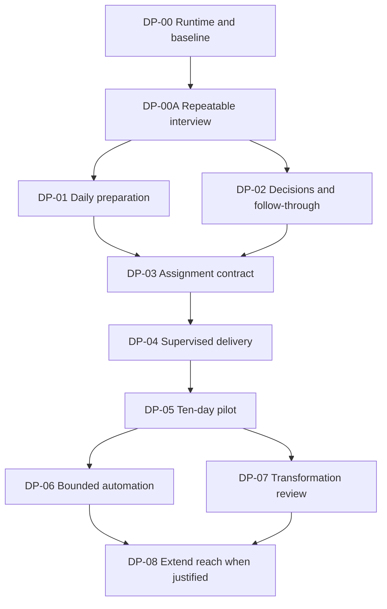

# Delivery recipe

Status: proposed work packets, not activated roadmap phases. Packet IDs avoid collision with ongoing numbered phases. Requirements are canonical in [SRS](SRS.md); gate evidence is defined in [ACCEPTANCE](ACCEPTANCE.md).

## 1. Working rules

Start each packet from the selected integration revision and an updated capability disposition. Classify work as reuse/prove, integrate, demonstrated fix, new implementation, or defer. A correct existing implementation with an activation problem gets activation work; an obsolete document does not justify rewriting its service.

Keep the initial footprint on the existing Desk, Project, meeting, decision, attention, Thread, and delivery surfaces. Register new domain contracts through existing kernel and transport patterns. Before implementing concurrency or lifecycle changes, review the state machine, transaction boundaries, failure windows, and concrete acceptance matrix. Repository evidence and commit gates apply when implementation ships. This package itself neither changes their status nor bypasses them.

No merge, restart, source-system write, or automatic recipe is performed by this document. Before a future effect, use the authority already supplied by the owner and the applicable runtime policy. Do not create an extra confirmation for reversible local work merely because it appears in this recipe.

## 2. Dependency order

These are logical dependencies; they do not authorize parallel agent sessions. DP-00A first proves a small interview path using existing manual domain capabilities; remaining section adapters and daily outcomes can close with DP-01/DP-02. It does not wait for the Assignment or unattended engine. R1–R2 pilot value is the condition for expanding scope. Foundational R3 design can proceed earlier without claiming unattended readiness.

## DP-00 — Establish one known runtime and adopt current work

**Gate:** R0. **Requirements:** AA-ENV-001–AA-ENV-005, AA-INT-003. **Character:** inspection, integration, targeted activation fixes.

1. Record workspace revision, intended integration revision, actual loaded backend/frontend identity, opaque database identity, schema, active process ownership, and exact model/provider readiness. Preserve unrelated running work.
2. Compare the target with the Phase 170–172 branch lineage and story evidence. Record which commits/capabilities are included and what remains unproved. Never integrate by copying individual runtime files across checkouts.
3. Trace one capture, one model attempt, and one connector read through the actual runtime. Give each prerequisite a working recovery action.
4. Confirm a viable backup and restore path on a database copy; select one actual Project and repository for the pilot without inventing employer scope.
5. Update the capability disposition so later packets cannot duplicate work already present.

**Seams:** `holdspeak/web_runtime.py`, `holdspeak/web_server.py`, system health/setup routes, model and connections services; newer concierge/heartbeat changes when adopted. **Do not rebuild:** model routing, connector auth, or the whole settings UI.

**Exit evidence:** AC-01–AC-03 with runtime attestation and real result receipts. Two process instances and a stale frontend are negative cases. **Stop condition:** loaded runtime identity or database ownership remains uncertain; proceed with isolated design/testing but defer dependent live changes.

## DP-00A — Compose the repeatable interview

**Gate:** R1. **Requirements:** AA-IVW-001–AA-IVW-018. **Character:** new durable conversational composition over existing setup and domain services. Detailed design: [INTERVIEW](INTERVIEW.md).

1. Select one goal, one existing Project, and one useful manual brief as the first complete path. Audit exact discover/read/prepare/apply/verify operations. Reuse ProjectSetupService for new source setup; add its missing proposal select/deselect/test and clarification tool parity through the same service validation. Do not substitute post-creation Watch tests for setup-proposal tests.
2. Define versioned section descriptors and reviewed capability metadata. Reuse MCP-to-model schema conversion, but compile an explicit interview palette with live principal, scope, disclosure, actual adapters, and policy. Preserve common-service/kernel execution instead of acquiring owner identity through stdio loopback.
3. Implement the durable controller, typed events, scoped fact references, proposal/plan revisions, idempotent operation links, pause/rebase/recovery, and expiry handling. Document transaction boundaries before shipping mutations.
4. Connect an LLM adapter for adaptive questioning and contextual suggestions, including novel compositions. Validate output and feasibility; cap visible suggestions and work budgets. Provide deterministic capture and exact model/auth handoffs when prerequisites are absent.
5. Use existing Desk/Thread/document primitives for entry, voice input, section switching, known facts, suggestions, proposed change, actual result, and continuation. A useful manual result must be possible without completing other sections.
6. Extend Goals, Projects, concerns, Cadences, People, Decisions, and delegation progressively. Discuss unavailable effects honestly and keep useful drafts/handoffs; R2/R3 requirements still govern execution. Preserve People boundaries before input persistence.
7. Prove repeated configuration changes, concurrent direct edits, lost acknowledgements, expired setup sessions, unsupported tools, ambiguous intent, and model failures. Evaluate whether real suggestions help the owner, separately from mechanical correctness.

**Seams:** `project_setup_service.py`, `thread_tools.py`, `thread_modes.py`, MCP family registries, existing citizen/People services, model/Concierge integration, and Desk primitives. **Do not build:** a parallel settings store, unrestricted tool agent, replacement Project setup engine, or second workflow executor.

**Exit evidence:** AC-30–AC-38, with relevant AC-02/AC-03 and AC-26 proof reused. One cold interview produces a useful verified manual result; a revisit revises existing setup without duplication. All section descriptors have supported outcomes or explicit handoffs. **Stop condition:** suggestions cannot become real supported outcomes, recur despite correction, or require more work than direct configuration; repair that path before adding more automation.

## DP-01 — Make preparation and attention useful

**Gate:** R1. **Requirements:** AA-CTX-001–AA-CTX-006, AA-ATT-001–AA-ATT-004, AA-ATT-006, AA-UX-001–AA-UX-003, AA-UX-005, AA-NFR-001. **Character:** reuse and user-flow completion.

1. Reuse capture/Thought custody, memory search, Project room data, and the newer needs-you aggregation/brief work.
2. Implement the bounded opening priority view over source-owned work: five priorities, reason and verb, honest remaining count, full retrieval.
3. Add the manual meeting-purpose entry to existing preparation flow where absent; calendar setup is not a dependency.
4. Freeze scope and source versions for each kept answer/brief; surface omissions and current/superseded decisions.
5. Complete RCP-01, RCP-02, and RCP-09 at both browser widths with keyboard and voice input. Fix demonstrated navigation/state problems at existing component seams.

**Seams:** `memory_service.py`, `monday_brief_service.py`, `project_service.py`, refinement services, `web/src/desk`, adopted needs-you service. **Do not build:** another search index, another inbox, a new home-screen metaphor, or an unrestricted organization crawler.

**Exit evidence:** AC-04–AC-06, AC-11–AC-12, AC-26–AC-27. An owner can use a kept brief and recover its sources without assistance. **Stop condition:** a technically generated brief is too noisy or takes more work to correct than to prepare manually; fix relevance before adding sources.

## DP-02 — Connect decisions to actual follow-through

**Gate:** R1. **Requirements:** AA-DEC-001–AA-DEC-006, AA-TRF-001–AA-TRF-002, AA-INT-005, AA-NFR-002. **Character:** integrate Phase 172, prove it, add only missing domain metadata.

1. Adopt the actual meeting auto-intelligence and proposal bridge implementation, including retries and source association semantics.
2. Confirm/Edit/Dismiss through the existing owning service and kernel. Preserve uncertain owner/date and actual decision provenance.
3. Reuse rationale, alternatives, owner, review date, and commitment fields. Add a narrowly typed authority-scope/source extension only if current records cannot express it.
4. Link the Project's outcome/scope and authoritative decision locator. Keep full transformation-profile work for DP-07.
5. Complete RCP-03 and the permitted RCP-04 path using real meeting evidence; verify supersession, later recall, and People boundaries.

**Seams:** decision lifecycle/record services, `follow_through_service.py`, Project relationships, meeting intelligence, adopted proposal bridge and People resolver. **Do not build:** duplicate action status or a separate decision repository.

**Exit evidence:** AC-07–AC-10, AC-13. One recorded meeting produces a confirmed decision, a commitment, and a later preparation/recall result. **Stop condition:** source-to-owner mapping is ambiguous or model extraction loses material distinctions; retain proposals and repair the demonstrated problem.

## DP-03 — Define and implement the assignment boundary

**Gate:** R2 foundation. **Requirements:** AA-RUN-001–AA-RUN-004, AA-RUN-010, AA-INT-001–AA-INT-002, AA-INT-006, AA-NFR-003–AA-NFR-005, AA-NFR-008. **Character:** new domain composition over existing execution.

1. Review CONTRACTS.md against the integration revision and Phase 155. Settle ref registration, immutable definition/revision, run-link uniqueness, review ownership, and kernel/native projection boundaries.
2. Implement AssignmentService with prepare/revise/read/run commands and a typed registered parent operation. Persist before dispatch; return an asynchronous handle.
3. Add the smallest new tables and migration/restore proof. Keep execution receipts in the journal and business acceptance in the review record.
4. Map one registered worker profile to capabilities, limits, and result protocol. Unknown enforcement is a capability gap, not an optimistic UI field.
5. Expose the same service through Web and scoped tools. Advertise missing live callbacks explicitly. Keep trusted authority out of request payloads.

**Seams:** `kernel/parent_run.py`, `kernel/runtime.py`, `project_contracts.py`, `refs.py`, tool executor/modes, MCP family registration, delivery factory and capability ledger. **Do not modify:** general Workflow graph semantics to accommodate assignments. A new domain parent can compose admitted children without changing the linearizer's contract.

**Exit evidence:** AC-14–AC-15, AC-19, AC-21, AC-25, AC-28 for R2-specific criteria. **Design review must resolve:** crash after claim, lost effect acknowledgement, stop/result race, changing scope, source revocation, adapter limitations, and physical attempt accounting before implementation is called complete.

## DP-04 — Complete supervised delivery and verification

**Gate:** R2. **Requirements:** AA-RUN-005–AA-RUN-008, AA-UX-004. **Character:** connect and verify existing launch/steer/result paths.

1. Launch a bounded assignment in a supported worktree/session with immutable target identity and registration timeout.
2. Connect blocker answers through the live supported adapter; keep draft answers and reported failures visible.
3. Materialize structured results and verification evidence as canonical artifacts. Implement mandatory check evaluation and owner review.
4. Open progress and results from existing Agents/Thread/Project surfaces. Reconnect a browser and recover the same run.
5. Exercise scope revision, cancellation, late result fencing, failed checks, and a worker that never registers.

**Seams:** delivery launch/attempt/dossier modules, coder steering, Thread tool service, proposed AssignmentService, existing Artifact/Project relationships. **Do not build:** a separate terminal, generic coding agent, or second global process screen.

**Exit evidence:** AC-16–AC-17; one complete RCP-05 run and its negative cases. **Stop condition:** a reviewer cannot determine which brief, repository revision, and tests produced the result.

## DP-05 — Run the ten-workday owner pilot

**Gate:** demonstrated R1–R2 value. **Requirements:** AA-NFR-007, owner evidence for AA-IVW, and the user outcomes in SRS section 11. **Character:** usage and measured correction, not feature expansion.

1. Establish baseline effort and define the actual tasks and denominators before scoring.
2. Use one transformation stream, five relevant meetings, ten recall tasks, and five bounded assignments. Record spontaneous use, friction, corrections, and maintenance time.
3. Execute a midpoint review after five workdays. Rank failures by lost work, incorrect authority, missing outcome, and wasted time. Fix only what blocks the selected recipes.
4. At day ten, classify every outcome as pass, fail, or inconclusive with evidence. Retain poor outcomes and failed runs in the sample.
5. Decide whether to extend, narrow, or stop investment in each recipe. A lower-scope daily helper can be useful even if autonomous execution is not ready.

**Exit evidence:** AC-29 with net time and quality results. **Stop/reshape condition:** negative net time, unreliable accepted records, or recurring supervision overhead that defeats the recipe. A missing sample extends validation rather than manufacturing a pass.

## DP-06 — Enable bounded automatic execution

**Gate:** R3. **Requirements:** AA-ATT-005, AA-RUN-009, AA-AUT-001–AA-AUT-008, AA-NFR-006 plus R3 portions of AA-NFR-003/005. **Character:** lifecycle/scheduler composition and operational proof.

1. Bind templates to the existing automation/Watch and delegated-schedule services. Make effective scope and limits inspectable.
2. Use durable fire identity, unique admission, lease/generation fencing, overlap coalescing, timezone/missed-fire policy, and bounded retries. Integrate the existing heartbeat rather than adding an independent timer.
3. Start with RCP-06 and scheduled preparation. Reconcile frozen route policy with revocation/expiry before each consequential child.
4. Integrate the Phase 155 child-work contract for one coordinator, worker, and verifier if required. Preserve shared budgets and depth one.
5. Prove restart, acknowledgement loss, cancellation, two competing instances, provider outage, and unavailable worker/model. Add external effects only after their adapter behavior is proved.

**Seams:** `watch_service.py`, `reaction_service.py`, `schedule_delegation.py`, `workbench_conductor.py`, adopted heartbeat, kernel parent/lease/receipt paths, Phase 155 Thread/conductor integration.

**Exit evidence:** AC-18–AC-21 and three consecutive scheduled occurrences on the attested hub, including an intentionally interrupted occurrence. **Stop condition:** any unexplained missing result, duplicate logical effect, or incorrect terminal success. Do not hide it by reducing the demonstrated failure case.

## DP-07 — Add transformation review depth

**Gate:** R4. **Requirements:** AA-TRF-003–AA-TRF-008, AA-INT-004. **Character:** typed Project extension and source-backed review.

1. Select one real initiative and its actual authoritative record. Add the optional architecture profile without changing Project IDs or duplicating decisions/actions.
2. Implement stage evidence, sponsor/decision authority, rollout waves, exception expiry, and metric definitions/denominators.
3. Add a small portfolio projection over existing Projects for shared dependencies, conflicts, and repeated exceptions. Preserve dissent and source gaps.
4. Extend the existing update/review pipeline for adoption and outcome evidence; make external reconciliation revision-aware and destination-specific.
5. Complete RCP-07 and RCP-08 with an actual architecture review and an explicit next transition.

**Exit evidence:** AC-22–AC-24. One initiative can move through a justified gate, expose an expiring exception, and distinguish delivery, adoption, and outcome evidence. **Stop condition:** the profile becomes manual duplicate reporting or lacks an authoritative source for its claims.

## DP-08 — Extend reach only for a proven missing step

**Gate:** subsequent scope, not required for R0–R4. **Character:** targeted adapter or deployment work.

Examples: a missing Confluence/Teams/internal-system read path; an always-on owner-controlled node; a scoped remote MCP adapter; native mobile continuation. Select one based on a recorded failed recipe. Document source identity, scopes, freshness, allowed effects, credential custody, normalization, and outcome evidence before implementation. Reuse the same service/assignment contract and extend the adapter capability ledger.

Do not bundle a new connector, remote authorization, native parity, and general agent recursion into one phase. A remote or unattended runtime earns its claimed guarantees through the same failure and policy scenarios as the local one.

## 3. Required closeout for each packet

The closeout records selected revisions/runtime, requirement dispositions, affected authority owners, actual scoped and required integration test results, relevant live-model evidence, UI walkthroughs for changed surfaces, remaining failures and owner-acceptance status. Existing repository full-suite and PMO gates apply at the shipping boundary. Reuse the existing test modules listed in BASELINE.md as regression evidence; new tests must demonstrate new behavior or a diagnosed defect rather than mirror implementation.

This SRS package itself receives document validation: local source links, stable/unique requirement IDs, acceptance traceability, recipe and packet references, and parseable examples. Documentation validation is not product acceptance.
