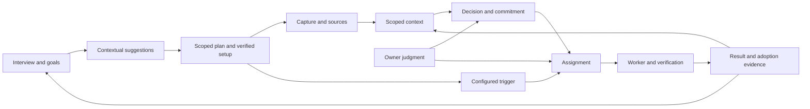

# Architect assistant: SRS and execution recipes

Status: target specification with an implemented first manual Interview increment. Version 0.2, 2026-09-05. See [delivery status and evidence](DELIVERY_STATUS.md) for implemented behavior and remaining work.

HoldSpeak shall help a Senior Software Architect preserve context, make and recover decisions, follow through on commitments, and direct agent work during an organizational transformation. Success means useful work completed and time recovered across an ordinary working week.

The primary conversational entry is a repeatable interview: explore goals, Projects, concerns, Cadences, People, Decisions, or delegation; receive contextual LLM suggestions; and turn a chosen suggestion into a tested supported setup. Revisit any section as work changes. Intelligent conversation guides discovery; deterministic state, existing service contracts, and actual tool results govern execution.

This package translates the repository and installation assessment into requirements, contracts, user recipes, delivery packets, and acceptance evidence. It specifies a target; it does not declare the target implemented, ratify a new product policy, or mark an existing phase complete.

## Read order

| Document | Purpose |
|---|---|
| [Baseline](BASELINE.md) | Evidence, implementation boundaries, work already underway, and assumptions. |
| [Delivery status](DELIVERY_STATUS.md) | Implemented increment, verification, reproduction, limitations, and remaining delivery. |
| [Repeatable interview](INTERVIEW.md) | Modular conversation, creative suggestions, MCP composition, durable continuation, and the first implementation path. |
| [System requirements](SRS.md) | Normative requirements, priorities, scope, and release gates. |
| [Domain and execution contracts](CONTRACTS.md) | Record ownership, lifecycle, authority, interfaces, recovery, and concurrency. |
| [Operating recipes](RECIPES.md) | Concrete architect workflows with triggers, steps, outputs, failure behavior, and example instructions. |
| [Delivery recipe](DELIVERY_PLAN.md) | Ordered work packets, reuse decisions, implementation seams, and exit evidence. |
| [Acceptance and pilot](ACCEPTANCE.md) | Requirement traceability, behavioral scenarios, failure injection, and a ten-workday validation protocol. |

## The product contract

One useful chain must survive a change of day, device viewport, model, and worker:

The Desk owns interaction; existing citizen services own their records; the kernel owns consequential execution authority and receipts. The interview coordinates those capabilities through a curated live tool palette and common services. Its session stores continuation and proposal state, while domain records keep their existing owners. The proposed Assignment ties later agent work to a versioned outcome and acceptance contract.

## Interpretation and precedence

`MUST`, `MUST NOT`, `SHOULD`, and `MAY` describe the target within this draft. Requirement IDs in SRS.md are canonical and remain stable once implementation begins. Other documents elaborate them; a contradiction is a specification defect to resolve before dependent implementation.

The [Constitution](../CONSTITUTION.md), the user's instructions, existing canonical security contracts, and accepted phase decisions retain their authority. This package does not change YOLO, Normal, or Secure defaults. An explicit owner action or existing bounded delegation supplies authority where the applicable operation allows it; a second confirmation is not automatically required. Architectural approval within an organization is a separate domain fact from permission to operate HoldSpeak.

The [Project Rooms suite](../project-rooms/README.md) remains the foundation for Project identity, source observation, reviews, Steward, and updates. This package proposes architect-specific composition and later capabilities beyond that suite's original V0 scope. Existing approved scope is not silently expanded.

Web on the local owner hub is the initial implementation target, with desktop and compact browser layouts. Native Swift parity, remote MCP, a new connector, and organization-wide administration are separate commitments. Missing employer-specific information is recorded as an assumption, not inferred from personal test data.

## Release gates

| Gate | Achieved state | Required demonstration |
|---|---|---|
| R0 | Known, recoverable installation | Identify the actual runtime and database; execute one capture, one model attempt, and one source read with traceable outcomes. |
| R1 | Useful daily assistant | Interview toward one useful setup, revisit it without duplicates, and prepare, capture, decide, follow through, and recall on one real transformation stream. |
| R2 | Supervised agent work | One assignment reaches a reviewed result through supported worker and verification adapters. |
| R3 | Bounded unattended work | A configured trigger runs the same assignment contract with recovery, limits, and no unexplained duplicate effect. |
| R4 | Transformation review | Review decisions, rollout, exceptions, adoption, and outcomes across a small portfolio with authoritative source links. |

R0–R2 form the first owner pilot. R3 begins with bounded preparation and analysis; broader effects require their actual capability and authority contract. R4 adds depth after the daily practice is useful. An unattended recipe cannot borrow the owner's identity merely because the local MCP sidecar currently runs as owner.

The interview can discuss every section at R1 and keep useful drafts/manual recipes or precise handoffs. Actual scheduling and agent effects retain their R2/R3 gates. R0 is an implementation/runtime proof obligation; the owner is not forced through every diagnostic or section before capturing a goal and seeing a useful first result.

No portfolio workspace or transformation initiative was created by writing this package. The first DP-00A Interview path is delivered through [PR #561](https://github.com/karolswdev/HoldSpeak/pull/561); runtime attestation, owner acceptance, and later release gates remain open. Current proof and reproduction instructions are in [delivery status](DELIVERY_STATUS.md).
