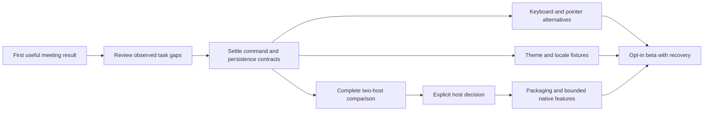

# Delivery roadmap and measurement plan

Status: **proposed implementation plan**, based on the source/SRS delta at
`675401a…`. This is not a release promise or a claim that the owner has used the
product. The separate Phase 201 first meeting result remains the first-use job.
Do not make this whole programme a prerequisite for that job.

## Staffing and estimates

Estimates below are engineering judgment, in person-weeks. They assume one
senior React/design-systems engineer, part-time accessibility/design review,
and a backend or host specialist for the relevant slice. A person-week is five
focused workdays. Ranges include focused verification and documentation, not
external store review or certificate procurement. Confidence is low until a
representative slice has been measured. Parallel staffing changes elapsed time,
not the total effort by the same factor.

| Delta from current source | Exit result | Effort | Skills |
| --- | --- | ---: | --- |
| Reconcile remaining metadata/contract exceptions | Missing semantics have an owner and asserted contract | 1–2 | architecture, source review |
| Portable window/selection/command contracts | Exact current behavior and migration fixtures agree | 1–2 | TypeScript, state and interaction design |
| Keyboard and non-drag parity | Each supported filing/grounding action has keyboard and simple pointer paths | 2–4 | accessibility, React, Pixi |
| Cross-window and multi-object manipulation | Matrix-driven batch behavior, cancellation and partial failure are explicit | 2–4 | gestures, domain APIs |
| Focus and semantic canvas/list parity | Keyboard and screen-reader journeys work across world/windows | 2–3 | accessibility, QA |
| Localization foundation and expansion | Message catalogue and formatting with 30/50% fixtures | 2–4 | i18n, frontend architecture |
| High-contrast and light-theme parity | Token variants pass the same component/contrast matrix | 2–3 | tokens, visual design, accessibility |
| Complete host comparison after minimal probes | Populated same-bundle journeys, permission denial and measurements in both hosts | 1–2 | Electron, Rust/Tauri, security |
| Productize selected host | Signed packages, update/recovery, bounded native capabilities and OS matrix | 4–7 | desktop packaging, release engineering |
| Opt-in beta and stabilization | Recovery, migration and user-task evidence across supported targets | 2–3 | QA, release, product owner |

Do not add these ranges to a fixed dated Gantt chart. Host productization is
conditional on a decision; light themes and multi-drop can follow first use.
A first tranche should fix the highest-cost task interruption observed during
Meet → Understand, then complete keyboard/non-drag access for that same job.

## Dependency sequence

The current probes close only build/static-load feasibility on macOS. They do
not close the comparison, permissions, packaging or release rows.

## Proposed benchmark acceptance

Reference environment: Apple Silicon M1-class machine, 16GB RAM, 60Hz display,
production build, clean temporary browser profile, no provider calls, and a
loopback fixture hub. Record exact OS, browser, CPU, memory and bundle hash on
each run. Use 100 normal and 1,000 heavy Desk objects; 4 and 12 open windows;
10 and 100 runtime frames/second. These are proposed fixtures, not claims of
supported production scale.

| Requirement | Metric and threshold | Method | Failure policy |
| --- | --- | --- | --- |
| NFR-PERF-001 | Normal gesture frame p95 ≤16.67ms; no task >100ms attributable to one drag | 30-second scripted drag/resize, 5 runs, browser performance trace | Block new gesture work; publish trace and fix or explicitly revise requirement |
| NFR-PERF-003 | Usable Desk ≤2 seconds after fixture data is available, p95 of 20 cold profiles | Performance marks around bootstrap and first operable object | Keep unimplemented until instrumented; compare same bundle/hub |
| NFR-PERF-004 | Heavy fixture frame p95 ≤33.3ms; commands remain available | Same trace at heavy object/window/event load | Use semantic/list fallback and state the tested ceiling |
| NFR-PERF-005 | Idle renderer average CPU <2% of one logical core after 30 seconds; 60-second sample | OS process accounting, include helper processes separately | Investigate continuous animation/subscriptions; no claim from a single screenshot |
| NFR-PERF-006 | Retained JS heap growth <10MB after 100 open/close cycles and forced test GC | Browser heap snapshots before/after; 3 runs | Block suspected listener/window leak; preserve repro |
| NFR-REL-004 | Last-known content remains readable after 30-second disconnect; one product socket reconnect loop | Fixture server cut/restart with event counter | Fail if duplicate dispatch or fabricated success occurs |
| NFR-A11Y-007 | AA target size/spacing: 24 CSS px minimum subject to WCAG exceptions; primary touch target 44px product target | Bounding boxes plus manual exception review at both widths | Record exception and test alternative; no blanket pass from axe |
| NFR-A11Y-008 | 200% text/zoom retains key action and state without clipped content | Browser zoom and enlarged-text fixtures plus keyboard walk | Block touched-face acceptance until reflow works |

The thresholds are **proposed acceptance criteria**, not measurements from this
PR. Change them only with a recorded reason and evidence. The existing bundle
gate remains authoritative; this document does not loosen its limits.

## Rollout and recovery

Ship contract and web conformance changes first. Keep browser operation as the
parity and recovery path. Add a null Web host adapter before native capabilities.
Enable native features individually with denial and recovery tests. Keep the
runtime's records outside workspace layout and native host state. Test layout
version mismatch and corrupt storage without touching a live database.

The release candidate needs platform packaging/signing and update rollback
proof. Linux and Windows host support remain unknown here. A static load or a
compiled binary cannot replace that evidence. Diagnostics should be local and
redacted; this roadmap does not introduce telemetry.
