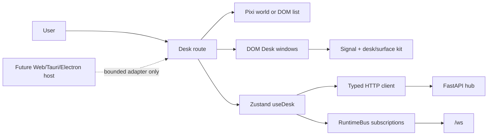

# HoldSpeak Desk software requirements specification

**Version:** 1.0 source-reconciliation baseline  
**Scope:** current Web Desk and bounded future host seam  
**Owner:** Astra, Desk lane  
**Evidence anchor:** pinned product revision `675401a857b85336d4acaa8c65383dfc9636e4c8`  
**Normative source:** [`requirements.json`](data/requirements.json)  
**Current design:** [`DESIGN_SPECIFICATION.md`](DESIGN_SPECIFICATION.md)  
**Architecture:** [`DESK_ARCHITECTURE.md`](../../DESK_ARCHITECTURE.md)  
**Object contract:** [`DESK_OBJECT_MODEL.md`](../../DESK_OBJECT_MODEL.md)

This SRS records the Desk that exists and the smallest requirements needed to
finish its documented contract. `IMPLEMENTED` means source plus inspected
assertion establish the behavior. `PARTIAL` means a real path exists with
known limits. `SPEC-DEBT` means code exists but the portable rule or oracle is
missing. `UNIMPLEMENTED` means the requirement is future work. `CONFLICT`
means source and governing canon disagree. `DEPRECATED` means a former path is
parked. No `SHOULD` is silently treated as shipped.

The user-facing language follows the Seven Tenets and UX Canon: simple words,
short labels, honest state and no walls of instruction text. The SRS itself is
technical documentation and uses normative English for traceability.

## 1. Product and system boundary

The Desk is the operating surface. `/` is the Desk; `/welcome` is arrival;
`/presence` is the Presence theater. Deep links stage a Desk window and return
to `/`. This is implemented by `PRODUCT_ROUTES`, `DEMOTED_ROUTES` and
`SurfaceRedirect` (`web/src/routes.tsx:16-76`, `web/src/App.tsx:18-68`).



The implementation has one HTTP client (`apiRequest/apiFetch/apiBlob`), one
product `/ws` owner (`RuntimeBusProvider`), one Desk store and one surface
component barrel. A future host cannot add a store, route world, generic
filesystem API or second component kit.

## 2. Current implementation inventory

| Boundary | Current contract | Source and inspected assertion | Status |
|---|---|---|---|
| Browser boot | tab token capture, URL scrub, authenticated HTTP and WS protocol | `web/src/lib/auth.ts:13-60`; `web/src/main.tsx:11-26` | IMPLEMENTED |
| Routes | 3 rendered routes; demoted product links | `web/src/routes.tsx:20-76`; `web/src/routes.test.ts:1-220` | IMPLEMENTED |
| Desk shell | Chair/Floor, spatial/list, shared windows and Dock | `web/src/desk/DeskApp.tsx:184-260` | IMPLEMENTED |
| World | deterministic normalized positions, zones, sprite state | `web/src/desk/world.ts:18-201`; `web/src/desk/gl/__tests__/iconCell.test.ts` | IMPLEMENTED |
| Store | primitive projections, selection, windows, layout and commands | `web/src/desk/store/types.ts:108-373` | IMPLEMENTED |
| Window | common frame, placement, clamp, resize, snap, Exposé, MRU | `web/src/desk/components/window/windowGeometry.ts:14-223`; `shell.test.tsx:125-285` | IMPLEMENTED |
| Workspace | version 1 storage, validation, 100-ID cap, no minimize persistence | `web/src/desk/store/workspaceStorage.ts:8-153`; `windows.test.tsx:200-246` | IMPLEMENTED |
| Menu/verbs | single `VERBS` registry, ghost reasons, derived faces | `web/src/desk/verbRegistry.ts:28-62`; `verbRegistry.test.ts:14-104` | IMPLEMENTED |
| Keyboard | one document binder and abstract primary modifier | `web/src/desk/keymap.ts:19-127`; `keymap.test.ts:16-86` | IMPLEMENTED; platform map debt |
| Internal drop | target matrix with named operation | `web/src/desk/dropMatrix.ts:9-47`; `dropMatrix.test.ts:6-43` | IMPLEMENTED |
| External file drop | armed veil, import/extract/refusal state | `web/src/desk/components/GlassDropLayer.tsx:9-107` | PARTIAL |
| Info | contract-derived footprint/properties and rename lock | `web/src/desk/infoContract.ts:14-167`; `infoContract.test.ts` | IMPLEMENTED; receipts debt |
| HTTP failures | `ApiError` with status and backend payload | `web/src/lib/api.ts:14-88` | IMPLEMENTED |
| RuntimeBus | typed frames, listeners, ping and reconnect | `web/src/runtime/RuntimeBus.tsx:13-120`; `web/src/runtime/RuntimeBus.test.tsx` | IMPLEMENTED |
| Host | no native host adapter in current tree | no source found in bounded Desk census | UNIMPLEMENTED |

## 3. Functional requirements

The complete requirement rows, each with rationale, source claims, owner,
acceptance, test and status, are in `data/requirements.json`. The following
table groups their normative intent.

| ID range | Requirement intent | Current status |
|---|---|---|
| FR-DESK | Desk shell and equivalent spatial/list representations | implemented / partial parity |
| FR-OBJ | object identity, selection and object-action grammar | implemented with selection extensions debt |
| FR-WIN | common window lifecycle and arrangement persistence | implemented |
| FR-MENU / FR-KEY | registry-derived commands and one keyboard binder | implemented with platform conflict debt |
| FR-DND | matrix, named release operation and non-drag alternatives | matrix implemented; alternatives and multi-drop unimplemented |
| FR-INFO / FR-STATE | Info honesty and truthful async outcomes | implemented / partial recovery |
| FR-HOST | bounded future desktop host and web fallback | web fallback implemented; host unimplemented |

Selected current contracts:

- A Desk primitive SHALL use one descriptor entry in `PRIMITIVES` and one
  object identity. The descriptor set is exhaustive at
  `web/src/lib/primitives.ts:419-644`.
- A Zone SHALL be a real window with remembered icon/list/sort/direction and
  membership operations. Its spatial placement is separate from hub
  membership (`web/src/desk/store/types.ts:80-91`).
- An internal drop SHALL match `DROP_MATRIX`; an unlisted pair SHALL be inert.
  A grounding drop SHALL hold input until a human presses the run verb
  (`web/src/desk/dropMatrix.ts:19-47`).
- A destructive operation SHALL use in-world confirmation. Reset opens Settings
  before mutation, and `ConfirmVerb` self-disarms after 3 seconds
  (`web/src/desk/verbRegistry.ts:302-311`; `Surface.tsx:1216-1270`).

## 4. Nonfunctional requirements

### Accessibility

The target is WCAG 2.2 AA. Existing native inputs, status roles, `aria-expanded`,
roving rows and focus return are current foundations. The SRS requires measured
keyboard, focus, semantic-list, zoom/reflow and non-drag paths. Axe alone is
not sufficient to close a row; behavior and a manual keyboard walk are part of
acceptance.

### Performance

The production target is 60Hz interaction: during normal one-window drag or
resize, no sustained frame may exceed 16.67ms. Local selection feedback must
appear by the next rendered frame. Window motion may animate only compositor
properties. Startup, object-density scaling, idle CPU and retained-window
memory require a baseline fixture before implementation status can become
`IMPLEMENTED`; current code does not provide that baseline in this lane.

### Reliability, error and recovery

RuntimeBus reconnects with a capped exponential delay and exposes `offline`.
Malformed frames are ignored; a closed socket is retried unless the provider is
disposed (`web/src/runtime/RuntimeBus.tsx:59-93`). Workspace corruption returns
an empty layout while hub records remain untouched
(`workspaceStorage.ts:79-117`). API failures retain status/payload in
`ApiError`; faces show a short named reason and an in-flow retry. External drop
refusal names the file reason (`GlassDropLayer.tsx:49-53,93-95`). Backend
offline/reconnect UX beyond the RuntimeBus state is PARTIAL and requires a
journey test.

### Localization

Visible labels and accessible names need a message catalogue. Stable command,
primitive and event IDs remain nonlocalized. Date/time/number rendering must
use the locale. Expansion fixtures must cover +30%, +50%, long compound words,
RTL/Bidi and keyboard notation. The current tree contains product literals and
has no complete locale/pseudo-locale harness; all such rows are UNIMPLEMENTED
or SPEC-DEBT.

### Theming

Signal dark is current. Themes may change semantic token values but may not
change command availability, state meaning, geometry or accessibility. High
contrast and light/system aliases require their own token and screenshot
fixtures. The current `prefers-reduced-motion` token behavior is implemented;
theme parity is not.

### Security and privacy

Provider keys pass temporarily through password inputs and connect requests
(`ModelLibraryCore.tsx:219-239`). They are excluded from persisted Web projections
and public profile/receipt DTOs; backend local key custody is a separate store.
This is not a claim that key bytes never enter the browser. The browser token is a
hub credential, held tab-scoped and forwarded as an HTTP header / WS subprotocol
(`web/src/lib/auth.ts:13-60`). A future host must expose only typed bounded
operations. Electron context isolation/sandbox and Tauri capability policy are
requirements of the later host ADR, not current implementation claims.

## 5. Portable data models

The following models are portable documentation contracts. Workspace version 1
mirrors the canonical saved shape; selection, localized verbs, theme, locale and
host models are **proposed**, not shipped persistence. The [JSON Schema](../../../architecture/desk-workspace.schema.json)
marks these differences. It does not replace the repairing workspace loader or
assert that every recoverable input has the canonical saved shape.

```ts
type WorkspaceLayout = {
  version: 1;
  windowsById: Record<string, WindowInstance>;
  panel: { rects: Record<string, WindowRect>; order: string[]; max: string[] };
  zoneWindows: string[];
  zoneViewPrefs: Record<string, ZoneViewPreference>;
};
type WindowRect = { x: number; y: number; w: number; h: number };
type WindowInstance = {
  id: string; kind: "surface"; applicationKey: string;
  scope: string | null; persistence: "workspace";
};
type SelectionContext = {
  selectedRefs: string[]; commandTargetRef: string | null;
  owner: "desk" | "window";
};
type VerbDefinition = {
  id: string; labelKey: string; scope: "floor"|"object"|"go"|"window"|"system"|"thread";
  shortcut?: string; glyph?: string; destructive?: boolean;
  applicability: string; unavailableReason?: string;
};
type DropCapability = {
  sourceKinds: string[]; targetKind: string; action: string;
  releaseLabel: string; requiresExplicitRun: boolean;
};
type ObjectVisualState = "rest"|"selected"|"stale"|"new"|"editing"|"dragging"|"drop-ready";
type ZoneViewPreference = { view: "icons"|"list"; sort: "name"|"kind"|"modified"; dir: "asc"|"desc" };
type ThemePreference = { mode: "dark"|"light"|"system"; contrast: "normal"|"high"; motion: "full"|"reduced"; density: "normal"|"compact" };
type LocalePreference = { locale: string; timeZone?: string; direction?: "ltr"|"rtl" };
type DesktopHostCapability = { id: string; platforms: string[]; permissionClass: string; webFallback: string; method: string };
```

Authority and lifetime are explicit: hub records are backend-authoritative and
sync through the API/bus; layout and windows are local workspace state;
selection/focus/animation are ephemeral; host capabilities are adapter state.
No workspace loss may delete a hub record. Version migration must reject
unknown schemas safely and preserve the live compositor.

## 6. API, event and receipt contracts

| Surface / verb | Current API seam | Runtime event | Local state | Receipt/egress |
|---|---|---|---|---|
| refresh Desk | `desk/api.ts` load path via `apiFetch` | optional `desk_changed` refresh | items/status/updatedAt | hub read |
| create/edit/delete primitive | `createPrimitive`, `updatePrimitive`, `deletePrimitive` through `desk/api.ts` | hub refresh/event | item + NEW/editor state | backend write receipt where route provides one |
| open/focus window | no HTTP | none | `windowsById`, panel lifecycle | local only |
| file into Zone | `fileIntoDir` / `removeFromDir` | hub refresh | membership projection | reversible hub mutation |
| file into Knowledge | `fileIntoKnowledge` | hub refresh | membership projection | reversible hub mutation |
| ground into capability | `runCapability` only after explicit run | runtime run frames | workbench/run state | model placement and receipt |
| external transcript import | `POST /api/meetings/import` | refresh after result | glass drop state, meeting item | local transcription or configured egress |
| calendar screenshot | `POST /api/calendar/snapshot` | surface result | glass drop state | configured model/egress badge at decision point |
| Runtime frame | `/ws` through `RuntimeBusProvider` | `{type,data}` | subscribers decide projection | read/event; effect paths use existing kernel seams |

The exact endpoint inventory is maintained by the typed Desk API module. New
features must use that module and the shared bus; a feature-local fetch or
socket is a contract violation.

## 7. Desktop host contract

The web Desk remains the application specification. The host seam is proposed
and unimplemented:

```ts
interface DesktopHost {
  readonly kind: "web" | "tauri" | "electron";
  showOpenDialog?(request: OpenDialogRequest): Promise<FileHandleRef[]>;
  showSaveDialog?(request: SaveDialogRequest): Promise<FileHandleRef | null>;
  registerGlobalShortcut?(commandId: string, accelerator: string): Promise<void>;
  showNotification?(notice: SystemNotice): Promise<void>;
  setTrayState?(state: TrayState): Promise<void>;
  revealPath?(opaqueRef: LocalFileRef): Promise<void>;
}
```

The renderer SHALL receive opaque file references and typed results, never
arbitrary shell, process or filesystem authority. The later host ADR compares
Tauri and Electron against the same production web build; it does not authorize
a native rewrite or a second visual/state architecture.

## 8. Error and recovery model

| Class | Required face | Current evidence |
|---|---|---|
| validation/refusal | named reason, no stack; retry or correction in place | `ApiError`, `SurfaceState`, `GlassDropLayer` |
| transport unreachable | `unreachable` state and named retry | RuntimeBus state; surface coverage varies |
| backend rejection | status plus backend reason, receipt if write | `ApiError:14-23,62-68`; write receipt tests |
| malformed runtime frame | ignore frame, retain bus health | `RuntimeBus.tsx:59-71` |
| corrupt workspace | discard invalid layout only, use empty v1 | `workspaceStorage.ts:79-117` |
| stale persisted geometry | clamp into current band | `windowGeometry.ts:95-110` |
| unsupported drop | inert target and named cursor/refusal where external | `dropMatrix.ts:41-47`, `GlassDropLayer.tsx:49-53` |
| lost host permission | named host capability refusal and web fallback | proposed `FR-HOST-001`, `SEC-HOST-001` |

## 9. Test strategy and CI

The test pyramid is:

1. static guards for tokens, routes, no page exit, no modal roles, surface
   imports, vocabulary, raw controls and registry completeness;
2. pure unit tests for geometry, projections, key parsing, drop matrix,
   persistence parsing and runtime reducers;
3. component tests for focus return, ARIA, menu traversal, state transitions,
   compact composition and reduced motion;
4. axe plus behavioral keyboard/manual checks;
5. 1440 and 393 screenshot walks, with wide/compact, reduced-motion and
   failure states;
6. pseudo-locale and high-contrast fixtures;
7. FastAPI integration and live RuntimeBus tests;
8. critical journeys and browser E2E;
9. performance/storm tests for object density and repeated windows;
10. future host contract, packaging, update and recovery tests.

Current CI already runs documentation validation, web quality/type/build,
unit/integration/browser and RuntimeBus coverage. The new rows require targeted
fixtures; they do not justify parallel duplicate pipelines.

## 10. Rollout and roadmap

The implementation order is a delta plan:

| Stage | Work | Exit evidence |
|---|---|---|
| A | freeze this source-backed Desk baseline and requirement trace | every normative row has source, owner and status |
| B | close selection parity, drag alternatives, receipts and compact/a11y gaps | focused assertions plus keyboard walk |
| C | add locale catalogue, pseudo-locale, high-contrast and light semantic aliases | visual fixtures at 1440/393 and expanded text |
| D | measure performance/startup/memory and add stable budgets | recorded benchmark fixture and CI gate |
| E | implement bounded `DesktopHost` null/web adapter | host contract tests without native authority |
| F | run the later Tauri/Electron spike and ADR | same-bundle parity/security result |
| G | capability-by-capability desktop preview and recovery | denied-permission, update/restore and critical-journey proof |

The [delivery roadmap](DELIVERY_ROADMAP.md) gives delta-based person-week
estimates, staffing assumptions, confidence, benchmark fixtures and concrete
thresholds. These are proposed planning/acceptance values, not measured product
performance. No desktop package is implied by this SRS.

## 11. Acceptance checklist

- [ ] Source paths and inspected assertions exist for every current claim.
- [ ] Current behavior and proposed behavior are separated by status.
- [ ] Every `SHALL`/`SHOULD` appears in `data/requirements.json` with ID,
  rationale, source, owner, acceptance and test.
- [ ] Spatial and list representations share object identity and commands.
- [ ] Window numerical constants and persistence rules match source.
- [ ] Verb, menu, keyboard and drop exceptions are recorded.
- [ ] A11y, localization, theming, performance, recovery, CI and host rows are
  measurable or explicitly marked unimplemented.
- [ ] No desktop, external-research or visual claim is promoted without its
  later artifact.
