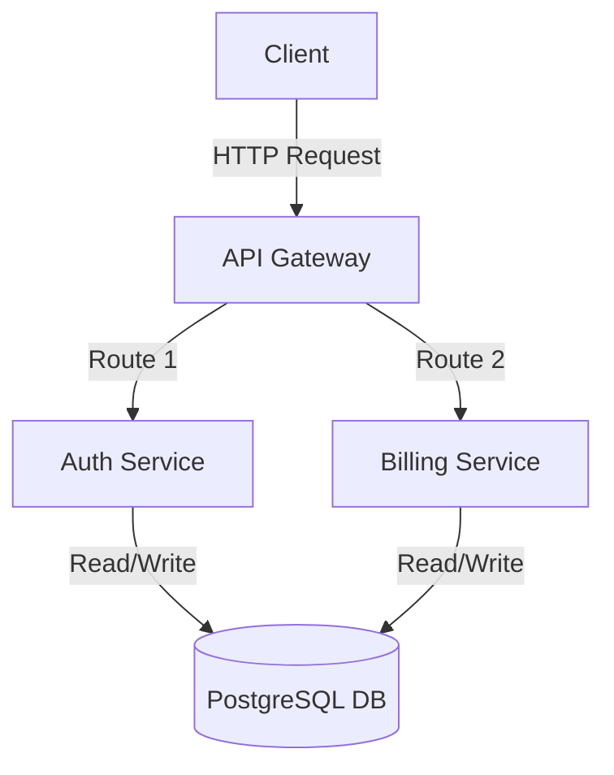

# HS-16-03 Evidence — Diagram-aware artifact body

**Date:** 2026-06-01.
**Story:** [story-03-diagram-artifact-rendering.md](./story-03-diagram-artifact-rendering.md).

## Implementation Evidence

**`holdspeak/plugins/synthesis.py`** — in `synthesize_meeting_artifacts`, after
computing the source-footer lines, a single diagram branch:

- If `artifact_type == "diagram"` **and** `canonical.output["mermaid"]` is a
  non-empty string, the body becomes:
  ```
  ### {title}

  {summary}

  ```mermaid
  {mermaid}
  ```

  - Source windows: ...
  - Source plugin runs: ...
  ```
  and `structured_json["mermaid"]` is set to the same value.
- Otherwise the body uses the exact legacy template and `structured_json` is
  unchanged (no `mermaid` key).

The mermaid value is inserted verbatim (only outer whitespace trimmed); synthesis
does not re-validate — the plugin owns syntax (HS-16-01). A `# TODO` marks where
a per-artifact-type renderer registry should be extracted once the follow-on
phase flips the other twelve plugins to real. No changes to `ArtifactDraft`,
`record_artifact`, or persistence.

## Tests

New `tests/unit/test_artifact_synthesis_diagram.py` (3 cases):
1. `diagram` + `output["mermaid"]` → body has **exactly one** fenced ```mermaid
   block (asserted via ` ```mermaid ` count == 1 and ` ``` ` count == 2), the
   block sits between summary and the source footer, and
   `structured_json["mermaid"]` matches.
2. `diagram` with no `mermaid` key (parse-failure shape) → legacy body, no fenced
   block, no `structured_json["mermaid"]`.
3. Non-diagram artifact (`requirements_extractor`) → `body_markdown` asserted
   **byte-for-byte** against the legacy template, even when the run pathologically
   carries a `mermaid` key.

```bash
uv run pytest -q tests/unit/test_artifact_synthesis_diagram.py tests/unit/test_artifact_synthesis.py tests/unit/test_artifact_synthesis_persist.py tests/integration/test_artifact_synthesis_pipeline.py
# 14 passed in 0.68s

uv run pytest -q --ignore=tests/e2e/test_metal.py
# 1902 passed, 13 skipped   (was 1899; +3 cases)
```

`ruff check` on the changed files: **All checks passed!**

## Live runtime check (real plugin → synthesis)

Ran the real `MermaidArchitecturePlugin` against the configured self-hosted
endpoint (`192.168.1.43:8080`, Qwen3.5-9B-Q6, no API key), then fed its output
through `synthesize_meeting_artifacts`:

```text
artifact_type: diagram | status: draft | confidence: 1.0
structured_json has mermaid key: True
fenced ```mermaid count in body: 1
--- body_markdown ---
### Mermaid Architecture

API Gateway routes traffic to Auth and Billing services which share a single PostgreSQL database.



- Source windows: m-live:w1
- Source plugin runs: 1
```

The synthesized artifact is rendering-ready: a single fenced Mermaid block in the
body plus a structured `mermaid` field.

## Result

A `diagram` artifact now carries the actual diagram, not a paragraph about it.
Phase 16 is 3/5. **Next: HS-16-04** — render these `mermaid` artifacts as inline
SVG (mermaid.js, lazy-loaded) in the web meeting-detail view; the web layer can
read either `body_markdown`'s fenced block or `structured_json.mermaid`.
