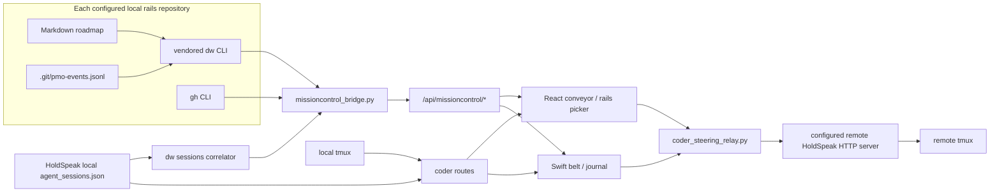
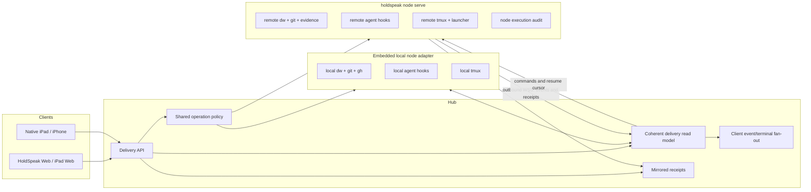

# Delivery Workbench integration — current system, gaps, and Phase 94 direction

**Status:** exploratory architecture review for Phase 94
**Reviewed:** 2026-07-11
**Code baseline:** `1e6a28f3` in the isolated
`codex/phase-94-delivery-workbench-platform` worktree
**Adjacent work:** Phase 93 is being authored separately and remains untouched.
This review treats its Desk-as-AI-operating-system and shared authority contracts
as upstream requirements, not as code available on this branch.

## Executive conclusion

HoldSpeak and Delivery Workbench already have most of the difficult ingredients:

- a stable, CLI-mediated roadmap feed;
- rail events and evidence receipts;
- a HoldSpeak agent-session registry;
- a Desk conveyor and native iPad belt;
- read-only pane capture;
- armed, pane-identity-checked text and key delivery;
- local steering audit;
- cross-machine HTTP relay;
- a local tmux session factory;
- Tailscale-capable hub and companion clients.

They are not yet one platform primitive. They are six adjacent integrations with
different identities, refresh loops, authority boundaries, and notions of
location. The present system can demonstrate each capability, but it cannot yet
reliably answer the owner's four ordinary questions from one remote Desk:

1. What is each agent working on, in which worktree and on which machine?
2. What changed, what is blocked, and what needs me now?
3. What evidence proves a story or phase finished, including its attached
   screenshots and logs?
4. Can I open the exact terminal, speak an instruction, and know whether it
   landed once on the intended pane?

Phase 94 should build a **Delivery Runtime** inside HoldSpeak. It should preserve
Delivery Workbench as the source of delivery truth and preserve the existing
steering chokepoints, but add the missing platform layer:

- stable node, source, worktree, attempt, session, terminal, and evidence
  identities;
- one hub-owned, cached and versioned delivery read model;
- an outbound authenticated node link for remote sources and terminals;
- explicit story-to-work-attempt binding instead of repo-wide guessing;
- evidence dossiers with safe asset streaming;
- resumable terminal output plus idempotent, ordered command envelopes;
- mirrored execution receipts;
- Project, Story, Coder session, Evidence, and Receipt expression through the
  Phase 93 Desk grammar on Web and native.

This is an integration and hardening phase, not a new dashboard, a hosted relay,
or a replacement for Delivery Workbench.

## Naming boundary

HoldSpeak already has a `/workbench` visual intelligence builder. That product
surface is unrelated to **Delivery Workbench**, the `dw` roadmap and commit-gate
system. Phase 94 must not overload the Workbench label in product copy.

Recommended terms:

| Layer | Name |
|---|---|
| External rails product | Delivery Workbench |
| HoldSpeak subsystem | Delivery Runtime |
| Durable Desk object | Project |
| Unit being delivered | Story |
| One agent undertaking | Work attempt |
| Live process | Coder session |
| Read/write terminal endpoint | Terminal target |
| Proof attached to completion | Evidence dossier |
| Consequential outcome | Receipt |

`missioncontrol`, `belt`, `rails`, and `coder_steering` remain compatibility
names in code and wire routes until migration earns deletion.

## Review method

This review traced:

- Delivery Workbench v1.12 as vendored under `.githooks/dw_pmo`;
- current Delivery Workbench source through completed Phase 16 and the adjacent,
  unfinished Phase 17;
- HoldSpeak Phases 82 and 86–90;
- Python bridge, route, policy, observer, grounding, relay, factory, audit, mesh,
  and session-registry code;
- React stores and Desk components;
- Swift contracts, HTTP clients, and the canonical Desk terminal/belt surface;
- focused unit/integration tests and the recorded live walks;
- the real local feed and session documents on 2026-07-11;
- Tailscale Serve and browser microphone requirements from their current
  official documentation.

No Phase 93 file was edited or copied. No Delivery Workbench working-tree file
was edited.

## Capability lineage

| Shipped phase | What it contributed | Durable value |
|---|---|---|
| HS-82 | `dw state`, `dw sessions`, and `dw events` relayed into the Desk; story status proposal/approval | the first contract-shaped seam |
| HS-86 | multi-project belt, GitHub PR/CI lights, raw story evidence pullout, belt bus frames | receipt-oriented delivery visibility |
| HS-87 | live pane peek, arm/disarm, voice-first steer, grounding, local audit | the consent and target-verification spine |
| HS-88 | rails as groundable material, ambient rail journal, remote-event receiving wire | delivery context and local observation |
| HS-89 | named keys, any local pane, direct cross-machine relay | first-class manipulation primitives |
| HS-90 | local spawn/rename/kill and the Web manipulation surface | terminal lifecycle from glass |
| HSM-26/27 | native belt, journal, steering/key/pane/factory client and Desk surface | iPad contract and initial couch experience |
| WLA-13 | state, sessions, event, and consent contracts | Delivery Workbench mission-control substrate |
| WLA-15 | read-only mission control in `dw-workbench`, including tailnet reach | a fifth consumer of the same feed |
| WLA-16 | legacy-tree parsing, receipts-first evidence pairing, correct current-phase selection | substantially more honest reads |
| WLA-17, adjacent | on-hold/paused semantics and board work | status evolution Phase 94 must tolerate |

## Current architecture



The topology explains the present limitation: delivery state is collected from
local filesystem paths, sessions are correlated through a local global file,
and remote terminal control is a separate direct HTTP side path. There is no
remote delivery source, no remote session discovery, and no shared identity
joining the two halves.

## Current source and contract inventory

### Delivery Workbench

| Concern | Owner |
|---|---|
| stable roadmap subset | `dw_pmo/statefeed.py`, `feed_schema: 1` |
| HoldSpeak registry correlation | `dw_pmo/sessions.py`, `sessions_schema: 1` |
| append-only local rail events | `dw_pmo/events.py` |
| evidence capture blocks | `dw_pmo/evidence.py` |
| rich path/trace read | `dw_pmo/api.py` via `dw context --compact` |
| read-only browser mission control | `dw_pmo/workbench.py` |
| guarded roadmap mutations | `dw_pmo/mutations.py` and the commit gate |

### HoldSpeak hub

| Concern | Owner |
|---|---|
| local repo map and CLI bridge | `holdspeak/missioncontrol_bridge.py` |
| bridge/read/write routes | `holdspeak/web/routes/missioncontrol.py` |
| session capture and local lifecycle | `holdspeak/agent_context/` |
| rails grounding | `holdspeak/grounding_rails.py` |
| ambient observer | `holdspeak/rails_observer.py` |
| pane identity, grants, text and keys | `holdspeak/coder_steering.py` |
| direct remote HTTP forwarding | `holdspeak/coder_steering_relay.py` |
| tmux lifecycle | `holdspeak/coder_factory.py` |
| terminal transport | `holdspeak/tmux_transport.py` |
| execution audit | `holdspeak/db/steering.py` |
| shared authority direction | `holdspeak/operation_policy.py` and Phase 93 |

### Clients

| Surface | Owner |
|---|---|
| Web belt state | `web/src/desk/missioncontrol.ts` |
| Web belt/evidence/proposals | `MissionControlConveyor.tsx` |
| Web steering state | `web/src/desk/steering.ts` |
| Web terminal surface | `SessionPullout.tsx` |
| native delivery contracts | `apple/Sources/Contracts/MissionControl.swift` |
| native hub clients | `HTTPDesktopClient+MissionControl.swift` and `+Steering.swift` |
| native belt/terminal UI | `apple/App/MeetingCapture/DeskDioramaStage.swift` |

The selected integration surface is already roughly 5,000 lines before tests,
CSS, mesh/session infrastructure, and Delivery Workbench itself. Phase 94 should
consolidate ownership rather than add another parallel store and route family.

## What works today

### Delivery state and writes

- State is read through each repository's own `dw` first, then a global
  installation as fallback.
- `feed_schema` and `sessions_schema` are checked at the HoldSpeak boundary.
- Missing CLIs and schema drift render typed absence instead of an empty belt.
- A story status change is validated against live rail state, recorded as an
  actuator proposal, approved through the shared lifecycle, rebuilt from stored
  payload at execution, constrained to the configured repo map, and still
  subject to the Delivery Workbench gate.
- Rail text used for grounding is named by `dw context` and path-contained.

### Terminal control

- Watching a pane is read-only and hash-gated.
- Arm grants are in-memory, TTL-bound, and pinned to tmux's `%N` pane identity.
- Text and named/literal key sequences have one hub-side chokepoint each.
- Pane identity is re-verified before every local delivery.
- Recycled panes refuse and revoke.
- Spawn and rename use argv lists and strict names; kill reuses the arm check.
- Delivered and refused local attempts are audited with a hash and short head.
- A configured remote node executes against its own tmux and owns its local
  grant and audit.

### Remote client access

- HoldSpeak refuses a non-loopback bind without a bearer token.
- React captures a tokenized arrival into tab-scoped storage and scrubs the URL.
- WebSockets carry the token in a subprotocol rather than the URL.
- Native clients use the same bearer-token API over LAN or Tailscale.
- Tailscale Serve can proxy a loopback HoldSpeak server over tailnet-only HTTPS.
  HTTPS is required for browser microphone access away from localhost.

These are the foundations to preserve.

## Verified findings

The table uses **P0** to mean “must be resolved before claiming the Phase 94
platform outcome,” not “the existing local-only feature is unusable.”

| Priority | Finding | Evidence and consequence |
|---|---|---|
| P0 | Delivery Workbench rail events are silent in linked worktrees. | `dw_pmo/events.py` requires `root/.git` to be a directory. In this requested worktree `.git` is a file; a live `emit` probe produced no event. Remote/parallel agent work is therefore absent from the ticker exactly where worktrees are most likely. |
| P0 | The configured Delivery Workbench repository cannot open its own evidence through HoldSpeak. | `story_evidence_payload` hard-codes `<root>/pm/roadmap` containment. Delivery Workbench self-hosts under `pmo-roadmap/pm/roadmap`. A live call for `WLA-15-01` returned `refused: evidence path escapes pm/roadmap` while a HoldSpeak story succeeded. |
| P0 | Real session-to-story correlation currently produces no exact pins. | The live `dw sessions --json` snapshot had 44 sessions: 29 `ambiguous` and 15 `off_rails`, zero `on_story`. Each ambiguous session had 34 candidate stories. Repo-wide “exactly one in-progress story” is an honest fallback, not a usable primary association model. |
| P0 | A remote terminal cannot be safely represented by the current client identity. | Web state holds `openKey` and a separate mutable global `targetNode`. Switching the node reinterprets the same key on another machine. Opening a new session does not reset the node. A compound immutable target is required to prevent target confusion. |
| P0 | Remote terminal commands have no command ID, ordering token, or deduplication receipt. | A response can be lost after the node typed. Retrying can type twice, while not retrying leaves the outcome unknown. Consequential remote commands need at-most-once application by idempotency key and an explicit `unknown` recovery state. |
| P0 | Remote execution receipts are stranded on the executing node. | The current safety decision correctly makes the far node own consent and audit, but the hub cannot browse that audit. The remote owner sees only the immediate HTTP response, not a durable, aggregate receipt. |
| P1 | Remote discovery is largely a wire demo. | The node list exposes names, but pane discovery is local-only by an explicit comment. Remote sessions, worktrees, sources, grants, and audits are not listed. The user must already know a remote key. |
| P1 | Remote factory and agent launch are missing. | Spawn, rename, and kill stay local. Spawn creates a shell, not a Claude/Codex process bound to a selected story/worktree. This prevents “start and steer the work from glass.” |
| P1 | Remote rail observation has only a receiving route. | HS-88 shipped `/rails/remote-events`, but its worker daemon was explicitly deferred. No production loop tails a far node's rails and sends them to the hub. |
| P1 | The project map models one local path, not delivery sources. | `~/.holdspeak/delivery_workbench.json` cannot express nodes, multiple clones, multiple worktrees, capabilities, credentials, or the same repo on several machines. It also exposes raw paths in browser payloads. |
| P1 | Evidence browsing is not a dossier. | The conveyor renders only current-phase stories. Completed phase chips are not navigable. Evidence is raw Markdown in a `pre`; relative links are inert; screenshots/JSON/logs under the phase are not enumerated; story spec, final summary, captured-run structure, commit, PR, and CI are not one object. |
| P1 | State, events, sessions, and receipts are not a coherent snapshot. | React requests four endpoints independently. A story can move between reads, producing mixed-time UI. There is no snapshot revision, ETag, cursor, or resumable event stream. |
| P1 | Polling cost multiplies by clients and repositories. | One refresh launches `3n + 1` subprocesses for `n` repos: state, events, `gh` receipts per repo plus one session correlation. On this 93-phase worktree, `dw state` took 1.16 s, `context` 0.27 s, and `sessions` 0.45 s. Every open client repeats the work every 15 s. |
| P1 | GitHub and gate lights are repo-level approximations. | The UI shows the first open PR's CI and the newest repo gate event, not the receipt associated with a story, branch, worktree, or attempt. |
| P1 | Native remote disarm does not target the remote node. | `disarmCoder` has no node parameter and `steerDisarm` calls the local route even when a remote node is selected. The UI clears its local state while the remote grant remains until expiry. |
| P1 | Web factory state can outlive the pane it described. | `attachedSession` and `targetNode` are independent mutable store fields and are not reset by every open/close path. Factory actions need an immutable target handle returned by discovery. |
| P2 | Delivery Workbench status evolution is not negotiated. | Adjacent WLA-17 adds `on-hold`/`paused` and reasons while keeping `feed_schema: 1`. HoldSpeak's mutation allow-list omits them. A schema number alone is not enough; capabilities and accepted operations must be declared. |
| P2 | Session payloads are eager and path-heavy. | Polling returns repo roots and last assistant text for all sessions even when the user has not opened one. Platform reads should carry minimal presence, then fetch explicit detail. |
| P2 | Bus frames are hints, not replayable events. | `scope:"belt"` compares only `generated_at_tree` in process memory; first read is a baseline, restarts forget it, unstaged working-tree changes can keep the same index tree, and late clients cannot resume. |
| P2 | Test strength is uneven at the system join. | Backend steering is well unit-tested and has local live tmux tests. There is no production multi-node discovery/stream/factory test, no lost-response duplicate test, no secondary-worktree event fixture, no cross-layout evidence asset fixture, and limited Web-store coverage for Phase 89/90 target/factory state. |

## The worktree problem is structural

Worktrees are not an edge case for this product. They are the normal way several
agents work beside one another without colliding.

Today:

- the project map points at one checkout, so another worktree's uncommitted rail
  and evidence state is invisible;
- the agent registry correctly records the worktree root, but the Delivery
  Workbench correlator reduces it to all in-progress stories in that repository;
- Delivery Workbench event emission silently assumes `.git` is a directory;
- GitHub receipts describe the repository, not the worktree branch;
- terminal identity is node-local and detached from worktree identity.

Phase 94 must make `Worktree` a first-class execution location, not parse a path
into a label in the UI.

Minimum worktree descriptor:

| Field | Meaning |
|---|---|
| `worktree_id` | opaque, stable within a node |
| `source_id` | clone/repository identity |
| `node_id` | machine that can read and execute there |
| `branch` / `head_sha` | current git receipt |
| `dirty` | working state, never inferred as delivery completion |
| `roadmap_projects` | Delivery Workbench project slugs present |
| `capabilities` | rails read/write, evidence read, terminal, factory, launch |
| `freshness` | observed time and live/stale/offline state |

Raw filesystem paths stay node-side. The hub may store them in protected config
for a local source, but clients receive opaque IDs and user-facing labels.

## Evidence must become a portable dossier

The current `evidence_exists` boolean and Markdown pullout are useful receipts,
but they do not support remote completion review.

An evidence dossier should be anchored to a story and a source revision and
contain:

- story specification;
- evidence Markdown rendered safely;
- parsed captured runs with command, exit code, timestamp, index tree, and
  bounded output;
- explicitly linked assets;
- safe phase-local attachments such as screenshots, JSON summaries, text logs,
  and video when supported;
- phase status and final summary;
- relevant commit and remote-verification receipts;
- matching branch/PR/CI receipts when present;
- byte size, MIME type, content hash, and provenance for every member;
- an honest `live-uncommitted` or `committed` state.

Delivery Workbench should produce the manifest because it owns evidence pairing
and nonstandard roadmap layouts. HoldSpeak should transport, cache, authorize,
and render it. Neither side should guess evidence by parsing prose alone.

Asset rules:

- only files named by the Delivery Workbench manifest;
- path containment through Delivery Workbench's resolved roadmap root;
- symlinks resolved and refused if they leave the root;
- MIME allow-list, byte caps, range reads, ETags/content hashes;
- Markdown sanitized; HTML disabled by default;
- no automatic transfer of a whole repository;
- content fetched only when a person opens the dossier or explicitly grounds it.

## Session correlation must become an explicit work attempt

The current correlator's rule—one in-progress story means `on_story`, more means
`ambiguous`—must remain available as a labeled fallback for old sessions. It
cannot be the primary platform join.

A `WorkAttempt` explicitly binds:

```text
node + source + worktree + project/story + agent session + terminal target
```

It can be created by:

1. launching an agent from a Story or Project on the Desk;
2. an agent rider claiming the current `dw next` story;
3. a person attaching an existing session and selecting a story;
4. a branch/session-intake receipt that identifies exactly one story.

Manual association must move from browser `localStorage` to a hub record with
provenance `manual`. It still must not masquerade as a Delivery Workbench fact.
The attempt owns lifecycle—starting, working, waiting, ended, abandoned—and
every transition becomes a replayable delivery event.

## Remote nodes need one connection, not a table of side channels

`HOLDSPEAK_STEER_NODES` is a useful proof seam, but it asks the hub to know every
node URL and bearer token and exposes only terminal verbs. A platform node
should connect outbound to the hub and advertise scoped capabilities.



Properties:

- browser and native clients speak only to the hub;
- the remote machine does not expose a general inbound web server;
- one node identity and token are scoped and rotatable;
- capability discovery covers rails, evidence, sessions, terminal, factory,
  launch, and inference without assuming every node supports all of them;
- the local machine uses the same node-facing interfaces in process;
- node reconnect resumes events and outstanding command results;
- no terminal command is blindly retried.

The existing mesh relay queue is prompt/result-shaped and is not a terminal or
delivery control protocol. Its node naming, liveness, worker discipline, and
profile concepts should be reused, but Phase 94 should not force terminal
streams into LLM job rows.

## Terminal window: stream output, keep input on the chokepoint

The current 1.5 s, 200-line, ANSI-stripped `capture-pane` poll is a good fallback.
It is not an “actual agent window” for a fast TUI, and every client polling the
same pane repeats the capture.

The target model should provide:

- one node-side subscription per pane, shared by all authorized viewers;
- an initial bounded snapshot and sequenced output deltas;
- ANSI-preserving output with declared rows/columns and a content hash;
- bounded buffers and backpressure;
- reconnect from the last output sequence or a fresh snapshot;
- a clear fallback to hash-gated snapshots when streaming is unavailable.

Input must **not** become a raw terminal WebSocket. Text, keys, resize, kill, and
factory actions remain typed commands through policy, target-generation checks,
idempotency, ordering, and audit. That keeps the Phase 87–90 safety spine
structural.

## Command correctness

Every consequential command needs:

- globally unique `command_id` and idempotency key;
- immutable `node_id + target_id + target_generation`;
- operation family and policy decision/version from the shared Phase 93 spine;
- payload hash and expiry;
- per-target sequence or serialization;
- node-side deduplication ledger;
- statuses `accepted`, `executing`, `succeeded`, `refused`, `expired`, and
  `unknown`;
- node execution receipt mirrored to the hub;
- no automatic resend of an `unknown` terminal input.

The node remains the authority over pane existence and generation and writes the
execution audit. The hub remains the user-facing authority over who requested
the operation and why policy allowed it. A joined Receipt shows both.

## Desk experience

Phase 93's Desk contract rules out a new dashboard or global control center.
Delivery work should inhabit existing Desk concepts:

- **Project object:** opens its delivery inspector/window.
- **Story object/card:** status, attempt, branch/worktree, receipts, evidence,
  and attention.
- **Coder session process:** node, agent, worktree, linked Story, waiting state,
  terminal window, and controls.
- **Evidence dossier:** a durable, browsable object attached to Story/Phase.
- **Receipt:** gate, command, commit, PR, CI, and completion outcomes.
- **Attention projection:** agent waiting, node offline, gate refusal, CI fail,
  evidence missing, command outcome unknown.

The belt can remain a compact spatial view. It must stop being the only place
delivery work exists. Past phases, a board/list, search, keyboard access, compact
Web, and native views are alternate views of the same objects.

### North-star journeys

#### Observe remote work

1. Open a Project from the Desk.
2. See each active Work attempt grouped by Story, with node, worktree, agent,
   branch/head, lifecycle, and freshness.
3. Open the Coder session and watch its live terminal.
4. If the node drops, the same object becomes stale/offline with last-seen time;
   no session silently disappears.

#### Review completion evidence

1. Open a completed Story or Phase.
2. See a dossier summary: passing/failing captures, commits, gate, PR/CI, and
   attached media.
3. Open screenshots, JSON, logs, and final summary without leaving the Desk.
4. Every item names source revision and origin node; unavailable remote bytes
   remain listed with an honest recovery action.

#### Voice-steer from an iPad browser

1. Reach the hub through tailnet-only HTTPS and authenticate.
2. Open the exact Coder session; target chips name machine, worktree, Story, and
   pane.
3. Hold to speak; review the composed instruction and any grounded dossier.
4. Send through the policy path.
5. See one Receipt: delivered once to the expected target, refused, or outcome
   unknown. Never a generic “network error” after possible delivery.

#### Start remote work

1. Choose a Story and an online node with `launch_agent`.
2. Select or create a worktree/branch under configured roots.
3. Preview the exact agent, command profile, source, worktree, and Story.
4. Launch; a Work attempt and Coder session appear atomically.
5. End/restart/recover through the same lifecycle and receipt model.

## Network and Tailscale posture

Canonical remote Web deployment:

```text
iPad Safari
  -> https://hub-name.tailnet.ts.net
  -> Tailscale Serve (tailnet only, TLS termination)
  -> http://127.0.0.1:<holdspeak-port>
  -> HoldSpeak bearer-token middleware
```

Why:

- Tailscale Serve provides an automatically provisioned HTTPS endpoint and
  remains tailnet-only; Funnel is the public-internet product and is out of
  scope.
- Browser microphone APIs require HTTPS or localhost.
- Tailscale's own security guidance warns that tailnet HTTP services can be
  susceptible to DNS rebinding; HoldSpeak's bearer gate remains required even
  on a private tailnet.
- Delivery Workbench's standalone server is a per-repo developer surface. It
  should stay behind loopback/Serve as a fallback, not become the Phase 94
  authority or an iframe.

Phase 94 should add a doctor/readiness check for:

- HoldSpeak hub bound or proxied correctly;
- HTTPS origin when Web microphone steering is expected;
- bearer token present and rotatable;
- WebSocket upgrade passing through Serve;
- tailnet-only, not Funnel;
- node link authenticated;
- node capability and clock health;
- browser microphone permission as an OS/browser prerequisite.

References:

- [Tailscale Serve command](https://tailscale.com/docs/reference/tailscale-cli/serve)
- [Tailscale Serve examples](https://tailscale.com/docs/reference/examples/serve)
- [Tailscale Funnel](https://tailscale.com/docs/features/tailscale-funnel)
- [Tailscale security best practices](https://tailscale.com/docs/reference/best-practices/security)
- [MDN: `getUserMedia` secure-context requirement](https://developer.mozilla.org/en-US/docs/Web/API/MediaDevices/getUserMedia)

## Performance and freshness target

The hub should be the only collector:

- one single-flight refresh per source/worktree, independent of client count;
- event-driven invalidation from node/rail events with a bounded fallback poll;
- in-memory last-known-good snapshot keyed by source revision and content hash;
- source-level freshness and errors retained alongside last truth;
- one coherent snapshot revision across projects, attempts, sessions, receipts,
  and attention;
- ETag/`If-None-Match` for HTTP and resumable cursors for the bus;
- GitHub reads cached separately at a slower cadence and matched to branch/PR;
- bounded global and per-node subprocess concurrency;
- no synchronous CLI work on the event loop;
- metrics for collection latency, command latency, node reconnects, dropped
  stream frames, cache age, and unknown command outcomes.

Provisional budgets for the closeout fixture:

| Measure | Target |
|---|---|
| cached snapshot API p95 | under 100 ms |
| local source refresh p95 on the HoldSpeak tree | under 2 s, single-flight |
| terminal output visible over tailnet p95 | under 750 ms |
| command accept/refusal p95 on an online node | under 1 s |
| node stale recognition | within 15 s |
| node offline recognition | within 30 s |
| duplicate terminal application under lost responses | zero |
| browser/client count effect on CLI invocation rate | zero after first collector |

These are phase targets to validate, not claims about the present system.

## Delivery Workbench counterpart

Phase 94 needs a small, explicit counterpart after Delivery Workbench's active
Phase 17. A proposed WLA-18 should provide:

1. **Worktree-correct git-local paths.** Resolve the per-worktree git directory
   and common git directory through git plumbing; define whether rail events are
   worktree-local or common and include worktree identity.
2. **Capabilities document.** Version, feed/events/evidence schemas, accepted
   statuses and mutation verbs, roadmap root, and optional features. HoldSpeak
   stops inferring behavior from a package version.
3. **Cursor event envelope.** Stable event IDs, schema/version, worktree/source
   identity, and `--after`/cursor reads while preserving the current event
   privacy allow-list.
4. **Evidence manifest/read command.** Delivery Workbench resolves story,
   evidence, phase summary, captured runs, and safe assets for standard,
   self-hosted, and legacy layouts.
5. **Joint fixture pack.** Standard repo, self-hosted repo, linked worktree,
   multiple in-progress stories, paused/on-hold work, evidence assets, and
   schema-compatibility cases.

HoldSpeak can build source/worktree identity, work attempts, node transport,
terminal control, UI, and receipts. It should not privately patch Delivery
Workbench parsing or evidence-pairing rules.

## Compatibility and migration

Phase 94 should land behind adapters:

| Existing seam | Phase 94 adapter |
|---|---|
| `delivery_workbench.json` | import into versioned Delivery Source registry; keep read fallback for one release |
| `missioncontrol_bridge.py` | local Delivery Workbench provider under the collector |
| `/api/missioncontrol/*` | compatibility facade over the Delivery Runtime read model |
| `dw sessions` | fallback correlation only; explicit Work attempts take precedence |
| `coder_steering_relay.py` | compatibility node adapter until outbound node links are configured |
| `coder_steering.py` | remains the local/node execution chokepoint |
| `coder_factory.py` | remains the local lifecycle implementation |
| `scope:"belt"`/`scope:"coder"` frames | translated into replayable `scope:"delivery"` events |
| Web missioncontrol/steering stores | migrate to normalized delivery selectors; delete only after route parity |
| Swift v1 DTOs | additive v2 DTOs with tolerant decoding; v1 hub remains usable |

No flag may create two delivery truths. During migration, the new read model is
derived from the old providers and the compatibility APIs read back from it.

## Phase boundary

### In

- counterpart contracts and worktree correctness;
- Delivery Source and Worktree registry;
- coherent hub read model and event cursor;
- authenticated outbound node worker;
- remote rail/session/evidence/audit observation;
- explicit Work attempts;
- evidence dossiers and asset transport;
- terminal output streaming with snapshot fallback;
- idempotent ordered commands and mirrored receipts;
- remote pane discovery, factory, and agent launch;
- Desk-native Web experience;
- native iPad parity for the north-star journeys;
- HTTPS tailnet onboarding/doctor;
- multi-node chaos, security, performance, and owner proof.

### Out

- replacing Delivery Workbench's Markdown or commit gate;
- hosting a cloud relay;
- public Tailscale Funnel exposure;
- arbitrary shell execution from a browser;
- a generic SSH client or terminal emulator unrelated to Coder sessions;
- replacing tmux in this phase;
- autonomous agent scheduling;
- a new global dashboard/control center;
- a second authority, receipt, attention, node, or Project model;
- full historical transcript replication from nodes;
- broad GitHub project management beyond receipts tied to delivery work.

## Recommended Phase 94 sequence

| Story | Outcome |
|---|---|
| HS-94-01 | counterpart contract and worktree truth |
| HS-94-02 | Delivery Source registry and coherent read model |
| HS-94-03 | authenticated node link, capabilities, liveness, and reconnect |
| HS-94-04 | explicit Work attempts and exact Story/session/worktree correlation |
| HS-94-05 | evidence dossiers and safe asset browsing |
| HS-94-06 | terminal stream and idempotent command receipts |
| HS-94-07 | remote factory and story-bound agent launch |
| HS-94-08 | Project/Story/Session/Evidence experience on the Web Desk |
| HS-94-09 | native parity and tailnet HTTPS onboarding |
| HS-94-10 | multi-node chaos/security/performance owner walk and close |

The contract and story files beside this review turn that sequence into an
implementation-ready draft.

## Decisions to resolve before activation

1. Does the node link extend `holdspeak mesh serve` or ship as
   `holdspeak node serve` with `mesh serve` as one capability? Recommendation:
   one node runtime, new explicit command, compatibility wrapper.
2. Does a Work attempt live only in the hub DB or also emit a local Delivery
   Workbench receipt? Recommendation: hub DB is runtime truth; the rails receive
   only lifecycle metadata that Delivery Workbench explicitly standardizes.
3. Is terminal streaming required on native in the same story as Web?
   Recommendation: one wire and one acceptance journey; Web may render ANSI
   first, but native cannot close with snapshot-only if the owner journey uses
   native.
4. How are node tokens issued? Recommendation: one-time pairing from the hub,
   per-node scoped secret in protected config/Keychain, rotation and revoke in
   Settings; never reuse the human browser token.
5. Which Phase 93 control-posture changes land before HS-94-06?
   Recommendation: Phase 94 consumes the shared policy decision and never
   hard-codes Secure/Normal/YOLO behavior.

## Activation recommendation

Do not start with terminal streaming or a visual redesign. Activate Phase 94
only after:

- this contract is accepted;
- the adjacent Phase 93 Desk/authority vocabulary is available to consume;
- Delivery Workbench's Phase 17 is closed or its status vocabulary is frozen;
- the WLA counterpart is scheduled;
- a two-node fixture and a real secondary worktree are reserved for every story,
  not only closeout.

Then ship stories in order. HS-94-01 through 04 establish truth and identity;
05 and 06 make proof and control reliable; 07 completes remote lifecycle; 08
and 09 make it a product; 10 proves it under failure.
